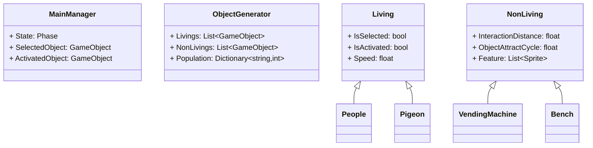
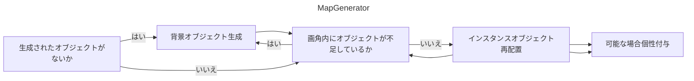
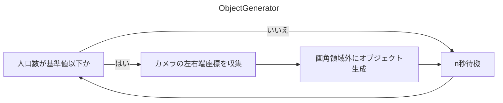
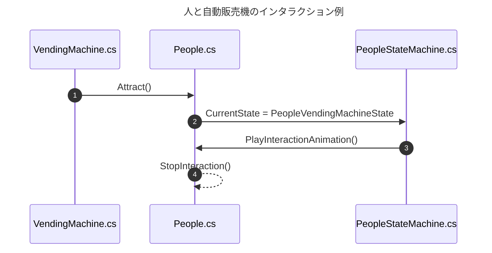
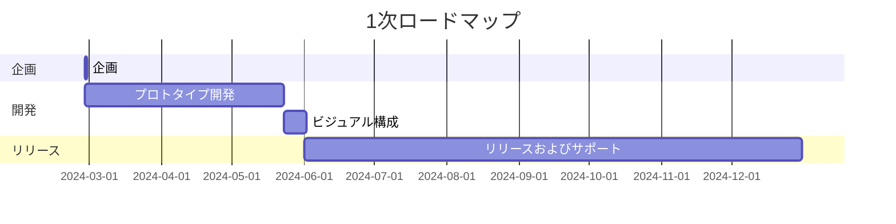

---
image:
    path: /2024-04-30-armonia-first-devlog/gameplay.webp
    lqip: data:image/webp;base64,UklGRiQBAABXRUJQVlA4TBgBAAAvD8ABAM1kRP9jE+UpQv/D4CCSJEXqOXpmBhts/1W8BGZa6B0bG44kyW2bnQUUHM7+//t8zQmA2wiMHEXSexc+ENN/QdRAxJC9WSlicZYaCiHEiBEEBULCMMoQhMMi0bv93TqZbAMSDEWRd+s75TKrKm4VicC+vLm9fnxs++PKnIq5yl2/HI/H7Znt/PFTbA+vP6RcraP+/u4u769YybUSgygQFMaTzCmCmruS9R8Wur+T874jmH1RRSUTIWlnwwMxK3/FTqFkkIRu7it/NDlMKxKqKhJtqW+MXnKWekjlKoNGylt4ripQbry6Ou5Me5Ctq6J0E8qGQe2+v3Tlrj/5bLz7VimPuFYRKZDFKkBIEQUROUhNEJEA
    alt: 開発中のプロトタイプ
    
title: "「行先地」、1回目の中間開発記"
authors: ["dev"]

categories: [마일스톤, 게임 개발]
tags: [마일스톤, 게임 개발, 유니티, C#, 행선지, 개발, 개발일지]
start_with_ads: true

toc: true

date: 2024-04-30 18:14:00 +0900
last_modified_at: 2024-05-23 23:11:00 +0900

mermaid: true
---

## **はじめに**

> [前の記事](https://hyngng.github.io/ja/dev/armonia-devlog-planning/)からの続きです。
:::

面白くて再挑戦する私の[4つ目のマイルストーン](https://hyngng.github.io/categories/%EB%A7%88%EC%9D%BC%EC%8A%A4%ED%86%A4/)開発記です。作りながらメモを整理するついでに中間チェックも必要だったので、約一ヶ月で作った成果物を簡単にまとめました。この開発段階で作ったものはまとめるとこうです。

- ゲームシステム
	- [x] タッチ入力によるスムーズなカメラ移動
	- [x] 画面内オブジェクトの選択および操作、インタラクション
	- [x] オブジェクトが一定数以下に制御されることを保証
	- [x] 一部のオブジェクトは指定範囲のランダム個性を獲得
	- [x] カメラ画角内でのみオブジェクトが存在することを保証

- 追加されたオブジェクト
	- [x] 人、鳩など2種の生物オブジェクト
	- [x] 家、地下鉄など7種の背景オブジェクト
	- [x] 消火栓、トラフィックコーンなど6種の街路オブジェクト

## **アーカイブ**

{: .w-75 }
_人を実装したとき。プレイヤーは任意のオブジェクトになって周辺環境とインタラクションできる。_

## **アセット制作**

### **画像アセット**


_描いた背景画像_

郊外にありそうな背景を作るため、都市イラスト、街の建物写真やロードビューなどを探して参照しながら背景画像アセットを作りました。言語翻訳のようなローカライズの可能性を開いておきたくて、広告チラシや新聞紙、カリグラフィーが入った看板などテキストがある要素は入れませんでした。人が直接描いた感じが出てほしくて、荒い質感の線を使いながら直線ツールもあえて使いませんでしたが、結果的に少し歪みつつもすっきり描けて満足しています。

できあがりは充実感がありますが、解像度が高すぎるようです。画像のダウンスケールも試しましたが、最初から低解像度で作った画像ではないためかなりぼやけてしまい、イマイチでした。もう少し低解像度で描いても同じ感じを十分に出せたと思うので、この点は残念です。

### **スプライトシェーダー**

開発途中でぶつかった難関です。このプロジェクトのオブジェクトは共通してスプライトコンポーネントを使用していますが、Unityの基本シェーダーの中には影を受け取る(Receive Shadow)が可能なスプライト用シェーダーがないため、他の方が作ったものを探して使用しています。

使ってみるとこのシェーダーはよく動作しますが、基本的にUnlitシェーダーなので影を生成(Cast Shadow)しません。オブジェクト同士で影ができてほしくてさらに調べたところ、UnlitシェーダーはCast Shadow機能の実装がそもそも不可能なようです。スプライトに適用可能で、光の反射なしに影を生成するシェーダーが必要ですが、シェーダーについては門外漢で実装が難しいです。この部分はさらに調べる必要がありそうです。

### **アニメーションアセット**

{: .light .w-25 .border }
{: .dark .w-25 }
_空を飛ぶ鳩_

アニメーションは直接描いて使うこともしました。例えば鳩の動きの場合、Unityのアニメーションコンポーネントで解決するのが難しく、伝統的なアニメーションを作るように一コマずつ描いてつなぎ合わせました。以前に動物の動きをアニメーションで描いたことはなかったので、鳩が歩く映像、飛ぶ映像を探して観察しながら描きました。

作りながらは、単純な単一アニメーションを作って使うよりも、アニメーションの流れを細分化してフェーズを分けました。例えば鳩が飛び立つ様子の場合、空へ飛び上がるEnterFlyアニメーション、空中に滞在しているBeingFlyアニメーション、地面に着地するEndFlyアニメーションの三つの別々のまとまりに分けて出力し、状態パターンと連動して使用しました。おかげで成果物は上の[アーカイブ](#アーカイブ)で見られるように、かなりそれらしく見えます。


_歩く人と情緒的な蛍_

ただし基本的にはこのようにUnityのアニメーションコンポーネントを使いました。上の例は人の位置変化に応じて歩くアニメーションの左右反転や再生速度が自動で調整されるように作ったシーンです。事前に資料を残せなかったのでよくわかりませんが、カットアニメーションなしで頭と胴体、手足を細かく組み立てて位置がそれぞれ別々に調整される様子です。

余談ですが、アニメーション関連の作業が最も大変に感じます。特にアニメーティングはプログラミングと違い、個人レベルで特別な突破口がない点が毎回大きく響きます。作業効率が個人の技量に左右されます。プロのアニメーターの方はこういう作業をどのようにされているのかわかりません。

## **開発過程**

[直前の経験](https://hyngng.github.io/posts/palette-developing/)で残念だった部分を改善するための努力がありました。特にコードの保守性を損なわないよう、SOLID原則を意識しました。クラスが少し大きくなりそうだと感じたら、単一責任原則を遵守できるよう必ず分割し、アクセス修飾子キーワードをより慎重に使用し、より詳細にはクラス属性や`#region`も積極的に活用しました。

途中でバックアップが必要だと思い、[Unityバージョンコントロール(VCS)](https://www.plasticscm.com/)も使ってみましたが、とても便利でした。GitHubに慣れていればすぐに適応でき、特に作業中にいつでもUnity内部インターフェースからアップロードできるのが良かったです。

### **クラス設計**



開発に入る前にクラスの役割とクラス間の関係を考慮しながら基本枠を構想しました。ただしUMLダイアグラムを描くほどではなく、個人レベルであまりに即興的な設計で複雑な構造が作られるのを予防できる程度に形式化しました。上記以外にも他のクラスについての内容がありますが、すべて収めるとダイアグラムが大きくなり複雑になりすぎるので、非常に代表的なものだけに絞りました。

スクリプトのメンバー以外にも、`MainManager`はシングルトンとして使用しイベント駆動型プログラミングを使用すること、`Living`と`NonLiving`は親スクリプトとして状態パターンを使用すること程度を事前に念頭に置き、実際にそのまま実現しました。

開発途中でプログラミングパターンをいくつか導入したり、`MainManager.cs`{: .filepath }から肥大化したタッチ関連コードを`TouchManager.cs`{: .filepath }に分離するなど、実際の形は変わった部分が多いですが、まず大枠を決めてから進めると確かに楽でした。今回とても役立ったので、次に何か開発することがあれば簡単なダイアグラム程度は描いておこうと思います。

### **マップ生成と管理**

{: .w-75 }



```cs
void GenerateObjects(List<GameObject> instantiated, List<GameObject> instantiable)
{
    GameObject tempInstantiated = instantiated[instantiated.Count - 1];

    for (int i=instantiated.Count - 1; i>0; i--)
        instantiated[i] = instantiated[i - 1];
    instantiated[0] = tempInstantiated;
    
    instantiated[0].transform.position = new Vector3(
        instantiated[1].transform.position.x - objectSize, 0, 0
    );

    /* ... */
}
```

マップ生成は自分で作るのは初めてです。事前にBSPのようなプロシージャルマップ生成アルゴリズムも調べてみましたが、作りたいものとは違うようで、またそれほど複雑なシステムが必要そうでもなかったので、自分で作ることになりました。

- 次の条件を満たします。
	- 一度生成されたマップはゲーム終了時点まで保存される
	- マップ関連オブジェクトは画面内でのみ見える
	- 毎プレイ、リスト順序をシャッフルしてマップを異なる構成にする

結果的に、端末ごとの画面比率に関係なく動作するよう、画角を基準に動作する段階的なマップ生成手順を作りました。ゲームオブジェクトリストを利用して、リストの最初の値は左端にあるオブジェクト、リストの最後の値は右端のオブジェクトとして維持され、カメラの画角に応じてオブジェクトが新たにインスタンス化されたり順序が調整されたりする仕組みです。結果的に予想していた以上にうまく動作しています。

### **オブジェクト生成**



```cs
void GenerateObject(GameObject targetObject)
{
    bool spawnAtLeft = Random.value > .5f;
    float spawnPosX = spawnAtLeft
                    ? MainCamera.GetRenderWidth(gameObject).Left - 1.8f
                    : MainCamera.GetRenderWidth(gameObject).Right + 1.8f;

    GameObject generatedObject = Instantiate(
        targetObject,
        new Vector3(
            spawnPosX,
            targetObject.GetComponent<BoxCollider>().size.y / 2,
            Random.Range(-3.5f, 3.5f)
        ),
        Quaternion.identity
    );
    generatedObject.transform.parent = standardObject.transform;
    GeneratedObjects.Add(generatedObject);
}

IEnumerator ManagePopulation()
{
    while (true)
    {
        GenerateLiving(LivingToGenerate);
        yield return new WaitForSeconds(GenerationDelay);
    }
}
```

オブジェクト生成は以前に似たコードを書いたことがあるので、それほど難しくありませんでした。`ViewportToWorldPoint()`を使って画角外でオブジェクトのインスタンス化が行われ、オブジェクトはインスタンス化された後、画角外でn秒経つと消えるように作りました。

ただしまだ補完すべき部分があります。例えばカメラが左右どちらかの方向に速く移動する場合、人のいない空っぽの町が見えて、時間が経って左右から人が一人二人現れ始めるのが、非常に違和感があるため、カメラ左右領域のオブジェクト密度が一定に保たれるように解決する必要がありそうです。

### **インタラクション**



このゲームの核心となるオブジェクト間インタラクションは、インタラクションの主体となるオブジェクトがインタラクションを呼び出すように作りました。コルーチンで一定時間間隔ごとに`Physics.OverlapBox`を用いた範囲内のオブジェクトを求め、その中からランダムなオブジェクトに対してインタラクションを呼び出します。状態パターンを使い、詳細には上記のように動作します。

ただ、私がまだ状態パターンに慣れていないせいなのか、プロセスが絡み合いすぎている感じがします。インタラクションをこれより簡単に実装する方法があるのか気になります。

## **おわりに**

これまで開発を進めてみて、ゲーム開発は確かに面白く、また充実感がある部分があります。まず体系を構想し、構想した企画案をもとに資料を収集し、資料が不足していれば直接作って適用し、そうした複合的なプロセスを経た成果物が確かな視覚的フィードバックとして届くと、ひと味違う達成感があると感じます。

- 今後以下の課題が残っています。
	- [ ] 効果音オーディオ追加
	- [ ] プロシージャルアニメーションの活用
	- [ ] オブジェクトおよびインタラクションの多様化
- または以下を試してみたいです。
	- [ ] トースト通知
	- [ ] 空気遠近法

開発途中でブログをせっせと改装するのに2週間ほど時間を費やした部分があります。残り一ヶ月ほどの時間は集中が分散しないよう節制しながら、期間内にしっかり終えられると良いです。


