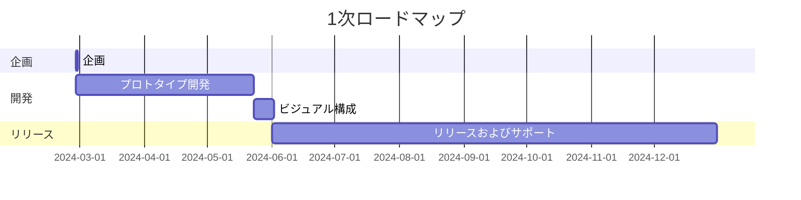

---
image:
    path: /2024-05-31-armonia-second-devlog/gameplay.webp
    lqip: data:image/webp;base64,UklGRlYAAABXRUJQVlA4IEoAAADwAQCdASoQAAgAAUAmJQBOgB8xi/GXoBAA/vuITP1jzd5vh9i82itNyxKJOlCBXvOebik8444+JnSUJik6FdPY8GR+D5jZO/WAAA==
    alt: 開発中のプロトタイプ
    
title: "「行先地」、2回目の中間開発記"


categories: [마일스톤, 게임 개발]
tags: [마일스톤, 게임 개발, 유니티, C#, 행선지, 개발, 개발일지]
start_with_ads: true

toc: true

date: 2024-05-31 22:53:00 +0900
last_modified_at: 2025-12-26 11:40:00 +0900

mermaid: true
---

## **はじめに**

:::info
[前の記事](https://hyngng.github.io/ja/dev/armonia-first-devlog/)からの続きです。
:::

私の[4つ目のマイルストーン](https://hyngng.github.io/categories/%EB%A7%88%EC%9D%BC%EC%8A%A4%ED%86%A4/)開発記です。さらにもう一ヶ月で作った成果物をまとめました。今回の一ヶ月は主にゲームのシステムとコンテンツ拡張作業が中心となり、詳細には今回の段階で作ったものはこうです。

- ゲームシステム
	- [x] 背景オブジェクトの階層化
	- [x] シェーダーグラフ交換による最適化
	- [x] ピンチズームアウトでアクセス可能な設定画面
	- [x] プロシージャルアニメーションを用いたオブジェクトインタラクション
- 追加されたオブジェクト
	- [x] 背景役割を果たす2種の建物オブジェクト

## **アーカイブ**

{: .w-75 }
*設定画面への進入テスト中に録画*

## **アセット制作**

### **画像アセット**

{: .light .w-25 .border }
{: .dark .w-25 }
*地面をつつく鳩*

キーフレーム形式のアニメーションは継続して追加していく予定です。今回は、鳩について地面をつつく動作の実装のためにアニメーションを作りました。アニメーションの分量も短く、何より[以前に作ったアセット](https://hyngng.github.io/posts/armonia-developing-first/#%EC%95%A0%EB%8B%88%EB%A9%94%EC%9D%B4%EC%85%98-%EC%97%90%EC%85%8B)があるので、以前のように他の鳩の映像を探して特徴を見つけて真似るといった負担はありませんでした。

前と同様に`DigState.cs`を作って状態パターンと連動する作業をし、おかげで動作も自然に見えます。インタラクションは優先的に鳩を選択した状態で地面をタッチすると発動します。

### **シェーダーファイル**

詳しくは後述しますが、GPUコストの問題があり、使用中の2Dスプライトシェーダーをより軽いものに変更しました。問題は、このシェーダーは影の生成<sup>Cast shadow</sup>機能がなく、ポストプロセッシングの被写界深度<sup>DOF</sup>効果が適用されないことです。改善できれば良いですが、シェーダーはまだ慣れていないので、詳しく勉強するか演出上の機能を諦めるかしなければならないようです。

## **開発過程**

### **カメラスタイルの設定画面実装**

{: .w-75 }
*ピンチズームで設定画面に進入、まだプロトタイプ*

設定画面はUIのないすっきりした画面を最大限保存し、少し面白い演出になるよう、別途のUI表示なしでピンチズームでアクセスできるようにしました。ピンチズームは段階的に動作し、一定範囲内では普通のカメラズームインアウトとして動作しますが、一定範囲を超えると振動フィードバックとともに設定画面に進入します。一度アクセスした設定画面からはピンチズームインで出ることができます。

設定画面のUIはカメラのように見えるように作りました。たまに写真を撮りながら、普段POV Street Photographyの動画を見て感じていた感覚をそのまま移したものです。手に取ったスクリーンの中のシーンが自分と被写体の間の膜を突き抜けて、シーンがリアルにつながるような感覚があり、その経験を模倣してみたかったのです。

バッテリーや時間は`SystemInfo.batteryLevel`と`DateTime.Now`を使って実際のバッテリー状態と時間を表示するように作り、シャッタースピードと絞り値はそれぞれポストプロセッシングのモーションブラーと被写界深度効果を調整するオプションとして機能させる予定です。

テキストがデフォルトフォントで表示されるなど、まだ完成すべき部分が残っていますが、今まで作られただけでも経験がユニークだと感じられ、ひとまず満足しています。

### **プロシージャルアニメーションの適用**

{: .w-75 }
*近くに鳩がいるとときどき見る*

[以前のマイルストーン](https://hyngng.github.io/ja/dev/palette-second-devlog/)を作りながら、プロシージャルアニメーションを使って環境とインタラクションする有機的なアニメーションを作るのを見て本当に素晴らしいと思い、よく覚えておいて今回試してみました。技術的に精巧な条件を設定して実装するものだと思っていましたが、Unityパッケージとして提供されているため思ったより簡単でした。ただしコードで制御するのは思ったより複雑でした。

鳩と違い、人は頭、体、脚などが個別オブジェクトとして独立して分かれており、[Animation Riggingパッケージ](https://docs.unity3d.com/Packages/com.unity.animation.rigging@1.1/manual/index.html)の`Multiple Aim Constraint`コンポーネントを使って、人の頭部オブジェクトが一定距離内で鳩の方を向いて見る機能を試しに実装しました。

```cs
public void ChangeSourceObject(GameObject discoveredObject)
{
    WeightedTransformArray sourceObjects = Constraint.data.sourceObjects;
    WeightedTransformArray newSourceObjects = new WeightedTransformArray(sourceObjects.Count);
    
    newSourceObjects[0] = new WeightedTransform();
    WeightedTransform wt = newSourceObjects[0];

    /* ... */

    newSourceObjects[0] = wt;
    
    data.sourceObjects = newSourceObjects;

    Animator.enabled = false;
    rigBuilder.Build();
    Animator.enabled = true;
}
```

この機能を実装するには`Multi Aim Constraint`コンポーネントの`sourceObject`プロパティをシーン内のオブジェクトに交換する必要がありますが、このプロセスに多くの困難があり大変でした。もしプロシージャルアニメーションの`sourceObject`をコードで変更したい方がいらっしゃれば、以下を参考にすると役立つでしょう。

- `sourceObjects`のプロパティは読み取り専用(read-only)です。他のローカル変数にデータを定義した後、`data.sourceObjects`に新しい値を代入する必要があります。
- 指定が完了した後は、該当オブジェクトのアニメーターを無効化してから`rigBuilder`をビルドした後、アニメーションを再有効化する必要があります。
- あるオブジェクトが他のオブジェクトの`sourceObject`として登録された場合、そのオブジェクトが削除される際に、自身が登録されている`sourceObject`プロパティを`None`に変更する必要があります。

[公式ドキュメント](https://docs.unity3d.com/Packages/com.unity.animation.rigging@1.0/api/UnityEngine.Animations.Rigging.html)を調べても解決法を見つけにくい動作やエラーがあって困った状況が多くありましたが、結果的によく作り上げたと思います。実装してみると確かにゲームの雰囲気を柔軟にしてくれる効果があるようです。後日3Dのトイプロジェクトでも作ることになれば、ぜひもっと活用してみたいです。

### **プロファイラを用いた最適化の試み**

{: .w-75 }
*Unityプロファイラで測定されるサンプルデータ*

私のゲームはおかしなことに、ビルド後40FPSレベルのフレーム維持もできないほど発熱が激しかったです。私のコードが完璧ではなくても、`GetComponent()`、`Find()`などの重い関数を避け、`for`、`foreach`、コルーチンなどの反復動作があるコードは無理に実行されないよう気をつけて書くなど基本的な部分は守っていると思っていましたが、明らかに軽いはずの2.5Dプロジェクトにもかかわらずフレームが落ちるのが理解できませんでした。

デバッグ中にすぐに熱くなるスマホが不快に感じられ、初めてプロファイラを使った最適化に挑戦しました。プロセスは思ったより単純で、Unityプロファイラが録画したデータ区間の中でフレームが高く測定される部分について、どの作業が最も多く実行されているかを探し、該当部分を改善するだけでした。

私の場合、`Semaphore.WaitForSignal`が50〜70%ほどのシェアを占めていましたが、この場合主にシェーダーを軽いものに変更する作業を推奨するという記事を見て、[以前に探したシェーダーファイル](https://hyngng.github.io/ja/dev/armonia-first-devlog/#%EC%8A%A4%ED%94%84%EB%9D%BC%EC%9D%B4%ED%8A%B8-%EC%85%B0%EC%9D%B4%EB%8D%94)をより軽いものに交換したところ、フレームがかなり上昇し、発熱が相当減る経験ができました。

## **リリース基準**

### **完走のための目標の必要性**

様々なオブジェクトについてそれぞれのアニメーションとインタラクションを作ることは基本的に楽しく興味深いことですが、時間と労力が思ったより多くかかると感じました。徐々に熟練しノウハウが増えるにつれて作業効率が上がると思っていましたし、実際にかなり上がりましたが、コードを入力したりキーフレームアニメーションを作ったりする作業はタイプを打ったり画面に線を引いたりする最低限の物理的労働を要求していました。

プロジェクトが大きくなり、対応すべきアセットが増えるにつれ、徐々に自分が背負っている負担が増えていることを実感し始めました。以前Unityが発行したゲーム業界レポートで、"Don't bite off more than you can chew"というアドバイスを見たことがありますが、今の自分の状況がそういう方向に向かっているのではないかと悩みました。

そこで目標地点としてのリリース基準が必要だと考え、当分は[Google Featuring](https://play.google.com/console/about/guides/featuring/)を申請できる程度を目標にすることにしました。Google Featuringは高品質のアプリとゲームに関する基準を明確に提示しており、その中には代表的に以下のようなものがあります。

- [高いユーザー評価](https://support.google.com/googleplay/android-developer/answer/138230?hl=en)
- [Google Playポリシー](https://play.google/developer-content-policy/#!?modal_active=none)遵守の有無
- [高いAndroid Vitals](https://support.google.com/googleplay/android-developer/answer/9844486?hl=en&visit_id=638527380779176477-2227653483&rd=1)スコア
- AndroidとGoogle Playの[コアアプリ品質ガイドライン遵守](https://developer.android.com/quality?hl=ko)の有無

特に[Android Developers](https://developer.android.com/quality?hl=ko)では、良いユーザー体験についてユーザビリティ(バックアップと復元など)、アクセシビリティ、ローカライズ、ディープリンク、視覚的魅力と職人精神(アニメーション、オーディオ、コントロールなど)... これ以外にも多くの基準と事例を提示しています。もう少し詳細化する必要がありますが、大きな基準としては参考にできそうです。

### **その他自己提示する詳細基準**

- アプリ
	- [ ] アプリアイコン
	- [ ] 3Dサウンド
	- [ ] 簡単なチュートリアル
	- [ ] 内部テキストのローカライズ
- オブジェクト
	- [ ] 5種類以上のオブジェクト
	- [ ] オブジェクト別2種類以上の個性
	- [ ] オブジェクト別3種類以上のインタラクション
- 背景
	- [ ] 雨、雪などの天気システム
	- [ ] 雲を含む動的スカイボックス
	- [ ] 画面に3つ以上の背景オブジェクトを保証

## **おわりに**



元のロードマップでは記事が発行される時点の今日または明日の完成を目標としていましたが、能力不足かかなり及ばなかったです。ロードマップも新たに提示し、何よりももう少し四半期ごとの役割と目標をより詳細に決める必要がありそうです。

追加で、6月に補充役の兵役履行が始まるため、当分は開発を置いて訓練所に行かなければなりません。今後の状況がまだよくわからないので可能かはわかりませんが、それでもストア登録が可能なレベルを目標に開発を着実に続けていきたいです。
