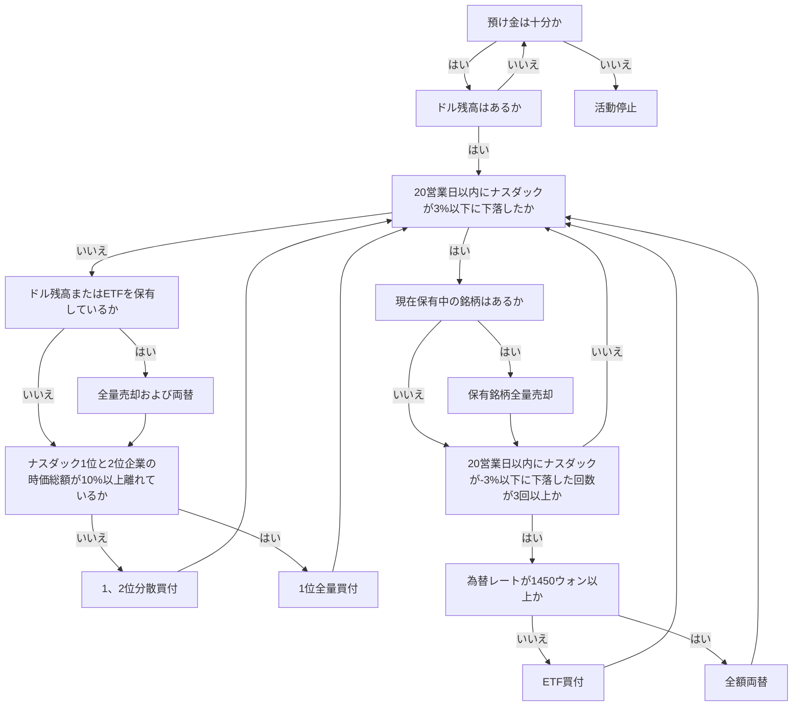

## **自動株式取引機、ASTP**

ASTP(Auto Stock Trading Program)は、内部アルゴリズムに従って株式の自動売買をテーマに作られたもので、[私の2つ目のマイルストーン](https://github.com/hyngng/astp/tree/legacy)です。1年生2学期が終わり、自分でプログラムを作ってみたいと思っていたところ、知人が自動株式取引機はどうかと言ったことに興味が湧いて作ることになりました。プログラムはPythonを使って作り、株式に関連する部分は知人の助けを受けながら、基礎戦略のみを簡単に従う形で作りました。

## **プログラムの特徴**

韓国投資証券の[OpenAPI](https://www.truefriend.com/main/customer/systemdown/OpenAPI.jsp?cmd=TF04ea01200)を使用しました。APIを利用するプログラムを作ったのはこれが初めてですが、できることが想像以上に増えて驚きました。売買戦略は次の二つに従い、NASDAQを基準に動作します。

- アルゴリズム概要
	- **株式買付**: NDX指数とNASDAQ上場1、2位企業の比率を考慮して株式を買い付けます。
	- **株式売却**: NDX指数が暴落したり、ウォンドル為替レートが過度に上昇した場合、保有株式をすべて売却し、売買活動を20営業日間停止します。NDX指数の暴落有無は、株式市場の開始時と終了時にそれぞれ2回、Excelに入力されたNDX指数の最大値と最小値を比較して判断します。
- 使用したライブラリ
	- `mojito`: 韓国投資証券のOpenAPI統合Pythonラッパーモジュールです。
	- `yfinance`: NASDAQ時価総額ランキングを調達するために使用します。
	- `BeautifulSoup`: 株式関連モジュールのすべてで欠落しているNASDAQ-100の数値をクローリングで調達するために使用します。

## **構造およびサンプルコード**



```python
# NDXクローリング
def get_ndx():

    if response.status_code == 200:
    
        html = response.text
        soup = BeautifulSoup(html, 'html.parser')

        ndx_class = soup.find(class_ = 'Fw(b) Fz(36px) Mb(-4px) D(ib)')
        ndx = re.sub(r'[^0-9]', '', ndx_class.get_text())

    else:
        print(response.status_code)
    
    return ndx

# NDX -3% 有無確認
def ndx_collapsed():

    df_ndf_data['ndx_index'] = df_ndf_data['ndx_index'].astype(float)
    ndx_decrse_3per = False

    ndx_max = df_ndf_data['ndx_index'].max()
    ndx_min = df_ndf_data['ndx_index'].min()

    if 100 * (ndx_max - ndx_min) / ndx_max > 3:
        ndx_decrse_3per = True
        print("\nNDX数値の変動が激しいです。\n")
    else:
        print("\nNDX数値は安定しています。\n")

    return ndx_decrse_3per
```

## **プログラム動作例**

{: .w-75 }
*プログラムの動作例と、プログラムを通じてApple 1株を買い付けた画面*

UIのない単純なPythonプログラムのため、コマンドプロンプトを通じて問題なく実行され、プログラムを一度実行すると任意に終了させるまでプログラムが自ら買付注文と売却注文を出します。約定された売却注文はプロンプト画面または韓国投資証券のアプリを通じても、以下のキャプチャ画面のように買付状況や保有中の株式状況を確認できます。

## **注意事項および限界**

- 米国株式市場は韓国時間でPM 11:30〜AM 6:30まで開いているため、海外株式をベースにするASTPは一般的なプログラムと異なり、コード動作を確認できる時間に制約があります。
- 韓国投資証券が提供するサービスを利用するために、プログラム外で事前作業が二つ必要です。
    1. 韓国投資証券の口座を開設し、[OpenAPI](https://apiportal.koreainvestment.com/intro)を申請する必要があります。申請ページで`key`と`secret`を発行され、その値を仮想口座番号と共にプロジェクト内の`mock.key`に保存して使用するためです。
    2. 注文の送受信や残高照会などを処理するために、韓国投資証券が提供する[eFriend Expert](https://www.truefriend.com/main/customer/systemdown/OpenAPI.jsp?cmd=TF04ea01200)プログラムをインストールする必要があります。
- この他に、共同認証書モジュールが64bit環境を未サポートという問題があるため、不便でも[32bit仮想環境](https://hyngng.github.io/ja/dev/virtual-32bit/)を任意に構築し、構築された仮想環境上でコードを実行する必要があります。

## **おわりに**

:::tip
[GitHub](https://github.com/hyngng/astp/tree/legacy)でより詳しくご覧いただけます。
:::

今回のマイルストーンを作りながらは、APIやライブラリなど外部モジュールを使ってみることを重点経験とし、実際に使ってみると、既に作られているモジュールを積極的に活用するほどより多くのことができるということを大きく認識できました。NASDAQ指標や各企業の時価総額などのデータをソート、表示する過程も学ぶことができました。

237行ほどの簡単なコードで終わりますが、後日プログラムを拡張することになれば、買付条件と売却条件をより精巧に詳細化し、クラス化を経てコードを簡潔に整理する努力が加わると良いのではないかという感想を持ちました。
