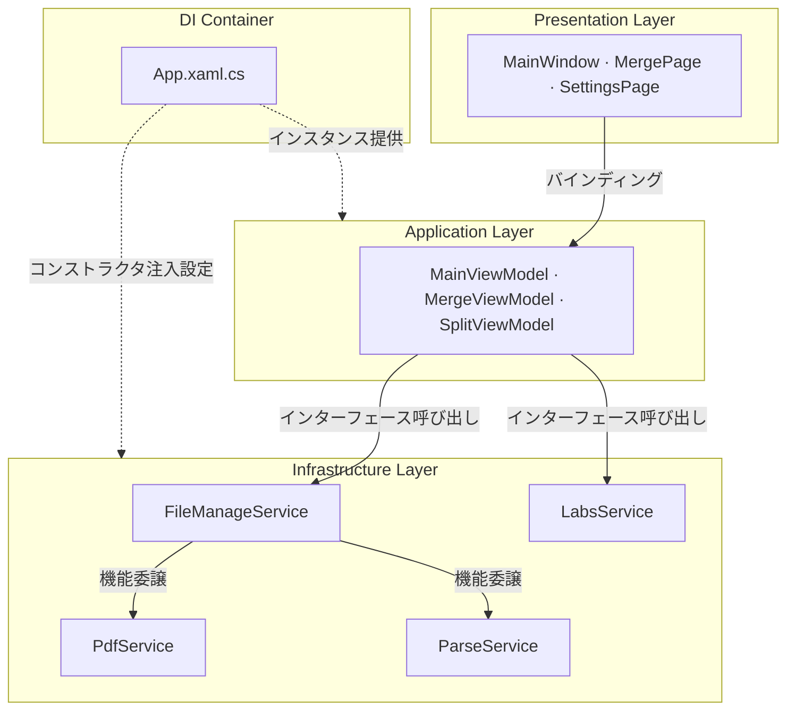

---
image:
    path: /2026-04-02-pascal-devlog/preview-image.webp
    lqip: data:image/webp;base64,UklGRj4AAABXRUJQVlA4IDIAAADQAQCdASoQAAgAAUAmJZwCdAEPDuQrCAD+/crO2PZZpBuP/xETb+8eyANti2KhVUAAAA==
    alt: "暫定的に使ったプログラム名は「Pascal」"

title: "WinUI 3 ベース PDF 編集プログラム開発回顧"
authors: ["dev"]

categories: [마일스톤, 기타 개발]
tags: [마일스톤, 기타 개발, WinUI 3, MVVM, XAML, C#]
start_with_ads: true

toc: true
toc_sticky: true

date: 2026-04-02 11:14:00 +0900
last_modified_at: 2026-06-23 16:47:00 +0900

mermaid: true
---

## **開発動機**

> 「ありがたいんだけど、うちは公共機関だから外部プログラムを勝手に使っちゃダメなんだ」

社会服務中、事務所で問題がありました。[社会服務要員の勤務後記](https://hyngng.github.io/posts/sabok-logs/)により詳しくまとめてありますが、簡単に要約すると、公共機関はライセンス許可を受けていない外部プログラムを勝手に使用できないという指摘を受けたことがあり、その経験がプログラム開発の動機につながりました。ただし単に「自分で作って使おう」という考えだけで始めたわけではありません。Unityで先に触れたC#を別の文脈でも使ってみたかったこと、ちゃんとしたWindowsプログラムも一度扱ってみたかったこともあって、新プロジェクトを思い切って始めることができました。

プログラム名がPascalである理由は、最初にPDF圧縮機能を目標に開発を始めたからです。実際には圧縮機能は召集解除間近で採算が合わず実装しませんでしたが、PDFファイル操作という文脈はマージと分割の二つで先に実装されました。

## **プログラム紹介**

{: .light }
{: .dark }
*完成した4ページのスクリーンショット。クレジット画面からわかる通り、すごく真面目なプログラムではない*

PascalはPDFのマージ、分割処理を行うプログラムです。社会服務期間中、約2ヶ月にわたって開発され、本当に運よく[開発者を志望する同僚の社会服務要員](https://github.com/din-c)がいたため、勤務中の空き時間に専用のNotionページを開いて小さなコラボレーションを進めました。本来はPDFテキスト抽出、JPG変換、圧縮など複数の事務関連機能をこのプログラムに統合して使用する予定でしたが、進路上の理由と残り少ない服務期間を考慮し、基礎的な機能いくつかのみ実装して終えました。

機関を特定できる情報を公開することは兵務庁が推奨しない行動であり、その立場を尊重して、どのような状況でどのように活用されたかを正確に描写するのは難しいですが、簡単には述べられそうです。まず、このプログラムを自分が所有しているという感覚が心理的に大きな助けになりました。次に、以前のPythonスクリプトを実行する前に`config.yaml`の設定値を毎回修正するなど、生のままの業務形態が、いくつかのボタンクリックで見栄えよく簡素化される利点がありました。

- 動作する機能
	- PDF複数ファイルのマージ
    - マージ順序変更可能
    - マージページ指定可能
	- PDF複数ファイルの同時分割
    - 分割単位指定可能
    - 分割範囲指定可能
	- Windowsアップデート画面を表示(実験室)

## **開発の難解さと適応の努力**

### **WinUI 3 フレームワーク**

Windowsプログラム開発に関して事前知識・経験がない状態で、フレームワークを選択する段階から方向性を簡単に見出せませんでした。最初はフロントエンド開発経験を再利用しようと[Electron.NET](https://github.com/ElectronNET/Electron.NET)を最初に調べてみたところ、当事者たちから「Wait - you host a .NET Core app inside Electron? Why?」と逆に問われる始末で、正統的な方向から大きく外れている印象を受けました。そしてちょうど[Fluent 2](https://fluent2.microsoft.design/)というMicrosoftのデザイン文法を知り、[ModernWPF](https://github.com/Kinnara/ModernWpf)ライブラリを使用するWPFプロジェクトに転換し、開発途中でレガシー環境が2025年基準では旧式だと感じ、最新フレームワークWinUI 3に開発環境を移しました。

この経験で事後的に振り返るべき点が一つあります。調べたところによると、Microsoftは過去20余年、WinFormsを皮切りにWPF、UWP、WinUI 3、そして最近のMAUIに至るまで、旧プラットフォームと完全に互換性のない新しいフレームワークを大量に投入してきました。そのためWindowsプログラム開発フレームワークは、モバイル、ウェブ、ゲームなど他の領域での開発と異なり、何を標準とすべきか基準が曖昧なのが事実であり、記事を書いている今この時点で振り返ってみると、私の試行錯誤はある種の通過儀礼だったように思います。

|フロントエンドWeb開発|WinUI|
|---|---|
|HTML|XAML|
|CSS|XAML Style|
|JavaScript|C#|

それでも第一印象が良かった点は、WPF、WinUI 3の開発経験がフロントエンドWeb開発と非常に似ていることです。ちょっと面白かったです。XAMLでUI構成要素とプロパティを定義し、C#で詳細ロジックを記述する過程がHTMLとJavaScriptが動作する方式と同じで、スタイル定義もCSS、SCSSを扱ったことがあるなら難しくなく、UIフレームワークにはすぐ適応できました。

ただしWinUI 3のエコシステムは、Microsoftの継続的な支援にもかかわらず依然として貧弱です。例えば[WinUI-3-Apps-Listプロジェクト](https://github.com/DesignLipsx/WinUI-3-Apps-List?tab=readme-ov-file)を見てみると、量自体はある程度ありますが質が高くありません。特にオープンソースでコードが公開されている場合はなおさら稀で、このフレームワークを他の人々が実際にどう扱っているのか知るのが難しかったです。そのためWinUI 3プロジェクトをどう進めるべきかという悩みは、[Microsoftが提供する公式ドキュメント](https://learn.microsoft.com/ko-kr/windows/apps/winui/winui3)と格闘しながら演繹的に解く必要がありました。韓国語翻訳版の完成度が低く、英語のドキュメントが事実上唯一の選択肢で、LLMもこの領域では大きな助けにはなりませんでした。初期学習コストがかかった部分です。

### **IDE、.NET、ライブラリ**

VSCodeのすっきりした感じが気に入っていて、遠い親戚のVisual Studioはちょっと馴染みがありませんでした。ましてWinUI 3という馴染みのないフレームワークで試したことはありませんでした。ソリューション、NuGet、デザイナーといった用語やメニューバーで提供される機能に慣れること自体が最初のボトルネックで、機能実装の前に開発環境の構造を理解するのに思ったより多くの時間を費やす必要がありました。

特に[WinUI-Gallery](https://github.com/microsoft/WinUI-Gallery)、[DevWinUI.Gallery](https://github.com/ghost1372/DevWinUI/tree/main/dev/DevWinUI.Gallery)、[Files](https://github.com/files-community/files)など他のオープンソースプロジェクトを見ると、`Services`、`Helpers`、`Modules`といった一種の方言に従っているのがわかります。UnityやPython、フロントエンドプロジェクトではあまり見かけなかった方式なので、最初はかなり違和感がありました。機能を学ぶこととは別に、プロジェクトを読む方法自体を探求する必要がありました。既存の感覚をこのプロジェクトに翻訳し、適用する必要がありました。

それでもWinUI 3環境にうまく定着できたのは、[Windows Community Toolkit](https://github.com/CommunityToolkit/WindowsCommunityToolkit)と[DevWinUI](https://github.com/ghost1372/DevWinUI)という優れたコントロールライブラリのおかげです。UIを扱う.NET開発環境ではUI要素をコントロールと呼びますが、二つのライブラリが本当に多様なコントロールを提供しているため、`DataTable`程度を除けばほとんど難しくなく実装できました。初期参入コストを減らせた部分です。

### **かなり馴染みのないMVVMパターン**

最も馴染みのなかった部分です。XAMLやC#の文法を知っている以外にMVVMに対する感覚が必要でした。MVVM自体はWinUI開発の必要条件ではありませんが、フレームワーク自体がMVVMを想定して設計されているため、遵守しなければコードのメンテナンス難易度が急激に高まります。Unityでの開発経験とは全く異なるものにした部分です。

コード間の依存度を下げるという概念自体は馴染みがありましたが、MVVMが実際にそれをどう達成するのか、モデルとビュー、ビューモデルの三つの領域がどこまでできて、どこからはやってはいけないのか、両者の違いをどう区別するのかについては学習が必要でした。そして実は記事を書いている今も理解が少し曖昧です。例えば、複雑なページは専用のViewModelを置き、単純なページは省略すること、ファイルのドラッグ＆ドロップのようにバインディングだけでは処理が難しい場合はコードビハインドを橋渡しとして使うことなどが、MVVMをよく遵守するための最善だと考えています。しかしこれが本当にうまく作られた最善なのか確信が持てず、最善だとしてもその利点をよく実感できません。

これとは別に、[MVVM Toolkit](https://learn.microsoft.com/en-us/dotnet/communitytoolkit/mvvm/)パッケージはWinUI 3開発において事実上必須で習得する必要があります。このパッケージは、ビューがUIマークアップファイルがコードビハインドを経由せずにビューモデルと通信できるように支援する役割を果たし、そのおかげでより直感的なプログラム設計構造に改善できます。

## **協業と業務効率についての所感**

### **協業**

普段から習慣的にNotion、Figma、GitHubを愛用しており、当然このプロジェクトでも利用しようとしました。同僚の社会服務要員がこれらのツールを使ったことがないと言われたので、ツールの使い方となぜこのツールなのかなどを簡単に説明し、今回はNotionでPARA方法論にも新たに挑戦し、自分なりの体系的な協業構造を築きたかったです。

しかし蓋を開けてみればGitHub以外は期待したほどの反応はなく、正直少し気まずかったです。同僚が怠けていたからではなく、WinUI 3という新しい環境だけでも大変なのに、NotionやFigmaといったツールがなぜ必要なのか、説得力が不足していたようです。私はリソース管理体系が開発をより長く持続させられるので常に必要だと考えていた一方、同僚は開発とあまり関係ないコストなら必要に応じて排除できると見ていたようです。そして次第に、ここではその考えが正しいと思うようになりました。オブジェクト指向の効用と同じく、良いツールや良いパターンにもそれが正当化される規模があることを感じました。良いものは良いと、ツールを慣性的に盲信していたようです。

形は変わりましたが、協業自体は満足できるものでした。私はビューとビューモデル、同僚の社会服務要員はビューモデルとモデルを担当するように作業領域を分け、修正事項は互いに共有・レビューし、相互に二次修正を経る形で進めました。視点を交換できるというだけでも満足な経験でした。コード作成習慣がほぼ同じで摩擦が少なかったのはおまけです。

### **効率**

数年前、ある海外の作家が作品に完全に集中するために仕事を辞めようとする記事を見ました。ある読者がコメントで「君がやりたいことのためだとしても、どんな理由であれ仕事を辞めるのは良くないと思う」とアドバイスすると、作家は「好きでもない職場のオフィスで自分の想像力を死なせてしまったことをすでに後悔している」という趣旨の強い一言を返し、その時点で議論は終わりました。

プログラム開発中にこの逸話を思い出しました。芸術作品を作る時につきものの、精神的感応、自己実現の切迫感などがプログラム開発に必要なわけではないので、厳密には私とは状況が異なります。しかし消耗的な業務を毎日処理しなければならない環境が、創作や作業への推進意欲をどれだけ疲弊させるかについては共感できる部分がありました。

実際にこのプロジェクトはそういった理由で進捗が困難でした。どのUIコントロールをどう使えるか想像している時に業務で呼び出され、20分後に席に戻って文脈を再度復旧していると、席の電話が鳴りました。創造力が必要な時だけでなく、M-V-VM間の依存関係フローを検討するなどの単純なデバッグ作業も、頻繁な中断で集中が難しかったです。不当な状況だったと愚痴りたいわけではありません。ただ、環境的な余裕が確保されていない時の業務効率がどこまで落ちるかを、今回は初めて確認しました。

## **アーカイブ**

### **各種スクリーンショット**

{: .w-75 }
*2025年初め、同僚の社会服務要員が直接Pythonでビルドしてくれたプログラム。これをハイレベルに置き換える目的もあった*

{: .light .border }
{: .dark }
*2024年末、ほぼ同じ機能を実行するプログラムの原始デザイン案*

*いろいろ試していた頃。機能が実装された時点で実使用と開発を並行していた*

### **簡略なアーキテクチャ**

### **使用したライブラリ**

- UIおよびフレームワーク拡張
    - `Windows Community Toolkit`[MITライセンス](https://github.com/CommunityToolkit/Windows/blob/main/License.md)
    - `DevWinUI`[MITライセンス](https://github.com/ghost1372/DevWinUI/blob/main/LICENSE)
- PDFドキュメント処理
    - `PDFsharp`[MITライセンス](https://github.com/empira/PDFsharp/blob/master/LICENSE)、PDFマージ・分割担当
    - `PdfPig`[Apache-2.0ライセンス](https://github.com/BobLd/PdfPig.Rendering.Skia/blob/master/LICENSE.txt)、テキスト抽出担当

### **開発に役立ったドキュメント**

- アイコン関連
	- [Symbol列挙型](https://learn.microsoft.com/ko-kr/uwp/api/windows.ui.xaml.controls.symbol?view=winrt-26100)
	- [fluentui-system-icons](https://github.com/microsoft/fluentui-system-icons)
	- [Segoe MDL2 Assets icons](https://learn.microsoft.com/en-us/windows/apps/design/style/segoe-ui-symbol-font)
	- [FluentIcons.Wpf](https://www.nuget.org/packages/FluentIcons.WPF/)
- WinUI3
	- [クイックスタート: 環境設定とWinUI 3プロジェクト作成](https://learn.microsoft.com/ko-kr/windows/apps/winui/winui3/create-your-first-pascal-devlog3-app?source=recommendations#unpackaged-create-a-new-project-for-an-unpackaged-c-or-c-pascal-devlog-3-desktop-app)
	- [名前空間Windows App SDK](https://learn.microsoft.com/ko-kr/windows/windows-app-sdk/api/winrt/?view=windows-app-sdk-1.7)
	- [Template Studio for WinUI](https://marketplace.visualstudio.com/items?itemName=TemplateStudio.TemplateStudioForWinUICs)
- MVVM
	- [MVVMツールキットの紹介](https://learn.microsoft.com/ko-kr/dotnet/communitytoolkit/mvvm/)
- .NET 9
	- [高度な.NETプログラミング解説書](https://learn.microsoft.com/ko-kr/dotnet/navigate/advanced-programming/)
	- [.NET 9用WPFの新機能](https://learn.microsoft.com/ko-kr/dotnet/desktop/wpf/whats-new/net90)

## **おわりに**

:::tip
[GitHub](https://github.com/hyngng/pascal.drill)でより詳しくご覧いただけます！
:::

ライブラリのうちDevWinUIは、[ghost1372](https://github.com/ghost1372)という名前で活動するイランの開発者Mahdi Hosseiniによって全面的に管理されています。公開情報によると、この方はイランのQeydar市で教師として働きながら居住しているようです。そして本当に信じられない話ですが、2025年12月28日、イラン全土で大規模なデモが発生し、イランの強硬保守政権はこれを武力鎮圧し始めました。

Wikipediaによると、この方が居住するQeydar市でもデモが報告されました。そして数日後、イラン政府がインターネットを全国的に遮断したため、ghost1372のコミット記録もその時点で途絶え、今後の動向も不透明になったことがありました。DevWinUIがWinUI 3エコシステムに貢献するところが少なくないため、冗談でMicrosoftがヘリコプターでも送ってこの方を救出しに行くべきだという話もしましたが、当時は実際に生死を確認する方法がなく心配した記憶があります。幸い今は再びコミットが上がっており、無事なようです。

- その他雑談
	- このプロジェクトを扱っている間にVisual Studio 2026がリリース2025年11月11日されました。
	- DevWinUIはバージョンが`9.4.0`から`9.8.0`に上がりました。
