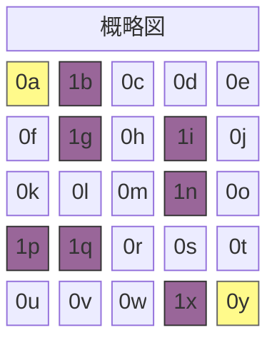
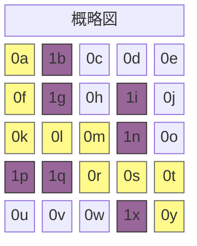

A*アルゴリズムは特定の二地点を結ぶ最短経路を探すためのグラフ探索アルゴリズムです。このアルゴリズムの特性は、$n$をノードとするとき、以下の一つの式で要約できます。

$$
f(n) = g(n) + h(n)
$$

## **オープンリストとクローズドリスト**

A*アルゴリズムは最短距離を求める際、移動可能な隣接ノードでのコストを調査します。まず調査対象をオープンリスト(Open List)に追加し、調査が終わったノードからクローズドリスト(Closed List)に移動します。

```python
open_list = []
closed_set = set()
```

このプロセスを実装するために二つのリストを使用します。オープンリストは優先度キュー、クローズドリストは集合(Set)データ構造を使用します。

## **$g(n)$: 1マス移動コスト**

$g(n)$はオープンリストに登録された候補ノードへ移動した時のコストを測定する関数です。もしマップが格子で与えられたなら、上下左右の移動コストは$1$、斜め移動が可能な場合、斜め移動コストは$\sqrt{2} \approx 1.4$と計算できます。私が書いたコードでは上下左右移動のみを考慮します。

```python
# ノードが以下のように定義されているとする
class Node:
    def __init__(self, position, parent=None):
        # ...
        self.g = 0

# 以下のように表現できる
neighbor.g = current_node.g + 1
```

## **$h(n)$: 目的地までの距離**

$h(n)$はオープンリストに登録された候補ノードから目的ノードまでの移動コストを大まかに推定する関数です。レストランを選ぶ時に客が多い所に行ったり、海外製品を購入する時に為替レートを1200〜1400ウォンと概算して計算することなどをヒューリスティックと呼びます。そのためヒューリスティック測定値とも呼ばれます。問題状況に合わせて該当値を適切に求めることがアルゴリズムの性能向上に役立つと知られており、一般的には以下の方法で得られます。

- 例1: マンハッタン距離 $h(n) = |x_1 - x_2| + |y_1 - y_2|$
```python
def heuristic(start_node, end_node):
    return abs(
        end_node[x] - start_node[x]) + abs(end_node[y] - start_node[y]
    )
```
- 例2: ユークリッド距離 $h(n) = \sqrt{(x_1 - x_2)^2 + (y_1 - y_2)^2}$
```python
def heuristic(start_node, end_node):
    return math.sqrt(
        (end_node['x'] - start_node['x'])**2 + (end_node['y'] - start_node['y'])**2
    )
```

## **Pythonで実装したアルゴリズム**

```python
import heapq

class Node:
    def __init__(self, position, parent=None):
        self.position = position
        self.parent = parent

        self.g = 0
        self.h = 0
        self.f = 0

    def __lt__(self, other):
        return self.f < other.f

def heuristic(a, b):
    return abs(a[0] - b[0]) + abs(a[1] - b[1])

def astar(grid, start, end):
    open_list = []
    closed_set = set()

    start_node = Node(start)
    end_node = Node(end)

    heapq.heappush(open_list, start_node)

    while open_list:
        current_node = heapq.heappop(open_list)
        closed_set.add(current_node.position)

        if current_node.position == end_node.position:
            path = []
            while current_node:
                path.append(current_node.position)
                current_node = current_node.parent
            return path[::-1]

        x, y = current_node.position
        neighbors = [(x+dx, y+dy) for dx, dy in [(-1,0), (1,0), (0,-1), (0,1)]]

        for next_pos in neighbors:
            nx, ny = next_pos
            if not (0 <= nx < len(grid) and 0 <= ny < len(grid[0])):
                continue
            if grid[nx][ny] != 0:
                continue
            if next_pos in closed_set:
                continue

            neighbor = Node(next_pos, current_node)
            neighbor.g = current_node.g + 1
            neighbor.h = heuristic(next_pos, end)
            neighbor.f = neighbor.g + neighbor.h

            if any(n.position == neighbor.position and n.f <= neighbor.f for n in open_list):
                continue

            heapq.heappush(open_list, neighbor)

    return None
```

## **アルゴリズム実行例**

該当アルゴリズムは、与えられたノードの値が$0$なら道、$1$なら障害物と判断します。例えば以下のようなマップを仮定します。黄色で強調された0aと0yはそれぞれ出発地と目的地です。



```python
grid = [
    [0, 1, 0, 0, 0],
    [0, 1, 0, 1, 0],
    [0, 0, 0, 1, 0],
    [1, 1, 0, 0, 0],
    [0, 0, 0, 1, 0]
]

start = (0, 0)
end = (4, 4)

path = astar(grid, start, end)
```

以下のように$5 \times 5$サイズのマップに出発地を`(0, 0)`、目的地を`(4, 4)`に設定し、適宜壁を配置した場合、最短経路`path`は次のように出力されます。



```bash
[(0, 0), (1, 0), (2, 0), (2, 1), (2, 2), (3, 2), (3, 3), (3, 4), (4, 4)]
```
