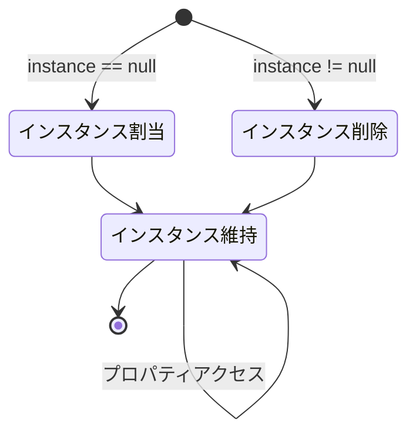

## **はじめに**

ゲームを開発していると、整理が必要な概念が多いことを徐々に感じています。NotionやObsidianを頻繁に活用してはいますが、やはり時間をかけて整理しておくのとは差があります。

それでも元々はブログの雰囲気が堅くなりすぎるかと思い、技術的概念を扱うポストはあえて詳細に書かないようにしていましたが、最近ブログの語源がWeb + Logだと知り、勉強したことをまとめた記事もなかなか良いのではないかと思いました。そこで今後、別途記録が必要なものは一度深く掘り下げておくついでに、ブログに一つずつ整理しておこうと思います。

そのうち最初に整理しておくのはシングルトン(Singleton)パターンです。シングルトンパターンは特定クラスのインスタンスがただ一つだけ存在することを保証するデザインパターンで、主に以下のような利点があります。

- ゲームの全体的な状態を複数のスクリプトやシーンで同一に維持可能
- オーディオ、スプライト、オブジェクトなどのデータを重複なく管理可能
- 個別クラスで重いコードを重複使用する状況を避けられるためパフォーマンスが良い

シングルトンパターンを最初に紹介する理由は、これが直感的だからです。ゲーム開発を学ぶ際、コードの書き方がある程度身についたらこのパターンに触れる方が多く、その分概念も簡単で使いやすいです。

## **構造の可視化**



## **基本コード**

```cs
public class Singleton : MonoBehaviour
{
    private static Singleton instance = null;
    public static Singleton Instance
    {
        get
        {
            if (instance == null)
                return null;
                
            return instance;
        }
    }

    void Awake()
    {
        if (instance == null)
        {
            instance = this;

            DontDestroyOnLoad(this.gameObject);
        }
        else
            Destroy(this.gameObject);
    }
}
```

シングルトンパターンのルールは次の二つにまとめられます。

- クラスのインスタンスをただ一つに保証する (Ensures that a class can only instantiate one instance of itself)
- 一つのインスタンスでグローバルなアクセスを提供する (Gives easy global access to that single instance)

なのでUnityでシングルトンパターンは非常にシンプルに実装されます。上部のプロパティ部分と下部の`Awake()`の両方とも、インスタンスがただ一つだけ存在することを保証しているに過ぎません。スクリプトのインスタンスは`static`で宣言されているため、シングルトンパターンが使用されたスクリプトのフィールドやメソッドは、外部クラスから`スクリプト名.Instance`形式でアクセス可能です。

## **インスタンス生成**

```cs
public class Singleton : MonoBehaviour
{
    private static Singleton instance = null;
    public static Singleton Instance
    {
        get
        {
            if (instance == null)
            {
                GameObject gameObj = new GameObject();
                instance = gameObj.AddComponent<Singleton>();
                DontDestroyOnLoad(gameObj);
            }
                
            return instance;
        }
    }
}
```

従来まではシングルトンインスタンスがない場合、インスタンスを単に`null`として処理し、新しいインスタンスを生成しないため、外部スクリプトからインスタンスにアクセスする際に`Instance`の有無をチェックする手間がありましたが、これが不便なら上記のようにプロパティ部分を修正し、インスタンス化コードまで接続できます。

こうすると、プロパティにアクセスするたびにインスタンスが自動生成されるため、外部スクリプトで別途インスタンスの有無をチェックする必要がなくなり、`Singleton.Instance`形式のコードを呼び出すだけでシングルトンインスタンスにアクセスできるようになります。

## **複数作成**

```cs
public class Singleton<T> : MonoBehaviour where T : MonoBehaviour
{
    private static T instance;
    public static T Instance
    {
        get
        {
            if (instance == null)
                return null;

            return instance;
        }
    }

    private void Awake()
    {
        if (instance == null)
        {
            instance = this as T;
            DontDestroyOnLoad(gameObject);
        }
        else
            Destroy(gameObject);
    }
}
```

```cs
public class GameManager : Singleton<GameManager>
{
    /* コード記述 */
}
```

シングルトンスクリプトのインスタンスは基本的にただ一つに維持されるため、概念的にはシングルトンインスタンスを同時に複数使用することはできません。無理やりコードをコピーして使うことはできますが非効率的です。代わりに、複数の異なるシングルトンインスタンスを使用したい場合は、ジェネリックを使用して`Singleton<T>`の形で異なるシングルトンスクリプトを複数生成して使用できます。

この場合、他のクラスも継承を通じて簡単にシングルトンに変更できます。例えば、`GameManager.cs`にシングルトンを適用したい場合、上記のように`Singleton<T>`を継承する形で使用できます。

## **使用例**

```cs
public class GameManager : MonoBehaviour
{
    /* シングルトン宣言部 */

    public int Score;

    public void ResetScore()
    {
        Score = 0;
    }
}
```

```cs
public class Player : MonoBehaviour
{
    void AttackEnemy()
    {
        Enemy.TakeDamage();

        if (Enemy.HP <= 0)
        {
            Destroy(Enemy);

            GameManager.Instance.Score += 100;
        }
    }

    void Dead()
    {
        GameManager.Instance.ResetScore();
    }
}
```

すべてのシーンで汎用的に存在し、ただ一つに維持されるという特徴は、`GameManager.cs`に活用するのに適しているという話でもあります。ゲームのデータや状況を総括するスクリプトは一般的にただ一つで処理するからです。これに関連して、ゲームマネージャに例えば上記のようにシングルトンパターンを使用できます。

プレイヤーが敵との戦闘を経て、プレイヤーが敵を倒すとスコアが上がり、死ぬとスコアがリセットされる状況を仮定しています。ゲームマネージャには`Score`と`ResetScore()`が定義されており、`Player.cs`は外部クラスとしてシングルトンインスタンスを通じてゲームマネージャの`Score`と`ResetScore()`に直接アクセスしています。敵が死ぬと`Player.cs`がスコアを直接上げ、プレイヤーが死ぬとスコアを直接リセットします。

外部からクラスメンバーに直接アクセスできるため、面倒な`GameManager`のインスタンス生成プロセスなしにこのような構成が可能です。この特徴を活かして`GameSystem.cs`などのマネージャスクリプトをシングルトンとして使用する場合、例えば以下のようなフィールドやメソッドを構成して活用できます。

- フィールド
	- `Score`、`CurrentLevel`、`EnemyCount`: レベルや点数、残りの敵数などの主要ゲーム状態を保存するため
	- `isGamePaused`、`IsMusicEnabled`: ゲームの一時停止有無やBGMの有効化有無などを保存するため
- メソッド
	- `StartGame()`、`QuitGame()`: ゲームが開始または終了する時に使用
	- `PauseGame()`、`ResumeGame()`: ゲームが一時停止または再開する時に使用
	- `LoadScene()`、`LoadLevel()`: 特定シーンやレベルを読み込む時に使用

## **注意事項**

ただし、シングルトンパターンは濫用しやすいという構造上の論争があるプログラミングパターンです。使用が便利すぎるあまり、スクリプトが多くの役割やデータを担当することになると、シングルトンインスタンスと他のクラス間の結合が強くなり、汚れたコードはインスタンスの変更主体やタイミングが分かりにくくなります。

したがって、使用前に代替案がないか検討しながら慎重になる必要があります。一般的なコード作成がそうであるように、シングルトンパターンも長期間にわたって濫用されると戻すのが難しいからです。シングルトンパターンを使用するなら、少数のスクリプトのみがシングルトンインスタンスにアクセスできるようにするのが良いでしょう。

それでも依然として使いやすく、`GetComponent()`や`Find()`などの重い関数の重複実行を避けられるという点で、プロジェクト規模によっては十分使用する価値があります。
