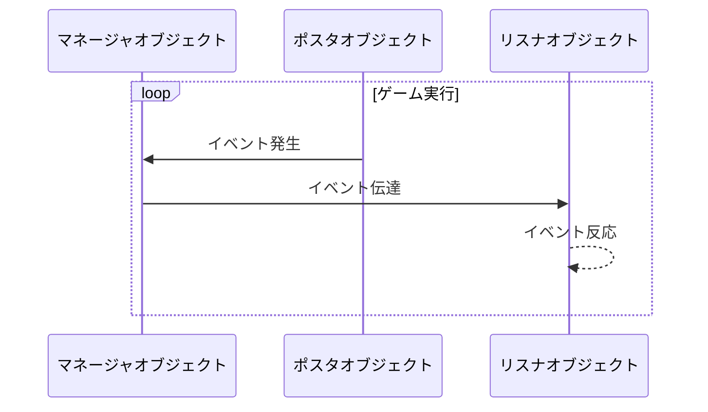

## **はじめに**

イベント駆動型プログラミング(Event Driven Programming)は、プログラムの流れがイベントによって決定されるプログラミングパラダイムで、イベントの発生、管理、実行を主管し、コードの拡張性を高め、可読性と保守性を管理するために使用します。[他のゲーム開発過程](https://hyngng.github.io/posts/armonia-first-devlog/)で大いに役立ったので、今後も有用に使えそうで記事にまとめます。

## **基本概念**

- イベント駆動型プログラミングは以下の三つの概念で実装されます。
	- マネージャ(Manager): 特定オブジェクトにイベントを伝播する役割
	- リスナ(Listener): 特定イベントに反応する役割
	- ポスタ(Poster): 特定イベントを発生させる役割

マネージャ役割は主に`GameObject.cs`のようなマネージャスクリプト一箇所で担当しますが、リスナやポスタ役割は一つのオブジェクトがすべての役割を担当することも、どちらか一つの役割だけを担当することもあります。

例えば爆発音が聞こえ、周囲のNPCが音のした方を見る状況を想定するとき、基本的に爆発音を発生させるオブジェクトはポスタ、周囲のオブジェクトはリスナ役割を一つずつ担当しますが、もし爆発音を発生させるオブジェクトも該当イベントに反応するNPCなら、このオブジェクトはポスタとリスナ役割の両方を担当できます。

## **構造の可視化**



## **基本コード**

### **イベントマネージャ**

:::info
コード長が少し長めです！
:::

```cs
public enum EventType
{
    FirstExampleEvent,
    SecondExampleEvent,
    /* ... */
}
```

```cs
public class EventManager : MonoBehaviour
{
    public static EventManager Instance { get { return instance; } }    
    private static EventManager instance = null;

    public delegate void OnEvent(EventType eventType, Component Sender, object Param = null);
    private Dictionary<EventType, List<OnEvent>> Listeners
        = new Dictionary<EventType, List<OnEvent>>();

    void Awake()
    {
        if (instance == null)
        {
            instance = this;
            DontDestroyOnLoad(gameObject);
            return;
        }
        DestroyImmediate(gameObject);
    }

    public void AddListener(EventType eventType, OnEvent Listener)
    {
        List<OnEvent> ListenList = null;

        if (Listeners.TryGetValue(eventType, out ListenList))
        {
            ListenList.Add(Listener);
            return;
        }

        ListenList = new List<OnEvent>();
        ListenList.Add(Listener);
        Listeners.Add(eventType, ListenList);
    }

    public void PostNotification(EventType eventType, Component Sender, object param = null)
    {
        List<OnEvent> ListenList = null;

        if (!Listeners.TryGetValue(eventType, out ListenList))
            return;

        for(int i = 0; i < ListenList.Count; i++)
             ListenList?[i](eventType, Sender, param);
    }

    public void RemoveEvent(EventType eventType) => Listeners.Remove(eventType);

    public void RemoveRedundancies()
    {
        Dictionary<EventType, List<OnEvent>> newListeners
            = new Dictionary<EventType, List<OnEvent>>();

        foreach(KeyValuePair<EventType, List<OnEvent>> Item in Listeners)
        {
            for (int i = Item.Value.Count - 1; i >= 0; i--)
                if(Item.Value[i].Equals(null))
                    Item.Value.RemoveAt(i);

            if (Item.Value.Count > 0)
                newListeners.Add(Item.Key, Item.Value);
        }

        Listeners = newListeners;
    }

    public void RemoveListener(Event eventType, OnEvent listener)
    {
        List<OnEvent> listenList = null;

        if (Listeners.TryGetValue(eventType, out listenList))
            listenList.Remove(listener);
    }

    void OnLevelWasLoaded()
    {
        RemoveRedundancies();
    }
}
```

デリゲートを用いた方法です。リスナオブジェクトでも一部のメソッドを使用できるように[シングルトンパターン](https://hyngng.github.io/posts/singleton-pattern/)を用い、イベントは`enum`を用いて定義します。コードは80行近くありますが、5つの個別メソッドで構成されているため難しくありません。

- デリゲートとフィールド
	- `OnEvent()`: イベントリスナのイベント反応メソッドを登録するデリゲートです。
	- `Listeners`: キーはイベント、値は`List<OnEvent>`で構成されるディクショナリです。特定のイベントとイベントへの反応を接続します。
- メソッド
	- `AddListener()`: あるイベントに特定オブジェクトの反応をメソッド形式で登録します。
	- `PostNotification()`: ポスタオブジェクトがイベントを発生させる時に使用するメソッドです。
	- `RemoveEvent()`: `Listeners`ディクショナリから特定イベントを削除するメソッドです。
	- `RemoveRedundancies()`: 一種の整合性検査です。特定イベントに対して実行するものが何もない場合、該当イベントを削除します。
	- `RemoveListener()`: リスナオブジェクトを破棄する際に`NullReferenceException`エラーを防ぐため、`Listeners`ディクショナリから該当オブジェクトを削除します。

### **イベントリスナ**

```cs
public class ListenerObject : MonoBehaviour
{
    void Start()
    {
        EventManager.Instance.AddListener(Event.ObjectAccessed, OnEvent);
    }

    public void OnEvent(EventType EventType, Component Sender, object Param = null)
    {
        switch (EventType)
        {
            case EventType.FirstExampleEvent:
                /* イベント動作コード記述欄 */
                break;
        }
    }

    void OnDestroy()
    {
        EventManager.Instance.RemoveListener(Event.ObjectAccessed, OnEvent);
    }
}
```

ゲームが開始されたりオブジェクトが生成されたりすると、希望するイベントを検知できるよう`EventManager.AddListener()`メソッドでリスナを追加し、オブジェクトが破棄される際に細かなエラーまたは不要なイベント呼び出しを防ぐため、`EventManager.RemoveListener()`で登録されたメソッドを削除します。

`OnEvent()`メソッドはイベントが発生した時に呼び出されます。イベントタイプ、イベントを発生させたオブジェクト、そして追加的なパラメータを引数として受け取り、`switch`文でイベントの種類に応じて異なるロジックを処理できます。この例では`FirstExampleEvent`イベントに対して特定ロジックを書けるように構成されています。

## **使用例**


[開発中のゲーム](https://hyngng.github.io/posts/armonia-first-devlog/)で使用した例です。特定オブジェクトを選択すると、一部のインタラクション可能なオブジェクトが黄色系で表示され、該当オブジェクトの選択を解除すると元に戻ります。イベント駆動型プログラミングで実装しました。
