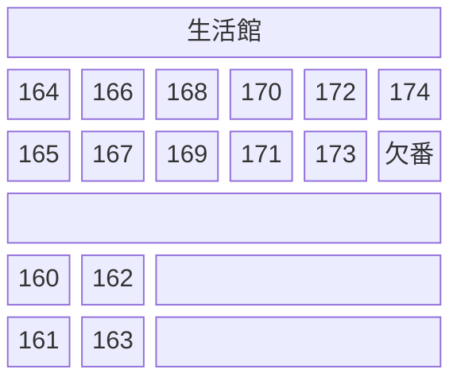

気分がぼうっとしている。ゆっくりと流れていた時間がいつの間にか過ぎ去り、練武館を出て家で文章を書いている。

私の場合は時期として、2024年5月21日の手榴弾爆発事故と2024年5月23日の中隊長の苛酷行為による訓練兵死亡事故が重なった直後に入営した最初の期であり、さらに補充役だったせいか、訓練所で目に見えて便宜を図ってもらえる部分があった。訓練そのものが楽だったというよりは、同じ教育でもできるだけ涼しい場所を探して行ったり、軍紀の強度を和らげるといった形だった。

補充役自体の現役に比べて緩い教育課程と雰囲気もあった。訓練所生活によって配置先が変わる現役とは違い、補充役は修了後の計画がすべて決まった状態で入営するからかもしれない。全員がそうとは限らないが、私の生活館では、長期待機で戦時勤労役への編入を控えており、訓練所が面白いと聞いてわざわざ来たという変わった同い年の同期もいた。

私は訓練所にノートと筆記用具を持って行き、その日一日を日記として欠かさず記録した。合計14枚分が整理され、修了後に家で記録を再びブログ記事に整えて書き写した。

## **訓練所の事前準備**

私は準備品をいくつか持って行った。修了して出てみると、裸一貫で入所しても大きな支障はなさそうだが、それでもそのうちのいくつかの物は有用だった。持って行った物は次の通りである。

|準備品|持って行った理由|実際に役立ったか|
|---|---|---|
|Casio F-91W-1 腕時計|時間確認用|どこへ行っても有用。本当に良い|
|ダイソー中敷き2足|軍靴に入れて使用するため|戦闘靴に入れて使うと本当に良かった|
|3M イヤープラグ2足|予備用|支給品イヤープラグとは比べ物にならないほど良い|
|練習帳と筆記用具|日記作成および絵を描く用|数回使ったが、結局は荷物だった|
|シャンプー、ボディウォッシュ|予備用|良いが、オールインワンのほうが勝る|
|本2冊|退屈しのぎ|不寝番のときにちょっと読む程度以外は、結局荷物だった|
|トイレットペーパー1ロール|予備用|支給品のトイレットペーパーも使いきれずに出てきた|
|歯ブラシケース|知人が必ず持って行けと強調|支給品で歯ブラシケースが出てきて役に立たなかった|

同じ生活館を使った人たちを見ると、ふつうシャンプーとボディウォッシュ程度だけ軽く持って来る場合が多かったが、カヌーやポカリスエットの粉末を持って来て分け合ってくれた方もいたし、特に専門研究要員の場合は何冊かの論文や本を持って来た場合もあった。私の場合も、訓練所生活が退屈だと聞いて本を二冊持って行った。

個人的に持って行けばよかったと思われる物には、睡眠用アイマスクがある。赤色の消灯ランプが点灯するのだが、敏感な人は睡眠の妨げになるほど明るいからである。

## **訓練所の一日の概要**

日誌を書く前に、毎日繰り返される共通分母を先に整理した。まず、訓練所の一日の日程は次のように進む。

```mermaid
gantt
    title 平常時の日程
    dateFormat HH:mm
    axisFormat %H:%M

    section 朝点呼
    就寝: 00:00, 06:30
    起床および洗面洗足: 06:30, 07:00
    朝点呼および朝食: 07:00, 09:00

    section 午前の日程
    午前教育および訓練: 09:00, 12:00
    昼食: 12:00, 13:00

    section 午後の日程
    午後教育および訓練: 13:00, 17:30
    夕食: 17:30, 18:30
    シャワーおよび個人整備: 18:30, 20:30

    section 夕点呼
    清掃および点呼待機: 20:30, 21:30
    夕点呼: 21:30, 22:00
    就寝: 22:00, 2h
```

基本的な一日の日程は上記のように進むが、訓練所の規定上、6月の訓練兵からは暑い期に分類され、酷暑期の日程が併行される。この変種日程は下記のように進む。

```mermaid
gantt
    title 酷暑期の日程
    dateFormat HH:mm
    axisFormat %H:%M

    section 午睡前の日程
    就寝: 00:00, 03:00
    起床および洗面洗足: 03:00, 03:30
    教育および訓練: 03:30, 07:00
    朝食: 07:00, 08:00
    教育および訓練: 08:00, 12:00
    昼食: 12:00, 13:00
    個人整備: 13:00, 14:00
    午睡: 14:00, 16:00
    教育: 16:00, 17:30
    夕食: 17:30, 18:30
    シャワーおよび個人整備: 18:30, 19:30

    section 夕点呼
    清掃および点呼待機: 19:30, 20:30
    夕点呼: 20:30, 21:00
    就寝: 21:00, 3h
```

酷暑期の日程の特徴は、就寝時間が夜9時、起床時間が朝3時に調整されることである。入所1週目が終わる前から早々に始まり、負担はかなりあるが従うしかない。

## **アーカイブ**

- 26連隊、24-24期（6月13日入営、7月4日修了）

## **訓練所日誌**

### **1週目**

#### **1日目**

初入所日である。入所式は陸軍訓練所入営審査台で短く行われ、国家を斉唱し、しばらく敬礼をしたら終わった。

両親が去ると助教たちがすぐに悪魔に変貌するという噂が蔓延しているが、実際には落ち着いた雰囲気のなかでさまざまな行政手続きが始まった。両親たちが退場し、両親が座っていた席の近くへ移動して、各種の検査とアンケート調査を受けた。持参した나라사랑카드（国愛カード）と身分証で入営対象者かどうかの確認を受け、うつ病や自殺など精神健康に関するアンケート用紙を4〜5枚書くというものだった。

アンケート用紙を書きながら、訓練所での入所に関する手続きは続く。まず500mLの氷水ペットボトルと訓練所の教番票が支給され、ベレー帽支給のために助教が順番に頭のサイズをメジャーで測り、同時にあの有名な国防モバイルセキュリティアプリをインストールした。入所者と助教がみな忙しないなか、トイレの急な人への案内と処理までさまざまな手続きがすべて終わると、持参したキャリーケースを引いて指定された連隊へ移動する。連隊までの距離は直線距離ではさほどでもないが、入営大隊と練武館を経て迂回するためかなり遠くを歩くことになる。初めて見る不慣れな環境と気まずい沈黙のなか、キャリーケースを引く音だけがゴロゴロと聞こえる緊張した雰囲気が演出された。

割り当てられた連隊および教育隊に到着し、コンプレッサーで土埃を払ってから自分の生活館へ入所した。生活館に着くとすぐにベッドに外装をかぶせる。材質が非常に粗くて硬いため、誰もが例外なく外装をかぶせるうちに、中指と薬指の第二関節が擦り剥けてしまう。一定の時間が経つと、自分の中隊の講義室へ移動し、これから3週間使用する生活服の上着とズボンをサイズごとにそれぞれ2着ずつ受け取る。その生活服にすぐに着替えたあと、持って来たキャリーケースをすべての生活館にある欠番の場所にテトリスを積むように整然と積み重ねた。

初日は特別な訓練や教育はなく、代わりに入営審査台で受けたのとよく似た論調の精神健康に関するアンケート用紙を何枚か書くことになる。ベッドの下に隠されたバスケットと、バスケットに入った歯磨き粉、歯ブラシ、石鹸、タオルなどの生活に必要な基礎支給品を確認したのち、夕食をとった。食事が終わると外部の浴場でシャワーを浴び、本当に不思議な気分のなかで一日が終わる。

久しぶりに本当にぼんやりと気まずい一日だった。互いにぎこちない人々のあいだで沈黙が続き、家から持って来た物——私の場合は本と練習帳、筆記用具など——があったが、出していいのかわからず、意味もなく腕時計で時間だけを確認し続けて眠りについた。

#### **2日目**

訓練所での初めての起床日であり、制式訓練の教育がある日である。

あの有名な起床ラッパを聞いて6時半に起床し、初めての朝点呼が行われた。半睡半醒の状態で簡単に洗面洗足を済ませ、新兵教育ガイドブックを手に取り、小さい生活館ごとに教育隊横の道路で3列に整列し、人員に異常がなければ練兵場へ移動して中隊の人数と健康状態を点検し、朝点呼を始める。

やや肌寒い雰囲気のなかで迎えた最初の朝点呼は、小隊長と中隊長の声が本当に大きく力強くて驚いたのを覚えている。威勢のいい声で分隊長—小隊長—中隊長—教育隊長の順に迅速に伝達される過程を初めて見たが、雰囲気はまさに噂に聞く「軍隊」である。自分が本当に軍隊に来ているのだと、しっかり実感できる瞬間だった。

朝点呼と朝食の時間を取ったあと、生活館で基本制式訓練を受けた。本来なら練兵場など外部空間で教育を行うが、私の所属する6月期からは暑い期に分類されるということで、生活館で教育が行われた。分隊長から気をつけ、休め、休め、楽に休め、左向け右、右向け右、回れ右などの基本動作を教わり、生活館ごとに4名程度を単位として評価を受ける形式だった。評価はそれほど厳しくはなく、動作をよく理解していると判断されれば合格を与える程度だった。

また、この日に分隊長訓練兵と副分隊長訓練兵を選んだ。副分隊長は存在感もない形式的な役割である一方、分隊長は後であちこちに呼ばれて苦労することになるため、駆け引きが始まるかと思いきや、私の生活館では「分隊長訓練兵に選ばれたらおやつやタバコタイムなどの特典を受けられる」と志願した人がいて、すんなり決めることができた。

昼食の時間が過ぎ、別の教育隊の建物の武器庫で、各自の教番に対応する銃器を受け取った。あの有名なK2小銃を実物で初めて見る瞬間である。実銃は重いと聞いていたが、ちょうど予想した通りに重く、ハンドガードと銃床部分にスクラッチや打痕が非常に多かった。このとき受け取った実銃は、修了前日までは訓練時に持ち歩き、訓練でないときは生活館の銃器保管箱に保管する。

いつだったか正確には覚えていないが、同じ生活館の同期の一人が家庭の事情で請願休暇を二日もらって出て行った。この方は子どもがいる世帯主でもあり、おそらく子どもの関係だったと思う。

この日の副食はABCクアンクチョコレート菓子、ピザチップス、スターバックス缶コーヒーだった。

#### **3日目**

部隊制式と銃器制式を教育される日である。

初めて不寝番を務めた日だった。不寝番は、起床すると先に起きていた者から当日の合言葉（この日の合言葉は「ナイロンエッセンス」だった）と特記事項などを引き継ぎ、指定された時間に起床して一時間、文字通りぼんやりと「不寝」することになる。

時間を過ごしていると、30分になると自分が担当する生活館区域の温湿度をチェックし、当直机の前で温湿度を記録する訓練兵のところへ行って報告する。45分になると次の人を起こしに行き、次の人が出てくると交代してから就寝する。ただ、私の生活館にはいびきが本当にひどい方がいて、この日の残りの時間はほとんど眠れずに過ごした。

土曜日は原則として訓練のない日だが、最初の週の土曜日だけは例外的に訓練が行われる。朝点呼にランニングが追加されたが、この日は後日予定されている1.5kmランニング体力測定のコースを歩いて行って戻ってくる程度で簡素に行われた。

この日は大きく分けて、昼食を基準に食前に部隊制式、食後に銃器制式を学ぶ形で進んだ。部隊制式は練武館へ移動し、両腕間隔、個人間隔、狭い間隔で左右に並ぶ、または2列縦隊で散開・集合などの基本部隊制式を学び、生活館単位で練習したのち分隊長に検査を受けて合格すれば生活館に戻るという形だった。銃器制式は再び練武館へ移動し、前方に銃、立て銃、捧げ銃などの基本銃器制式を学んだあと、すぐに銃器授与式を経る形で進んだ。銃器授与式は訓練兵全員が整列した状態で中隊長に向かって捧げ銃を何度か行うと、すぐに終わった。

この日は徐々に自分がどこで何をして来たかを互いに詳しく紹介し始め、生活館の雰囲気が和らぎ始める日でもあり、同時に訓練兵と現役分隊長とのあいだでコミュニケーションが生まれ始める日でもあった。

正確な時間は覚えていないが、この日に戦闘服（いわゆる訓闘服）と戦闘靴が支給された。

この日の副食は缶コーラが出た。

:::info
この日のエピソード
- 同じ生活館の29歳専門研究要員訓練兵が就寝時間に「今日もお疲れさまでした」といった一日の締めくくりコメントをしに当直机へ呼ばれ、この日からラジオ兵というあだ名で呼ばれ始めた。
- 個人整備時間にやることがないと、机の上で水筒の蓋を使ってビリヤードやおはじきをして時間を過ごす同期がいた。
:::

#### **4日目**

訓練兵として迎える実質的な最初の休日である。休日だが、日程がまったくないわけではない。ベッドマットレスをめくって日干しにし、この日、分隊長たちが直接蒸気消毒したという水筒が支給される。

この日は初めて携帯電話が2時半から3時半までの1時間制限で解除される日でもある。この日は入所時期が時期であるだけに、当直机から「雰囲気が雰囲気なだけに、ご両親に安否電話を必ずかけましょう」という案内放送も流れた。私は30分電話をかけ、残りの時間は溜まっていたウェブトゥーンを見て過ごした。ほかの人たちはだいたいYouTubeやInstagramを見ながら時間を潰していたが、変わったところでは子どもがいる方々が互いに子どもの写真を自慢し合っていた。

携帯電話の使用時間が過ぎると、新兵教育ガイドブックの穴埋め問題の解答時間があった。もちろん問題は難しくないが、分量がかなりあり、本のあちこちを探さなければならないため、私の生活館では各自がパートを分担して埋め、専門研究要員がより多くの割り当てを引き受ける形で分量を分配し、すべて埋まったら互いに本を回し見することにした。

分隊長たちは早く埋めたらテレビを見せると言って煽てるが、与えられた分量が多く、書き写すのに時間がかかるため、実際にはaespaの映像だけちょっと見て終わった。

二日前に請願休暇をもらって出て行った訓練兵がこの日に復帰した。本当に大したことではないが、皆が喜んで歓迎した。

この日も副食は出たが、具体的なメモは残していない。

:::info
この日のエピソード
- 基本教材の検査のとき、私の字が良いと他の訓練兵たちが分隊長に見せ、「おっ、字がいいね〜」と褒められた。このときから生活館で代筆兵と呼ばれた。
- 破傷風などの予防接種を希望する人員の需要調査があった。私の生活館では、薬剤師博士課程にいる専門研究要員が予防接種を受けるといいことがあるという一言で、「面倒だし、じゃあみんなで受けに行こうか」という感じになった。
- 笑えて記憶に残る生活館同期のセリフたち：「ああ、もっと厳しくしたらコーラを全部盗んでやる」「コーラ2本くれたら問題解いたの見せてあげるよ」「軍隊に行けば便秘になるって言うのに、俺はうんちがダラダラ出るよ」
:::

#### **5日目**

健康診断と訓練準備を受ける日だった。

この日の朝点呼の前に、戦闘靴に予め持って行ったダイソーの中敷きを入れてみたら、履き心地が比べ物にならないほどふかふかになって驚いた。特に朝点呼のランニングはもちろん、後の遠い教場までの移動や行軍などで、足や脚にかかる負担を大きく減らしてくれた。

ランニングのあと、生活館でリハイミックスという粉末状の水分補給剤が支給された。皆、好奇心でさっそく飲んでみたが、生活館の人員全員の共通した感想は、まずかった。ザクロ味とのことだが、それよりも形容しがたい中途半端な味がしたため、以降、修了式まで飲んでみることは一度もなかった。

次に、朝食のあと尿検査と結核検査があった。過程は簡単だが、人数が多いため午前中のほとんどの時間を待機し続けることになる。検査は学校でやっていたのと同じで、教育隊の建物の廊下と結核検査バスを行き来しながら行われる。

昼食のあとは教育隊の外の建物へ移動し、髄膜炎菌と破傷風の予防接種を受け、戻ってからは夕食の時間まで新兵ガイドブックの手榴弾と応急処置のパートの問題解答で時間を過ごした。

夕食のあと、生活館ごとに上着と陸軍帽に貼る革製の軍番票（訓練所ではレザーと呼ばれていた）と裁縫道具を受け取った。革の軍番票には連隊、中隊、教番などの所属情報が書かれており、私の場合は上着用の「26-1-XXX」軍番票と、陸軍帽用の「01-XXX」軍番票を受け取った。裁縫は実はみんな苦手で、教範通りなら軍番票のシルエットに沿って6箇所にX字に縫わなければならないが、皆だいたいいい加減に一直線に固定する形でごまかした。

個人的には、この日から初日の緊張もかなり解け、制式や敬礼が自然になるなど、訓練所生活がかなり慣れてきた。

この日の副食はビンツとモンスターゼロ（ホワイト）だった。

:::info
この日のエピソード
- 昼食に行く途中、元分隊長訓練兵が分隊長に捕まって制式訓練を受けた。「訓練兵ら、制式が冗談だと思うな？遊びに来たのか？この訓練兵、できるまでやるぞ。その場足踏み、進め！イチ！ニ！サン！シ！...」面白かったのは、制式訓練が続くと、この訓練兵が「私、鈍臭いです」と小さく告白すると、分隊長が「私、頭に来ます」と聞き間違えて、状況がさらにややこしくなりかけたこと。
- この訓練所の同期が夕点呼のあと、分隊長に家に帰りたいと真剣に訴えた。分隊長の役割を引き受けていたが、外で聞いていたのとは違い何の特典もなく、昼食のときにあったことも正直腹が立つとのことだった。分隊長は話を聞き、「今は帰してやれないから、まず一眠りして考えてみろ」と諭した。
:::

#### **6日目**

対敵観教育を受ける日だった。

朝3時に不寝番があった。いびきもあり、不寝番が終わってからも眠れず、ほとんど眠れずに過ごした。そのため前日にもらったモンスターゼロを飲んでみたにもかかわらず、この日は一日中つらかった。この日の朝点呼は、おそらく賞罰点制で点数が低くて別に呼び出されたのだと思うが、ランニングの順番になったとき、私の生活館だけが除外され、教育隊の建物を一周しながらゴミ拾いをするという変則的な形で行われた。

朝食のあとは、訓練服姿で午前午後ともに室内でテレビによる対敵観教育を聞いた。主に「我々の主敵は北朝鮮である」といったニュアンスの教育があり、教育のあと「大韓民国がなぜ大切で、自分はどのような気持ちで祖国を守るのか」をテーマにエッセイを書いた。その後はまた新兵教育ガイドブックの問題解答の時間があった。

生活館に分隊長が訪れ、脊柱側弯症がある人や前日の尿検査の結果に異常があった人など、健康上の理由がある人員を対象に家に帰るかどうかの意思確認と、ニコチンパッチの需要を調査して行った。このとき分隊長がいくつかの話をして行ったが、訓練所の雰囲気に関連した話で、おおよそ次のような内容だった。

- 「化生放ガスは例えが難しいけど、だいたいワサビを石炭に付けて食べる感じだ」
- 「殺傷手榴弾は今の事故のせいで現役も投げられず、お前たちも練習用手榴弾しか投げられない。俺は練習用じゃなくて実弾手榴弾を丘で投げてみたけど、嘘じゃなくて地面がドーンと響いて全身に鳥肌が立った」
- 「行軍は5km歩いて休み、また5km歩いて休むという形で進む。俺が訓練兵のとき、体重48kgの同期が自分の体重の半分の装具を背負うのはおかしいと言ってたけど、その同期も結局完歩した。俺は行軍が終わって三日間はよろよろ歩いてた」
- 「お前たちのちょっと前の期だけでも、コロナのせいで入所後1週間を隔離だけで過ごし、昔はまるまる3週間をすべてZoomで済ませていた時代もあった」

この日の副食はククダスと2%缶だった。正確な時間は覚えていないが、この日に銃器分解図をもらい、酷暑期の日程があるため同様に9時に就寝した。

:::info
この日のエピソード
- 前日、家に帰りたいと言っていた訓練所の同期は一眠りして落ち着いた。
- 前日、制式に引っかかったことで制式をきっちり合わせたら、賞与点をもらった。
- 個人整備時間に、他の訓練兵の手紙の代筆をしてあげた。
:::

#### **7日目**

体力測定と銃器分解教育を受ける日だった。

この日から酷暑期の日程が始まり、朝3時に起床した。この日は体力測定と銃器分解教育があった。酷暑期の日程に従い活動服姿で待機し、簡素化された朝点呼が終わると、体力測定はまず1.5kmランニングの記録測定を行い、体力測定が終わるとしばし休憩ののち、教育隊の建物の裏で腹筋と腕立て伏せの測定を行う。

それぞれの種目には合格基準があり、三つのうち一つでも不合格の場合は補充訓練を受けなければならない。私の場合、腹筋は59回、腕立て伏せは30回で基準を満たしたが、ランニングで134位で基準に達せず（ただしランニングの合否は順位ではなく時間を基準とする）、補充訓練を受けることになった。

酷暑期の日程では、早朝の日程が終わるとちょうど朝の時間になる。食事のあとは、食堂の前にロの字型に集まり、ガス調節器から遊底までの銃器分解法を教育された。このとき休憩時間の途中に小隊長からいくつかの訓練所の話を聞かせてもらった。おおよそ次の内容だった。

- K2はすべてにおいて良いが、重心が合わず、体感重量が重いという欠点がある。米軍のM4の場合、マガジン挿入口を基準に左右の重量が釣り合っているが、K2は放熱板側がはるかに重い。このため、うちの幹部はK2の銃床の首の部分を片手で握り、地面と水平に持ち上げたまま40秒耐えるのが営内罰だった。
- 自分は脚が除隊理由となり、除隊を準備している。理由は、他人の痛みが自分の仕事になるのが嫌だからだ。これまで一師団規模の訓練兵を輩出してきたが、その多くの人員を訓練するなかで、就寝時間に指4本を針で貫通した訓練兵や、自殺した訓練兵などを目の当たりにしてきて、そういう点が気に入らない。
- 銃を把持するときは、お前たちの楽なように持てばいい。軍隊の特性上、全員が同じ照準姿勢をとるよう矯正することもあるが、実は教範にも射手が楽な姿勢をとるのが良いと書いてあり、俺の考えでもそれが正しい。

昼食とシャワーを済ませたあと、午後2時から4時まで午睡の時間をとった。起床後は講義室で個人火器教育の映像を視聴し、生活館でしばらく待機したあと、「A級」と呼ばれる新しい軍服が支給された。

副食はプリングルスサワークリーム＆オニオン味とポカリスエットが出た。

:::info
この日のエピソード
- 生活館の末っ子がじゃんけんに負けて雑用をした。翌日、他の中隊の射撃訓練で使う給食皿と食器の数を揃えて整列させ、ラップで包装する作業だった。
:::

### **2週目**

#### **8日目**

この日は銃器分解と射撃姿勢、銃器安全検査についての教育を受けた。

朝点呼のあと、攻撃装具姿で近隣の訓練場へ移動し、銃器分解と基礎射撃姿勢、そして銃器安全検査を教育される。銃器分解は生活館ごとに全員が一定時間内にガス調節器から遊底撃鉄までの分離、そして再び逆順の組み立てまでを一定時間内に終え、分隊長に検査を受けて合格判定をもらわなければ通過できない方式である。基礎射撃姿勢も同様に、生活館単位で立射、膝射、伏射の三つの姿勢を教育され練習したのち、分隊長に合格をもらえば通過である。

個人的にはこの日、いくつか不便があった。攻撃装具が思ったよりかなり締め付けられ、呼吸が少し苦しいほどだったこと、また私の場合、銃器分解を素早くやろうとして銃身上下部の分離過程で右手人差し指の二関節目を挟み、血管が切れる事故があったこと、さらに立射姿勢でK2小銃を構えている必要があったが、銃が思ったよりずっと重く、検査の過程で耐えるのがつらかったことなどがあった。

生活館に戻ってからは、なりたい軍人像、炊事場および食事の満足度、排便活動の周期異常などに関するアンケート調査があり、夕食のあとは翌日の射撃時の組と射手の表が出た。分隊長がこれは絶対に忘れるなと強調したため、私の生活館の同期のうち数名は手にペンで書き留めていた。私は5組3射手だった。

正確な時間順は覚えていないが、この日射撃で使うイヤープラグを受け取った。ただし薄くて硬く、裂けていたため使用はしなかった。

この日の副食はいちご味のウェハースが出た。

:::info
この日のエピソード
- 家に帰りたいと言っていた訓練兵が小隊長に報告すると、「バカだな、帰るなら早く帰らないと。射撃だけして帰るか？手榴弾も投げてから帰るか？ってなるんだよ。そうやってやってるうちに気づけばもう2週目、3週目だ」という形で諭され、戻って行った。
- 隣の10生活館で「次に分隊長に何か指摘されたら、俺の手でやっつけてやる」という形でイジメごっこをしていて捕まったという噂があった。
- 訓練所入所初日にベッドの外装をかぶせるときに擦り剥けた薬指がほぼ治った。
- 食事に行くたびに制式を指摘され続け、結局不利益を受けた。
:::

#### **9日目**

この日は初めての射撃があった。攻撃装具姿で、バッグの左ポケットに銃器分解図、右ポケットに500mLの水、バッグの中に防弾ヘルメットを入れた状態で零点射撃場へ移動した。記憶に残っているのは、早朝の空気を吸いながら見たハイパス車道と、その上に架けられた陸橋である。教場へ向けて初めて渡る瞬間、皆が橋の下を通る民間車両を見ながら同じことを考えているようで、実際に誰かが「うわ、すぐに飛び降りたい」といった悲鳴を上げていた。あとで知ったことだが、この橋の正式名称は小龙陸橋、別名「痛哭の橋」と呼ばれる非常に有名な橋だった。

論山訓練所の近くの村と民家のあいだを通り抜けると、零点射撃場に到着する。事前に教育隊から3kmの距離だと案内され、実際にもそのくらいありそうな距離を移動しなければならず、かなり遠かった。射撃場に到着してからは、次の順序で零点射撃が進められる。

1. 先に到着した組が射撃を終えるまで待ちながら、軍用イヤープラグを支給され、注意事項などが伝達される。
2. 順番が来ると、イヤープラグを装着した状態で安全検査を受けたのち、射撃場に順次入場する。
3. 入場後も自分の順番が来るまで前の人の動作を見守りながら待機し、自分の順番が近づくとコントロールタワーの指示を大きな復唱とともに行う。
4. 射撃の過程は、コントロールタワーの指示と訓練兵のなかから選出された専門副射撃手の補助に従い（遊底後退固定—弾倉引継—弾倉結合—調節子単発—射撃開始—一発、二発、三発射撃終了—調節子安全）の順序で進められる。姿勢は伏射に限られる。
5. 一度の射撃過程が終わると（射手銃を置き、膝をついて待機—標的確認—クリック調整）の過程を経て、この過程を三回繰り返す。
6. 射撃が終わると、自分の標的紙を持って射撃場を出て、（遊底後退固定—薬室確認—遊底前進—撃発—3回後退前進—撃発）の順序で安全検査を実施する。
7. 安全検査のあと、持って来た標的紙で評価を受ける。3次射撃のうち、標的紙の円の中に三発中二発以上を命中させれば合格、そうでなければ不合格で再射撃となる。
8. 先に朝食をとり、合格した人は銃器手入れ、不合格の人は再射撃で上記の過程を合格するまで繰り返す。

実際に聞いた射撃音は、何か爆発したような音だ。体が跳ねるほど音が大きく、自分の番が来るまで他人の射撃音にびくびく驚くことになる。ところが不思議だったのは、いざ自分が撃つときは、トン、トン、トンという程度で、それほど大きな音ではなかった。イヤープラグをきちんと装着していたせいか、撃ったあとも耳鳴りはなかった。射撃に関しては、次のことを特記しておきたい。

- 反動は誰かが静かに肩を三回押す程度の感じだった。
- 銃口の火花はゲームや映画の描写とは違い、他人が撃つときも自分が撃つときもまったく見えなかった。
- 意外にも薬莢受けはなかった。

わずか25mだが、私はよく撃てたほうだった。初射撃のあと、どきどきしながら標的紙を確認しに行くと、弾丸が通った穴がこぢんまりと集まっており、少し驚いた。分隊長が「お〜…訓練兵、上手く撃つね？クリックは右に3、下に7で調整して。訓練兵は上手く撃てるから、呼吸だけ気をつけて」と言い、それを聞いた専門副射撃手の訓練兵が「普段ああいうことはあまり言わないんですが、本当に上手く撃たれたみたいですね」と言ったのを覚えている。大したことではないが、その日はなぜか誇らしく、気分が良かった。

おかげで私は1次射撃で三発中二発が標的紙の円の中に命中し、射撃は一発合格した。1次合格者の割合は1/3程度で、他の同期のうち何人かは2次、3次、4次射撃に行っても不合格をもらい、36発ほど撃った訓練兵もいた。一度の射撃の過程に時間がかかるため、待機しているうちに朝食が終わり、一緒に合格した同期と訓練が終わるのを待ちながら、あれこれ話をたくさんした。4次射撃を過ぎると、時間の都合のためか、それ以上再射撃訓練は行われず、教育隊に戻って不合格者のみを別に呼び出し、補充教育を行う形で代用された。

生活館に戻る道では、熱を冷ますための氷を用意したので、多機能作戦帽の中に3〜4個入れて移動するよう案内された。このシステムが正式用語か愛称かはわからないが、訓練所では「オアシス」と呼ばれていた。氷を入れた状態で移動していると、溶けた氷水が紐を伝って水滴となってぽたぽたと後頭部を濡らし始め、そうして濡れた服と装具が日差しで乾きかけるころに陸橋を越えて新しい氷を受け取った。この氷が溶けるころに教育隊の建物に到着し、戻ってから練兵場に集まり、「今日の攻撃装具の重量は銃器を含めて5.8kgだった。大変だった人もいるだろうが、お疲れさま」という小隊長のねぎらいの言葉を聞いて生活館に戻った。

この日の副食は、ジャーキー風の乾燥ソーセージと눈을감자（目を閉じたポテト）、ミルキス250ml缶だった。

:::info
この日のエピソード
- 夕方、ゴミを捨てるときに箱を誤って破いたら、右手親指の爪が少し剥がれる事故があった。
:::

#### **10日目**

朝1時の不寝番で始まった一日で、久しぶりの休日だった。

この日は雨が降っており、食事に行くたびにポンチョを着て行った。ポンチョは一度使うと教育隊の講義室のハンガーにかけて乾かすのだが、生活館全体のポンチョが混ざってしまうため、食事に行くたびに違うポンチョを着ることになる。

午後2時になり、初めてPXに行った。PXは一般的な街のスーパーといった感じで、バスケットを持って一定時間買い物をする。私は独島化粧品2つとロカティー2着程度で5万ウォンほど使ったが、ほかの方はプレゼント用に14万、15万、多い人では60万ウォン分を買う生活館の同期もいた。主に副食ではもらえないメッコール、缶コーヒー、菓子類が人気で、化粧品やロカティーも人気があった。

生活館に戻ってからもまた、午後3時から1時間、携帯電話を受け取った。私は最初の30分は両親に安否電話をかけ、残りの30分は知人に生存報告をし、溜まったウェブトゥーンを見て過ごしたが、時間が制限されているため、ウェブトゥーンの内容はあまり頭に入ってこなかった。ほかの方々も似たように電話、YouTube、Instagramなどで時間を過ごした。

その後はテレビ視聴が許可された。テレビは一台で人は多いため、意見を募っているなかで、ある同期の「雨の日にオールド・ボーイを見るのがぴったりだ」という言葉に賛同が集まり、実際にオールド・ボーイを見ながら時間を過ごした。

正確な時間順は覚えていないが、献血する人員と宗教行事に参加する人員の調査があった。

#### **11日目**

洗浄組がある休日である。

洗浄組は朝点呼から洗浄準備のため、人員報告までだけ参加して除外され、洗浄の準備に行く。配膳に関して、皿洗いと後片付けを担当することになる。具体的には、국식판（スープ皿）、굿그릇（よい器）、멀티（マルチ）、바트（バット）、쓰레기（ゴミ）のポジションで参加する。ポジションは私の生活館の場合は事前に抽選で決め、それぞれの役割は次の通りである。

|名前|役割|
|---|---|
|食皿|文字通り食器を洗う|
|スープ皿|文字通りスープ皿を洗う|
|マルチ|特別な役割のない補助要員。ボトルネックが生じるあちこちに呼ばれる|
|バット|一番大変。生ゴミ、つまり残飯を捨てる役割をする|
|ゴミ|一番楽。その都度出るパンの袋やヨーグルト容器のゴミを入れる役割で、袋を持ってじっと立っていればよい|

後片付けの清掃が非常に大変で、洗浄組を一回やるたびに服から残飯の匂いがつく。洗浄組は一度指名されると、その日は洗浄だけで終わると見ていい。特に洗浄状態を検査する下士官との相性が重要で、ある時はFMの訓育指導官に当たり、本当に熱心に清掃しても米粒が一、二粒見えたら清掃をやり直せと言われ、意味のない清掃を2〜3回やり直したこともあった。

最後の洗浄が終わり、教育隊の講義室へ移動し、洗浄のせいで見られなかった翌日の化生放映像教育を受けた。スピーカーから音が出なかったので、音が出ないまま映像を視聴した。

この日のシャワーがとても気持ちよかったのを覚えている。

:::info
この日のエピソード
- 洗浄が終わったあと、訓育指導官に朝食に出ていたアイスクリームの処分を押し付けられた。どう処理すべきか悩んでいたところ、生活館の同期の一人が冷凍保存しようと分隊長たちに黒い冷凍庫を使ってもいいか尋ねたら、分隊長が誰がくれたのかと逆に聞き、階級と人相を言うと、分隊長3人が同時に「ああ、クソがあの障害女か」と反応したという。アイスクリームは分隊長たちを通じて廃棄された。
- 他の中隊の分隊長のなかに、スプーンとコップを洗っているところに食べ残したスープを流して行く者がいた。生活館の同期の一人が問い詰めに行こうとしたが、周りに止められて我慢した。
- 昼食時の洗浄に出る前に、生活館でマットを整理せずに出て行ったとして減点された。一日中苦労したのにやる気の下がる知らせで、生活館の雰囲気は良くなかった。
:::

#### **12日目**

あの有名な化生放訓練がある日である。

化生放教場は教育隊から距離が4km程度とかなり遠い。私服なら歩けない距離ではないかもしれないが、攻撃装具姿で銃を背負い、2列に整列して往復しなければならないのが大きな負担となる。そのため前日にこの点が強調され、よりゆっくり歩くための差等制要員を募ったが、私が応募してみたものの大きな助けにはならなかった。

教育は核攻撃に備える方法と防毒面具の装着法を教え、練習し、そして検査を受ける形で行われる。防毒面具は9秒以内の装着を目標にすると言われるが、現実的に難しい基準であるため、皆が防毒面具の装着法をきちんと習得しているかどうかだけを検査して終わる。

防毒面具を着けた感触は、視界が少し制限され、呼吸がかなり難しくなる感じだ。肺活量が良くない場合は問題になりうる程度である。実際に事故になりかけたが、訓練所の同期の一人が防毒面具着用後、呼吸が苦しくなり、自分で防毒面具を外せず、周りの人が慌てて外してやる出来事があり、よだれを垂らして息苦しがるこの訓練兵を、横で教育を進めていた中隊長が訓練から外すことがあった。

防毒面具の装着法教育が終わると、エアコンのある室内空間で朝食をとり、食事のあとはガス室に入る訓練があった。ガス室に入った感じは、蚊帳の煙が充満した暗い倉庫のような感じで、事前に案内された通り、防毒面具を外せという指示はなく、防毒面具の装着にも異常はなかったため、ガスを吸い込むことはなかった。ガス室内では防毒面具の浄缶だけを取り外して終わった。

ただし、ガス室に入る直前と直後にガスを少し吸ってみた。個人的には、カプサイシンよりもしつこく辛い感じと、口のなかで何かが噛めるような、喉に何かが引っかかるような感覚を覚えた。ガス室を出てからは、腕を上下に大きく振りながらゆっくり移動して粒子を落とし、皮膚にガスがついてヒリヒリする場合は水で洗い流すことができた。このとき顔は絶対に触ってはいけないと教育された。私は平気だったが、カプサイシンの粒子がついたのか、皮膚が真っ赤になりヒリヒリする訓練兵もかなりいた。

生活館に戻ってからは、午睡のあと手榴弾と対人応急処置のビデオ講義を視聴し、休憩時間を少し取ったあと、夕食とともに一日を終えた。

この日の副食はTartelettesいちご味とマックスボンソーセージ、コカ・コーラゼロ缶だった。

:::info
この日のエピソード
- 訓練所の同期が教場から戻ってから、右足首の炎症でまともに歩けない状態になった。食事に行くときもおんぶして移動しなければならないほどだった。問題は、分隊長に「救急外来なり何なりに送ったほうがいいと思う」と報告したところ、「事情はわかるが、俺たちにできることは限られている。救急外来はお前たちが考えているようなものじゃない」という返答があったことだ。もどかしく思い、同期の一人が小隊長にもう一度報告したところ、分隊長二人を連れて生活館にやって来た。
小隊長はこの訓練兵に一度立ち上がってみるよう指示し、うまく立ち上がれないのを見て、現在の症状と以前に似たような病気があったかなどを確認し、携帯電話でどこかに電話をかけて自分の階級と名前を名乗り、地球病院を予約すると同時に、分隊長に仮の松葉杖を取り寄せさせた。さらに必要な措置はあるかと尋ね、ないと言うと生活館を出て行き、自然と拍手が起こった。
おそらく、以前に小隊長自身が化生放教場でうまく歩けていない姿を目撃していたため、迅速な処理が可能だったのだろう。小隊長が去ってから2分ほど後、訓練兵統制中の人員を除くすべての分隊長が小隊長室に呼ばれ、この文脈からおそらく関連の注意があったのだろう。
:::

#### **13日目**

手榴弾訓練がある日である。

時間はメモを残していないのでよくわからないが、不寝番で始まった一日だった。風邪と不寝番が重なると本当に辛くて、本当に、体の反応が遅く、まぶたが重くなり続けるほどだった。

手榴弾教場は化生放のときより距離が近いと案内されたが、個人的にはそれでもまだ遠いと感じた。手榴弾投擲訓練は零点射撃のときと同様に、組と射手を教番順に編成し、コントロールタワーの指示を大きな復唱とともに段階的に従う形で進められた。

手榴弾投擲の順番が来ると、分隊長が名前を呼びながら「できる」、「うまくやってる」という形で熱心にケアをしてくれる。手榴弾投擲の過程は「手榴弾引継—標的確認—安全クリップを外せ—安全環に指を入れろ—安全環を外せ、投げろ！—イチ、ニ、サン、標的確認」だった。自分の順番が来るまでの待ち時間に、この動作を繰り返し練習する。

手榴弾を4回投げ、一本でも教場に設置してある鉄条網を越えれば合格だが、4本すべてが基準を超えられなければ補充教育対象となる。ほとんどは苦労せず合格するが、私の場合は少し危なかった。最初の手榴弾は地面に叩きつけてしまい、残りの二本目と三本目も基準を超えられなかったが、最後の一本をかろうじて成功させ、一応合格した。

手榴弾訓練が終わり、教育隊に到着したところ、中隊長が1中隊の人員を練兵場に別に出し、「俺が後ろでずっと見ていたが、軍紀、制式が完全にメチャクチャだ。冗談か？遊びに来たのか？」と注意を与えた。私は状況が理解できたので不満なく聞いていたが、中隊長は最後に「みなさん、怒ってごめんね〜」と緊張の切れる終わり方をした。わざと大目に見ているのかと、少し不思議に思った瞬間だった。

この日の訓練が終わって食べた朝食が、過去最高にひどかった。純豆腐と醤油、カクテギ（大根の角切りキムチ）、油が浮いている変なチゲ、卵焼き一つだった。食べないと言う生活館の同期もおり、その反応にも共感できる程度だった。

午睡のあとは講義室へ移動して各個戦闘の映像を視聴し、休憩時間を取ったあと夕食を食べて一日を終えた。

この日の副食はビラックシケ（伝統的な甘酒飲料）500mL一缶だった。

:::info
この日のエピソード
- 歯痛を訴えていた訓練所の同期は、この日地球病院に行って神経治療を受けた。戻って来て伝えてくれた話では、PXの近くで一緒に行った背の高い訓練兵が逃げ出し、20分で分隊長に捕まって戻って来たとのこと。
:::

#### **14日目**

3kmランニング測定と各個戦闘姿勢の練習がある日である。

この日は不寝番もなく、久しぶりにぐっすり眠れたが、それでも一日中疲れた一日だった。

朝点呼のあと、3kmランニング測定があった。測定開始前に、ランニングを除外して体力鍛練を代わりに受ける人を別に募り、私は前回の1.5kmランニング測定のときにあまりに辛かったので最初から除外した。体力鍛練は国軍徒手体操で簡素に行われた。

各個戦闘では、低い匍匐、高い匍匐など身体的な負担の大きい姿勢がかなりあった。訓練が終わったあと、立っているときに少しめまいがする程度の、これまでの訓練のなかでは最も強度の高いものとして行われた。教育は分隊長の見本をまず見せたあと、訓練兵を整列させ、「各個がつらいのを世間で習わなかったのか？押せ！引け！押せ！引け！」と追い込む形で進められた。

各個戦闘は各動作が終わると10分程度の休憩を挟んだ。このとき二つのことが記憶に残っている。一つは休憩中に「おい、俺は来週帰るぞ〜頑張れよ〜」と現役訓練兵を挑発する訓練兵がいたこと、もう一つはそのなかで訓練所の景色が普段見るものより何倍も平和で美しく感じられたことである。

午睡の時間に風邪を理由に午睡をスキップし、医務室を申請して行った。医務室には待機者が非常に多く、また面白かったのは医務室の椅子のあちこちに「俺は行くからお前たちは各個やれ」「配膳組が最高だ」といった落書きが多かったことだ。診察のなかで、風邪の診療ついでに、翌日に行軍が予定されているため腰が痛いと言って湿布をもらい、翌日の行軍差等制を受けた。

副食はハニーバターバケットとモンスターブラック一缶だった。

:::info
この日のエピソード
- 私の訓練所の期に何かのサッカー選手がいると聞いたが、実際にこの日、ランニング記録測定で圧倒的な1位で入ってくる訓練兵が一人見えた。
:::

### **3週目**

#### **15日目**

各個戦闘実習と行軍をする日である。

体調が本当にひどかった。喉が腫れ、非常に眠かった。

早朝から銃器箱から銃器を取り出し、集合後、各個訓練場へ出発した。各個戦闘は組ごとに準備された障害物を段階的に通過しながら走っていく形だ。タイヤを伏せてくぐったり、鉄条網の下を空を見て仰向けになって通ったりするなどの過程があり、最後はまた叫びながら走って行ったのを覚えている。

各個戦闘が終わると、生活館ごとに敵遭遇、味方負傷、6時方向敵航空機出現など、各詳細な戦時状況への対応を順番に評価される。難しくはなく、むしろ訓練のなかでは一番面白いほうだった。

各個戦闘の評価が終わると、講義室の前でしばし待機して朝食をとり、食事のあとは歩哨の任務を教育された。歩哨の講義が終わると、小隊長から銃剣術を教育された。このとき不思議だったのは、最近ではCQBというものがあると、小隊長自身が銃剣術をあまり好んでいない様子だったことだ。銃剣術は突く、打つ、回すなどの姿勢を数回繰り返し、検査なしで終わった。

各個戦闘が終わり、訓練所での最後の午睡の時間をとった。すぐ後に行軍が予定されていたため、2時から6時までの4時間ぐっすり眠り、実際に疲れもかなり取れた。引き続き夕食をとったが、食事のあと炊事場を出るとき、太陽がちょうど綺麗に沈もうとしていた。雲に映る影、視界の左側と右側で反転するオレンジ色と紫色の濃度など、景色が本当に美しかった。

行軍は、装具から水筒を抜き、防毒面具袋から防毒面具を抜くなど、荷物を最大限軽くしようとしたのを覚えている。行軍は夜9時から朝3時まで、ランニングコースを使って6往復する形で行われ、1往復には約45分かかった。行軍の荷物検査はあったが、できるだけ大目に見ようとしていた訓練所の当時の雰囲気のせいか、全員が荷物検査を受けたわけではなかった。また、1回目の行軍のあとは天気が暑すぎるといって、生活館で防弾帽を多機能作戦帽に替えてから出直せという指示があり、このとき「これは荷物をできるだけ減らして出てこいという意味だ」と、生活館に荷物を置いて出て行く場合が多かった。実際、集まってもう一度荷物検査をしてから出発することはなかった。

最初に行軍を始めるときは北斗七星が見えると言って、楽しみながら始めたが、夜中に怪我をする危険があると分隊長が前方注視と静粛を統制し、1回目の中間を過ぎると本当に皆が無言で歩くだけだった。私の場合、1回目が終わってあまりに退屈になったので、あとは外国語で足音を数えながら時間を過ごした。

4回目の行軍が終わると、休憩時間にポカリスエットとピザパン、ジャーキーを受け取った。個人的には眠くて疲れていたため食欲がなく、ポカリスエット少々とピザパンだけ食べた。

5回目の行軍のときは、休憩時間に少し目をつむっていたら、隣にいた他の生活館の方が「飴あげましょうか？眠気覚ましに」と言いながら、スーパーサワーキャンディーを一つくれた。ゴミは私が片付けようとしたら「ゴミはください。私が捨てますから」と言って持って行った。チンピラ風の見た目で、実際あの訓練兵が問題児だという噂もあったが、ともかくあのとき受けた親切が記憶に残っている。

行軍が終わると、日差しで乾かす目的で汗で濡れたベストと装具を地面に置き、生活館に入った。行軍が終わってからはシンラ麺と茹で卵、ポカリスエットが配られたが、私は荷物になりそうなのであえて受け取らなかった。他の同期の方々は主にポカリスエットだけ受け取って来たようだ。

完全装具で行った人のうち、2名ほど負傷したらしい。そのなかには、眠くて歩いていて排水溝に足を取られた人がいたそうで、近くにいた生活館の同期の話では、何か銃が折れるような音がしたとのことだ。

行軍が終わって二等兵の分隊長から「お湯が出るように言ってあるから、行って好きなだけシャワーして来い」と言われて浴場に行ったが、冷水だった。専門研究要員だった同じ生活館の同期が、心から無言で怒っている姿が見られた。

就寝時間は朝4時から翌朝11時まで与えられた。寒くて、いびきがうるさくて2回ほど起きたが、時間がかなりあったので、起床したときのコンディションは悪くなかったように思う。

:::info
この日のエピソード
- 行軍中、皆が銃を装具の弾倉ポケットに差して歩いていたので、私も真似してみたら、確かにずっと楽だった。
- 行軍中の晴れた天気のおかげで、北斗七星が本当にはっきり見えた。
:::

#### **16日目**

行軍後の装具類を洗浄した日である。

11時に起床し、起きるなり昼食を食べ、前日置いておいたベストと装具を取りに行った。生活館に戻ってからは、戦闘ベスト、弾倉、防弾帽、水筒を洗浄し、水筒の蓋、弾倉5個分の底面と防毒面具に付いた泥を拭き取り、検査を受けた。ベストと防毒面具ポーチは再度水に濡らし、生活館横の地面に生活館ごとに整理して乾かした。このベストとポーチは夕方の時間が過ぎてから回収された。

訓練所では配膳に関して、各生活館ごとに洗浄組または配膳組を一度ずつ担当することになるが、生活館の数が足りず、各生活館から一人を代表として送り、当直机の前でもう一度作業する生活館をじゃんけんで決める。私の生活館は末っ子が代理で出たが負け、そのおかげで翌日の配膳組のポジションを決め始めた。配膳のポジションは、食器とスプーン、ご飯、おかず、スープ、副食などで、ほとんどはおかずである。私の生活館では、あみだくじで順番を決め、防弾帽にメモを入れてくじを引いた。私は6番目でスープを引いた。

そのほかはこの日、特別な予定はなく、適当に遊び、掃除し、夕点呼を受けて、余裕をもって締めくくられた。

:::info
この日のエピソード
- この日から「いよいよ家に帰る」といった雰囲気が少しあった。
:::

#### **17日目**

久しぶりの休日だが、前日に予告された配膳組が行われた。

朝点呼のとき、訓練がすべて終わってから修了までのあいだに事故による退所が多く発生するので、無事に修了したいなら修了するまで気をつけるようにという案内があった。この期間は分隊長の統制も弱くなり、訓練兵同士の感情的な争いも多く起こるらしい。

配膳組は、肉体労働の強度としても、衛生的にも洗浄組よりはるかに、はるかに楽だ。帽子とビニール手袋、アームカバーを着けなければならないこと以外に不便はなく、文字通り配膳すること以外にやるべきことは他になく、作業の雰囲気も散らからない。洗浄組はご飯を一番最初に食べるが、配膳組は一番最後に食べるため、量を自由に取れるという特典がついてくるのもおまけである。

1.5kmランニング不合格者に対する体力補充訓練がこの日あった。教育進行者の「訓練所で何かでも得ていくのがいいんじゃないか」という言葉とともに、スクワット、プッシュアップ、開脚跳び、仰向けでパートナーの足を掴んで脚上げなどをそれぞれ10回または20回で2〜3セット程度行った。ただし強度は高くなかった。

昼食を食べて来て、途中で途切れていた映画『オールド・ボーイ』をエンディングまで見た。このとき初めて見た映画だったが、印象的だった。

:::info
この日のエピソード
- 軍隊では食事量を1.2人前から1.5人前程度で準備するため、毎回ものすごい量の食べもしない生ゴミが出る。持ち帰りも禁止されているため、この日はまともなコーンフロスト3袋がそのまま廃棄された。
- 久しぶりに温水シャワーを浴びることができた。大したことではないのに、洗ってベッドに横たわるととても幸せだった。
:::

#### **18日目**

久しぶりののんびりした休日だった。

同じ生活館の同期の一人が洗濯物を入れようと業務用ロッカーを開けた瞬間、ロッカーが外れた。分隊長に報告すると、別の分隊長がドリルを持って来てロッカーを固定して行った。このとき分隊長が「おい、俺は人間ドリルだ。はあ…なんでこんなに上手いんだろうな？」と自画自賛しながら作業していたのを覚えている。

この日は台風が来ており、暴風雨の日だった。同様に食事に行くときもポンチョを着て行かなければならなかったが、生活館の数名が面倒だといってポンチョなしで生活服のまま行き、帰り道に「おい！お前ら何中隊だ！」と叫びながら走って来た分隊長に捕まって注意を受けた。

この日は主要な訓練や教育も終わっており、訓練服を洗濯したこと以外は特に何もなかった。同様に生活館で残ったお菓子を集めて食べながら騒いで時間を過ごしたり、私の場合は持って行った本の読書録を書いたり、テレビ視聴が許可されてからは『シュリ』、『アガシ』、『파우스트（ファウスト）』などの映画を見て時間を過ごした。

:::info
この日のエピソード
- 私の左隣のベッドの訓練兵の髪が伸びて「切られるかな？」と思っているとき、生活館の人員が結託して、一人の分隊長に「これは大目に見てもらえませんか」とあらゆる説得をして回り、あとで「ああ、そのくらいなら大丈夫だよ」の一言をもぎ取った。実際に、この訓練兵は髪を切られずに無事修了した。
:::

#### **19日目**

7月の最初の日であり、訓練が終わって迎える最初の平日である。

朝食のあとは装具類の数を確認し、湿布を支給されてベッドの落書きを消した。ベッドに落書きをする人がいるのかと思うかもしれないが、私の生活館にも数名いた。ところが隣の生活館で湿布を撒き散らしすぎて匂いがひどく、私たちの生活館から「湿布を撒くのをやめろ！！」と叫んだところ、隣の生活館の人々と喧嘩になりかける出来事があった。穏便に収まったが、これまで溜まっていた不満について生活館単位での共感があり、この出来事をきっかけに私たちの生活館で「心の手紙」を作成することにした。専門研究要員の方々の力を借りて、最大限の心血を注いで作成し、一人が代表で出向いて「心の手紙」ボックスにこっそり入れて来た。

残りの時間は日程がそれほど多くはなく、生活館ごとに生活服の上着とズボンを一着ずつ持ち寄って集団で洗濯した。ただし、同じ生活館の別の場所でまたロッカーが外れる出来事があった。今回はドリルがないから直せないと言われ、仮に適当にうまく使ってくれという形で終わった。

のんびりした時間が過ぎ、夕点呼のあと消灯してベッドに横たわっていると、兵長の分隊長の一人が当直机から「本分隊長も、今日が最後の—勤務日です」と放送し、すべての生活館から拍手が起こった。そして訓練所の習慣なのか、自分へのQ&Aを10分間受け付けると言った。Q&Aの内容としては、NMIXXのヘウォンが理想のタイプだということや、一番好きな分隊長は誰々だといった程度の内容だった。

この日の副食はプリングルススモークバーベキュー味とモンスターホワイトゼロシュガーだった。

:::info
この日のエピソード
- 夕方の清掃時間に、トイレの清掃道具を片付けようと戦友組と本当に遅くまで教育隊の建物の外に出ていたところ、分隊長間で連絡が行き届かず、先に門が閉まるのではと走って出て行ったことがある。
- 同じ生活館の同期の一人が、雨で外に出る用事をなんとか減らしてほしいと、天気のお守りを作って下げた。
- 余った時間は互いに名札を交換して遊んだり、残った副食を食べながらのんびり過ごした。
:::

#### **20日目**

朝4時の不寝番で始まった一日だった。この時間の不寝番は8時間の睡眠時間を6時間に減らす最悪の時間帯だった。もう一つ面白かったのは、この日の合言葉が「문화와 범퍼, 캐린더（文化とバンパー、カレンダー）」だったが、普段より長かったので起床して確認してみると、元は「범퍼와 캐린더（バンパーとカレンダー）」だったことがわかった。推測では、「문어가 범퍼, 답어가 캐린더（文語がバンパー、答語がカレンダー）」と案内されたが、「문어」が何かわからず「문화와 범퍼（文化とバンパー）」に変わって伝わったらしい。

3週目になり、帰る時期になると、皆がだいぶ仲良くなり、静かだった人たちも一緒に騒ぎ始めた。互いに円くなって副食をもらったものを開け、いろいろな話題で騒いだり、互いに足を上げて騒いだりするなど、本当にリラックスした雰囲気だった。

1時半から1時間半、北朝鮮学博士の講演を聞いた。テーマは「力による平和が重要な理由」で、詳細には主に北朝鮮の最近の動向と軍の準備態勢などの内容があった。私は国際政治学に興味があり、北朝鮮学そのものに興味が湧いたので、それなりに真剣に聞いたが、内容自体は平凡だった。隣の席に座った生活館の同期たちは、面白くなかったのか、修了後の将来計画をテーマに話を交わしている様子が見えた。

前日の「心の手紙」は小隊長によって埋葬された。実際、他の「心の手紙」も少しずつ溜まっていたのだが、小隊長が小隊員を講義室に集め、「訓練が終わったから、互いに突つき合っている。これが本格化すれば、6人くらいは退所になりそうだ。しかし俺はお前たちに修了の甘い味を見せてやりたい。お前たち全員が3週間苦労したから、俺はこれを静かに葬る。問題のある奴らは別に呼んで話すから、俺の決定に異議を唱えるな」と解散させ、集まった小隊員は無言で各自の生活館に戻った。

:::info
不寝番のなかで、他の生活館の同期の方々が本を読んでいたので、私も持って来た本を読んで時間を過ごしていたところ、訓育指導官が来て「不寝番！不寝番！本を読まないでください！不寝番のときは余計なことをしないでください！」と注意して行った。（この方は、分隊長たちのあいだでも非好感的で有名な方だった。）
:::

#### **21日目**

修了の前日である。

いよいよ本当に家に帰る時間になったことを、全員が実感する時期だ。日程は多くはなく、朝点呼のあと銃器を隣の教育隊の武器庫で返却し、訓練兵全員が練武館へ移動し、修了式に向けて足を合わせ続ける時間があった。このとき足が合わず、座ったり立ったりが10回ほどあり、訓練所で受けたなかで最も強度の高い軍紀訓練だった。

最後ということで「訓練兵の日」というレクリエーションの時間があった。26連隊は施設が老朽化しているということで、27連隊の建物の講義室を借りて行われた。プログラムの構成や雰囲気は学校の学園祭に似ていた。余談だが、このとき見た27連隊の建物は、26連隊に比べると差がかなりあった。26連隊は長く補修されてきた、逆に言えば老朽化している感じなら、27連隊は街の学校の施設程度に新しくてきれいに見えた。

冷たいエアコンの効いた講義室にすべての期の訓練兵が入ると、パピコアイスクリームが出され、イベントが始まった。内容自体は、訓練兵たちが直接軍歌に合わせて振り付けや演劇をしたり、中隊長訓練兵を四人呼んで特技発表をさせたり、分隊長が歌を歌ったりするといったものだった。そのなかでも特に、中隊長訓練兵がゼロトゥを踊ったり、分隊長が歌を歌っていて高音を出すときの反応が非常に良かった。

訓練兵の日が終わり、生活館に戻ったあと、4〜5時ごろに小隊長が小隊員を講義室に呼んだ。小隊長は小隊員の前で「軍人の縁がつながった間柄として最後の挨拶をしようと呼んだ」と言い、訓練所で不祥事が続けて二度起こり、教育隊長や連隊長などが今回の期に関心を持っていたこと、自分はオートバイ窃盗や学校暴力などのチンピラ生活を送り、20代になって何を食べて生きていこうか悩んでいるときに軍人になってみたら、決まった規律に従うだけの生活が気に入って下士官に志願し、こうして皆の小隊長として出会うことになったなど、いくつかの話をしてくれた。いくつかの話が終わり、修了式に参加が難しいとして、最後に小隊長が小隊員の全員と一人ずつ握手を求めた。私の番になったときの小隊長の手の感触は、手のひらは柔らかく、指は荒れていたが、温もりのある、典型的な大人の手だった。生活館に戻ってからは、夕点呼の前に荷物をまとめた。

夕点呼のあと、分隊長たちが各部屋を訪れ、同様にいくつかの話をして行ったらしい。この文章が引用文になっているのは、分隊長が生活館を訪れると聞いて私も一緒に待ってみたが、疲れて先に寝てしまったからだ。翌日起きて聞いた話では、分隊長が順番に訪れ、訓練所のヴィランなど、いろいろな話をしてくれたとのこと。

個人的には、正直残念で胸が詰まる思いがあった。訓練、教場、生活館、すべて嫌だったが、訓練を受けるときに皆で「アジャアジャ」と励まし合う生活館の人々の雰囲気が良かったし、訓練所の雰囲気——時間になればご飯を食べ、スマートフォンなしで顔を合わせ、ときおり話ができたこと——がかなり気に入っていたので、惜しさがあった。もちろん、生活館で運良く良い人たちに出会えたおかげである。

#### **22日目**

訓練所を修了する日である。

朝点呼のあと、サイズごとに生活服の返却が行われた。生活館に戻ってからは、歯ブラシ、活動靴など前日に少しまとめておいた荷物をキャリーケースに移して整理した。

訓練所での最後の食事だった朝食は、本当にひどかった。海苔、ご飯、スープ、肉、キムチ程度で出されたが、それでも全部食べて出て来た。生活館に戻って洗面洗足のあと、A級戦闘服に着替え、キャリーケースを引いて教育隊の建物を出るときに順番に電話を受け取った。このときの天気は本当に晴れており、気温は少し暑かった。

2列に整列し終えると、練武館の前で生活館ごとに建物の外側にキャリーケースを整理して置き、修了式の観閲台に合わせて整列したのち、建物の廊下に入り、9時50分までしばらく待機時間を取った。時間になると、響き渡るベースとキックに左足を合わせて中に入場し、前日の練習通りに制式を合わせ、国家と陸軍訓練所歌を斉唱すると、訓練所での最後の公式日程、修了式も終わる。そういうわけか、個人的には少し、国家を斉唱するときに胸が熱くなる思いがあった。

私の生活館は互いに仲が良かったほうなので、修了式が終わり、待機場所に集まって最後の写真を撮ろうと事前に打ち合わせてあった。そして約束通りに写真を何枚か撮り、「お疲れさまでした！！」、「ご苦労さま〜」などと最後の挨拶を交わして別れた。続いて建物の外に出て家族と何枚か写真を撮り、家へ出発し、荷物をほどき、軍番札やゴムリングなど、各種訓練所の物品を整理した。

:::info
この日のエピソード
- 両親に手を振るよう指示されたとき、顔を向けたらすぐそこに家族がいた。最初の感想は「え、ここ訓練所に家族がなぜ…？」だった。
- 先入観で知ってはいたが、分隊長の歳はみな04年生まれだったらしい。
:::

## **修了後に感じたこと**

文章にまとめると短い期間に見えるが、訓練所の環境がまったく違う場所であるため、体感時間は3週間以上だった。日常で一ヶ月半か二ヶ月を過ごしたのと同じくらいの重みに感じられる。家に帰ってからは、雰囲気があまりに平和で静かなため、訓練所生活が少し非現実的に感じられる。

個人的には、体重がかなり増え、ときどき夢に分隊長や同じ生活館の同期が出てくるようになり、強制ドーパミン治療と睡眠時間の矯正などをはじめ、かなり健康になって出て来たという変化があった。体重については、訓練所で体もよく動かすが、ご飯もたくさん食べるので、これが増えるのか減るのか気になったが、結果的には5kg近く増え、中学生時代から一定だった慣性を破り、人生で初めての異例の高値を記録した。ドーパミンはすぐに元に戻ったが、訓練所で矯正された睡眠時間は今でも悪くなく、10時半、11時就寝を維持している。

人について、私の場合、いびきを除けば、中隊長、小隊長、生活館の人々、すべて悪い人はおらず、運良く良い人たちに出会って、精神的には健康でいられた。特に、生活館の雰囲気を楽しく誘導してくれる同い年の同期もいたし、専門研究要員の兄さんたちも雰囲気を健全に保ってくれて良かった。他の中隊や生活館から聞こえてくる消息のなかに、問題児がいるとか雰囲気が暗くなっている場合があったことを思えば、本当に運が良かった。

分隊長も、新兵から適当に軍生活が流れればいいと思う人、コンビニのアルバイトのように目が虚ろな人、すべてがイライラする人、軍生活を本当に真面目にきちんとこなす人、皆の前では厳しく接するが、訓練の日程が終わると非常に親切になる人、表情からすべてが余裕のある末年兵長など、さまざまなタイプがいたが、ほとんどは自分の立場や環境に対して誠実な人たちだった。

結果的に、さまざまな運のおかげで訓練所での記憶が悪くなく、私は良い思い出として残しておこうと思う。特に訓練所の痕跡として、睡眠時間は朝の1〜2時に寝ていた入所前のパターンが10〜11時にきちんと矯正され、非常に満足している。
