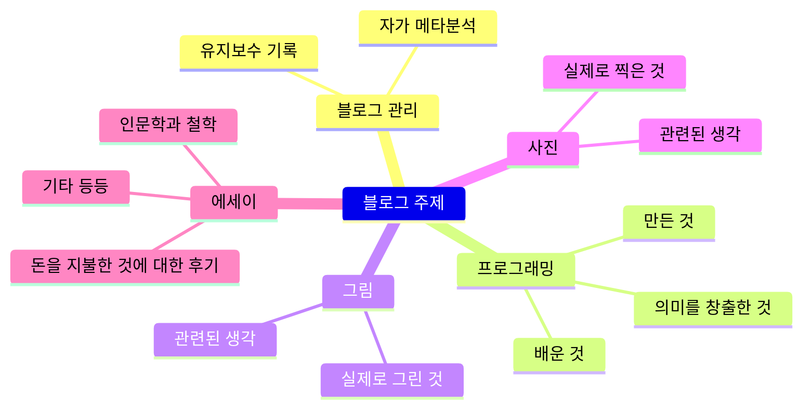

---
title: "블로그를 직접 만들게 된 개인적인 이유"

categories: [블로그]
tags: [블로그]
start_with_ads: true

toc: true

date: 2026-08-08 21:09:00 +0900
last_modified_at: 2026-08-08 21:09:00 +0900

mermaid: true
---

## **블로그를 만들었습니다**

미루고 미뤄왔던 숙원 중 하나입니다. 2024년 SEO 개선을 목표로 테마를 뜯어보기 시작했고, 태그와 기능을 추가하고 몇 달간 운용해본 다음 그 효용에 따라 기능을 소거해보기도 하면서 SSG 블로그 이해가 쌓여갔습니다. 그렇게 관리기간이 4년 지나면서 이건 결국 정적 웹 프레임워크고, 쉽게 요약해서 정교한 for문으로 이루어진 웹페이지 생성기인 것으로 인상이 단순해졌습니다. 웅장한 건물을 처음 보는 듯 경외스러웠던 첫인상이 무너지면서, 이 정도면 고유 공간을 직접 설계해보고 싶다는 생각이 들었습니다.

## **그 외 만들게 된 이유들**

### **도메인 관리의 애매함**

이 정도의 분야를 카테고리로 분류하려는 시도는 점점 실패하고 있었습니다. 예를 들어 블로그 유지보수 글은 그 특성상 기술사항을 많이 언급할 필요가 있었는데, 개발 카테고리 하위로 넣기엔 규모가 크고 독립 카테고리로 유지하기엔 성격 구분이 딱 맞아 떨어지지 않았습니다. 다른 예시로 인공지능의 등장에 의해 기술 글을 튜토리얼성 글 대신 기술사항에 대한 생각 위주로 방향을 재정립하기 시작했고, 이제 개발이 아니라 에세이에 더 가까워진 것은 아닌지 헷갈리게 되었습니다.

**해결**

이런 고민은 필연입니다. 범주는 우리의 직관이 만든 인위적인 것이고, 한계를 쉽게 겪습니다. 이런 상황을 근본적으로 해결하는 방법은 분류를 포기하거나 분류기준을 다르게 제시하는 것이고 제 선택은 후자입니다. 기준이 사람이라면 범주 내 다양한 글이 있는 것이 자연스러우므로 카테고리 기능의 지위를 글쓴이 정보로 통합시켰습니다.

### **소유감**

[첫 글에서 밝혔듯](https://hyngng.github.io/blog/first-post/) 티스토리, Velog 등의 메이저 블로그 플랫폼 대신 깃허브 페이지와 SSG 블로그 테마의 조합을 선택한 이유는 구조적 독립이었습니다. 예를 들어 티스토리의 경우 2023년 1월의 카카오 광고 무단 삽입 약관 개정 논란, 2026년 1월의 동영상 업로드 중단 및 기존 영상 강제 삭제 논란, 네이버 블로그의 경우 2020년 12월 뮤직샘 서비스 종료 논란, 2021년 1월 짧은 주소 지원 종료 논란이 있었습니다.

그런 플랫폼의 독단을 피할 목적으로 깃허브 페이지와 SSG 블로그의 조합을 선택했고 그 효용도 확실했지만, 완벽하지는 않았습니다. 이런 류의 SSG 블로그는 네이버, 티스토리, 미디엄 등의 블로그 플랫폼에서 관리되는 테마와는 다르게 버그가 보고되고 해결되고, 새 아이디어가 제안되고 누군가가 구현해오면서 저절로 발전합니다. 그런데 유지보수를 무료 위탁할 수 있다는 그런 점이 메인 브랜치로의 연루를 걱정하게 만드는 원인이었습니다.

예컨대 버전 업데이트 후 좋아하던 애니메이션 효과가 망가지는 일, 태블릿 환경에서의 UI가 망가지는 일이 있었습니다. 꼭 버그뿐만이 아니라 최근에는 `v7.6.0`으로 오면서 토글로 동작하던 라이트/다크 테마 전환 버튼이 드롭다운 메뉴로 바뀌는 등 타인의 결정이 제 취향을 덮어쓰는 경우도 있었습니다. 공통점은 제가 참여한 적 없는 변경점이라는 겁니다.

특히 메인 브랜치가 활발히 유지보수되는 한 제 마음대로 테마를 수정하면 원본과의 동기화 비용이 같이 늘어납니다. 여기서 위화감을 느꼈습니다. 부분적으로만 통제 가능한 것은 소유가 아니라 임차입니다. 물론 이 흐름대로라면 도메인을 구매하고, 렌더링 엔진과 파서도 직접 구현하고, 서버도 직접 구축해 호스트하고, 서버를 돌릴 전기도 직접 생산해야 할 수 있습니다. 따라서 요는 적당한 선에서 임차를 받아들이는 것이고, 다만 테마 동작과 읽는이의 전반적인 탐색 경험에 대해서만 의존을 벗어나보는 겁니다.

**해결**

그 자체로 새 블로그를 만들게 된 이유입니다. 단 처음부터 만들되 이전까지 사용하던 Chirpy 테마의 장점, 설계 철학, 편리했던 관리 과정 등 유산을 차용해 비슷한 사용경험을 만들고자 했습니다. KaTeX, mermaid 렌더링 및 PWA 지원 등이 포함됩니다.

### **이제 낡은 Jekyll**

2022년 블로그를 개설할 때만 해도 Jekyll은 전통적인 선택지였으나 현재는 기능은 경쟁 프레임워크 대비 부족하고 늙어보이는 선택지가 되었습니다. 가장 큰 문제는 다국어 지원이 미비하다는 점, 빌드 속도가 느리다는 점, 앞으로의 방향성이 불투명해보인다는 점 세 가지입니다.

- 빌드 결과를 확인하면서 글을 쓴다면 Jekyll은 답답합니다. 한 글자의 수정만으로도 빌드가 새로 진행되는데 그 빌드 시간이 50개가량의 포스트를 기준으로 40초가량 걸렸습니다. 글이 어떻게 보이게 되는지 확인하기 위해 40초를 기다려야 하는 셈입니다. Jekyll은 `--incremental` 옵션으로 증분 빌드를 제공하지만 완벽하지 않았습니다. 그리고 이건 Jekyll이 Ruby 기반의 단일 스레드 구조 위에 만들어졌기 때문이고, 원리적으로 개선이 힘듭니다.
- 다국어에 관해, 글이 한국어로만 제공되어 글 관리에 들인 노력에 비해 국내에서만 제한적으로 도달한다는 점이 아쉬웠습니다. 그런데 Jekyll 프레임워크는 다국어 지원을 크게 고려하지 않고 설계된 탓에 언어별 URL 라우팅도, 언어 간 페이지 매핑도, SEO 처리도 지원되지 않는 상황이었니다. `Jekyll-Polyglot` 커스텀 플러그인으로 일부 구현이 가능하지만 직접 코드를 대량 리팩토링해본 결과 관리비용의 문제로 롤백한 적이 있었습니다. 설계 단계에서 다국어 지원이 반영된 새 프레임워크가 필요했습니다.
- Jekyll의 최신버전은 글을 쓰는 시점을 기준으로 2025년 01월 29일에 출시된 `v4.4.1`입니다. 벌써 1년 반이 되도록 업데이트 소식이 없는데 반해 그 마지막 버전도 변경사항은 유지보수에 초점을 맞춘 소규모 업데이트입니다. 당연하지만 환경은 바뀌고, 기존의 것은 새것 대비 가치우위를 잃기 마련입니다. 이 역시 Jekyll 사용을 재고해보는 이유가 되었습니다.

**해결**

세가지 모두 프레임워크를 바꾸는 것으로 해결됩니다. Hugo와 Astro 두 가지 선택지를 놓고 고민했는데, 선택은 실리도 고려하되 좀 더 유망해보이는 Astro로 결정했습니다. 빌드 속도와 다국어 지원 두 가지만 놓고 보면 Hugo가 유리한 점이 있지만 나온지 벌써 13년이 지났다는 점이 걸렸고, Astro도 빌드 속도나 다국어 지원이 부실한 선택지는 아니었기 때문입니다. 특히 글을 쓰는 지금 확인해보면 부분  수정사항이 1초 이내로 반영되는 수준입니다.

### **AI 에이전트의 성숙함**

위 3가지 사항은 블로그 개발을 염두하게 된 빌드업입니다. 원래부터 그 정도 불편함은 인지하고 있었고, 다만 개발 비용이 커 실행으로 옮기고 있지 않았을 뿐입니다. 그렇게 2023년, 2024년, 2025년을 지나 AI가 개발환경에 점점 녹아들고 또 에이전트로서 성숙해지면서 이제 몇 가지 노력만 동반되면 자연어로 충분히 코드를 통제할 수 있겠다는 생각이 들었습니다.

AI와의 협업에 있어서 가장 중요한 부분은 감독능력이고, 작성된 코드와 아키텍처가 내 의도에 부합하는지를 판별할 수 있는 능력입니다. 그리고 역설적으로, 그러려면 자연어로 테마가 구성되는대로 유기할 것이 아니라 도메인 지식과 자기고집을 전제하고 코드를 한 줄 한 줄 직접 읽어봐야만 합니다. 그리고 그럴 수만 있다면, 이제 저비용 AI로도 현실적인 작업 위임이 가능하겠다는 생각이 들었습니다. 이에 올해 초부터 AI용 요구사항 문서, 기술사항, 주의사항을 담은 문서를 하이퍼링크로 연결해가며 짬짬이 작성하기 시작했습니다.

## **이 글은 새 테마의 첫 글**

테마는 완성이 되었고, 이 글은 완성 직후에 쓰는 첫 글입니다. 앞서 AI를 사용하기 이전에 도메인 지식을 먼저 쌓을 것을 강조했듯이 개발 초기엔 그 관점을 따라 결정을 지연하여 고민에 최고로 많은 시간을 투자했습니다. 그리고 시간에 쫓기게 되면서 감독의 상당 부분조차 AI에게 위임했고, 제 역할은 프롬프트를 검토하는 것 위주로 축소되었습니다. 겉보기엔 모든 기능이 잘 동작하는 것처럼 보이지만 AI Slop이 어디에 얼마나 있는지 의심스러운 상황입니다. 다만 AI 에이전트는 작업에 더불어 작업기록, 수정의 의도 텍스트를 토큰 손해를 보더라도 남기도록 지시한 덕에 문서가 잘 축적되어 있는 상황입니다. 당분간 코드 건전성과 아키텍처를 모두 검토할 생각입니다.

<!--
### **그 외 기타**

아이디어를 실제로 구현해보고 싶었습니다. 그런데 기존의 블로그 테마에 그렇게 하면, 바닐라 Chirpy에 제 아이디어가 실현된 건 좋은데, 유지보수 비용도 문제고 바닐라의 철학을 훼손하는 느낌이 있었습니다. 감동과 당황스러움이 동시에 느껴지는. 그게 불편했음.

SEO 및 AI 최적화도 있음. `llms.txt`같은거. 효용은 없었지만.

7월 한 달간 Gemini 시리즈, BigPickle, Nemotron 3 Ultra, DeepSeek V4 Flash Free의 도움을 받아 만들었습니다. Claude 5 Sonnet 무료 이용분으로 모르는 개념에 대한 설명과 기술사항에 대한 여론과 유망함 등의 조사를 부탁했고, Antigravity와 Codex 무료 이용분으로 수정 계획을, OpenCode의 BigPickle, Nemotron 3 Ultra 무료 이용분으로 구현을 맡겼습니다.

- 로컬호스트를 여는 명령어가 `bundle exec jekyll s` 대신 `npm run dev`로 달라졌습니다.
- 본문 주석이 `endcomment`에서 `<!-- --`로 바뀌었습니다.

그리고 이 문제는 테마를 바꾼다고 해서 해결되는 문제는 아닌 것 같았습니다. 적어도 제가 능력으로는 이 고민을 하는 테마를 찾지 못했습니다.

- 다양한 도메인에서 글을 쓰면서, 서로가 서로에게 영향을 줌. 개발 블로그도, 그림이나 사진도. 전부 에세이화가 되어가고, 정작 진짜 에세이 글은 표현 하나를 가볍게 넘겨짚지 못하고 의미관계를 명확히 하려고 함. 특히 [3년차 블로그 소회와 나의 글쓰기 원칙]() 글의 경우 기술사항과 단순 에세이가 나름 위화감 적게 잘 섞인 예시임.

플랫폼이라고 해서 그래도 되는가를 떠나서, 플랫폼은 그럴 능력이 있습니다.

## **도입부**

블로그를 만들기로 했습니다.

Jekyll 환경의 Chirpy 테마를 기반으로 4년동안 애정을 담아 관리해왔습니다.

- 남의 집에 빌붙어 사는 기분.
- 업데이트는 편리하긴 하지만, 결국 방청소 남이 해주는 기분이었음.

- 아, 미니멀리즘을 지향해서 기능들(Ex. 코드블럭의 복사 버튼, 라인 표시 등)을 다 뺐는데, 기능이 있는데 안 쓰는 것과 없어서 못 쓰는 것은 다르다는 것을 알고 있고, 그 점을 충분히 반영해야 함. 그러니까 왜 뺐는지는 납득 가능하게, 설득력 있게 설명해야 함.

*태블릿에서 페이지 레이아웃 깨짐*

이에 더해, AI의 성숙이 용기를 줬습니다. 바이브 코딩을 넘어 콘텍스트, 하네스 엔지니어링 등 최신 트렌드를 반 년 넘게 따라가보면서 '원하면 만들 수 있는 시대'라는 세간의 평가에 동의하게 되었습니다. 보수적으로 바라보더라도 도메인 지식과 위험관리 능력이 있다면 시도해볼만하다는 생각이 들었습니다.

## **Chirpy 테마의 장단점**

떠날 생각을 하고 있지만 이 테마는 사려깊게 제작된, 정말 완성도 높은 테마입니다. 찬사가 아깝지 않습니다.

단정한 디자인은 물론이거니와 SEO 최적화, LQIP, PWA 등의 부가기능이 매력적이었고, 그래서 불편함이 있더라도 오랫동안 사용해왔습니다.

사용하면 할 수록 치명적인 단점이 있었습니다.

### ****

- Jekyll => 다국어 지원 어려움. 가능하긴 한데, 차력쇼. 메인 프로젝트와 호환성도 나빠짐.
- 깃허브 블로그를 선택한 이유는 두 가지. 기술독립(자립)과 커스터마이징. 전자는 너무나 훌륭하게 달성했지만 후자는 말이 안됨. 메인 프로젝트는 메인 프로젝트대로 계속 업데이트되므로 업데이트 병합을 해줘야 하는데, 커스터마이징과 충돌이 나는 경우가 종종 있음. 장기 지속성을 생각해서 내 커스터마이징을 포기하는 편.
    - 이건 역설적으로, 블로그를 내가 '소유했다'는 느낌까지는 아님.
- 어느새 Jekyll은 낡았고, 그 사이에 대안으로 Astro가 등장함.

- 그래서 나는 내 블로그를 만들기로 했다.
-->