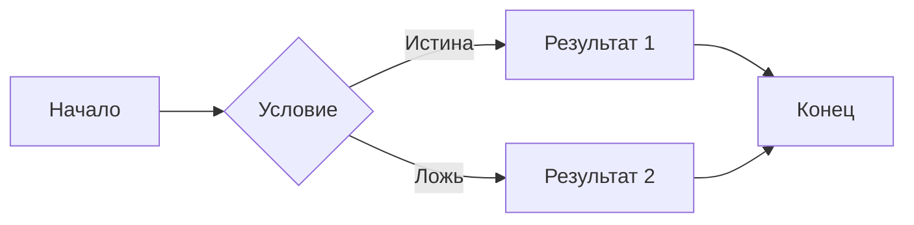

## **Введение**

Прошло почти 2 года с тех пор, как я [открыл блог](https://hyngng.github.io/ru/blog/first-post/). Честно говоря, за два года я написал не так много, но это не значит, что я был к нему равнодушен. Бывали занятые периоды — и личные, и рабочие, бывали периоды затишья, но я всё равно периодически поддерживал блог.

Недавно я обновил блог и подал заявку на регистрацию в поисковых системах. Тогда я начал чувствовать, что стал гораздо более привычным к платформе GitHub-блога, чем раньше. Писать стало заметно легче, и освободившееся время я трачу на оформление блога. Лично мне кажется, что выбор GitHub-блога был своего рода авантюрой, но я наслаждаюсь индивидуальностью этой платформы. Хочу разобрать, какие преимущества GitHub-блога меня привлекают.

## **Свобода кастомизации**

{: .light .border }
{: .dark }
*Недавно добавленная функция удаления содержимого определённых тегов и экран с успешным применением*

GitHub-блог в целом гораздо сложнее в управлении по сравнению с другими платформами. Приходится уделять внимание и самостоятельно настраивать множество вещей, что довольно хлопотно. Тем не менее, люди выбирают GitHub-блог именно из-за огромной свободы в его ведении.

GitHub-блог постоянно ощущается как открытая и гибкая среда, в отличие от других блог-платформ. Другие платформы — это закрытая среда, где можно использовать только функции, поддерживаемые в рамках определённых ограничений. GitHub-блог же предоставляет все составляющие страницы в редактируемом виде, поэтому, имея базовые знания фронтенда, можно самостоятельно реализовать большинство функций. В основном используются следующие языки:

- Ruby
- Liquid
- SCSS
- JavaScript

В моём случае я уже написал две статьи о [разнообразных настройках](https://hyngng.github.io/ru/blog/first-blog-customization/) и [реализации определённых функций](https://hyngng.github.io/ru/blog/blog-content-remove/). Хотя отдельно я об этом не писал, недавно я также добавил LQIP-превью, иконку Instagram, кнопку аплодисментов и некоторые другие фишки.

Благодаря такой свободе кастомизации, украшать блог интересно, и это мотивирует продолжать им заниматься с привязанностью. Я постоянно думаю, оглядываясь на блог: «Как бы ещё его улучшить?», или ищу похожие блоги — «Что из их хороших решений можно внедрить у себя?».

## **Статьи в Markdown**

*Экран написания текущего абзаца статьи*

Одна из главных особенностей GitHub-блога — использование языка разметки Markdown для написания статей. У Markdown есть свои плюсы и минусы, но лично я считаю, что плюсов больше.

Когда привыкаешь к Markdown, пропадает необходимость каждый раз нажимать кнопки в редакторе для вставки полужирного текста, цитат, разделителей и других элементов. Когда синтаксис достаточно освоен, при написании текста руки заняты только клавиатурой, а глаза — только экраном, что позволяет полностью сосредоточиться.

К тому же, в используемой мной теме хорошо поддерживаются внешние модули для Markdown: [MathJax](https://www.mathjax.org/) для формул, [Mermaid](https://mermaid.js.org/) для диаграмм и схем. Это накладывает мало ограничений на написание статей и, наоборот, позволяет сосредоточиться на качестве текста.

Например, если немного постараться, можно аккуратно вставить в текст такие формулы или диаграммы:

**MathJax**
$$
\begin{equation}
  \sum_{n=1}^\infty 1/n^2 = \frac{\pi^2}{6}
  \label{eq:series}
\end{equation}
$$

**Mermaid**

Ещё одно преимущество — хорошая совместимость с программами на основе Markdown, такими как Obsidian. Хотя это не очень удобно, но при подключении Obsidian к мобильному устройству можно редактировать статьи и в мобильной среде.

## **Полезные встроенные функции темы**

*Часть экрана настроек темы Chirpy (_config.yml)*

Шаблон, который я сейчас использую, я выбрал из-за чистого дизайна, поддержки переключения тёмной темы и функции рекомендации похожих записей. Но в процессе использования я понял, что встроенные функции темы довольно мощные. Если вы планируете создать GitHub-блог с этим шаблоном, обязательно ознакомьтесь и используйте следующие возможности:

- Интеграция с Google Search Console и Analytics
- Разделение изображений для тёмной и светлой темы
- LQIP (превью низкого качества), PWA (веб-приложение)
- Комментарии на основе GitHub: utterance, giscus и др.

Эти функции часто упускают из виду, но при правильном использовании они могут улучшить общее качество опыта как для пишущего, так и для читающего. При грамотном подходе можно создать особые впечатления: плавная загрузка изображений, установка приложения блога на смартфон и т.д.

Кроме того, есть множество полезных функций, таких как добавление теней к изображениям или параллельное выравнивание изображений и текста, а также уже упомянутые MathJax и Mermaid, которые хорошо поддерживаются на уровне шаблона блога.

## **Заключение**

Однако есть и обратная сторона — это сложность. Если вы не разработчик, нужно знать некоторые технические детали GitHub и веб-страниц, чтобы нормально управлять блогом. Как видно из [официального руководства по написанию статей Chirpy](https://chirpy.cotes.page/posts/write-a-new-post/), даже для простого написания статьи нужно освоить определённый синтаксис. Вставка рекламы и показ статей тоже требуют отдельных внешних процедур, так как нет встроенных сервисов подключения.

Несмотря на это, я считаю, что GitHub-блог может стать отличным опытом для тех, кто хочет снизить зависимость от платформы или обладает сильным техническим любопытством. Это действительно сложно, но 90% функционала уже реализовано, поэтому безнадёжно трудно не будет. Вдобавок, зависимость от платформы низкая, и блог можно вести так, как хочется — если привыкнуть, это не просто «сносно», а приносит ни с чем не сравнимое чувство достижения и удовольствия.
