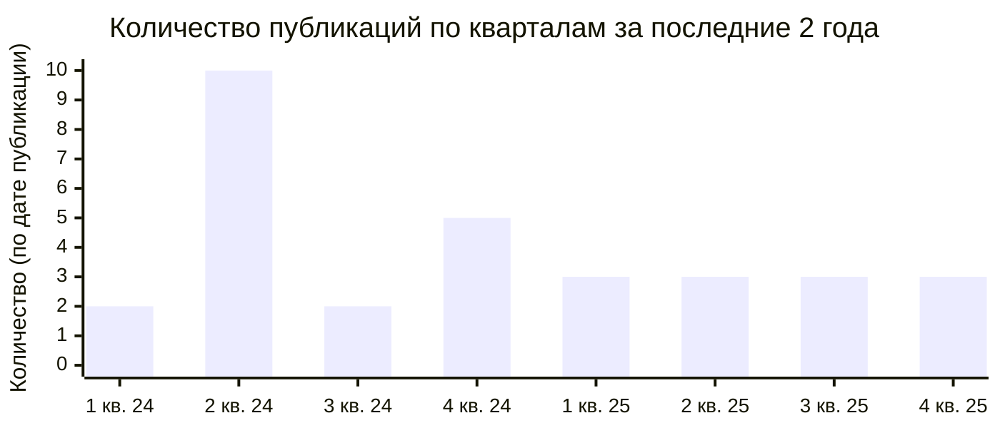
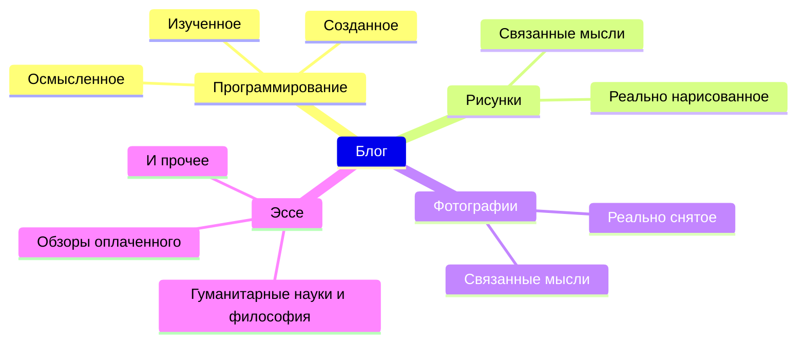

## **Зачем я вообще начал вести блог**

За это время, исключая данную статью, я написал в общей сложности 42 поста. Если вернуться к моменту создания блога, сам по себе импульс был отчасти под влиянием извне. Мне казалось крутым, когда в других блогах люди собирали в одном месте то, что они изучили, различные технические детали, собственные методы решения задач, — и естественным образом мой блог тоже стал ориентироваться на техническую направленность. На самом деле, это оказалось неплохо, и я до сих пор сознательно придерживаюсь этого курса. В будущем я планирую регулярно публиковать статьи, обобщающие мой опыт в программировании и трудности, с которыми я сталкивался в процессе.

Во-вторых, мне хотелось иметь пространство, которое хорошо меня описывает. В какой-то момент мне стало трудно объяснять новым знакомым, кто я такой. То, что это блог, а не распространённые соцсети вроде X, Threads, Facebook, Instagram, — тоже в этом контексте. Соцсети хороши для распространения лёгких текстов, но это не лучшая среда для использования рассудка, и они не позволяют достоверно описать одного человека.

Если подвести итог, эти две цели достигаются даже лучше, чем я ожидал, и, оглядываясь на написанные ранее тексты, я испытываю небольшое удивление и определённые чувства. Требуется много времени и усилий, но тот факт, что я поддерживаю блог, — это определённо хорошая черта меня нынешнего.

## **Краткий и долгий путь**

### **Принципы для регулярного написания**

Если обобщить количество написанных статей с прошлого года по сегодняшний день раз в два месяца, получается диаграмма выше. На самом деле, с момента создания блога я размышлял, как часто нужно писать. В прошлом году я негласно поставил цель — одна статья в две недели, и однажды даже писал по 4–5 статей в месяц. Но из-за следующих причин пришлось снизить частоту публикаций. Оказалось, что количество статей само по себе не делает блог богаче. Чем сильнее привязка к блогу, тем сложнее сосредоточиться на реальной жизни, и чем выше целевое количество публикаций, тем труднее писать качественные тексты.

В 2025 году я придерживаюсь частоты — одна статья в месяц, с разницей лишь в том, начало месяца или нет. Это тоже негласный паттерн, и строго соблюдать его не обязательно, но примерно за год поддержания такого ритма я смог нормально балансировать между занятой повседневностью и блогом. 12 статей в год — немало, я считаю, что это долгосрочно реализуемый уровень, и если не будет особого повода, вероятно, новые статьи и дальше будут выходить примерно в таком темпе.

### **Постоянная кастомизация блога**

То ли потому, что файлы конфигурации блога всегда под рукой, я часто вношу изменения в структуру страниц при каждом написании статьи. [Раньше я уже несколько раз вносил правки](https://hyngng.github.io/posts/first-blog-customization/), и до сих пор продолжаю менять их по своему вкусу. Недавний пример: я отключил анимацию переключения между тёмной и светлой темами. На уровне темы нет опции для её отключения, а меня это раздражало. Я нашёл атрибут, определяющий эффект смены темы, такой как `id="post-preview"`, и переопределил его с помощью `transition: none !important`. Теперь переключение происходит мгновенно.

Кроме того, на версии темы `v7.3.1` я обнаружил баг: при переходе превью-изображения на главной странице из LQIP в оригинал не воспроизводился эффект размытия. После долгой отладки я решил проблему и [опубликовал issue](https://github.com/cotes2020/jekyll-theme-chirpy/issues/2537) в официальном репозитории. Примерно через 2,5 недели разработчик подтвердил проблему, и вскоре был создан [новый коммит с учётом моего мнения](https://github.com/cotes2020/jekyll-theme-chirpy/pull/2551), а затем вышла новая версия [v7.4.0](https://github.com/cotes2020/jekyll-theme-chirpy/blob/master/docs/CHANGELOG.md#740-2025-10-19), в которой этот баг был официально исправлен.

### **Размышления о поисковых системах**

Я уже [писал одну статью на эту тему](https://hyngng.github.io/posts/webmasters-and-seo/), так что можете воспринимать это как послесловие. Во-первых, при работе с инструментами для веб-мастеров нужно запастись терпением. Действительно большим терпением. Особенно Google Search Console — после регистрации до нормального появления в результатах поиска может пройти до полугода, и даже по прошествии достаточного времени, если авторитет страницы низок, работа краулера может существенно замедлиться. Моё впечатление может быть неточным, но мне показалось, что для индексации важнее авторитет домена, чем качество реализации SEO.

В Bing было так, что индексация внезапно отменилась. Точнее, Bing классифицирует страницы на «индексированные», «с ошибками», «предупреждения» и «исключённые», и все страницы моего блога переместились в «исключённые» и исчезли из результатов поиска Bing. Поскольку проблем с самим сайтом — хостингом или `robots.txt` — не было, 13 августа я [обратился в службу поддержки Bing Webmaster Tools](https://www.bing.com/webmasters/support). 30 августа пришёл ответ: «We have reviewed your site and sent it to our Product Review group for further assessment.», а 3 октября — «I am happy to inform you that the issue related to your site has been resolved». Потребовалось около полутора месяцев, но индексация почти полностью восстановилась, и сейчас всё отлично.

## **Личные принципы письма**

### **Разнородный характер блога**

По состоянию на момент написания статьи тематика блога примерно такова. Весьма разношёрстно; если говорить хорошо — это разнообразие, если плохо — можно сказать, что характер размыт. Смешение многих тем действительно невыгодно с точки зрения SEO, но, несмотря на это, у меня есть определённые основания писать на разные темы. Предпосылка такова: блог — это личное пространство для свободных записей, и на своей странице я не должен оглядываться на чужое мнение. Если мои интересы действительно распределены по множеству областей, то и мои тексты естественно должны отражать это.

Быть может, это звучит несколько критично, но, например, когда блог ведут, ориентируясь в основном на чужие предпочтения — темы, ставшие вирусными в соцсетях, или темы с высокой рекламной ставкой, — мне кажется, что в долгосрочной перспективе это обесценивает смысл личного блога. В любом случае, в момент написания текста человек в какой-то степени становится автором в буквальном смысле слова, поэтому мнение пишущего должно преобладать над вкусами читателя в пропорции примерно 51:49. Поскольку цель этого пространства — создать место, которое хорошо меня описывает, охват нескольких тем в данном контексте — это осознанное решение.

### **Осознанное разделение стиля**

На раннем этапе я писал в неформальном стиле от первого лица, затем, думая о потенциальных читателях, пробовал унифицированный вежливый стиль. При смене стиля я чувствовал неестественность в обоих вариантах. В это время я заметил, что у кинокритика Ким Хери, которого я люблю, стиль письма варьируется свободно в зависимости от текста. Идея, что у каждого произведения есть свой подходящий формат, и философия, что такую идею стоит воплотить на практике, показались мне убедительными, и мне тоже захотелось это попробовать.

Раньше я не делал таких попыток, так что, возможно, это выглядит как авантюра в глазах других. Но в [недавних текстах вроде этого](https://hyngng.github.io/posts/finding-camus-in-goryeo-history/) я пассивно экспериментирую с тем, чтобы типы завершения предложений отличались от других текстов. Это позволяет быть более искренним в тексте и делает процесс написания интереснее, так что впечатление положительное. В будущем при написании статей я буду стремиться не к единообразию, а к разнообразию — не только на уровне окончаний предложений, но и в композиции абзацев, длине, точке повествования и т.д., стараясь писать хоть сколько-нибудь свежо.

### **Выбор неавторитарных выражений**

Как и при выборе имён переменных в программировании, при написании текстов я часто размышляю между несколькими вариантами выражений. Критерий хорошего выражения для меня — не риторическая красота, а ясность смысла, то есть насколько можно снизить степень абстрактности контекста. Я стараюсь серьёзно применять этот критерий. Даже в уже написанных предложениях со временем видны недостатки, поэтому я нахожу и исправляю канцелярит, кальки, а ещё тщательнее — слишком многословные предложения, снижающие передачу смысла.

В схожем ключе, при выборе слов я учитываю языковую иерархию. По возможности отдаю предпочтение исконно корейским словам, а китаизмы и заимствования использую по необходимости. Аргумент прост: исконные слова относятся к проверенной классике, тогда как заимствования рискуют остаться временным веянием. Главное — не слепо следовать этой тенденции, а выбирать выражение, которое наиболее точно передаёт смысл в каждом конкретном случае. Однако если доля последних в тексте высока, это может создать впечатление демонстрации экспертизы, поэтому я сознательно избегаю заимствований там, где они не точнее исконных слов. В ситуациях, где нужны специальные термины, я сначала обдумываю, не лучше ли объяснить это своими словами.

### **Уважение к читателю, медленный темп**

Я стараюсь не использовать полужирный шрифт. У него есть преимущество — чёткая передача смысла, но этот эффект легко достигается визуальным акцентированием. И это имеет побочный эффект: оно излишне выдвигает на первый план определённое субъективное мнение автора. Безусловно, есть среды, где это необходимо: коммерческие случаи вроде кинопостеров или рекламы продуктов. Но в среде с сильным архивным характером, как эта, предпочтительнее, чтобы автор вежливо старался построить убедительную языковую композицию. По схожим причинам я свожу к минимуму использование курсива, зачёркивания и других стилистических приёмов, доступных в Markdown.

Точно так же я придерживаюсь текстов с длинным дыханием. Я стараюсь избегать привычки заканчивать текст коротко, а когда нужно добавить новую информацию, по возможности дописываю её в существующую статью, а не публикую отдельную новую. Это тоже идёт вразрез с сегодняшним трендом короткого и ёмкого контента, ориентированного на мобильные устройства. Я осознаю это и принимаю невыгоду, потому что хочу, чтобы мои тексты не устаревали со временем и оставались хорошими статьями в будущем.

### **Консервативный подход к AI**

В отличие от кода, в написании текстов я максимально придерживаюсь традиционного подхода без помощи LLM-сервисов вроде ChatGPT, Gemini, Claude и других. Причина, по которой я пишу, — это рефлексия, повышение навыков и привязанность, так что доверять написание кому-то другому бессмысленно. Если тема мне по силам, я могу написать качественный текст без внешней помощи; если нет — значит, сначала нужно ближе познакомиться с материалом. Однако я не исключаю генеративный AI полностью — я размышляю о здоровых способах его использования. Например, недавно я использую его для сравнительного анализа черновика с текстами, которые произвели на меня впечатление, или для проверки конкретных выражений.

Ответы последних моделей, таких как ChatGPT 5 или Claude 4.5, уже на уровне, который можно осмысленно использовать. Особенно Gemini 2.5 Pro — с самого запуска я часто замечал его высокий уровень владения языком. Он хорошо предлагает общее впечатление от текста и его проблемы, альтернативы для конкретных слов, сжатые и расширенные версии предложений, так что при должном обращении к словарю он отлично подходит для редактирования. Однако галлюцинации всё ещё требуют серьёзной осторожности. Чем новее модель, тем лучше она умеет выдавать правдоподобные, но неверные концепции в узких областях, поэтому я сначала обращаюсь к официальным руководствам, иногда к книгам или нескольким научным статьям, и только потом отражаю это в тексте.

## **Продолжаю работать в обычном режиме**

Во время создания блога у меня было много интересных тем, которые могли бы его обогатить: базовые теории международной политики вроде политического реализма и идеализма, индоевропейская языковая семья и лингвистическая типология, сходство монгольской и маньчжурской письменности, происхождение современных корейских чтений китайских иероглифов в лингвистике, истории о рисунках, связанные с быстрым развитием AI, физические ограничения CMOS-сенсоров и стратегии их преодоления... Жаль, что из-за нехватки времени ни одна из этих тем не была опубликована, но интерес сохраняется. Возможно, когда-нибудь я напишу на подобные темы.

Ещё говорят, что с развитием AI поисковая активность в интернете сокращается, и традиционные блоги умерли. Действительно, многие теряют мотивацию к ведению блогов из-за ослабления взаимовыгодного сотрудничества с поисковыми системами и снижения рекламных доходов. Основываясь на многих показателях, тот факт, что мой блог будут находить ещё реже, — это уже свершившийся факт. Но в моём случае на первом месте стоит не обмен информацией, а самопотребление, поэтому я, кажется, смогу продолжать без особых потрясений.

Я читал, что число блогов, существующих более года, очень мало. Если это правда, то я уже перешагнул трёхлетний рубеж и приближаюсь к четвёртому — значит, первое препятствие осталось далеко позади. Лично я хочу продолжать вести блог долго-долго.
