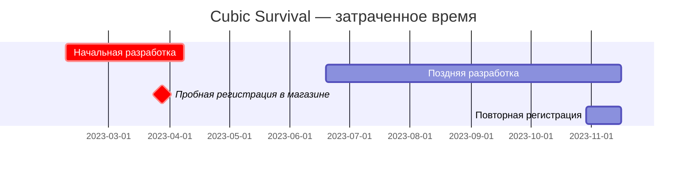

---
image:
    path: /2023-12-22-palette-first-devlog/gameplay.webp
    lqip: data:image/webp;base64,UklGRrYAAABXRUJQVlA4TKoAAAAvD8ABAHW4jWxbbfp4JJmZmSml0LH7L0Mq4pgVtG3DuOOPdQge4zaSFHVVH9P78o+T+j8BbhLNGhMUUL7GTwDFP6j3DTiLqMug0k4+RlwpOQFUC2jKxL/yzX0tKUApmm8sxu7n4LvlOeUbSBnGjBjAWUR/xmX1IQt/X/KSXVS1BnsLKLMeGqGJGl7KM5cUhbtrZyZYxL+CgfcTwNUUcJMaRE0DKQrAqa8oAA==
    alt: Пример геймплея
    
title: "'Cubic Survival' — концепция и процесс разработки"
authors: ["dev"]

categories: [마일스톤, 게임 개발]
tags: [마일스톤, 게임 개발, 유니티, C#, URP, 큐빅 서바이벌, 기획, 개발일지]
start_with_ads: true

toc: true

date: 2023-12-20 19:18:00 +0900
last_modified_at: 2023-12-22 20:42:00 +0900

mermaid: true
---

## **Создание игры**

В новом 2023 году мне нужно было найти занятие. Хотелось сделать что-то, что поможет отточить навыки программирования и при этом будет увлекательным. После боя курантов на следующий день я составил несколько планов.

Среди идей были: библиотека на Python на основе шести вопросов журналистики, камера-приложение в стиле беззеркалок, 2D-мобильная игра. Каждая из них была ответвлением от предыдущего опыта — [Python-программы](https://hyngng.github.io/posts/astp-devlog/), простого приложения на Android Studio или [предыдущего проекта на Unity](https://hyngng.github.io/posts/lavad-devlog/).

Но разработка игр казалась слишком увлекательной. Сам опыт работы с Unity оставил яркое впечатление, а идея самостоятельно обеспечивать себя ассетами казалась весьма интересной. Хотя это был и тяжёлый труд, тема создания программы на собственном, ни у кого не заимствованном материале казалась невероятно привлекательной. К тому же, я как раз начал получать удовольствие от объектно-ориентированного программирования и хотел как следует освоить объектно-ориентированный язык. Так я начал создавать 2D-мобильную игру.

## **Обзор проекта**



Поскольку разработка делится на начальный и поздний периоды, я разделил их на два поста. Таким образом, этот пост охватывает начальную разработку, выделенную на диаграмме красным.

Я начинал проект с лёгкостью, желая лишь быстро ознакомиться с особенностями объектно-ориентированного программирования, и не ожидал, что привяжусь к нему. Поэтому у проекта не было чёткого плана или цели; имелись лишь смутные пожелания, перечисленные ниже.

- [x] Хочу создать минималистичный визуальный дизайн.
- [x] Хочу реализовать плавные движения камеры.
- [x] Хочу эффективно применить объектно-ориентированное проектирование.
- [x] Хочу попробовать использовать корутины.

Поскольку разработка была долгой, эти цели в итоге были достигнуты одна за другой. О том, где и как они были реализованы, рассказ будет долгим, поэтому подробно разберу их в этой и следующей статьях.

## **Процесс начальной разработки**

{: w="960" }
*Поначалу думал, что при убийстве нескольких врагов должно происходить какое-то событие*

Сначала я начал с клонирования. Подход был таким: взять какую-нибудь известную игру и попробовать её воспроизвести в малом масштабе.

Первым делом я обратился к Brawl Stars, в которую мы с друзьями с удовольствием играли в старшей школе. Впрочем, я не столько копировал её систему, сколько пытался понять, как должна ощущаться 2D-мобильная платформа.

### **Джойстик**

{: w="960" }

Я хотел реализовать джойстик, типичный для 2D-мобильных игр, и сделал два: один слева для перемещения игрока и один справа для прицеливания.

Для создания я использовал класс `OnScreenStick` из пакета `Unity​Engine.​Input​System.​On​Screen`, создав на его основе два новых скрипта, каждый из которых через `Translate()` перемещал игрока и прозрачный объект для прицеливания в зависимости от угла отклонения. Корейских материалов по пакету `​On​Screen` было мало, так что я часто обращался к [официальной документации](https://docs.unity3d.com/Packages/com.unity.inputsystem@1.7/api/UnityEngine.InputSystem.OnScreen.OnScreenStick.html?q=OnScreenStick).

Кстати, у меня было много идей, которые хотелось реализовать: визуальное соединение стика с центром через LineRenderer, упругое возвращение стика в центр, разное управление джойстиком для разного оружия. Но тогда не хватало навыков, а некоторые идеи конфликтовали со структурой игры, поэтому реализовать их не удалось. Вместо этого я сделал лишь вибрационный отклик при нажатии и отпускании джойстика.

### **Спаун и поведение врагов**

{: w="960" }
```cs
void spawnEnemy(GameObject Enemy, float east, float west, float south, float north)
{
    float spawnPointX = Random.Range(west, east);
    float spawnPointY = Random.Range(south, north);

    instantiatedEnemy = Instantiate(
        enemy,
        player.transform.position + new Vector3(spawnPointX, spawnPointY),
        transform.rotation
    );
}

IEnumerator spawnEnemies()
{
    for (int i = 0; i < data.spawnCount; i++)
    {
        spawnEnemy(Enemy, east, west, south, north);
        yield return new WaitForSeconds(spawnDelay);
    }
}
```

Сначала я делал так, чтобы враги появлялись из объекта-портала в заданных точках, но решил, что после появления это будет выглядеть слишком однообразно, и написал код, в котором враги генерируются вокруг игрока, как показано выше.

На основе четырёх параметров `east`, `west`, `south`, `north` генерируется случайная координата на определённом расстоянии от игрока. Чтобы враги не появлялись внезапно рядом с игроком, координаты дополнительно задаются за пределами области рендеринга экрана.

В Unity нет простого способа задать задержку, например через `Delay()`, и в большинстве случаев рекомендуется использовать корутины, что стало для меня первым опытом их применения. Я создал корутину, которая спаунит врагов с интервалом, равным значению `spawnDelay`.

```cs
void Move()
{
    dirTowardsPlayer = (player.transform.position - gameObject.transform.position).normalized;
    transform.Translate(dirTowardsPlayer * speed * Time.deltaTime);
}

void OnCollisionEnter2D(Collision2D collider)
{
    if (collider.gameObject.tag == "player")
    {
        player.hp -= damage;

        Vibration.Vibrate((long)20);
        Destroy(gameObject);
    }
}
```

Враги по умолчанию движутся к игроку. При столкновении с игроком они уменьшают его здоровье на `damage` с вибрационным откликом и уничтожаются вызовом `Destroy()`.

### **Инвентарь и предметы**

По мере того как структура игры начала вырисовываться, я подумал, что неплохо бы иметь инвентарь, в который можно складывать предметы и потом их доставать. Здесь я немного поколебался, потому что во многих играх либо делают отдельное окно инвентаря, либо обходятся без него вовсе, используя кнопку-переключатель. Меня не устраивал ни тот, ни другой вариант.

Вместо этого я поставил цель создать инвентарь, способный вмещать несколько предметов, но при этом не мешающий игровому процессу. В результате ручное прицеливание, назначенное на правый джойстик, было заменено на автонаводку, а освободившаяся функция была отведена под инвентарь. Если зажать правый джойстик, открывается инвентарь; если отпустить — закрывается.

{: w="960" }
```cs
public struct InventoryData
{
    public string[]     Code;
    public GameObject[] UI;
    public GameObject[] ItemUI;
    public GameObject   Weapon;
    public int[]        Rounds;
}

for (int i = 0; i < InventoryData.InventoryUI.Length; i++)
    InventoryData.UI[i].transform.position = Vector3.Lerp(currentPos, targetPos[i], 2*t);
```

Инвентарь использует 8 объектов. При открытии они разворачиваются вокруг игрока. Для управления необходимыми данными (идентификаторы предметов, объекты инвентаря, объекты предметов, данные оружия, патроны) была создана структура, как показано выше.

Предметы разделены на объект для спауна на поле и объект для UI. Когда игрок подбирает предмет на поле, объект его UI добавляется в массив `ItemUI`.

|Предмет|ID|
|---|---|
|Пистолет|WPPSTL|
|Дробовик|WPPASG|
|Миниган|WPMING|
|Пассивка — скорость передвижения|PVMSPD|
|Пассивка — скорость атаки|PVATKR|
|...|...|

Идентификаторы предметов устроены так: два символа обозначают тип, затем четыре символа — название предмета. Забавно, что когда я это делал, то не осознавал, но по мере увеличения количества предметов я естественным образом подумал: «Нужно придумать уникальные коды для различия!» — и это оказалось концепцией «идентификатора». Вещь оказалась полезной, и я планирую использовать её и впредь.

### **Стрельба оружия**

{: w="960" }
```cs
if (shotTimer > fireThreshold)
{
    for (int i = 0; i < bulletCount; i++)
    {
        instantBullet = Instantiate(
            bullet,
            FirePosition.transform.position,
            Quaternion.Euler(
                0, 0, transform.rotation.eulerAngles.z + Random.Range(MOA * -1, MOA) + 180
            )
        );
        Destroy(instantBullet, 1);
    }
}

shotTimer += Time.deltaTime;
```
```cs
void hasHitEnemy()
{
    hit = Physics2D.Raycast(transform.position, transform.right, 100);

    if (hit.collider != null && hit.distance < 1)
    {
        if (hit.collider.gameObject.tag == "enemy")
        {
            if (hit.collider.GetComponent<Enemy>().HP > 0)
                Destroy(gameObject);
            /* ... */
        }
    }
}
```

Пуля создаётся у дочернего объекта `FirePosition` оружия, летит в направлении прицеливания игрока и исчезает через 1 секунду. Для эффекта разброса пуль при создании каждой из них значение Z-угла слегка корректируется с помощью `Random.Range()` в пределах значения `MOA`, заданного для оружия.

Проверка столкновений выполнялась с помощью Raycast. Однако пули летели слишком быстро, и Raycast не всегда корректно обрабатывал столкновения — пули просто пролетали сквозь врагов. Увеличение длины Ray или расширение области Collider не помогали, но проблему удалось решить добавлением условия `hit.distance < 1`.

После завершения я обнаружил, что в случаях частого создания объектов (как при стрельбе) можно использовать оптимизационную технику Object Pooling. Надеюсь применить её в будущем, когда будет время.

## **Дизайн пользовательского опыта**

Если предыдущий раздел был о том, как создать экшн-игру про блуждание по полю и уничтожение врагов, то этот — о реализации плавного и необычного пользовательского опыта. Большая часть визуальной работы, по моему мнению, была сделана на этапе поздней разработки, поэтому подробно опишу её в следующей статье.

### **Камера**

{: w="960" }
```cs
void Move()
{
    transform.position = Vector3.Lerp(
        transform.position,
        player.transform.position,
        Time.deltaTime * moveSpeed
    );
}

void Vignette()
{
    targetVignetteValue = inventoryIsOpen ? 0.35f : 0f;

    vignette.intensity.value  = Mathf.Lerp(
        vignette.intensity.value,
        targetVignetteValue,
        Time.deltaTime * vignetteSpeed
    );
}
```

В процессе ретуширования [фотографий](https://hyngng.github.io/posts/photos-of-imin/) я часто обращал внимание на опцию виньетирования. Она затемняет края экрана, фокусируя взгляд в центре. В [пост-обработке](https://docs.unity3d.com/kr/2020.3/Manual/PostProcessingOverview.html) Unity есть такая же опция, и я подумал, что она идеально подойдёт для момента открытия инвентаря.

Я сделал так, чтобы при открытии инвентаря значение виньетирования достигало примерно 0.35. Движение виньетки, как и перемещение камеры, реализовано плавно через Lerp. В процессе разработки было непросто подобрать такие параметры, как `vignetteSpeed` и `moveSpeed`, чтобы они давали нужное ощущение. Я играл, корректировал, снова играл и снова корректировал, возвращаясь к настройкам, когда результат переставал устраивать, и так продолжалось в течение всей разработки.

### **URP**

{: w="960" }
*При выстреле оружия позади врага отбрасывается тень*

Поначалу я как-то использовал стандартные световые эффекты Unity 2D, но их не хватало, и я применил [URP (Universal Render Pipeline)](https://unity.com/srp/universal-render-pipeline). Визуал стал намного лучше. Помимо встроенных мягких и красивых световых эффектов, появилась возможность настраивать Falloff Strength для более приглушённого или яркого света, а с помощью опции Shadows — создавать эффекты света и тени, как на картинке выше. Всё это было очень полезно.

Однако, когда я добавил Light2D на каждую пулю и каждого врага, телефон быстро начал нагреваться. Видимо, это сильно нагружает GPU, так что я не стал использовать этот подход активно и оставил его только для обогащения эффекта вспышки при выстреле.

## **Заключение**

Кратко подвёл итоги начальной разработки. Пишу и замечаю, что воспоминания о том периоде сохранились не так хорошо, как хотелось бы. Кажется, я не смог передать все мысли и усилия, поэтому в следующий раз постараюсь почаще делать заметки по ходу дела.

Тем не менее, пробуя реализовывать разные вещи самостоятельно, я понял, что создание игр — более тонкая работа, чем я думал. Особенно я проникся уважением к играм, которые не следуют модным трендам, а ищут новые парадигмы и успешно их реализуют. И, признаться, как человек, считающий такие вещи крутыми, я почувствовал лёгкую зависть.
