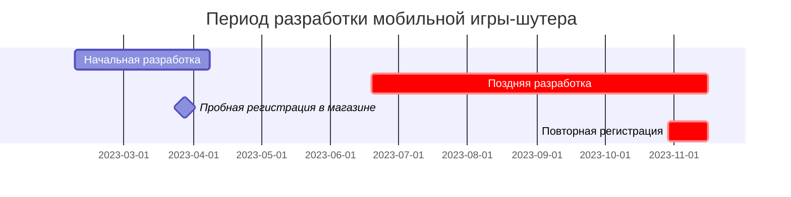
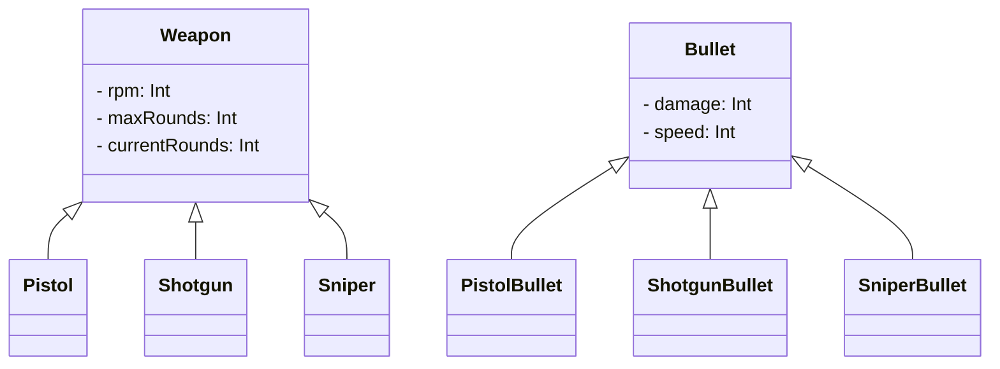

---
image:
    path: /2023-12-24-palette-second-devlog/gameplay.webp
    lqip: data:image/webp;base64,UklGRp4AAABXRUJQVlA4TJIAAAAvD8ABAHW4jW07cZZZFK05opg5dwVuh0KP63YPX9K8r/lX2LZtQ/9/b7pH/6uQQTkldeJfaiu1Vm5md+y6VXAnB01t6GKRzP0ax2haSBXAIpUOphDguA1NYDEqXRj3wIgpeMdtNWAhXjfv2IdZJp2CutpKacCzQSqv6wO8mG9t+BciZqCmJINcWYVt8M57GziHAA==
    alt: Пример геймплея
    
title: "'Cubic Survival' — разработка и процесс релиза"
authors: ["dev"]

categories: [마일스톤, 게임 개발]
tags: [마일스톤, 게임 개발, 유니티, C#, URP, 큐빅 서바이벌, 개발, 개발일지]
start_with_ads: true

toc: true

date: 2023-12-22 22:38:00 +0900
last_modified_at: 2024-03-20 17:38:00 +0900

mermaid: true
---

## **Почему я снова начал разработку**

:::info
Продолжение [предыдущей статьи](https://hyngng.github.io/posts/palette-first-devlog/).
:::



В марте начался новый семестр. Первый месяц я продолжал делать базовые системы игры (инвентарь и т.п.), но с приближением экзаменов поток разработки прервался из-за давления. Однако после финальных экзаменов в июне снова появилось свободное время, и я решил продолжить работу над игрой.

За два месяца летних каникул я увлёкся визуальной частью — изображениями, эффектами частиц. Ощущение, что игра заметно улучшается, а также сама идея создавать что-то уникальное, не похожее на другие проекты, казались очень ценными. Решив, что такой опыт выпадает нечасто, я пошёл на риск во втором семестре: постарался нормально посещать занятия и сдавать экзамены, но при этом посвящать разработке игры как можно больше времени.

В этом посте я собрал, что и как делал в оставшийся период.

## **Создание оружия**

### **Анимация выстрела** {#weapon-animation}


```cs
if (shotTimer > fireThreshold)
{
    WeaponAnimator.SetTrigger("Fire");
}

shotTimer += Time.deltaTime;
```

Анимация выстрела была создана с помощью анимационного компонента Unity. Компоненты Unity позволяют создавать не только традиционную кадровую анимацию путём замены спрайтов, но и анимацию, напрямую изменяющую положение дочерних объектов. Я использовал оба подхода, чтобы при выстреле оружия воспроизводилась соответствующая анимация отдачи.

Эффект вспышки из дула был обработан размытием изображения, а для уменьшения неестественности я увеличил размер спрайта и добавил световой эффект от URP и эффект Bloom в пост-обработке. Благодаря этому удалось создать яркий, привлекающий внимание эффект, избавившись от впечатления скупости.

{: w="480" }
{: w="480" }

Изображения для анимации вспышки были созданы с помощью анимационных функций Clip Studio. Поскольку создание спрайтов анимации вручную — это, по сути, цифровой ручной труд, я подумывал использовать официальные ассеты Unity, но среди них не было того, что мне было нужно, поэтому я решил нарисовать всё сам. При создании я медленно, покадрово изучал [другую анимацию стрельбы](https://www.youtube.com/watch?v=kAafHZcT2fc) и добивался нужного мне ощущения.


Чтобы сгладить неестественность при смене оружия, я также сделал уникальную для каждого вида оружия анимацию проверки патронника, которая воспроизводится только при смене или получении нового оружия. При переключении оружия на мгновение возникает задержка управления, что после внедрения сделало игровой процесс гораздо более органичным, и я доволен результатом.

### **Эффект попадания по врагу**


```cs
public void Hit()
{
    ParticleSystem hitEnemyParticle = hit.collider.GetComponent<ParticleSystem>();
    hitEnemyParticle.Emit(particleNumber);
}
```

Эффект попадания был создан с помощью Particle System. Сначала я просто заставил частицы двигаться в случайных направлениях с постепенным замедлением, но результат показался неестественным, и я долго думал, как это исправить.

Решение пришло случайно: в модуле Velocity over Lifetime я задал линейную и орбитальную скорости как Random between two curves и дважды перекрутил график. Получился эффект, напоминающий поднимающуюся пыль, который я и использовал. Выглядит неплохо, и ощущение удара тоже довольно хорошее.

### **Система патронов**


```cs
public virtual void Update()
{
    if (roundsCurrent > 0)
        Fire();
    else if (!WeaponAnimationInfo.IsTag("Weapon_Reload"))
        WeaponAnimator.SetTrigger("RoundIsEmpty");
    else
        roundsCurrent = roundsMax;
}

public virtual void Fire()
{
    if      (currentRounds == 1) WeaponAnimator.SetTrigger("FiredLastRound");
    else if (currentRounds > 0)  WeaponAnimator.SetTrigger("Fired");

    roundsCurrent -= 1;
}
```

Реализована индикация оставшихся патронов. Когда патроны заканчиваются, воспроизводится анимация перезарядки, после которой число патронов возвращается к максимальному значению, заданному для объекта оружия. Как и здоровье игрока, UI патронов отображается в виде игрового объекта над головой игрока.

Добавлена небольшая деталь: если оружие меняется до завершения анимации перезарядки, то при следующем взятии этого оружия воспроизводится анимация `GainedEmpty`, отличающаяся от анимации `Gained`. Разница в том, что в случае `GainedEmpty` затвор остаётся отведённым назад, и патронник виден, после чего начинается перезарядка. Я подсмотрел эту особенность во многих FPS-играх.

### **Эффект урона**


Сам эффект урона был реализован ещё на этапе начальной разработки, но его поведение было реализовано кодом, а не анимационным компонентом, да и визуал оставлял желать лучшего, поэтому я переделал его. Простое исчезновение с постепенным уменьшением прозрачности было заменено на динамическое изменение размера и скорости перемещения эффекта.

Попутно я внедрил систему критических ударов: при вероятностном удвоении урона воспроизводится специальная анимация. Чтобы было легко понять, что нанесён критический урон, анимация отличается размером и цветом по сравнению с обычной.

### **Разнообразие оружия**


```cs
public abstract class Weapon : MonoBehaviour
{
    protected int   RPM;
    protected int   maxRounds, currentRounds;

    public virtual void Awake()
    {
        /* ... */
    }
}
```
```cs
public class Pistol : Weapon
{
    public override void Awake()
    {
        base.Awake();
        
        maxRounds     = 10;
        rotationSpeed = 40;
    }
}
```

Изначально я не планировал делать много оружия, но, переиспользуя то, что уже было создано, получилось сделать несколько видов, в основном огнестрельного. В процессе я старался следовать принципу полиморфизма: в родительском классе `Weapon.cs` описал базовые свойства (`RPM`, `maxRounds`, `currentRounds`), а конкретные классы оружия (`Minigun.cs`, `Shotgun.cs`, `SMG.cs`) наследуют его и реализуют свою логику.

Это был мой первый опыт использования наследования, и по сравнению с прежними подходами к написанию кода работа стала заметно эффективнее. Унификация повторяющегося кода на нижнем уровне и вызов его в конечных классах ощущались совершенно иначе, чем использование библиотек, — непривычно и в то же время удивительно.

## **Создание анимации**


### **Перемещение игрока**


Использовать стандартные квадратные фигуры Unity в качестве игрока казалось слишком небрежным, поэтому я добавил новый корпус и движущиеся ноги. В зависимости от того, потянул ли игрок джойстик на максимум, воспроизводится либо анимация ходьбы, либо анимация бега.

Чтобы уменьшить неестественность анимаций, скорость воспроизведения анимации ходьбы динамически регулируется в зависимости от степени отклонения джойстика. Также была добавлена функция, позволяющая игроку идти назад в зависимости от направления прицеливания. Например, если игрок идёт влево, а враг находится справа, игрок медленно отступает назад, прицеливаясь во врага. В результате движения выглядят вполне естественно.

### **Система опыта**


Чтобы немного уменьшить скуку во время игры, я создал систему опыта. Убивая врагов, игрок получает опыт; при достижении определённого количества опыта уровень повышается, и игрок получает усиление; накопленный уровень отображается в виде очков на экране результатов после завершения игры.

Сначала игрок должен был сам подбирать частицы опыта на поле, но по мере приближения к концу игры из-за увеличивающегося числа врагов экран становился слишком загромождённым. Я изменил систему так, чтобы опыт начислялся сразу после убийства врага. После внедрения новый способ оказался гораздо чище и даже стал казаться стандартным.

### **Переход на экран игры**


Лично мне нравится, когда переход между сценами происходит плавно, а не жёстко — это создаёт ощущение заботы со стороны программы. Я хотел применить это и в своей игре.

Поэтому при смене сцены при нажатии кнопки «Играть» происходит не просто смена сцены, а появление игрока из объекта, имеющего форму и размер кнопки. При нажатии кнопки UI главной сцены плавно исчезает, а UI игровой сцены появляется с краёв экрана. Хотя заметны некоторые недостатки, присущие любительской работе, я немного горжусь тем, что создал уникальный опыт, которого нет в других играх.

## **Поздняя разработка: прочие работы**

### **Изображения-ассеты**


*Рисунок на Galaxy Tab*

[Как уже упоминалось](#weapon-animation), все изображения я создавал сам, не используя Asset Store Unity. Сначала я нарисовал оружие в пиксель-арте — выглядело оно естественно, поэтому и другие изображения (враги, эффекты попадания, джойстик, шкала опыта) я тоже сделал в пиксель-арте. Пиксель-арт, как оказалось, не требует больших усилий, что дало свободу — я мог делать несколько вариантов или заменять используемые изображения на новые.

В основном я использовал Clip Studio, экспортировал изображения в PNG с удалённым фоном, обреза́л их по размеру и импортировал. Все импортированные изображения были настроены как Sprite (2D and UI), Filter Mode — Point (no filter), Max Size — в соответствии с разрешением изображения.

### **Камера**

Благодаря своему [увлечению фотографией](https://hyngng.github.io/posts/photos-of-imin/) я обнаружил, что угол обзора может многое выразить, и захотел применить это в своей игре. Хотя 2D-среда Unity отображает сцену в ортографической проекции, что концептуально отличается, я считал, что с абстрактной точки зрения — насколько широкая область захватывается — в 2D тоже есть над чем подумать.


Я сделал так, чтобы значение `Camera.orthographicSize`, отвечающее за поле зрения камеры, могло динамически меняться на нужное мне. Например, при перезарядке или начале новой игры, когда я хотел выразить чувство беспомощности и напряжённости, я сужал угол обзора. После сборки тестового приложения и личного опробования я остался доволен: замысел хорошо передаётся и при этом делает игровой процесс уникальным.

### **Аудио**

{: .light .border }
{: .dark }
*Звук крита*

Звуковые эффекты и фоновая музыка стали для меня неожиданным вызовом. В отличие от рисования или написания кода, в звуке я не разбирался совсем: не знал, где и как доставать аудиофайлы, как их редактировать.

В итоге после долгих поисков я получил бесплатные аудиофайлы с [Pixabay](https://pixabay.com/ko/sound-effects/) и [GDC Game Audio](https://sonniss.com/gameaudiogdc), а затем редактировал их с помощью [Audacity](https://www.audacityteam.org/), понемногу уменьшая шум или усиливая низкие частоты.

Результат получился неплохим, но звуковая часть оставила довольно сложное впечатление. Если в следующий раз я буду делать игру, нужно сначала найти звуковые эффекты и фоновую музыку, а уже потом приступать к разработке.

### **Внутриигровая реклама**


```cs
void PlayerDied()
{
    ShowInterstitialAd();
}
```

Эта функция была реализована одной из первых на этапе поздней разработки. Поскольку при создании [простого торгового робота](https://hyngng.github.io/posts/astp-devlog/) я заинтересовался использованием внешних модулей (API, SDK), из любопытства сделал вызов рекламы. Когда игрок умирает и переходит к экрану с результатами, в промежутке показывается полноэкранная реклама.

Я создавал её, сверяясь с [официальной документацией Google AdMob](https://developers.google.com/admob/unity/banner?hl=ko). Следуя официальному руководству, я сделал всё на удивление легко. Результат работал чисто, что меня удивило.

### **Внутриигровые покупки**

{: .light .border }
{: .dark }
```cs
void Purchase()
{
    if (playerDonateKimbab)
    {
        DonateKimbab();
        playerDonateKimbab = false;
    }
}
```

Функцию внутриигровых покупок я тоже хотел реализовать по той же причине. Однако в игре не было внутриигровой валюты или предметов, поэтому покупки были сделаны в форме донатов. Я придумал три блюда — кимбап, острый цыплёнок и стейк — зарегистрировал их как товары в Google Console и сделал так, чтобы в игре покупка проходила без вознаграждения.

В процессе реализации я слышал, что при внедрении внутриигровых покупок нужно быть осторожным с безопасностью. Этот проект был по большей части игрушечным и не ставил целью заработок, так что это было не важно, но в следующий раз, если придётся реализовывать покупки, нужно будет отнестись к этому внимательнее.

## **Регистрация в магазине**

### **Подготовка к регистрации**

{: .light .border .w-25 }
{: .dark .w-25 }
*Логотип приложения*

Для единообразия логотип приложения был сделан на основе того же изображения, что и кнопка «Играть». Регистрация в магазине имела для этого проекта скорее символическое значение; я не ставил целью привлечь внимание, поэтому решил мириться с не самой очевидной связью. Имя пакета приложения — `com.payang.palette` — было взято от имени разработчика и личного названия проекта.

### **Регистрация в магазине**

{: .light .border w="960" }
{: .dark w="960" }
*Форма регистрации приложения в Google Console*

Регистрация приложения ограничилась Play Store, поэтому я использовал Google Console. На самом деле, я уже регистрировал приложение один раз на [этапе начальной разработки](https://hyngng.github.io/posts/palette-first-devlog/) — просто из любопытства хотел посмотреть, как проходит процесс и действительно ли моё приложение попадёт в магазин. После подтверждения успешной регистрации я сразу же отключил приложение.

Прошло более полугода, и мне стало казаться, что тратить время на этот проект уже в тягость. При этом игра достигла вполне сносного уровня качества, так что я решил обновить приложение и снова его включить. При повторной регистрации я заново написал название и описание приложения, обновил иконку, графические изображения и скриншоты.

{: .light .border w="960" }
{: .dark w="960" }
*Страница игры в Google Play Store*

В итоге приложение снова активировано и доступно для загрузки. Прошла примерно неделя с момента активации, при поиске по названию приложение отображается без проблем.

### **Продвижение и отзывы**

Честно говоря, называть это полноценной рекламной кампанией неловко. Я никогда не задумывался о продвижении, поэтому было трудно, но раз уж я сделал «игру», хотелось, чтобы в неё играли, и я начал искать, где и как можно о ней рассказать.

Но эта игра с самого начала была скорее увлечением игрушечным проектом, который разросся, чем чем-то, созданным для того, чтобы в него играли, поэтому я начал сомневаться, уместно ли её продвигать. К тому же разработка была интересной, а вот реклама — это совсем другое; когда дошло до дела, стало стыдно рассказывать о своём творении.

{: .light .border w="960" }
{: .dark w="960" }

Всё же я набрался смелости и опубликовал короткий пост в зарубежном [сабреддите Unity2D](https://www.reddit.com/r/Unity2D/comments/17p1toj/my_first_game_is_now_on_google_play_what_do_you/). Я выложил его с мыслью, что буду очень благодарен, если его увидят хотя бы 100 человек. Но за неделю просмотры превысили 20 тысяч, а через месяц почти 100 тысяч человек проявили интерес, что меня очень удивило.

{: .light .border w="960" }
{: .dark w="960" }

Некоторые из них, к моей огромной благодарности, не только поиграли, но и оставили подробные отзывы. Были замечания вроде «джойстик зафиксирован в одном положении, его нельзя изменить, это неудобно», «Bloom кажется чрезмерным», «игра похожа на другие».

Я согласен с частью этих замечаний, но сейчас не хочу продолжать разработку. Если в будущем появится свободное время, я буду понемногу вносить исправления или учту их в следующем проекте.

## **Заключение**

:::tip
Игру можно скачать и опробовать в [Play Store](https://play.google.com/store/apps/details?id=com.payang.palette&hl=ko-KR).
:::

На этом завершился проект, в который было вложено много времени и сил. Я потратил около полугода, и, глядя на экран с зарегистрированным приложением, испытываю разные чувства. Можно выделить три основных.

- Создание анимации — увлекательное и приносящее удовлетворение занятие, но оно требует огромного количества времени, поскольку всё приходится делать вручную. Если вы не профессиональный аниматор, к созданию анимации с нужным ощущением нужно быть морально готовым, и делать уникальную анимацию для каждого объекта неэффективно. Лучше сделать так, чтобы несколько объектов могли использовать одну и ту же анимацию.

- Создание проекта без планирования, спонтанным подходом «снизу вверх», может быть интересным в небольшом масштабе, но у него есть явные ограничения. Поток разработки и создания анимации часто прерывался, а если результат не устраивал, приходилось откатывать готовую работу и делать всё заново.  
Поэтому я постоянно сожалел, что тщательное планирование на начальном этапе могло бы предотвратить такую неэффективность. В следующий раз я намерен серьёзно подойти к планированию в начале.

- Наконец, об управлении временем. Изначально этот проект задумывался как короткий, на месяц, во время зимних каникул. Но он оказался настолько интересным, что стал летним проектом, а затем чуть не стал и следующим зимним.  
Совмещая игру с учёбой в семестре, я так увлёкся, что учёба отошла на второй план. Это, естественно, сказалось на оценках, и осталось сожаление о неумении управлять временем.


Несмотря на это, сам процесс был настолько увлекательным и оставил приятные воспоминания, что я, вероятно, скоро снова возьмусь за Unity, чтобы создать следующий майлстоун, учтя недостатки. Хочется применить новые паттерны и приёмы, которые я узнал в процессе, и, как говорится, первый раз всегда сложно, а второй — уже нет. Но если я возьмусь за это снова, хочу вывести игру на новый уровень благодаря более систематичному планированию и подготовке.
