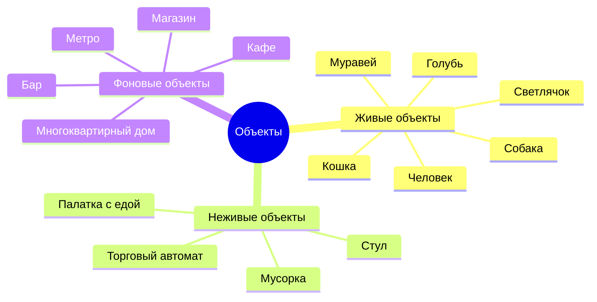
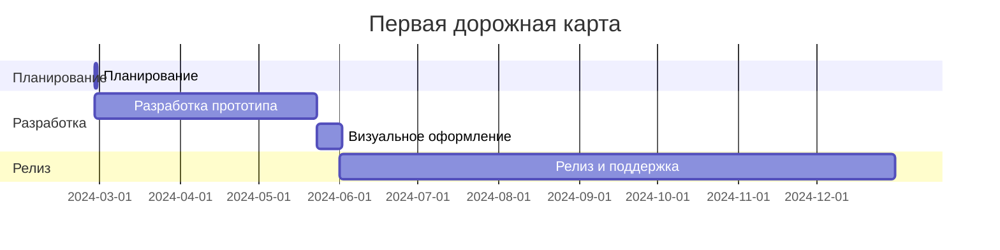

---
image:
    path: /2024-03-22-armonia-devlog-planning/preview-image.webp
    lqip: data:image/webp;base64,UklGRoAAAABXRUJQVlA4THMAAAAvD8ABAJUwiiRJkZtjZmbGF9s5Kyd1ScY8FbRt5MYA/F79RFEjSWpSxn2Zbw+m+z8BjqBzPlDmvL+4+00yVxL5ht9jZKHMSM22JRAbkUChuDviWIX4O+VnNh9jixzr0LjyndMjOUfNsQQDkKGXf/yfCzAGAA==
    alt: Примерно так
    
title: "'Waybound' — планирование игры"
authors: ["dev"]

categories: [마일스톤, 게임 개발]
tags: [마일스톤, 게임 개발, 유니티, 행선지, 기획, 개발일지]
start_with_ads: true

toc: true

date: 2024-03-22 19:24:00 +0900
last_modified_at: 2024-04-30 18:58:00 +0900

mermaid: true
---

## **Введение**

Завершив [предыдущий опыт](https://hyngng.github.io/posts/palette-developing/) и собираясь начать новый проект на Unity, я пересмотрел один спокойный фильм десятилетней давности и задумался о том, какое влияние оказывает опыт. Когда мысли немного улеглись, я подумал, что хотел бы создавать такие же вещи, как хорошее кино, оставляющее приятные впечатления. К тому же мне всегда хотелось что-то создавать и выражать.

{: .w-50 }
*Простой концепт-арт и набросок плана, который мы набросали с другом*

Сосредоточившись на опыте, я задумал среду, в которой объекты в сцене самостоятельно взаимодействуют друг с другом, даже если игрок вообще ничего не делает. Игра, в которой можно просто наблюдать и бродить без очков или условий завершения.  
Быстро набросав рисунок на основе этой идеи, я понял, что она выглядит неплохо, и реакция окружающих тоже была положительной. Так началось формирование концепции.

## **Планирование**

Самым большим разочарованием в прошлый раз было отсутствие планирования. Без ориентиров и долгосрочного плана было трудно определить направление игры на макроуровне, а на микроуровне — думать о ретенции или монетизации. Поэтому в этот раз я решил сначала хотя бы в общих чертах составить план.

Поискав концепции, помогающие в планировании игр, я наткнулся на GDD (Game Design Document). Это что-то вроде спецификации игры; единой формы не существует, поэтому я решил взять за основу [шаблон GDD от Unity](https://connect-prd-cdn.unity.com/20201215/83f3733d-3146-42de-8a69-f461d6662eb1/Game-Design-Document-Template.pdf) и заранее описать только необходимые разделы.

### **Упрощённый GDD**

- Основное описание
	- Название: 행선지 (англ: waybound)
	- Жанр: горизонтальный скролл-адвенчура (side-scrolling adventure)
	- Формат: 2.5D мобильная
- Геймплей
	- Игрок становится одним из существ, населяющих среду, — человеком, собакой, кошкой, муравьём и т.п. — на окраине города и выполняет доступные этому существу взаимодействия. Например, человек достаёт напиток из автомата, собака обнюхивает скамейку на улице.
	- Даже если игрок специально не управляет существом, существа взаимодействуют друг с другом и создают атмосферу городской окраины. У каждого существа есть внешняя индивидуальность в заданных пределах.
- Ключевые особенности
	- Разнообразные взаимодействия между объектами
	- Рисованные изображения и покадровая анимация
	- Изменение ощущений в зависимости от погоды (дождь, снег и т.п.)

### **Примеры объектов**



### **Примеры взаимодействий**

```mermaid
graph TD;
    Человек -- Купить напиток --> Торговый автомат;
    Человек -- Выгуливать --> Собака;
    Человек -- Гладить --> Кошка;
    Человек -- Смотреть --> Светлячок;
    Человек -- Сесть --> Стул;
    Человек -- Купить еду --> Палатка с едой;
```

## **Цели**

### **Технические цели**

В прошлых проектах у меня было много путаницы с именами переменных и функций. Не удавалось добиться ни согласованности, ни интуитивности, и со временем читать и изменять код становилось всё труднее.

Тогда я наткнулся на статью в блоге Unity о [правилах именования](https://unity.com/how-to/naming-and-code-style-tips-c-scripting-unity) и был немного поражён. Если бы я знал это с самого начала, было бы гораздо удобнее. В итоге я чётко понял, когда и какие имена использовать в C#, а каких стилей следует избегать.

Продолжая искать, какие ещё практики мне следует знать, я обнаружил электронную книгу Unity под названием ["Level up your code with game programming patterns"](https://blog.unity.com/games/level-up-your-code-with-game-programming-patterns). Внимательно её изучив, я узнал о принципах SOLID, фабричном паттерне, паттерне состояния и других полезных техниках. На основе этого я стал искать производные паттерны и определил для себя несколько областей, в которых хотел бы применить более системный подход к проектированию кода. Кратко это можно свести к следующему:

- PlasticSCM
- Событийно-ориентированное программирование
- Процедурная анимация
- Строгие правила именования

Из них PlasticSCM — это система контроля версий (VCS), предназначенная для замены GitHub, чтобы время от времени сохранять наработки в процессе разработки. Событийно-ориентированное программирование и правила именования — ключевые навыки, которые я хочу приобрести в этом проекте. Кроме того, есть небольшие цели — лучше освоить ещё не вполне привычные для меня паттерн синглтон, корутины, делегаты, свойства get set и т.д.

### **Художественные цели**

Основная цель — описать повседневную атмосферу вокруг нас через опыт восприятия движущихся линий и рисунков. Хотелось бы передать это так, чтобы было достаточно заметно, но не раздражающе. По возможности я стремлюсь к кинематографичной подаче и планирую использовать следующее:

- Покадровая анимация
- Динамическая глубина резкости
- Тональные кривые

В целом, я хотел бы сделать игру, в которой будет интересно даже просто смотреть на экран, ничего не делая. Однако я беспокоюсь, хватит ли у меня для этого способностей. В частности, я слышал, что рисовать движения животных — собак, кошек, голубей — покадровой анимацией — это удел профессиональных аниматоров. Мне не нужно делать такую детализированную анимацию, но из-за отсутствия опыта и знаний, вероятно, будут ошибки.


## **Дорожная карта**


