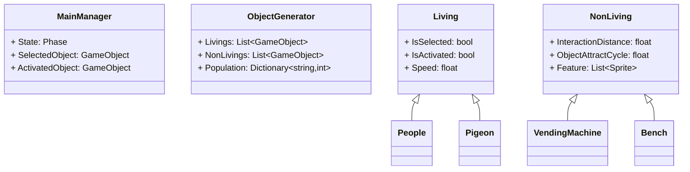
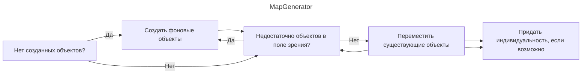
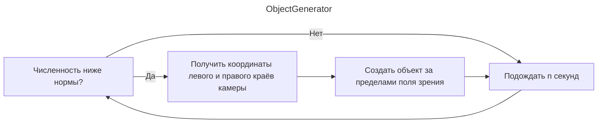
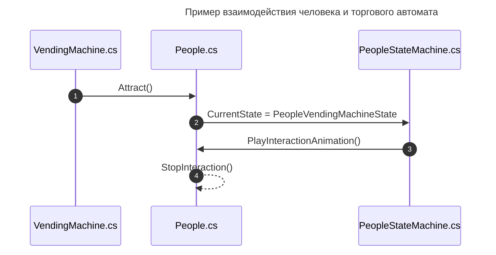
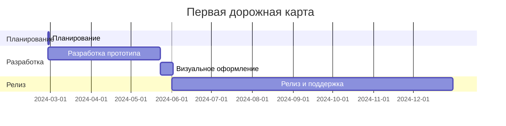

---
image:
    path: /2024-04-30-armonia-first-devlog/gameplay.webp
    lqip: data:image/webp;base64,UklGRiQBAABXRUJQVlA4TBgBAAAvD8ABAM1kRP9jE+UpQv/D4CCSJEXqOXpmBhts/1W8BGZa6B0bG44kyW2bnQUUHM7+//t8zQmA2wiMHEXSexc+ENN/QdRAxJC9WSlicZYaCiHEiBEEBULCMMoQhMMi0bv93TqZbAMSDEWRd+s75TKrKm4VicC+vLm9fnxs++PKnIq5yl2/HI/H7Znt/PFTbA+vP6RcraP+/u4u769YybUSgygQFMaTzCmCmruS9R8Wur+T874jmH1RRSUTIWlnwwMxK3/FTqFkkIRu7it/NDlMKxKqKhJtqW+MXnKWekjlKoNGylt4ripQbry6Ou5Me5Ctq6J0E8qGQe2+v3Tlrj/5bLz7VimPuFYRKZDFKkBIEQUROUhNEJEA
    alt: Разрабатываемый прототип
    
title: "'Waybound', первый промежуточный отчёт о разработке"
authors: ["dev"]

categories: [마일스톤, 게임 개발]
tags: [마일스톤, 게임 개발, 유니티, C#, 행선지, 개발, 개발일지]
start_with_ads: true

toc: true
toc_sticky: true

date: 2024-04-30 18:14:00 +0900
last_modified_at: 2024-05-23 23:11:00 +0900

mermaid: true
---

## **Введение**

> Продолжение [предыдущей статьи](https://hyngng.github.io/posts/armonia-devlog-planning/).
:::

Это отчёт о разработке моего [четвёртого майлстоуна](https://hyngng.github.io/categories/%EB%A7%88%EC%9D%BC%EC%8A%A4%ED%86%A4/), который я решил повторить, потому что мне понравилось. Нужно было подвести промежуточные итоги, заодно систематизируя заметки, сделанные в процессе. Я кратко описал результат примерно месяца работы. Вот что было сделано на этом этапе:

- Игровые системы
	- [x] Плавное перемещение камеры по касанию
	- [x] Выбор, управление и взаимодействие с объектами на экране
	- [x] Гарантия, что количество объектов под контролем не превышает определённого лимита
	- [x] Некоторые объекты получают случайную индивидуальность в заданном диапазоне
	- [x] Гарантия, что объекты существуют только в пределах видимости камеры

- Добавленные объекты
	- [x] 2 вида живых объектов: человек, голубь
	- [x] 7 видов фоновых объектов: дом, метро и т.д.
	- [x] 6 видов уличных объектов: гидрант, дорожный конус и т.д.

## **Архив**

{: .w-75 }
_Когда были реализованы люди. Игрок может стать любым объектом и взаимодействовать с окружающей средой._

## **Создание ассетов**

### **Изображения**


_Нарисованные фоновые изображения_

Чтобы создать фон, похожий на пригородную местность, я искал и использовал в качестве референсов городские иллюстрации, фотографии домов и панорамы улиц. Я хотел оставить возможность для будущей локализации, поэтому не добавлял элементы с текстом (рекламные листовки, газеты, вывески с каллиграфией). Хотелось, чтобы чувствовалась рука художника, поэтому я использовал линии с грубой текстурой и намеренно избегал применения инструментов для рисования прямых линий. В итоге рисунки получились слегка кривоватыми, но аккуратными, и я доволен.

В целом, я доволен и рад, но, пожалуй, разрешение слишком высокое. Я пробовал уменьшать масштаб, но изображения изначально не создавались в низком разрешении, поэтому они сильно пикселизировались, что выглядело плохо. Жаль, что не нарисовал в более низком разрешении — можно было бы добиться того же эффекта.

### **Шейдер спрайтов**


С этим возникла трудность в процессе разработки. Все объекты в проекте используют компонент Sprite. Среди стандартных шейдеров Unity нет подходящего для спрайтов, который поддерживал бы получение теней (Receive Shadow), поэтому я использую шейдер, написанный другим разработчиком.

Этот шейдер работает хорошо, но, поскольку он основан на Unlit, он не отбрасывает тени (Cast Shadow). Я хотел, чтобы объекты отбрасывали тени друг на друга, но, как выяснилось, для Unlit-шейдеров реализовать Cast Shadow невозможно. Нужен шейдер, применимый к спрайтам, который может создавать тени без отражения света, но я совершенно не разбираюсь в шейдерах, поэтому реализовать это сложно. Надо будет изучить этот вопрос подробнее.

### **Анимации**

{: .light .w-25 .border }
{: .dark .w-25 }
*Голубь в полёте*

Анимации я иногда рисовал сам. Например, для движений голубя, которые было трудно реализовать с помощью анимационного компонента Unity, я рисовал каждый кадр и склеивал их, как в традиционной анимации. У меня не было опыта рисования анимации движений животных, поэтому я находил и изучал видео с ходящими и летающими голубями.

В процессе я разделил поток анимации на фазы, вместо того чтобы создавать одну простую анимацию. Например, полёт голубя был разбит на три отдельных набора: анимация взлёта (EnterFly), анимация полёта (BeingFly) и анимация приземления (EndFly), которые затем привязывались к паттерну состояния. Благодаря этому результат, как видно в [архиве](#아카이브), выглядит довольно правдоподобно.


*Идущий человек и атмосферные светлячки*

В основном, однако, я использовал анимационный компонент Unity. На примере выше показан эпизод, где в зависимости от изменения положения персонажа автоматически регулируется отражение по горизонтали и скорость воспроизведения анимации ходьбы. Это не очень хорошо видно, так как я не сохранил предварительные материалы, но голова, тело и конечности собраны из отдельных фрагментов, положение которых регулируется независимо, без покадровой анимации.

Кстати, работа с анимацией, пожалуй, самая сложная. В отличие от программирования, в анимации на индивидуальном уровне нет какого-то особого прорыва, и это каждый раз даёт о себе знать. Эффективность работы целиком зависит от личного мастерства. Интересно, как профессиональные аниматоры справляются с такой работой.

## **Процесс разработки**

Были предприняты усилия для улучшения того, что не устраивало в [предыдущем опыте](https://hyngng.github.io/posts/palette-developing/). В частности, я старался не упускать из виду поддерживаемость кода, руководствуясь принципами SOLID. Если мне казалось, что класс становится слишком большим, я без колебаний разделял его, чтобы соблюсти принцип единственной ответственности, более тщательно использовал модификаторы доступа, а на более детальном уровне — активно применял атрибуты классов и `#region`.

Также, подумав, что необходимо делать резервные копии, я попробовал [Unity VCS](https://www.plasticscm.com/) и остался очень доволен. Если вы знакомы с GitHub, к нему можно быстро привыкнуть. Особенно понравилось, что можно загружать файлы прямо из интерфейса Unity в любой момент работы.

### **Проектирование классов**



Перед началом разработки я продумал основную структуру, учитывая роли классов и отношения между ними. Я не стал рисовать полноценные UML-диаграммы, а лишь формализовал структуру настолько, чтобы предотвратить появление излишне сложной архитектуры из-за спонтанного проектирования. Помимо перечисленного, есть и другие классы, но диаграмма стала бы слишком большой и сложной, поэтому я ограничился наиболее показательными.

Помимо членов скрипта, я заранее предусмотрел, что `MainManager` будет использоваться как синглтон с применением событийно-ориентированного программирования, а `Living` и `NonLiving` как родительские скрипты будут использовать паттерн состояния. Всё это было реализовано на практике.

В процессе разработки я внёс несколько программных паттернов, выделил код, связанный с касаниями, из разросшегося `MainManager.cs`{: .filepath } в отдельный `TouchManager.cs`{: .filepath } — фактическая форма изменилась во многом, но сперва задать общую структуру было определённо удобно. Этот подход очень помог, и если в будущем мне снова доведётся что-то разрабатывать, я постараюсь хотя бы набросать простую диаграмму.

### **Генерация и управление картой**

{: .w-75 }



```cs
void GenerateObjects(List<GameObject> instantiated, List<GameObject> instantiable)
{
    GameObject tempInstantiated = instantiated[instantiated.Count - 1];

    for (int i=instantiated.Count - 1; i>0; i--)
        instantiated[i] = instantiated[i - 1];
    instantiated[0] = tempInstantiated;
    
    instantiated[0].transform.position = new Vector3(
        instantiated[1].transform.position.x - objectSize, 0, 0
    );

    /* ... */
}
```

Генерацию карты я делал впервые. Я изучил такие алгоритмы процедурной генерации, как BSP, но они не подходили под мои задачи, и, поскольку такая сложная система была не нужна, я решил сделать всё сам.

- Удовлетворяются следующие условия:
	- Однажды сгенерированная карта сохраняется до конца игры.
	- Объекты карты видны только на экране.
	- Порядок списка каждый раз перемешивается, чтобы карта выглядела по-разному.

В итоге я создал поэтапную процедуру генерации карты, работающую на основе поля зрения камеры, чтобы она корректно отображалась на устройствах с любым соотношением сторон экрана. С помощью списка игровых объектов первый элемент в нём всегда соответствует крайнему левому объекту, а последний — крайнему правому. В зависимости от поля зрения камеры объекты либо создаются заново, либо их порядок корректируется. В результате всё работает даже лучше, чем я ожидал.

### **Создание объектов**




```cs
void GenerateObject(GameObject targetObject)
{
    bool spawnAtLeft = Random.value > .5f;
    float spawnPosX = spawnAtLeft
                    ? MainCamera.GetRenderWidth(gameObject).Left - 1.8f
                    : MainCamera.GetRenderWidth(gameObject).Right + 1.8f;

    GameObject generatedObject = Instantiate(
        targetObject,
        new Vector3(
            spawnPosX,
            targetObject.GetComponent<BoxCollider>().size.y / 2,
            Random.Range(-3.5f, 3.5f)
        ),
        Quaternion.identity
    );
    generatedObject.transform.parent = standardObject.transform;
    GeneratedObjects.Add(generatedObject);
}

IEnumerator ManagePopulation()
{
    while (true)
    {
        GenerateLiving(LivingToGenerate);
        yield return new WaitForSeconds(GenerationDelay);
    }
}
```

Создание объектов не составило большого труда, так как я уже имел опыт написания похожего кода. Объекты создаются за пределами поля зрения с помощью `ViewportToWorldPoint()` и уничтожаются, если остаются за его пределами более n секунд.

Однако есть ещё что доработать. Например, при быстром перемещении камеры влево или вправо в какое-то мгновение можно увидеть пустую улицу без людей, а затем по прошествии времени слева и справа начинают появляться люди по одному-два. Это выглядит очень неестественно, поэтому, вероятно, нужно решить эту проблему, поддерживая плотность объектов слева и справа от камеры на постоянном уровне.

### **Взаимодействие**



Взаимодействие между объектами, являющееся ключевой механикой игры, реализовано так, что инициирующий объект вызывает взаимодействие. С помощью корутины через определённые промежутки времени находятся объекты в пределах досягаемости с помощью `Physics.OverlapBox`, и для случайного из них вызывается взаимодействие. Используется паттерн состояния, который работает, как показано выше.

Возможно, из-за того, что я ещё недостаточно освоил паттерн состояния, процесс кажется мне слишком запутанным. Интересно, есть ли способ реализовать взаимодействие проще.

## **Заключение**

Работа над разработкой до сих пор была, несомненно, увлекательной и приносила удовлетворение. Сначала продумываешь систему, затем на основе плана собираешь материалы, а если их не хватает — создаёшь и применяешь сам. Результат этого комплексного процесса даёт чёткую визуальную обратную связь, и это приносит совершенно особенное чувство достижения.

- В будущем остаются следующие задачи:
	- [ ] Добавить звуковые эффекты
	- [ ] Использовать процедурную анимацию
	- [ ] Разнообразить объекты и взаимодействия
- Или хотелось бы попробовать следующее:
	- [ ] Toast-уведомления
	- [ ] Воздушная перспектива

В процессе разработки я потратил около двух недель на активное обновление блога. Надеюсь, в оставшийся месяц мне удастся оставаться сосредоточенным, не отвлекаясь, и завершить проект в срок.


