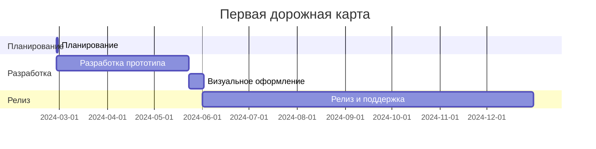

---
image:
    path: /2024-05-31-armonia-second-devlog/gameplay.webp
    lqip: data:image/webp;base64,UklGRlYAAABXRUJQVlA4IEoAAADwAQCdASoQAAgAAUAmJQBOgB8xi/GXoBAA/vuITP1jzd5vh9i82itNyxKJOlCBXvOebik8444+JnSUJik6FdPY8GR+D5jZO/WAAA==
    alt: Разрабатываемый прототип
    
title: "'Waybound', второй промежуточный отчёт о разработке"


categories: [마일스톤, 게임 개발]
tags: [마일스톤, 게임 개발, 유니티, C#, 행선지, 개발, 개발일지]
start_with_ads: true

toc: true

date: 2024-05-31 22:53:00 +0900
last_modified_at: 2025-12-26 11:40:00 +0900

mermaid: true
---

## **Введение**

:::info
Продолжение [предыдущей статьи](https://hyngng.github.io/posts/armonia-first-devlog/).
:::

Это отчёт о разработке моего [четвёртого майлстоуна](https://hyngng.github.io/categories/%EB%A7%88%EC%9D%BC%EC%8A%A4%ED%86%A4/). Я подвёл итоги ещё одного месяца работы. В этот раз основное внимание было уделено расширению систем и контента игры. Вот что было сделано:

- Игровые системы
	- [x] Слои фоновых объектов
	- [x] Оптимизация путём замены шейдера
	- [x] Окно настроек, доступное через pinch-to-zoom
	- [x] Взаимодействие объектов с помощью процедурной анимации
- Добавленные объекты
	- [x] 2 вида зданий, играющих роль заднего плана

## **Архив**

{: .w-75 }
*Запись процесса тестирования входа в настройки*


## **Создание ассетов**

### **Изображения**

{: .light .w-25 .border }
{: .dark .w-25 }
*Голубь, клюющий землю*

Планирую и дальше добавлять покадровую анимацию. В этот раз я сделал анимацию для голубя, клюющего землю. Анимация короткая, и, что самое важное, у меня уже были [ранее созданные ассеты](https://hyngng.github.io/posts/armonia-developing-first/#%EC%95%A0%EB%8B%88%EB%A9%94%EC%9D%B4%EC%85%98-%EC%97%90%EC%85%8B), так что не пришлось, как раньше, искать видео с другими голубями и подмечать их особенности.

Как и раньше, я создал `DigState.cs`, привязал его к паттерну состояния, благодаря чему движения выглядят естественно. Взаимодействие срабатывает, если выбрать голубя и коснуться земли.

### **Шейдер**

Более подробно об этом ниже, но из-за проблем с нагрузкой на GPU я заменил используемый шейдер 2D-спрайтов на более лёгкий. Проблема в том, что этот шейдер не умеет отбрасывать тени (Cast shadow), и в нём не работает эффект глубины резкости (DOF) от пост-обработки. Было бы хорошо это исправить, но я пока не освоил шейдеры в достаточной мере, так что придётся либо уделить этому время, либо отказаться от некоторых визуальных эффектов.

## **Процесс разработки**

### **Настройки в стиле камеры**

{: .w-75 }
*Вход в настройки через pinch-to-zoom. Пока прототип.*

Окно настроек сделано без отдельного UI, чтобы максимально сохранить чистоту экрана и создать интересный эффект. Доступ к настройкам осуществляется с помощью pinch-to-zoom. Жест работает ступенчато: в определённом диапазоне это обычное увеличение/уменьшение масштаба камеры, а при превышении порога с вибрационным откликом открываются настройки. Выйти из настроек можно обратным жестом — pinch-in.

UI настроек выполнен в виде камеры. Иногда, фотографируя, я испытывал чувство, проходящее через экран в руке между мной и объектом съёмки — словно граница исчезает и сцена соединяется реалистично. Мне захотелось воспроизвести это ощущение.

Батарея и время отображаются с помощью `SystemInfo.batteryLevel` и `DateTime.Now`, показывая реальное состояние аккумулятора и время. Выдержка и диафрагма будут управлять эффектами пост-обработки — размытием движения и глубиной резкости.

Пока есть ещё что доделывать — например, текст отображается стандартным шрифтом, — но даже в текущем виде ощущение от взаимодействия кажется уникальным, и я пока доволен.

### **Применение процедурной анимации**

{: .w-75 }
*Если рядом голубь, персонаж на него смотрит*

Во время работы над [предыдущим майлстоуном](https://hyngng.github.io/posts/palette-second-devlog/) я видел, как процедурная анимация используется для создания органичных взаимодействий с окружением, и подумал, что это очень круто. Я запомнил это и решил попробовать в этот раз. Я думал, что для этого нужны технически сложные условия, но, поскольку Unity предоставляет готовый пакет, оказалось проще, чем я ожидал. Однако управление через код оказалось сложнее, чем казалось.

В отличие от голубя, у человека голова, тело и ноги — отдельные объекты. С помощью компонента `Multiple Aim Constraint` из пакета [Animation Rigging](https://docs.unity3d.com/Packages/com.unity.animation.rigging@1.1/manual/index.html) я в качестве эксперимента реализовал, как голова персонажа поворачивается в сторону голубя, находящегося в определённом радиусе.

```cs
public void ChangeSourceObject(GameObject discoveredObject)
{
    WeightedTransformArray sourceObjects = Constraint.data.sourceObjects;
    WeightedTransformArray newSourceObjects = new WeightedTransformArray(sourceObjects.Count);
    
    newSourceObjects[0] = new WeightedTransform();
    WeightedTransform wt = newSourceObjects[0];

    /* ... */

    newSourceObjects[0] = wt;
    
    data.sourceObjects = newSourceObjects;

    Animator.enabled = false;
    rigBuilder.Build();
    Animator.enabled = true;
}
```

Чтобы реализовать эту функцию, нужно было заменить свойство `sourceObject` компонента `Multi Aim Constraint` на объект внутри сцены. Этот процесс оказался полным трудностей. Если кому-то понадобится программно менять `sourceObject` процедурной анимации, вот что может пригодиться:

- Свойство `sourceObjects` — только для чтения (read-only). Нужно определить данные в другой локальной переменной, затем присвоить новое значение `data.sourceObjects`.
- После присвоения необходимо отключить аниматор объекта, собрать `rigBuilder`, а затем снова активировать анимацию, чтобы изменения применились корректно.
- Если какой-то объект зарегистрирован как `sourceObject` другого объекта, при его удалении следует изменить свойство `sourceObject` на `None`.

В официальной документации было трудно найти решение некоторых проблем и ошибок, и это вызывало затруднения, но в итоге, кажется, получилось неплохо. Внедрение этой функции определённо сделало атмосферу игры более гибкой. Если когда-нибудь буду делать 3D-проект, обязательно постараюсь использовать её более полноценно.

### **Попытка оптимизации с помощью Profiler**

{: .w-75 }
*Пример данных, измеряемых Unity Profiler*

Моя игра, как ни странно, после сборки сильно нагревалась и не могла поддерживать стабильные 40 FPS. Даже если мой код был неидеален, я старался избегать тяжёлых функций вроде `GetComponent()` и `Find()`, а код с циклами (`for`, `foreach`, корутины) писал так, чтобы он не выполнялся без необходимости. Но я никак не мог понять, почему 2.5D-проект, который должен быть лёгким, теряет частоту кадров.

Мне было неприятно, что телефон быстро нагревался в процессе отладки, поэтому я впервые решил попробовать оптимизировать проект с помощью Profiler. Процесс оказался довольно простым: нужно записать данные с помощью Unity Profiler, найти участки с наибольшей загрузкой кадров, определить, какая операция выполняется чаще всего, и улучшить этот участок.

В моём случае `Semaphore.WaitForSignal` занимал от 50 до 70% времени. Прочитав, что в такой ситуации рекомендуется заменить шейдер на более лёгкий, я заменил [ранее найденный шейдер](https://hyngng.github.io/posts/armonia-first-devlog/#%EC%8A%A4%ED%94%84%EB%9D%BC%EC%9D%B4%ED%8A%B8-%EC%85%B0%EC%9D%B4%EB%8D%94) на более лёгкий. Частота кадров заметно выросла, а нагрев значительно снизился.

## **Критерии релиза**

### **Необходимость цели для завершения**

Создание анимаций и взаимодействий для разных объектов — это, в целом, увлекательное и интересное занятие, но я чувствовал, что оно отнимает гораздо больше времени и сил, чем я думал. Я надеялся, что с опытом эффективность работы вырастет, и она действительно выросла, но написание кода и создание покадровой анимации всё равно требуют минимального физического труда — набора текста или рисования линий на экране.

По мере роста проекта и увеличения количества ассетов я начал ощущать, что нагрузка становится всё больше. Помню, как в отчёте игровой индустрии, опубликованном Unity, я читал совет: «Don't bite off more than you can chew». Я задумался, не движется ли моя ситуация в этом направлении.

Поэтому я решил, что нужно определить критерии релиза как целевой ориентир. На данный момент я решил поставить цель — подать заявку на [Google Featuring](https://play.google.com/console/about/guides/featuring/). Google Featuring устанавливает чёткие критерии для высококачественных приложений и игр, среди которых:

- [Высокий рейтинг пользователей](https://support.google.com/googleplay/android-developer/answer/138230?hl=en)
- [Соблюдение политик Google Play](https://play.google/developer-content-policy/#!?modal_active=none)
- [Высокий балл Android Vitals](https://support.google.com/googleplay/android-developer/answer/9844486?hl=en&visit_id=638527380779176477-2227653483&rd=1)
- [Соблюдение основных рекомендаций по качеству приложений для Android и Google Play](https://developer.android.com/quality?hl=ko)

В частности, [Android Developers](https://developer.android.com/quality?hl=ko) предлагает в качестве хорошего пользовательского опыта удобство использования (резервное копирование и восстановление), доступность, локализацию, глубокие ссылки, визуальную привлекательность и мастерство исполнения (анимация, аудио, управление)... и многие другие критерии и примеры. Нужно будет детализировать, но как общий ориентир они вполне подходят.

### **Прочие собственные критерии**

- Приложение
	- [ ] Иконка приложения
	- [ ] 3D-звук
	- [ ] Простое обучение
	- [ ] Локализация текста в приложении
- Объекты
	- [ ] Не менее 5 видов объектов
	- [ ] Не менее 2 вариантов индивидуальности на объект
	- [ ] Не менее 3 видов взаимодействия на объект
- Окружение
	- [ ] Система погоды (дождь, снег и т.п.)
	- [ ] Динамическое небо с облаками
	- [ ] Гарантированное наличие на экране не менее 3 фоновых объектов

## **Заключение**



Согласно первоначальной дорожной карте, к моменту публикации этой статьи предполагалось завершить проект, но, то ли из-за нехватки навыков, до завершения ещё далеко. Нужно составить новую дорожную карту и, что более важно, более детально определить роли и цели по кварталам.

Кроме того, в июне начинается служба в резерве, поэтому на какое-то время разработку придётся отложить и отправиться в учебный центр. Ситуация пока неясна, но я хотел бы, если возможно, постепенно продолжать разработку, нацелившись на уровень, достаточный для регистрации в магазине.
