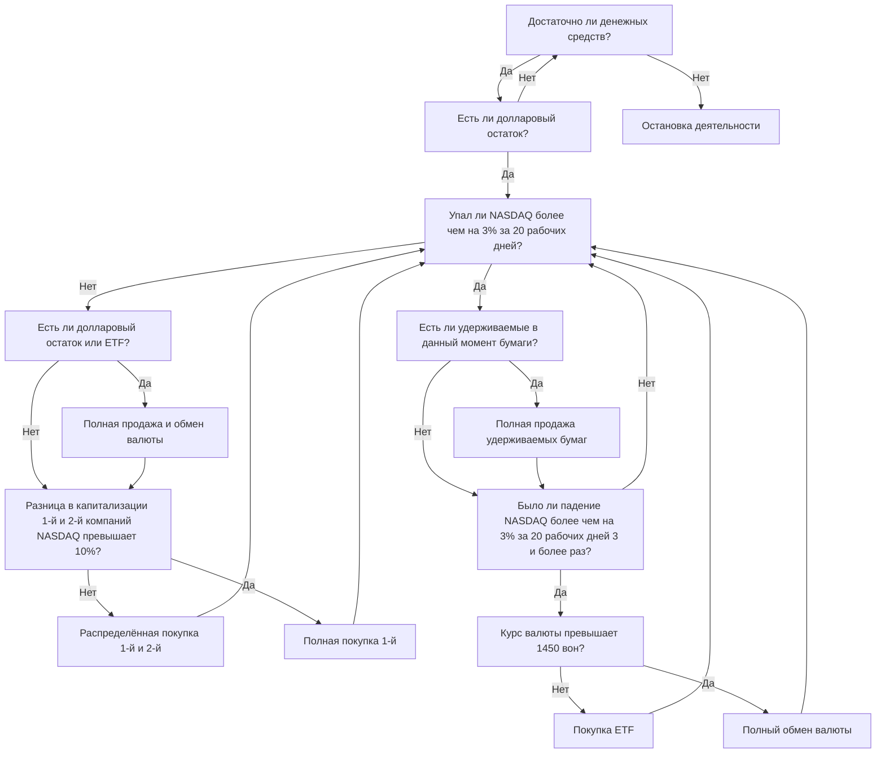

## **Автоматический торговый робот, ASTP**

**ASTP (Auto Stock Trading Program)** — это мой [второй майлстоун](https://github.com/hyngng/astp/tree/legacy), созданный с темой автоматической торговли акциями по внутреннему алгоритму. После второго семестра первого курса мне захотелось самостоятельно создать программу, и, когда знакомый предложил идею автоматического торгового робота, мне стало интересно, и я взялся за дело. Программа написана на Python, а часть, связанная с акциями, была сделана при помощи знакомого, с использованием лишь простой базовой стратегии.

## **Особенности программы**

Используется [OpenAPI](https://www.truefriend.com/main/customer/systemdown/OpenAPI.jsp?cmd=TF04ea01200) Korea Investment & Securities. Это был мой первый опыт создания программы, использующей API, и я был удивлён тем, насколько расширились мои возможности. Торговая стратегия основана на двух принципах и работает по индексу NASDAQ.

- Краткое описание алгоритма
	- **Покупка акций**: покупка осуществляется с учётом соотношения индекса NDX и рыночной капитализации 1-й и 2-й компаний, котирующихся на NASDAQ.
	- **Продажа акций**: если индекс NDX резко падает или курс доллара к воне чрезмерно вырастает, все удерживаемые акции продаются, и торговая деятельность приостанавливается на 20 рабочих дней. Факт резкого падения NDX определяется путём сравнения максимального и минимального значений индекса NDX, введённых в Excel дважды — на открытии и на закрытии торгов.
- Использованные библиотеки
	- `mojito`: Интегрированный Python-модуль для OpenAPI Korea Investment & Securities.
	- `yfinance`: Используется для получения рейтинга NASDAQ по рыночной капитализации.
	- `BeautifulSoup`: Используется для краулинга значения NASDAQ-100, которое отсутствует во всех связанных с акциями модулях.

## **Структура и пример кода**



```python
# краулинг NDX
def get_ndx():

    if response.status_code == 200:
    
        html = response.text
        soup = BeautifulSoup(html, 'html.parser')

        ndx_class = soup.find(class_ = 'Fw(b) Fz(36px) Mb(-4px) D(ib)')
        ndx = re.sub(r'[^0-9]', '', ndx_class.get_text())

    else:
        print(response.status_code)
    
    return ndx

# проверка падения NDX на -3%
def ndx_collapsed():

    df_ndf_data['ndx_index'] = df_ndf_data['ndx_index'].astype(float)
    ndx_decrse_3per = False

    ndx_max = df_ndf_data['ndx_index'].max()
    ndx_min = df_ndf_data['ndx_index'].min()

    if 100 * (ndx_max - ndx_min) / ndx_max > 3:
        ndx_decrse_3per = True
        print("\nNDX сильно колеблется.\n")
    else:
        print("\nNDX стабилен.\n")

    return ndx_decrse_3per
```

## **Пример работы программы**

{: .w-75 }
*Пример работы программы и снимок экрана после покупки 1 акции Apple*

Поскольку это простая Python-программа без UI, она бесперебойно запускается из командной строки. После однократного запуска программа самостоятельно размещает ордера на покупку и продажу до тех пор, пока её не остановят принудительно. Информацию о совершённых сделках можно увидеть в окне командной строки или в приложении Korea Investment & Securities, как показано на скриншоте ниже.

## **Предостережения и ограничения**

- Американский фондовый рынок открыт с 23:30 до 06:30 по корейскому времени, поэтому ASTP, основанный на зарубежных акциях, имеет ограничения по времени, когда можно проверить выполнение кода (в отличие от обычных программ).
- Для использования сервисов, предоставляемых Korea Investment & Securities, помимо самой программы требуются две предварительные операции:
    1. Открыть счёт в Korea Investment & Securities и подать заявку на [OpenAPI](https://apiportal.koreainvestment.com/intro). На странице заявки получить `key` и `secret`, сохранить их вместе с номером виртуального счёта в файле `mock.key` в проекте.
    2. Установить программу [eFriend Expert](https://www.truefriend.com/main/customer/systemdown/OpenAPI.jsp?cmd=TF04ea01200), предоставляемую Korea Investment & Securities, для обработки отправки и получения ордеров, а также проверки остатка на счёте.
- Кроме того, из-за того, что модуль с общим сертификатом не поддерживает 64-битную среду, необходимо [вручную создать 32-битную виртуальную среду](https://hyngng.github.io/posts/virtual-32bit/) и запускать код в ней, даже если это неудобно.

## **Заключение**

:::tip
Более подробно можно ознакомиться на [GitHub](https://github.com/hyngng/astp/tree/legacy).
:::

При создании этого майлстоуна основным опытом для меня было использование внешних модулей (API, библиотеки). На практике я хорошо усвоил, что для достижения большего необходимо активно использовать уже готовые модули. Также я узнал, как сортировать и отображать такие данные, как показатели NASDAQ или рыночная капитализация компаний.

Хотя проект завершился довольно простым кодом (около 237 строк), я подумал, что в будущем, при расширении программы, было бы неплохо более тщательно детализировать условия покупки и продажи, провести рефакторинг кода с использованием классов и сделать его более лаконичным.
