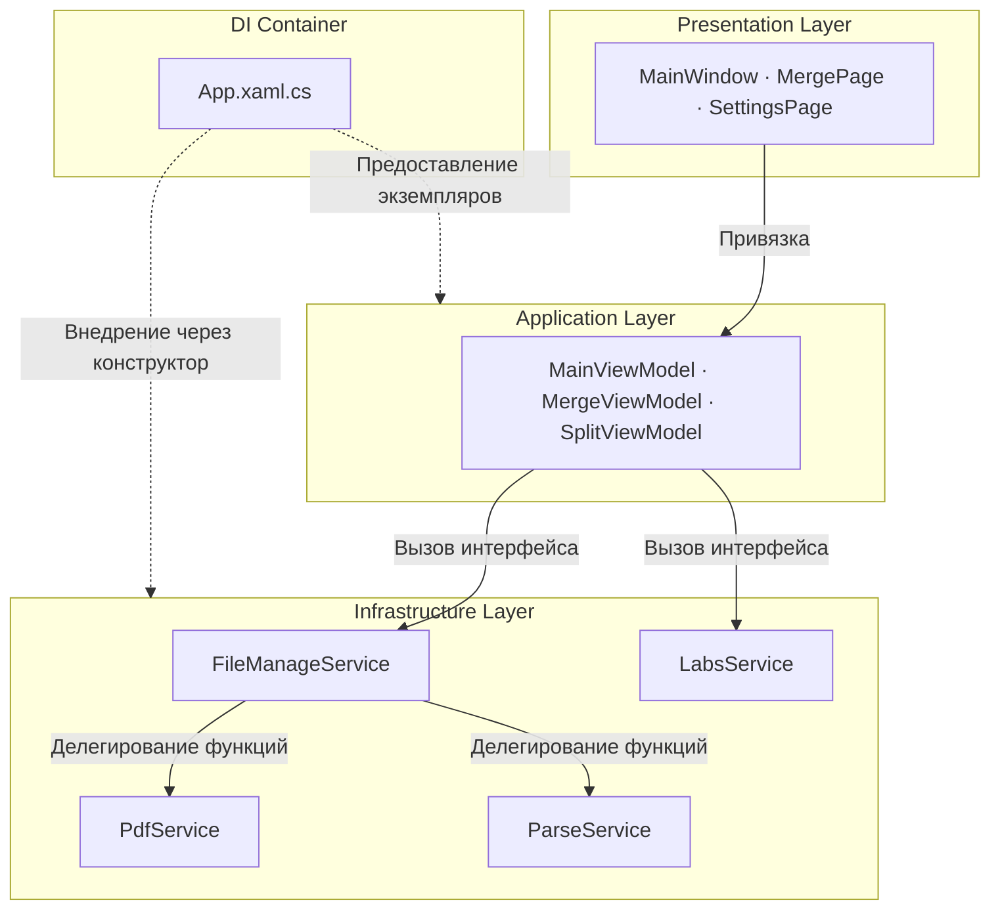

---
image:
    path: /2026-04-02-pascal-devlog/preview-image.webp
    lqip: data:image/webp;base64,UklGRj4AAABXRUJQVlA4IDIAAADQAQCdASoQAAgAAUAmJZwCdAEPDuQrCAD+/crO2PZZpBuP/xETb+8eyANti2KhVUAAAA==
    alt: "Временное название программы — 'Pascal'"

title: "Ретроспектива разработки PDF-редактора на WinUI 3"
authors: ["dev"]

categories: [마일스톤, 기타 개발]
tags: [마일스톤, 기타 개발, WinUI 3, MVVM, XAML, C#]
start_with_ads: true

toc: true

date: 2026-04-02 11:14:00 +0900
last_modified_at: 2026-06-23 16:47:00 +0900

mermaid: true
---

## **Мотивация разработки**

> «Спасибо, но мы — государственное учреждение, не можем использовать внешние программы как попало.»

Во время социальной службы в офисе возникла проблема. Она подробно описана в [посте о моей службе](https://hyngng.github.io/ru/essay/sabok-logs/), но если кратко — в госучреждениях нельзя использовать внешние программы без лицензии, и на это мне указали. Этот опыт и стал толчком к разработке. Однако я начал не просто с мысли «сделаю сам». Мне хотелось применить C#, с которым я познакомился в Unity, в другом контексте, а также попробовать создать полноценную Windows-программу. Это позволило мне смело открыть новый проект.

Название Pascal возникло потому, что изначально разработка начиналась с цели сжатия PDF. Функция сжатия так и не была реализована — к моменту моего увольнения из-за призыва это было уже нерентабельно, — но контекст работы с PDF-файлами сначала воплотился в двух функциях: объединении и разделении.

## **О программе**

{: .light }
{: .dark }
*Скриншоты четырёх готовых страниц. Как видно из окна с титрами, программа не слишком серьёзная*

Pascal — программа для объединения и разделения PDF-файлов. Разрабатывалась около двух месяцев в период социальной службы. К счастью, [сослуживец, также интересовавшийся разработкой](https://github.com/din-c), составил компанию, и мы устроили небольшую коллаборацию, открыв отдельную страницу в Notion в свободное от работы время. Изначально планировалось интегрировать в программу множество офисных функций — извлечение текста из PDF, конвертацию в JPG, сжатие и т.п., — но из-за карьерных соображений и небольшого остававшегося срока службы мы ограничились базовыми функциями.

Раскрывать информацию, позволяющую идентифицировать учреждение, не рекомендуется военкоматом, и, уважая эту позицию, я не могу точно описать, как и в каких условиях она использовалась, но могу кратко рассказать. Во-первых, ощущение, что эта программа находится в моём распоряжении, оказало большую психологическую поддержку. Во-вторых, сырая форма работы — например, каждый раз править значения в `config.yaml` перед запуском Python-скрипта — была красиво упрощена до нажатия нескольких кнопок.

- Работающие функции
	- Объединение нескольких PDF-файлов
    - Возможность изменения порядка объединения
    - Возможность указания страниц для объединения
	- Одновременное разделение нескольких PDF-файлов
    - Возможность указания единицы разделения
    - Возможность указания диапазона разделения
	- Отображение окна обновления Windows (лаборатория)

## **Сложности разработки и адаптация**

### **Фреймворк WinUI 3**

У меня не было предварительных знаний или опыта в разработке Windows-программ, и выбор фреймворка с самого начала давался нелегко. Сначала я хотел переиспользовать опыт фронтенд-разработки и присматривался к [Electron.NET](https://github.com/ElectronNET/Electron.NET), но сами авторы спрашивали: «Wait — you host a .NET Core app inside Electron? Why?», что указывало на то, что это далеко от стандартного подхода. Как раз в это время я узнал о дизайн-языке Microsoft [Fluent 2](https://fluent2.microsoft.design/), переключился на WPF-проект с использованием библиотеки [ModernWPF](https://github.com/Kinnara/ModernWpf), но в процессе разработки среда показалась мне устаревшей (на 2025 год), и я перенёс проект на современный фреймворк WinUI 3.

В этом опыте стоит отметить один момент. Согласно моим изысканиям, за последние 20 с лишним лет Microsoft выпустила множество новых фреймворков, не полностью совместимых со старыми платформами: WinForms, WPF, UWP, WinUI 3 и, в последнее время, MAUI. Поэтому в разработке Windows-программ, в отличие от мобильной, веб- или игровой разработки, критерии выбора стандарта действительно размыты. Оглядываясь назад, могу сказать, что мои мучения были своего рода обрядом посвящения.

|Фронтенд веб-разработка|WinUI|
|---|---|
|HTML|XAML|
|CSS|XAML Style|
|JavaScript|C#|

Тем не менее, первое впечатление было хорошим: опыт разработки на WPF и WinUI 3 очень похож на фронтенд-веб-разработку. Это было даже забавно. Процесс определения элементов UI и их свойств в XAML и написания бизнес-логики на C# напоминал работу HTML и JavaScript, а работа со стилями не вызывала трудностей, если есть опыт работы с CSS или SCSS. Так что с UI-фреймворком я освоился быстро.

Однако экосистема WinUI 3, несмотря на постоянную поддержку Microsoft, всё ещё довольно скудна. Например, если посмотреть [проект WinUI-3-Apps-List](https://github.com/DesignLipsx/WinUI-3-Apps-List?tab=readme-ov-file), количество приложений есть, но качество оставляет желать лучшего. Особенно редко можно найти проекты с открытым исходным кодом, поэтому было трудно понять, как другие на самом деле работают с этим фреймворком. Вопросы о том, как вести проект на WinUI 3, приходилось решать дедуктивно, изучая [официальную документацию Microsoft](https://learn.microsoft.com/ko-kr/windows/apps/winui/winui3). Качество корейского перевода оставляло желать лучшего, так что английская документация была фактически единственным выбором, и LLM в этой области тоже не сильно помогали. Начальное обучение потребовало затрат.

### **IDE, .NET, библиотеки**

Visual Studio, будучи дальним родственником, показался мне незнакомым после чистого VSCode. К тому же, у меня не было опыта работы с незнакомым фреймворком WinUI 3. Привыкание к таким терминам, как «решение», «NuGet», «дизайнер», и к функциям, предлагаемым в строке меню, само по себе стало первым узким местом. Мне пришлось потратить больше времени, чем я думал, на понимание структуры среды разработки, ещё до реализации функциональности.

В других open-source проектах, таких как [WinUI-Gallery](https://github.com/microsoft/WinUI-Gallery), [DevWinUI.Gallery](https://github.com/ghost1372/DevWinUI/tree/main/dev/DevWinUI.Gallery), [Files](https://github.com/files-community/files), я заметил следование своего рода диалекту: `Services`, `Helpers`, `Modules`. Этот подход был мне незнаком по Unity, Python или фронтенд-проектам, и сначала я чувствовал себя неуверенно. Нужно было не просто изучать функциональность, но и осваивать сам способ чтения проекта, переводить и применять прежние ощущения к этому проекту.

Тем не менее, закрепиться в среде WinUI 3 мне помогли отличные библиотеки элементов управления: [Windows Community Toolkit](https://github.com/CommunityToolkit/WindowsCommunityToolkit) и [DevWinUI](https://github.com/ghost1372/DevWinUI). В среде разработки .NET, работающей с UI, элементы интерфейса называются контролами. Обе библиотеки предоставляют огромный выбор контролов, благодаря чему почти всё, за исключением, пожалуй, `DataTable`, можно было реализовать без особого труда. Это снизило начальный порог входа.

### **Совершенно незнакомый паттерн MVVM**

Это была самая незнакомая часть. Помимо знания синтаксиса XAML и C#, требовалось понимание MVVM. Сам по себе MVVM не является обязательным требованием для WinUI-разработки, но поскольку сам фреймворк спроектирован в расчёте на MVVM, его несоблюдение резко повышает сложность поддержки кода. Это кардинально отличает его от разработки в Unity.

Сама концепция снижения зависимости между частями кода была мне знакома, но нужно было изучить, как MVVM на самом деле этого добивается, каковы возможности и границы модели, представления и модели представления, как их различать. И, честно говоря, даже сейчас, когда я пишу этот текст, понимание остаётся несколько размытым. Например, я считаю, что для сложных страниц следует выделять отдельную ViewModel, для простых — опускать, а в случаях, которые трудно обработать одной лишь привязкой (например, drag-and-drop файлов), использовать код позади в качестве моста. Но я не уверен, действительно ли это самое лучшее решение, и, даже если это так, я не вполне ощущаю его преимущества.

Пакет [MVVM Toolkit](https://learn.microsoft.com/en-us/dotnet/communitytoolkit/mvvm/) — это практически обязательный элемент для ознакомления в разработке на WinUI 3. Он позволяет представлению взаимодействовать с моделью представления, минуя код позади, что упрощает структуру программы и делает её более интуитивной.

## **О коллаборации и эффективности работы**

### **Коллаборация**

Я привык активно пользоваться Notion, Figma и GitHub и, естественно, планировал использовать их и в этом проекте. Мой коллега сказал, что не пользовался этими инструментами, и я кратко объяснил, как ими пользоваться и почему именно они. В этот раз я даже попробовал методологию PARA в Notion, чтобы выстроить свою системную структуру коллаборации.

Однако, помимо GitHub, ожидаемого отклика не было, и, признаться, я чувствовал себя неловко. Дело было не в лени коллеги: новая среда WinUI 3 сама по себе была сложной, и мои аргументы о необходимости Notion и Figma, видимо, были недостаточно убедительными. Я считал, что система управления ресурсами всегда нужна, поскольку она позволяет поддерживать разработку на дистанции, тогда как коллега, похоже, считал, что от несущественных затрат, не связанных напрямую с разработкой, можно отказываться по мере необходимости. Со временем я понял, что в данном контексте его мысль была верна. Как и в случае с эффективностью объектно-ориентированного программирования, у хороших инструментов и хороших паттернов есть масштаб, при котором они оправданы. Похоже, я по инерции слепо верил в хорошие инструменты.

Несмотря на изменение формы сама коллаборация прошла удовлетворительно. Я занимался представлением и моделью представления, а коллега — моделью представления и моделью. Мы разделили области работы, но изменениями делились, рецензировали и вносили взаимные правки. Сама возможность обмена точками зрения была ценным опытом. Плюс, наши привычки написания кода были почти одинаковы, поэтому трений было мало.

### **Эффективность**

Несколько лет назад я прочитал пост зарубежного автора, который хотел уволиться с работы, чтобы полностью сосредоточиться на творчестве. Один читатель прокомментировал: «Даже если это ради того, что тебе нравится, я считаю, что увольняться с работы по любой причине — нехорошо». Автор ответил: «Я уже сожалею, что позволил своему воображению умереть в офисе на нелюбимой работе» — и на этом спор закончился.

В процессе разработки программы я вспомнил эту историю. Строго говоря, моя ситуация отличается, так как для создания произведения искусства нужны душевный резонанс и острая потребность в самореализации, а для разработки программ — нет. Но я понимаю, насколько изнуряет среда, требующая ежедневно выполнять истощающую работу, и как это подрывает волю к творчеству и работе.

По этой причине проект продвигался с трудом. Когда я представлял, как использовать тот или иной UI-контрол, меня отвлекали по рабочим вопросам; через 20 минут я возвращался на место, пытался восстановить контекст — и тут же звонил рабочий телефон. Трудности с концентрацией возникали не только в моменты, требующие творчества, но и при простой отладке, например, при проверке потоков зависимостей между M-V-VM. Я не хочу жаловаться на несправедливость. Просто впервые столкнулся с тем, насколько может упасть эффективность работы, если нет достаточной свободы в окружении.

## **Архив**

### **Различные скриншоты**

{: .w-75 }
*В начале 2025 года коллега сам собрал такую программу на Python. Одной из целей было заменить её на что-то более качественное*

{: .light .border }
{: .dark }
*Конце 2024 года, сырой дизайн-план для программы, выполняющей почти те же функции*

*Время активных экспериментов. Параллельно с реализацией функциональности шло реальное использование*

### **Краткая архитектура**

### **Использованные библиотеки**

- UI и расширения фреймворка
    - `Windows Community Toolkit`[Лицензия MIT](https://github.com/CommunityToolkit/Windows/blob/main/License.md)
    - `DevWinUI`[Лицензия MIT](https://github.com/ghost1372/DevWinUI/blob/main/LICENSE)
- Обработка PDF
    - `PDFsharp`[Лицензия MIT](https://github.com/empira/PDFsharp/blob/master/LICENSE), отвечает за объединение и разделение PDF
    - `PdfPig`[Лицензия Apache-2.0](https://github.com/BobLd/PdfPig.Rendering.Skia/blob/master/LICENSE.txt), отвечает за извлечение текста

### **Полезные документы**

- Иконки
	- [Перечисление Symbol](https://learn.microsoft.com/ko-kr/uwp/api/windows.ui.xaml.controls.symbol?view=winrt-26100)
	- [fluentui-system-icons](https://github.com/microsoft/fluentui-system-icons)
	- [Segoe MDL2 Assets icons](https://learn.microsoft.com/en-us/windows/apps/design/style/segoe-ui-symbol-font)
	- [FluentIcons.Wpf](https://www.nuget.org/packages/FluentIcons.WPF/)
- WinUI3
	- [Быстрый старт: настройка среды и создание проекта WinUI 3](https://learn.microsoft.com/ko-kr/windows/apps/winui/winui3/create-your-first-winui3-app?source=recommendations#unpackaged-create-a-new-project-for-an-unpackaged-c-or-c-winui-3-desktop-app)
	- [Пространство имён Windows App SDK](https://learn.microsoft.com/ko-kr/windows/windows-app-sdk/api/winrt/?view=windows-app-sdk-1.7)
	- [Teamplate Studio for WinUI](https://marketplace.visualstudio.com/items?itemName=TemplateStudio.TemplateStudioForWinUICs)
- MVVM
	- [Введение в MVVM Toolkit](https://learn.microsoft.com/ko-kr/dotnet/communitytoolkit/mvvm/)
- .NET 9
	- [Руководство по продвинутому программированию на .NET](https://learn.microsoft.com/ko-kr/dotnet/navigate/advanced-programming/)
	- [Новые возможности WPF в .NET 9](https://learn.microsoft.com/ko-kr/dotnet/desktop/wpf/whats-new/net90)

## **Заключение**

:::tip
Более подробно можно ознакомиться на [GitHub](https://github.com/hyngng/pascal.drill)!
:::

Библиотека DevWinUI полностью поддерживается иранским разработчиком Mahdi Hosseini, действующим под ником [ghost1372](https://github.com/ghost1372). Согласно открытой информации, он работает учителем и живёт в городе Qeydar, Иран. И вот что совершенно невероятно: 28 декабря 2025 года по всему Ирану начались масштабные протесты, которые жестокий консервативный режим Ирана начал подавлять силой.

Согласно Википедии, протесты были зафиксированы и в городе Qeydar, где живёт этот разработчик. Несколько дней спустя правительство Ирана отключило интернет по всей стране, и коммиты ghost1372 прервались в тот же момент. Его дальнейшая судьба стала неясна. Поскольку DevWinUI вносит значительный вклад в экосистему WinUI 3, в шутку говорили, что Microsoft должна отправить вертолёт, чтобы спасти этого человека, но в то время я помню, что действительно беспокоился, так как не было способа проверить, жив ли он. К счастью, теперь коммиты снова появляются, и, видимо, он в безопасности.

- Прочие мелочи
	- В процессе работы над проектом вышла Visual Studio 202611 ноября 2025.
	- Версия DevWinUI поднялась с `9.4.0` до `9.8.0`.
