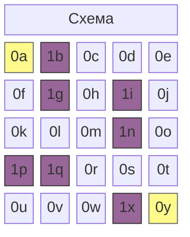
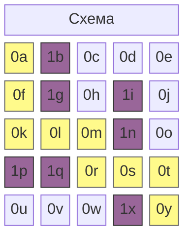

Алгоритм A* — это алгоритм поиска по графу для нахождения кратчайшего пути между двумя заданными точками. Характеристику этого алгоритма можно кратко описать одним уравнением, где $n$ — узел:

$$
f(n) = g(n) + h(n)
$$

## **Открытый список и закрытый список**

Алгоритм A* при нахождении кратчайшего расстояния исследует стоимость достижения смежных узлов. Сначала исследуемые узлы добавляются в открытый список (Open List), а затем, после завершения исследования, перемещаются в закрытый список (Closed List).

```python
open_list = []
closed_set = set()
```

Для реализации этого процесса используются два списка. Для открытого списка используется очередь с приоритетом, а для закрытого списка — структура данных «множество» (Set).

## **$g(n)$: стоимость перемещения на один шаг**

$g(n)$ — это функция, измеряющая стоимость перемещения к узлу-кандидату, добавленному в открытый список. Если карта представляет собой сетку, стоимость перемещения по горизонтали и вертикали равна $1$, а при возможности диагонального перемещения стоимость диагонали можно вычислить как $\sqrt{2} \approx 1.4$. В моём коде учитывается только перемещение по горизонтали и вертикали.

```python
# если узел определён следующим образом
class Node:
    def __init__(self, position, parent=None):
        # ...
        self.g = 0

# можно выразить так
neighbor.g = current_node.g + 1
```

## **$h(n)$: расстояние до цели**

$h(n)$ — это функция, приблизительно оценивающая стоимость перемещения от узла-кандидата из открытого списка до целевого узла. То, что при выборе ресторана мы идём в тот, где больше посетителей, или при покупке зарубежного товара примерно оцениваем курс в 1200–1400 вон, называется эвристикой. Поэтому это значение также называют эвристической оценкой. Известно, что правильное определение этого значения в соответствии с задачей способствует повышению производительности алгоритма. Обычно его получают следующими способами:

- Пример 1: Манхэттенское расстояние $h(n) = |x_1 - x_2| + |y_1 - y_2|$
```python
def heuristic(start_node, end_node):
    return abs(
        end_node[x] - start_node[x]) + abs(end_node[y] - start_node[y]
    )
```
- Пример 2: Евклидово расстояние $h(n) = \sqrt{(x_1 - x_2)^2 + (y_1 - y_2)^2}$
```python
def heuristic(start_node, end_node):
    return math.sqrt(
        (end_node['x'] - start_node['x'])**2 + (end_node['y'] - start_node['y'])**2
    )
```

## **Реализация алгоритма на Python**

```python
import heapq

class Node:
    def __init__(self, position, parent=None):
        self.position = position
        self.parent = parent

        self.g = 0
        self.h = 0
        self.f = 0

    def __lt__(self, other):
        return self.f < other.f

def heuristic(a, b):
    return abs(a[0] - b[0]) + abs(a[1] - b[1])

def astar(grid, start, end):
    open_list = []
    closed_set = set()

    start_node = Node(start)
    end_node = Node(end)

    heapq.heappush(open_list, start_node)

    while open_list:
        current_node = heapq.heappop(open_list)
        closed_set.add(current_node.position)

        if current_node.position == end_node.position:
            path = []
            while current_node:
                path.append(current_node.position)
                current_node = current_node.parent
            return path[::-1]

        x, y = current_node.position
        neighbors = [(x+dx, y+dy) for dx, dy in [(-1,0), (1,0), (0,-1), (0,1)]]

        for next_pos in neighbors:
            nx, ny = next_pos
            if not (0 <= nx < len(grid) and 0 <= ny < len(grid[0])):
                continue
            if grid[nx][ny] != 0:
                continue
            if next_pos in closed_set:
                continue

            neighbor = Node(next_pos, current_node)
            neighbor.g = current_node.g + 1
            neighbor.h = heuristic(next_pos, end)
            neighbor.f = neighbor.g + neighbor.h

            if any(n.position == neighbor.position and n.f <= neighbor.f for n in open_list):
                continue

            heapq.heappush(open_list, neighbor)

    return None
```

## **Пример выполнения алгоритма**

Данный алгоритм считает, что значение узла $0$ — это путь, а $1$ — препятствие. Предположим, например, следующую карту. Выделенные жёлтым 0a и 0y — это начальная и конечная точки соответственно.



```python
grid = [
    [0, 1, 0, 0, 0],
    [0, 1, 0, 1, 0],
    [0, 0, 0, 1, 0],
    [1, 1, 0, 0, 0],
    [0, 0, 0, 1, 0]
]

start = (0, 0)
end = (4, 4)

path = astar(grid, start, end)
```

Если на карте размером $5 \times 5$ задать начальную точку `(0, 0)` и целевую `(4, 4)`, разместив стены в соответствующих местах, кратчайший путь `path` будет выведен следующим образом.



```bash
[(0, 0), (1, 0), (2, 0), (2, 1), (2, 2), (3, 2), (3, 3), (3, 4), (4, 4)]
```
