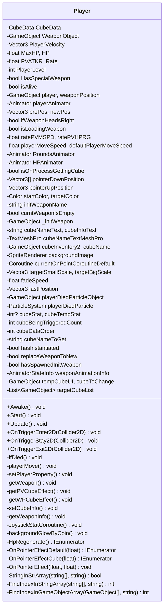

Не знаю, на каком этапе я нахожусь, но, если проводить аналогию с четырьмя стадиями познания, это, пожалуй, уровень осознанной компетентности. Чувства, позволяющего оценить, что такое хороший дизайн, у меня пока нет, но в процессе появляются кое-какие проблески понимания, и некоторые из них кажутся довольно интересными.

## **Кратко об объектно-ориентированном программировании**

Предпосылки возникновения ООП и то, в чём оно преуспело, широко известны. Чтобы преодолеть ограничения традиционной процедурной парадигмы, сохранить абстрактное мышление и естественным образом проектировать сложную бизнес-логику в удобной для человека форме. Однако то, почему эта методология получила такой широкий отклик, обсуждается реже. И в этой связи я нашёл две точки зрения: бизнес и философия.

Первое. Предприниматель или амбициозный человек, берущий на себя ответственность, не любит неопределённости. Одна из причин, по которой северные империи, граничащие с Корейским полуостровом, постоянно вторгались на него, заключалась в том, чтобы обезопасить тыл перед завоеванием континента. Рим объединил Италию до войны с Карфагеном, Германия заключила пакт о ненападении с СССР до вторжения во Францию. Примеры и мотивы схожи. Чем масштабнее предприятие, чем серьёзнее одержимость ответственного лица, тем обязательнее блокировка чёрных лебедей.

Второе. Стремление физика-теоретика к теории великого объединения, предположение лингвиста о существовании универсальной грамматики для всех языков мира, попытка экономиста описать поведение миллионов людей одним графиком спроса и предложения — всё это проистекает из желания обуздать хаос. Почему такие усилия исторически сопутствуют развитию? За этим могут стоять практические причины, такие как снижение когнитивных издержек, но мне ближе точка зрения Альбера Камю. Например: «Человек не выносит неопределённости и двусмысленности и жаждет ясной картины мира».

Конечно, это всего лишь воображение, но интуитивно понимание ООП как человеческой натуры (вроде склонности к управлению рисками) не кажется натяжкой. ООП разделяет традиционный процедурный код, расставляя его по нужным местам, и оставляет больше указателей в структуре и именах. В результате сложность и неопределённость берутся под контроль, даря разработчику чувство стабильности.

## **SRP: Принцип единственной ответственности**

> У объекта должна быть только одна ответственность.

В литературе существует похожий принцип «одно предложение — одна тема» (一文一事). Поэтому сама идея принципа единственной ответственности не кажется незнакомой, но её легко понять превратно. «Избавиться от лишнего ради смысловой ясности» — это главная цель SRP, но не суть. Истинная цель, к которой стремится SRP, — отсечь мелкие смысловые ответвления и тем самым достичь предсказуемости изменений.

Принципы SOLID были созданы в расчёте на живую, дышащую программу. Ситуация будет постоянно меняться, и программа тоже должна постоянно меняться. Здесь нужно отношение, подобное «Искусству войны» Сунь Цзы, — расчёт, направленный на управление рисками и достижение эффективности. Как говорится, «умелый полководец не набирает солдат дважды и не подвозит провиант трижды» (役不再籍, 糧不三載), так и устранение повторяющихся издержек очень важно.

По той же причине существует большая разница в затратах между чётким осознанием цели работы на этапе разработки, минимизацией объёма работы и смелым выполнением без побочных эффектов. В этом контексте чёткость смысловых связей означает предсказуемость последствий действий, а это, в свою очередь, означает возможность рассчитать риски. Вот почему SRP считается стандартом и основой.

## **DIP: Принцип инверсии зависимостей**

> Абстракция не должна зависеть от деталей; детали должны зависеть от абстракции.

Проходя социальную службу в качестве альтернативной военной службы, я наблюдал, насколько далеко может зайти самоконтроль организации, и, что забавно, в этом процессе я постоянно вспоминал принцип DIP. Идея такова: в типичной корпоративной структуре с распределением обязанностей между отделами и сотрудниками, согласно DIP, компания должна зависеть только от социально согласованных концепций и распределения обязанностей, а не от личных качеств или навыков сотрудника, выполняющего эту работу.

Это здравый смысл. Дни компании кажутся застывшими, и кажется, что тот же сотрудник будет выполнять ту же работу на том же месте и завтра. Но в реальности неизбежно происходят замены сотрудников из-за регулярных перестановок, внезапных кадровых изменений, увольнений или, в крайнем случае, из-за ужасного предположения о Bus Factor — смерти ответственного сотрудника. Если организация зависела не только от распределения обязанностей, но и от личных качеств каждого человека, то при отсутствии этого человека по какой-либо причине возникнет неразбериха.

С этой точки зрения, причиной, по которой следует предотвращать делегирование сотруднику задач, выходящих за рамки согласованной категории, является не только то, что это аморальное использование чьей-то доброй воли, но и то, что это угрожает устойчивости организации. Один раз может сойти с рук, но много раз — нет. Если объём работы, требуемый от организации, увеличился, нужно не взваливать нагрузку на отдельных людей, а пересмотреть структуру распределения обязанностей, пусть даже путём корректировки должностных инструкций. В переводе на технический язык это и есть исходный принцип: «Абстракция не должна зависеть от деталей; детали должны зависеть от абстракции».

## **Окостенение**

Бывает, что концепции, предложенные прагматично, со временем становятся нормой, утрачивая смысл и превращаясь в формальность. На самом деле, это не просто «бывает» — большинство известных нам вещей укоренилось именно так, став культурой и традицией. ООП также начиналось как прагматичная методология, но в современных программах обучения оно явно стремится стать своего рода обрядом посвящения.

Поэтому возникают сомнения. В плане производительности существует отличный подход — DOD, а в плане сложности управления состоянием — функциональная парадигма. Конечно, ООП может просуществовать и дольше, но современные тренды — от vibe coding до harness engineering — развиваются в направлении, где человек не смотрит напрямую на код. Под вопрос ставится сама необходимость писать код в виде объектов. Надеюсь, ни одна парадигма не останется жёсткой традицией навечно.

## **Принципы SOLID**

SOLID — аббревиатура, объединяющая пять принципов: единственной ответственности (SRP), открытости/закрытости (OCP), подстановки Лисков (LSP), разделения интерфейса (ISP) и инверсии зависимостей (DIP).

С момента знакомства с SOLID и попыток их применять прошло около двух лет. Концепции уже привычны, но применение по-прежнему даётся непросто. Обобщая, SOLID-философию можно свести к ослаблению связанности между классами, а конкретнее — к двум направленностям.

## **Чёткость классификации**

Принцип единственной ответственности предписывает чётко определять роль класса — это довольно ясно. Понять концепцию нетрудно, но на практике при написании классов возникает вопрос: где пролегает граница единственной ответственности? Сами принципы SOLID как бы побуждают размышлять над такими ситуациями и находить верное решение, но на этот вопрос они умалчивают.

Если учесть, что ключевое понятие ООП — class — происходит от classify («классифицировать»), то объектно-ориентированное проектирование и без отдельного ярлыка «единственной ответственности» требует строгой классификации и упорядочивания. Из личного опыта: в [одной из прошлых игр](https://hyngng.github.io/posts/palette-second-devlog/) я устроил показательный номер, намеренно возложив все обязанности на один-единственный класс `Player.cs`, прикреплённый к объекту игрока. Замысел был прост: «если собрать все связанные функции в одном классе, не придётся разносить код по разным местам», и «хотелось написать максимально длинный код».

Первоначально в одном `Player.cs` было больше 1000 строк, после чистки осталось около 720. Если разобрать, какие обязанности нёс этот единственный класс, получится так:

1. Управление перемещением, анимацией и звуками на основе ввода
2. Отображение HP, восстановление и обработка смерти
3. Смена оружия, спецэффекты под каждое оружие
4. Управление инвентарём на 8 слотов
5. UI (джойстик и прочее)

Выглядит чудовищно. Слишком тяжеловесно и избыточно. Особенно UI джойстика.

