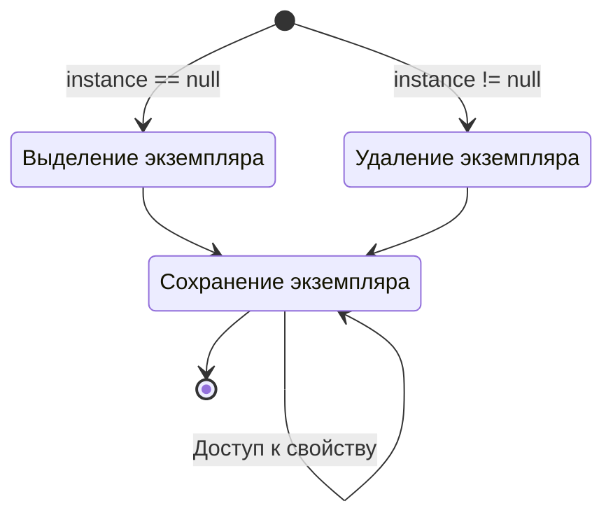

## **Введение**

Разрабатывая игры, я всё больше чувствую, что многие концепции требуют систематизации. Я часто использую Notion и Obsidian, но это не то же самое, что разобраться в чём-то, потратив время.

Тем не менее, изначально я не хотел подробно писать о технических концепциях, опасаясь, что блог станет слишком сухим. Но недавно я узнал, что слово «блог» происходит от Web + Log, и подумал, что статьи с разбором изученного материала — это тоже неплохо. Впредь я планирую по возможности глубоко разбирать то, что стоит запомнить, и понемногу систематизировать это в блоге.

Первый паттерн, который я хочу разобрать, — это Singleton. Singleton — это паттерн проектирования, гарантирующий, что у определённого класса существует только один экземпляр. Его используют благодаря следующим преимуществам:

- Состояние игры может оставаться одинаковым для всех скриптов и сцен.
- Данные (аудио, спрайты, объекты) можно управлять без дублирования.
- Избегается дублирование тяжёлого кода в отдельных классах, что улучшает производительность.

Я решил начать с Singleton, потому что он интуитивно понятен. Многие, кто учится разработке игр, сталкиваются с этим паттерном, когда уже немного освоили написание кода. Концепция проста, и использовать его легко.

## **Визуализация структуры**



## **Базовый код**

```cs
public class Singleton : MonoBehaviour
{
    private static Singleton instance = null;
    public static Singleton Instance
    {
        get
        {
            if (instance == null)
                return null;
                
            return instance;
        }
    }

    void Awake()
    {
        if (instance == null)
        {
            instance = this;

            DontDestroyOnLoad(this.gameObject);
        }
        else
            Destroy(this.gameObject);
    }
}
```

Правила паттерна Singleton можно свести к двум пунктам:

- Гарантирует, что у класса может быть только один экземпляр (Ensures that a class can only instantiate one instance of itself)
- Предоставляет глобальный доступ к этому единственному экземпляру (Gives easy global access to that single instance)

В Unity Singleton реализуется очень просто. Как часть со свойством вверху, так и `Awake()` внизу только гарантируют существование единственного экземпляра. Поскольку экземпляр скрипта объявлен как `static`, к полям и методам скрипта с Singleton можно обращаться из внешних классов по форме `ИмяСкрипта.Instance`.

## **Создание экземпляра**

```cs
public class Singleton : MonoBehaviour
{
    private static Singleton instance = null;
    public static Singleton Instance
    {
        get
        {
            if (instance == null)
            {
                GameObject gameObj = new GameObject();
                instance = gameObj.AddComponent<Singleton>();
                DontDestroyOnLoad(gameObj);
            }
                
            return instance;
        }
    }
}
```

Раньше, если экземпляра Singleton не было, он просто возвращал `null`, и новый экземпляр не создавался. Поэтому при доступе к `Instance` из внешнего скрипта приходилось проверять его наличие, что было неудобно. Если это неудобно, можно изменить свойство, как показано выше, подключив код создания экземпляра.

В этом случае при каждом обращении к свойству экземпляр будет создаваться автоматически, так что внешним скриптам не нужно будет проверять его существование. Доступ к Singleton будет осуществляться просто вызовом `Singleton.Instance`.

## **Создание нескольких**

```cs
public class Singleton<T> : MonoBehaviour where T : MonoBehaviour
{
    private static T instance;
    public static T Instance
    {
        get
        {
            if (instance == null)
                return null;

            return instance;
        }
    }

    private void Awake()
    {
        if (instance == null)
        {
            instance = this as T;
            DontDestroyOnLoad(gameObject);
        }
        else
            Destroy(gameObject);
    }
}
```

```cs
public class GameManager : Singleton<GameManager>
{
    /* код */
}
```

По умолчанию экземпляр скрипта Singleton поддерживается только один, поэтому концептуально невозможно использовать несколько Singleton-экземпляров одновременно. Можно скопировать код, но это неэффективно. Вместо этого, если нужно несколько разных Singleton-экземпляров, можно использовать дженерики в форме `Singleton<T>` и создать несколько разных Singleton-скриптов.

В этом случае другие классы также могут быть легко превращены в Singleton через наследование. Например, если нужно применить Singleton к `GameManager.cs`, его можно использовать, унаследовав `Singleton<T>`, как показано выше.

## **Пример использования**

```cs
public class GameManager : MonoBehaviour
{
    /* объявление Singleton */

    public int Score;

    public void ResetScore()
    {
        Score = 0;
    }
}
```

```cs
public class Player : MonoBehaviour
{
    void AttackEnemy()
    {
        Enemy.TakeDamage();

        if (Enemy.HP <= 0)
        {
            Destroy(Enemy);

            GameManager.Instance.Score += 100;
        }
    }

    void Dead()
    {
        GameManager.Instance.ResetScore();
    }
}
```

То, что экземпляр существует во всех сценах и поддерживается в единственном числе, означает, что он хорошо подходит для использования в `GameManager.cs`. Скрипт, управляющий данными или состоянием игры, обычно должен быть в единственном экземпляре. В связи с этим можно применить паттерн Singleton, как показано выше на примере GameManager.

Смоделирована ситуация, в которой игрок сражается с врагами: при убийстве врага очки повышаются, при смерти игрока очки сбрасываются. В GameManager определены `Score` и `ResetScore()`, а `Player.cs` как внешний класс обращается к `Score` и `ResetScore()` GameManager через Singleton-экземпляр. Когда враг умирает, `Player.cs` напрямую увеличивает очки; когда игрок умирает, очки напрямую сбрасываются.

Поскольку возможен прямой доступ к членам класса извне, такая конфигурация возможна без обременительного создания экземпляра `GameManager`. Используя эту особенность, можно настроить и использовать, например, такие поля и методы для менеджера вроде `GameSystem.cs`:

- Поля
	- `Score`, `CurrentLevel`, `EnemyCount`: для хранения основных состояний игры — уровня, очков, количества оставшихся врагов.
	- `isGamePaused`, `IsMusicEnabled`: для хранения состояния паузы или включения фоновой музыки.
- Методы
	- `StartGame()`, `QuitGame()`: используются при запуске или завершении игры.
	- `PauseGame()`, `ResumeGame()`: используются при приостановке или возобновлении игры.
	- `LoadScene()`, `LoadLevel()`: используются для загрузки конкретной сцены или уровня.

## **Предостережения**

Однако паттерн Singleton — это спорный паттерн проектирования, поскольку его легко использовать чрезмерно. Из-за удобства использования скрипт может взять на себя слишком много ролей или данных, что приведёт к сильной связанности между Singleton-экземпляром и другими классами, а запутанный код затруднит понимание того, какой субъект и в какой момент изменяет экземпляр.

Поэтому перед использованием нужно подумать, нет ли альтернативы. Как и в случае с обычным кодом, долгое и чрезмерное использование Singleton может привести к тому, что исправить его будет трудно. Если использовать Singleton, лучше сделать так, чтобы только небольшое количество скриптов имело доступ к его экземпляру.

Тем не менее, его по-прежнему легко использовать, и благодаря тому, что можно избежать повторного выполнения тяжёлых функций (вроде `GetComponent()` или `Find()`), он вполне заслуживает применения в зависимости от масштаба проекта.
