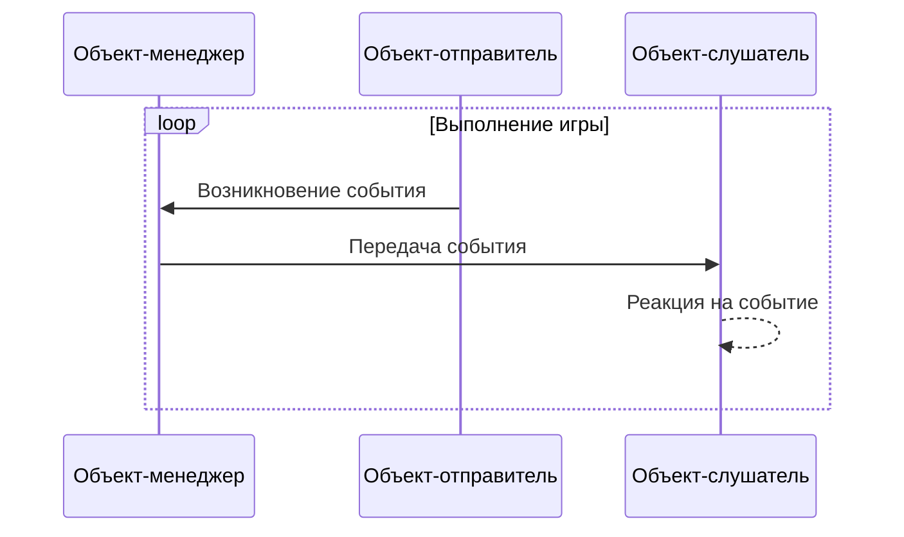

## **Введение**

Событийно-ориентированное программирование (Event Driven Programming) — это парадигма программирования, в которой поток программы определяется событиями. Она управляет возникновением, обработкой и выполнением событий, повышая расширяемость кода, читаемость и поддерживаемость. Этот подход очень помог в [другом процессе разработки игры](https://hyngng.github.io/posts/armonia-first-devlog/), и я решил, что он может быть полезен и в будущем, поэтому оформляю его в виде статьи.

## **Основные концепции**

- Событийно-ориентированное программирование реализуется на основе трёх концепций:
	- Менеджер (Manager): роль — распространение событий на определённые объекты.
	- Слушатель (Listener): роль — реагирование на определённые события.
	- Отправитель (Poster): роль — инициирование определённых событий.

Роль менеджера обычно берёт на себя один скрипт-менеджер (например, `GameObject.cs`), но один объект может выполнять как все роли (слушателя и отправителя), так и только одну из них.

Например, в ситуации, когда слышен звук взрыва и NPC поворачиваются к месту звука, объект, издающий звук взрыва, будет отправителем, а окружающие объекты — слушателями. Однако если объект, издающий звук взрыва, также является NPC, реагирующим на это событие, он может выполнять обе роли — и отправителя, и слушателя.

## **Визуализация структуры**



## **Базовый код**

### **Менеджер событий**

:::info
Код немного длинный!
:::

```cs
public enum EventType
{
    FirstExampleEvent,
    SecondExampleEvent,
    /* ... */
}
```

```cs
public class EventManager : MonoBehaviour
{
    public static EventManager Instance { get { return instance; } }    
    private static EventManager instance = null;

    public delegate void OnEvent(EventType eventType, Component Sender, object Param = null);
    private Dictionary<EventType, List<OnEvent>> Listeners
        = new Dictionary<EventType, List<OnEvent>>();

    void Awake()
    {
        if (instance == null)
        {
            instance = this;
            DontDestroyOnLoad(gameObject);
            return;
        }
        DestroyImmediate(gameObject);
    }

    public void AddListener(EventType eventType, OnEvent Listener)
    {
        List<OnEvent> ListenList = null;

        if (Listeners.TryGetValue(eventType, out ListenList))
        {
            ListenList.Add(Listener);
            return;
        }

        ListenList = new List<OnEvent>();
        ListenList.Add(Listener);
        Listeners.Add(eventType, ListenList);
    }

    public void PostNotification(EventType eventType, Component Sender, object param = null)
    {
        List<OnEvent> ListenList = null;

        if (!Listeners.TryGetValue(eventType, out ListenList))
            return;

        for(int i = 0; i < ListenList.Count; i++)
             ListenList?[i](eventType, Sender, param);
    }

    public void RemoveEvent(EventType eventType) => Listeners.Remove(eventType);

    public void RemoveRedundancies()
    {
        Dictionary<EventType, List<OnEvent>> newListeners
            = new Dictionary<EventType, List<OnEvent>>();

        foreach(KeyValuePair<EventType, List<OnEvent>> Item in Listeners)
        {
            for (int i = Item.Value.Count - 1; i >= 0; i--)
                if(Item.Value[i].Equals(null))
                    Item.Value.RemoveAt(i);

            if (Item.Value.Count > 0)
                newListeners.Add(Item.Key, Item.Value);
        }

        Listeners = newListeners;
    }

    public void RemoveListener(Event eventType, OnEvent listener)
    {
        List<OnEvent> listenList = null;

        if (Listeners.TryGetValue(eventType, out listenList))
            listenList.Remove(listener);
    }

    void OnLevelWasLoaded()
    {
        RemoveRedundancies();
    }
}
```

Это реализация с помощью делегатов. Чтобы объекты-слушатели также могли использовать некоторые методы, применяется [паттерн Singleton](https://hyngng.github.io/posts/singleton-pattern/), а события определяются с помощью `enum`. Код состоит почти из 80 строк, но разбит на 5 отдельных методов, поэтому не сложен.

- Делегат и поле
	- `OnEvent()`: Делегат для регистрации методов реакции на события в слушателе.
	- `Listeners`: Словарь, где ключ — событие, а значение — `List<OnEvent>`. Связывает определённое событие с реакцией на него.
- Методы
	- `AddListener()`: Регистрирует реакцию определённого объекта на событие в виде метода.
	- `PostNotification()`: Метод, используемый объектом-отправителем для инициирования события.
	- `RemoveEvent()`: Метод для удаления определённого события из словаря `Listeners`.
	- `RemoveRedundancies()`: Своего рода проверка целостности. Если для определённого события нечего выполнять, удаляет это событие.
	- `RemoveListener()`: Удаляет объект из словаря `Listeners` при его уничтожении, чтобы предотвратить ошибку `NullReferenceException`.

### **Слушатель событий**

```cs
public class ListenerObject : MonoBehaviour
{
    void Start()
    {
        EventManager.Instance.AddListener(Event.ObjectAccessed, OnEvent);
    }

    public void OnEvent(EventType EventType, Component Sender, object Param = null)
    {
        switch (EventType)
        {
            case EventType.FirstExampleEvent:
                /* Место для кода реакции на событие */
                break;
        }
    }

    void OnDestroy()
    {
        EventManager.Instance.RemoveListener(Event.ObjectAccessed, OnEvent);
    }
}
```

Когда игра запускается или создаётся объект, слушатель добавляется с помощью `EventManager.AddListener()`, чтобы он мог обнаруживать нужные события. При уничтожении объекта зарегистрированный метод удаляется с помощью `EventManager.RemoveListener()` для предотвращения мелких ошибок или ненужных вызовов событий.

Метод `OnEvent()` вызывается при возникновении события. Он принимает тип события, объект, инициировавший событие, и дополнительные параметры. С помощью `switch` можно обрабатывать разную логику в зависимости от типа события. В данном примере настроено так, чтобы для события `FirstExampleEvent` можно было написать определённую логику.

## **Пример использования**


Пример из [разрабатываемой игры](https://hyngng.github.io/posts/armonia-first-devlog/). При выборе определённого объекта некоторые интерактивные объекты подсвечиваются жёлтым, а при отмене выбора возвращаются к исходному состоянию. Реализовано с помощью событийно-ориентированного программирования.
