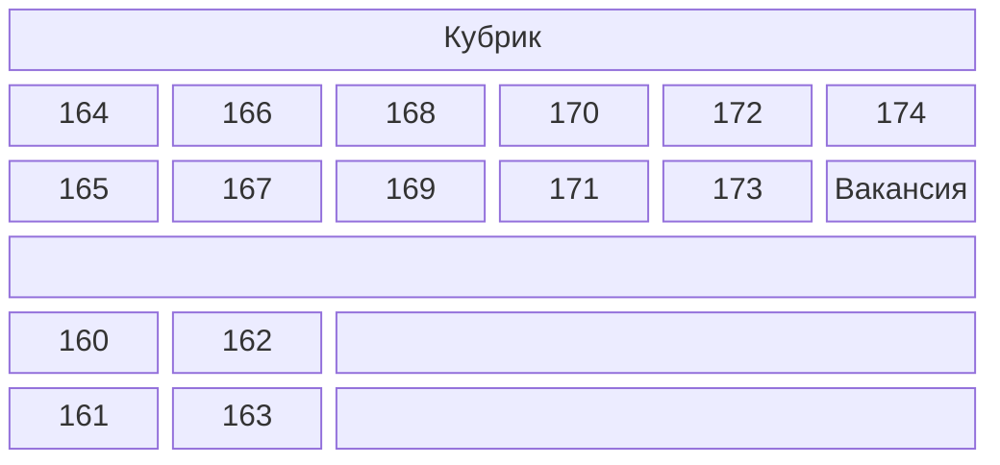

Чувствую себя странно. Время, тянувшееся так медленно, вдруг пролетело — и вот я вышел из Ёнмугвана и пишу этот текст дома.

Я был первым призывом сразу после взрыва гранаты 21 мая 2024 года и гибели стажера от жестокого обращения комроты 23 мая 2024 года; плюс я был из службы замещения (по-корейски «по-бо-ён-ёк»), поэтому в учебном центре к нам относились заметно лояльнее. Не то чтобы обучение само по себе было лёгким, но одни и те же занятия по возможности проводили в прохладных местах, а строгость воинской дисциплины смягчали.

Сама программа для замещающего состава была послабленнее, чем для действующих военнослужащих. В отличие от срочников, чьё распределение зависит от результатов в учебке, мы уже знали, куда попадём после выпуска — поэтому, возможно, и атмосфера была другой. Конечно, не все были такими, но в моём кубрике нашёлся один необычный сверстник, который пришёл в учебку ради интереса — он слышал, что здесь весело, а ему предстоял долгий период ожидания перед переводом в гражданский персонал военного времени.

Я взял с собой в учебный центр блокнот и пенал и каждый день вёл дневник. Всего набралось 14 страниц, а после выпуска я дома переработал записи в формат блога.

## **Предварительная подготовка**

Я взял с собой несколько вещей. Оглядываясь назад, можно сказать, что и без всего этого вполне можно было обойтись, но кое-что всё же пригодилось. Вот список того, что я брал:

|Предмет|Зачем взял|Действительно ли пригодилось|
|---|---|---|
|Casio F-91W-1, наручные часы|Для отслеживания времени|Пригождаются везде. Отличная вещь|
|Две пары стелек из Daiso|Чтобы вставить в армейские ботинки|В ботинках было реально удобно|
|Две пары берушей 3M|Запасные|Несравнимо лучше казённых берушей|
|Блокнот и пенал|Для ведения дневника и рисования|Пару раз пользовался, но в итоге — лишний груз|
|Шампунь и гель для душа|Запасные|Хорошо, но лучше взять «всё в одном»|
|2 книги|Чтобы скоротать скуку|Только немного почитал в дозоре, в итоге — лишний груз|
|1 рулон туалетной бумаги|Запасной|Казённую бумагу так и не израсходовал|
|Футляр для зубной щётки|Знакомый настоял взять обязательно|Выдали казённый, так что не пригодился|

Судя по соседям по кубрику, большинство брали с собой лишь шампунь и гель для душа; некоторые приносили растворимые напитки вроде Cappuccino Mix или Pocari Sweat и делились; особенно среди специалистов-исследователей были те, кто прихватил научные статьи или книги. Я тоже, наслышанный о скуке в учебке, взял две книги.

Из того, что стоило бы взять лично мне, — маска для сна. Красный ночной свет дежурного освещения достаточно яркий, чтобы мешать спать чувствительным людям.

## **Распорядок дня в учебном центре**

Прежде чем перейти к дневнику, я сначала описал общую для всех дней часть. Распорядок дня в учебном центре выглядит следующим образом:

```mermaid
gantt
    title Повседневный распорядок
    dateFormat HH:mm
    axisFormat %H:%M

    section Утренняя поверка
    Сон: 00:00, 06:30
    Подъём и умывание: 06:30, 07:00
    Утренняя поверка и завтрак: 07:00, 09:00

    section Утренние занятия
    Утренние занятия и тренировки: 09:00, 12:00
    Обед: 12:00, 13:00

    section Дневные занятия
    Дневные занятия и тренировки: 13:00, 17:30
    Ужин: 17:30, 18:30
    Душ и личное время: 18:30, 20:30

    section Вечерняя поверка
    Уборка и ожидание поверки: 20:30, 21:30
    Вечерняя поверка: 21:30, 22:00
    Отбой: 22:00, 2h
```

Обычный распорядок — такой, но по правилам учебного центра с июня призывников считают «жаркой» сменой и вводят особый летний распорядок. Этот вариант выглядит так:

```mermaid
gantt
    title Летний распорядок (жаркая смена)
    dateFormat HH:mm
    axisFormat %H:%M

    section До дневного сна
    Сон: 00:00, 03:00
    Подъём и умывание: 03:00, 03:30
    Занятия и тренировки: 03:30, 07:00
    Завтрак: 07:00, 08:00
    Занятия и тренировки: 08:00, 12:00
    Обед: 12:00, 13:00
    Личное время: 13:00, 14:00
    Дневной сон: 14:00, 16:00
    Занятия: 16:00, 17:30
    Ужин: 17:30, 18:30
    Душ и личное время: 18:30, 19:30

    section Вечерняя поверка
    Уборка и ожидание поверки: 19:30, 20:30
    Вечерняя поверка: 20:30, 21:00
    Отбой: 21:00, 3h
```

Особенность летнего распорядка — отбой в 21:00, подъём в 3:00 утра. Он вводится ещё до конца первой недели, довольно тяжёл, но приходится подстраиваться.

## **Архив**

- 26-й полк, 24-24-й призыв (зачисление 13 июня, выпуск 4 июля)

## **Дневник учебного центра**

### **1-я неделя**

#### **День 1**

День первого зачисления. Церемония прошла быстро в приёмном зале учебного центра — пропели гимн, коротко отдали честь, и всё.

Ходят слухи, что инструкторы тут же превращаются в демонов, как только уходят родители, но на деле всё началось спокойно, с административных процедур. После ухода родителей нас переместили ближе к тому месту, где они сидели, и провели разные проверки и анкетирования: сверяли личности по картам и удостоверениям, заполняли 4–5 опросников о психическом здоровье — депрессия, суицидальные мысли и тому подобное.

Пока мы заполняли анкеты, приёмные процедуры продолжались. Выдали 500-мл бутылку ледяной воды и жетон с номером, замерили голову для берета — инструкторы по очереди обмеряли сантиметровой лентой. Параллельно устанавливали знаменитое приложение «Defense Mobile Security». В этой суматохе решили вопрос с теми, кому срочно нужно в туалет, и когда все процедуры завершились, мы потащили свои чемоданы к назначенному полку. Расстояние по прямой небольшое, но путь петляет через приёмный батальон и Ёнмугван, так что идти довольно далеко. Незнакомая обстановка, неловкое молчание, только стук колёсиков чемоданов — всё это создавало напряжённую атмосферу.

Добравшись до полка и учебного батальона, сдули пыль компрессором и заселились в свои кубрики. Сразу же натянули чехлы на матрасы — материал очень грубый и тугой, так что у всех, без исключения, средние и безымянные пальцы на второй фаланге стёрлись до крови. Через какое-то время пошли в лекционный зал своей роты получать два комплекта повседневной формы — куртку и штаны — по размеру. Переодевшись, сложили чемоданы, как тетрис, на вакантные места у каждого кубрика.

В первый день никаких особых тренировок и занятий не было — вместо этого заполнили ещё несколько почти таких же опросников по психическому здоровью, как и в приёмной. Проверили спрятанные под кроватью корзины с базовыми принадлежностями: зубная паста, щётка, мыло, полотенца. Поужинали, сходили в внешнюю баню, и день закончился в совершенно незнакомом ощущении.

Давно не было такого пустого и неловкого дня. Молчание среди чужих друг другу людей, я не знал, можно ли достать свои вещи — книги, блокнот, пенал, — так и лежал, бессмысленно поглядывая на часы, пока не уснул.

#### **День 2**

Первый подъём в учебном центре и день обучения строевой подготовке.

В 6:30 под знаменитую побудку прошла первая утренняя поверка. Спросонья умылись, взяли учебник новобранца и выстроились в три шеренги на дороге возле учебного здания — по кубрикам. Если с численностью всё в порядке, шли на плац, где рота проверяла количество и состояние здоровья, затем начиналась поверка.

Помню, на первой поверке было прохладно, и меня поразило, какие громкие и энергичные голоса у комвзвода и комроты. Зычным голосом команды передавались от командира отделения к комвзвода, затем к комроты и комбату — это было впервые вживую, и атмосфера была именно той «армией», о которой только слышал. В тот момент я по-настоящему осознал, что я в армии.

После поверки и завтрака прошли базовую строевую подготовку в кубрике. Обычно её проводят на плацу или на улице, но нашу июньскую смену объявили «жаркой», и занятия проводились в помещении. Нас учили основным командам: «смирно», «вольно», «налево», «направо», «кругом» и так далее. Оценка проводилась по 4 человека от кубрика, и она была не особенно строгой — если понимание было, ставили зачёт.

В этот день также выбрали командира отделения и его заместителя. Заместитель — чисто формальная роль без особого веса, а вот командир отделения потом мотается по разным поручениям и хлебнёт горя. Я ожидал борьбы за эту должность, но в моём кубрике нашёлся доброволец, заявивший, что «если стать командиром отделения, можно получить плюшки вроде вкусняшек или перекуров», так что решили без проблем.

После обеда пошли в оружейную комнату соседнего учебного корпуса получать оружие — каждому по его номеру. Это был момент, когда я впервые увидел знаменитую винтовку K2 вживую. Слышал, что боевое оружие тяжёлое — и оно оказалось именно таким, как я ожидал. На цевье и прикладе было множество царапин и вмятин. Полученное оружие мы носили с собой на тренировках, а в остальное время хранили в оружейном сейфе кубрика до дня перед выпуском.

Точно не помню, когда именно, но один из моих соседей по кубрику получил двухдневный отпуск по семейным обстоятельствам. У него была семья и дети, так что, видимо, дело было связано с ребёнком.

В этот день на перекус выдали печенье ABC Quean Choco, пицца-чипсы и баночный кофе Starbucks.

#### **День 3**

День обучения строевым приёмам в составе подразделения и с оружием.

Впервые заступил в дозор (ночной дежурный). Проснувшись, принял от уже бодрствующего сменщика информацию о дневном пароле (в тот день — «нейлоновая эссенция») и прочие особенности, затем в назначенное время проснулся и час «бодрствовал» — буквально тупил в стену.  
Через полчаса измерил температуру и влажность в зоне своего кубрика, пошёл доложить дежурному солдату, записывающему показания. Через 45 минут разбудил следующего, дождался его выхода, передал дежурство и лёг спать. Но в моём кубрике был очень громкий храпун, так что остаток ночи я почти не спал.

Суббота — день без тренировок, за исключением первой субботы, когда занятия всё же проводятся. К утренней поверке добавился бег, но в этот день он был упрощённым — мы просто прошли пешком трассу будущего теста на 1,5 км.

День прошёл так: до обеда — строевые приёмы в составе подразделения, после обеда — с оружием. Строевые приёмы отрабатывали в Ёнмугване: учились строиться в шеренги и колонны с разными интервалами, затем по отделениям сдавали зачёт командиру и возвращались в кубрик. С оружием — снова Ёнмугван: учили основные приёмы вроде «на плечо», «к ноге», «на караул», после чего сразу прошла церемония вручения оружия. Церемония была короткой — весь личный состав выстроился ровными рядами, пару раз взял «на караул» в сторону комроты, и всё.

В этот день мы начали подробнее рассказывать друг другу, кто откуда и чем занимался, так что атмосфера начала согреваться. Заодно наладилось общение между стажерами и инструкторами из действующих военнослужащих.

Точное время не помню, но в этот день выдали боевую форму (так называемую «хунтубок») и ботинки.

На перекус в этот день была банка колы.

:::info
Эпизод дня
- 29-летнего стажера-специалиста из моего кубрика вызвали к дежурному столу произнести завершающую фразу вроде «И сегодня все молодцы», и с этого дня его прозвали «радистом».
- В личное время один из соседей, которому было нечего делать, играл на столе в мини-бильярд крышками от бутылок (игра «аль-каль-ги»).
:::

#### **День 4**

Первый полноценный выходной в статусе стажера. Выходной — это не значит, что дел совсем нет: надо было вынести матрасы на солнце и получить фляги, которые, по словам инструкторов, они сами простерилизовали паром.

В этот день впервые сняли ограничение на телефоны — на час, с половины третьего до половины четвёртого. Учитывая обстановку призыва, дежурный объявил по громкой связи: «Раз уж такая ситуация, обязательно позвоните родителям». Я позвонил на 30 минут, а остаток времени смотрел накопившиеся вебтуны. Другие в основном убивали время YouTube и Instagram, а те, у кого есть дети, особенно — хвастались друг перед другом их фотографиями.

После окончания телефонного времени была разгадка заданий в учебнике новобранца — заполнение пропусков. Задания не сложные, но объём большой, и нужно перелистывать всю книгу. В моём кубрике мы поделили части: специалисты-исследователи взяли на себя больше, а когда всё заполнили, дали книгу друг другу.  
Инструкторы подгоняли: «быстрее заполните — дадим телевизор», но из-за объёма и времени на переписывание на деле мы лишь мельком увидели клип Aespa.

Стажёр, уходивший в отпуск два дня назад, вернулся. Вроде мелочь, но все ему обрадовались.

В этот день тоже выдали перекус, но конкретных записей я не оставил.

:::info
Эпизод дня
- При проверке базового учебника другие стажёры показали инструктору мой почерк, сказав, что он хороший, и я получил похвалу: «О, почерк классный~». С этого дня в кубрике меня называли «писцом».
- Был опрос желающих сделать прививки от столбняка и т.д. В моём кубрике аспирант-фармацевт сказал, что прививки — это хорошо во всех смыслах, и все быстро согласились: «Ну ладно, тогда давайте все пойдём».  
- Смешные цитаты соседей, которые запомнились: «Если будете ещё больше напрягать — я всю колу украду», «Дайте две колы — покажу решённые задачи», «Говорили, что в армии будет запор, а у меня, наоборот, понос».
:::

#### **День 5**

День медосмотра и подготовки к тренировкам.

Перед утренней поверкой я вставил в ботинки стельки из Daiso — и был поражён, насколько мягче и удобнее стала посадка. Особенно это облегчило нагрузку на ноги и стопы не только при беге на поверке, но и при марш-бросках на дальние полигоны.

После бега выдали порошковый регидрант «Re:high Mix». Все с любопытством сразу же попробовали, но единодушное мнение всего кубрика — невкусно. По заявлению — гранатовый, но на деле — некий неопределённый привкус. С тех пор до самого выпуска его никто ни разу не пил.

Далее, после завтрака, были анализ мочи и проба на туберкулёз. Процедура простая, но из-за большого количества людей пришлось ждать почти всё утро. Проверка проходила так же, как в школе — по коридору учебного корпуса между туалетом и автобусом для флюорографии.  
После обеда пошли в здание за территорией учебки — ставить прививки от менингококка и столбняка. Вернувшись, до ужина разгадывали задачи по гранатам и первой помощи в учебнике.

После ужина каждому кубрику выдали кожаные жетоны с номером (в учебке их называли «леза») для крепления к куртке и армейской фуражке, а также швейные принадлежности. На жетонах были указаны полк, рота и номер — мне выдали жетон для куртки «26-1-XXX» и для фуражки «01-XXX». Шить никто толком не умел — по инструкции нужно было прошить крест-накрест в шести точках по контуру, но все просто прихватывали прямой строчкой.

Лично я с этого дня заметно расслабился после первого напряжения, освоился — строевая и приветствия стали естественными.

На перекус — 빈츠 (Binch) и Monster Zero (White).

:::info
Эпизод дня
- По пути на обед бывший командир отделения попался инструктору и отрабатывал строевую. «Стажёры, строевая — это шутка? Развлекаться пришли? Будем делать, пока не научитесь. На месте шагом — арш! Раз! Два! Три! Четыре!..» Смешнее всего было, когда стажёр робко признался: «Я туповат», а инструктор ослышался: «Я взбешён», и ситуация чуть не стала ещё хуже.
- Один сослуживец после вечерней поверки серьёзно жаловался инструктору, что хочет домой. У него была роль командира отделения, и, вопреки слухам, никаких бонусов не было, да и происшествие в обед его разозлило. Инструктор выслушал и сказал: «Пока отпустить не могу, сначала выспись и подумай».
:::

#### **День 6**

День идеологического обучения «противнику».

У меня был дозор в 3 часа ночи. Храп мешал, после дозора уснуть не мог — практически не спал, и даже Monster Zero, выпитый накануне, не помог. Весь день был вымотанным. Утренняя поверка прошла необычно: кажется, из-за низких баллов по системе штрафов и поощрений наш кубрик отделили и отправили собирать мусор вокруг учебного корпуса, вместо бега.

После завтрака, в тренировочной форме, весь день — и утро, и вечер — мы смотрели в помещении видеоурок об «основном противнике». Тон был примерно такой: «Наш главный враг — Северная Корея». После урока написали эссе на тему «Почему Корея дорога и с каким настроем я буду защищать Родину». Затем снова была разгадка заданий в учебнике новобранца.

Инструктор зашёл в кубрик и опросил всех, у кого есть сколиоз, отклонения в анализе мочи или другие проблемы со здоровьем, — хотят ли они поехать домой, а также собрал заявки на никотиновые пластыри. Попутно он поделился несколькими историями об атмосфере в учебке.

- «Химзащита… трудно описать, но примерно как есть васаби, макая в уголь.»
- «Осколочную гранату сейчас из-за недавнего происшествия даже срочники не бросают — и вы только учебную кинете. Я бросал настоящую с холма — и, не вру, земля гудела так, что мурашки по коже.»
- «Марш-бросок: 5 км, отдых, ещё 5 км, отдых. Когда я был стажёром, один парень весом 48 кг спросил, нормально ли нести половину своего веса. И он нормально дошёл. А я после марша три дня ходил вразвалку.»
- «Ваша предыдущая смена из-за ковида первую неделю сидела на карантине, а раньше бывало, что все три недели через Zoom проводили.»

На перекус — 쿠크다스 (Kukdas) и банка «2%». Точное время не помню, но в этот день также выдали схему разборки оружия, и из-за летнего распорядка снова отбой в 9 вечера.

:::info
Эпизод дня
- Стажёр, хотевший домой вчера, выспался и успокоился.
- За то, что после вчерашнего случая со строевой мы подтянулись, начислили поощрительные баллы.
- В личное время написал письмо за другого стажёра.
:::

#### **День 7**

День физтеста и обучения разборке оружия.

С этого дня начался летний распорядок — подъём в 3 утра. В плане были физтест и разборка оружия. По летнему распорядку мы ждали в спортивной форме; после упрощённой поверки — сначала бег на 1,5 км на время, затем короткий отдых и отжимания с прессом за учебным корпусом.  
По каждому виду есть норматив; если хотя бы один не сдан — ждёт дополнительная тренировка. У меня пресс — 59 раз, отжимания — 30 раз, норматив выполнен, но бег — 134-е место, недобор (хотя оценивают по времени, не по месту), так что попал на доп.

При летнем распорядке после утренних занятий наступает завтрак. После еды построились буквой «ㄷ» перед столовой и прошли обучение разборке оружия — от газового регулятора до затвора. В перерыве комвзвода рассказал несколько армейских баек:

- «K2 — хорошая винтовка, но центр тяжести смещён, и ощущается тяжелее. У M4 американцев центр тяжести сбалансирован относительно магазина, а у K2 сторона с радиатором гораздо тяжелее. Наказание у нас было — держать K2 за шейку приклада одной рукой, горизонтально, 40 секунд.»
- «У меня самого скоро увольнение по состоянию — из-за того, что чужая боль стала моей работой. Я выпустил дивизию стажёров, и среди них были те, кто на отбое проколол себе четыре пальца иглой, или стажёр, покончивший с собой. Мне это не нравится.»
- «Держать оружие можно как удобно. В армии учат единой стойке для всех, но в наставлениях сказано, что стрелок может принять удобную позицию — и я с этим согласен.»

После обеда и душа — дневной сон с 14:00 до 16:00. После пробуждения — просмотр видеоурока по индивидуальному оружию в классе. Затем недолго ждали в кубрике и получили новую форму, так называемую «A-класс».

Перекус — Pringles Sour Onion и Pocari Sweat.

:::info
Эпизод дня
- Самый младший в кубрике проиграл в «камень-ножницы-бумага» и выполнял хозяйственные работы: пересчитывал и упаковывал пищевые лотки и приборы для стрельб соседней роты на следующий день.
:::

### **2-я неделя**

#### **День 8**

Обучение разборке оружия, стрелковым стойкам и проверке безопасности оружия.

После поверки в полной боевой выкладке пошли на ближайший полигон. Разборка оружия: весь кубрик должен уложиться в норматив — от газового регулятора до ударника разобрать и собрать в обратном порядке. Затем сдать инструктору. Со стрелковыми стойками аналогично: учили три позиции — стоя, с колена, лёжа, — отрабатывали и сдавали.

Лично у меня в этот день было несколько неудобств. Полная выкладка оказалась довольно тугой, дышать было тяжеловато. Ещё я спешил с разборкой и при разделении верхней и нижней частей ствольной коробки защемил указательный палец правой руки — лопнул сосуд. И в стойке стоя винтовка K2 оказалась довольно тяжёлой, так что на проверке было трудно удерживать.

Вернувшись в кубрик, заполнили анкеты — об образе желаемого военнослужащего, удовлетворённости столовой, частоте дефекации. После ужина объявили назначения по отделениям и номерам на завтрашнюю стрельбу. Инструктор особо подчеркнул, что это нельзя забывать — некоторые соседи записали ручкой на руке. У меня было 5-е отделение, 3-й номер.

Точную последовательность не помню, но в этот день выдали беруши для завтрашней стрельбы. Они были тонкие, жёсткие и рваные — не использовал.

Перекус — клубничные вафли.

:::info
Эпизод дня
- Стажёр, хотевший домой, доложился комвзвода. Тот урезонил: «Глупый, если хочешь — вали быстрее. Сначала постреляешь — потом уйдёшь? И гранату кинешь — и уйдёшь? А так уже и 2-я, и 3-я неделя пройдут.»
- Из соседнего 10-го кубрика дошёл слух, что там устроили «дедовщину» с угрозами: «Если ещё раз получим от инструктора — тебе конец», и их поймали.
- Поцарапанный палец, который я содрал при натягивании чехла в первый день, почти зажил.
- За постоянные замечания по строевой по пути в столовую в итоге получили штраф.
:::

#### **День 9**

Первый день стрельб.

В полной выкладке — в левом кармане рюкзака схема разборки оружия, в правом — 500 мл воды, внутри — бронешлем, — двинулись на стрельбище для пристрелки. Запомнился проезд Hi-Pass и пешеходный мост над ним в утреннем воздухе. Когда переходили его впервые, все, глядя вниз на гражданские машины, думали об одном — кто-то даже вскрикнул: «Ооо, прямо спрыгнуть хочется». Позже я узнал, что официальное название этого моста — Сорёнский мост, а в народе его называют «Мостом стонов».

Путь проходит между деревнями и частными домами рядом с центром Нонсан. Нам говорили, что до стрельбища 3 км — похоже на правду, довольно далеко. Прибыв, прошли пристрелку в таком порядке:

1. Ждали, пока первое отделение закончит стрельбу — выдали армейские беруши, провели инструктаж.
2. Когда подошла очередь, в берушах прошли проверку безопасности и вошли на стрельбище по очереди.
3. Внутри ждали своей очереди, наблюдая за действиями передних. Когда подходила очередь, громко повторяли и выполняли команды контрольной вышки.
4. Стрельба шла по командам вышки и под руководством отобранных стажёров-помощников: (отвод затвора назад — получение магазина — присоединение магазина — переводчик на одиночный — открытие огня — один, два, три, конец стрельбы — переводчик на предохранитель). Позиция — только лёжа.
5. По окончании одного цикла: (отложить оружие, встать на колено — проверка мишени — регулировка клика). Процесс повторяется трижды.
6. Стрельба завершена; выйти с мишенью, провести проверку безопасности: (отвод затвора — осмотр патронника — досылание затвора — спуск — 3 раза отвод-досылание — спуск).
7. С мишенью — на оценку. Если из трёх выстрелов хотя бы два попадают внутрь круга — зачёт, иначе — перестрел.
8. Сначала завтрак. Те, кто сдал — чистят оружие, не сдавшие — повторяют до зачёта.

Звук выстрела — как взрыв. Тело вздрагивает каждый раз. Пока ждёшь своей очереди, пугаешься чужих выстрелов. Но удивительно: когда стрелял сам, звук был глухим — «тук, тук, тук» — не таким громким. Может, из-за берушей — стрельба прошла без звона в ушах. Вот что стоит отметить:

- Отдача — как будто кто-то тихо толкнул плечо три раза.
- Дульной вспышки не было заметно ни у других, ни у себя — не так, как в играх или фильмах.
- Удивительно, но гильзоулавливателя не было.

Хотя всего 25 метров, я стрелял неплохо. Когда после первой серии пошёл проверить мишень — пулевые отверстия собрались кучно. Я удивился. Инструктор сказал: «Ого~... стажёр хорошо стреляет? Клик — правый 3, вниз 7. Стажёр и так хорошо стреляет, так что следи только за дыханием». А помощник-инструктор добавил: «Обычно он так не говорит — видимо, вы действительно хорошо выстрелили». Вроде мелочь, но в тот день я чувствовал гордость и было приятно.

Благодаря этому я сдал стрельбу с первой попытки: 2 из 3 в круге. Соотношение сдавших с первого раза — около 1/3; некоторые сдавали со 2-го, 3-го, 4-го раза — один стажёр сделал около 36 выстрелов. Процесс долгий, так что мы с теми, кто тоже сдал, ждали завершения тренировки остальных, болтая о том и сём. После 4-го раза из-за нехватки времени перестрелы прекратили и вернулись в расположение — тех, кто не сдал, отправили на дополнительное обучение.

На обратном пути в кубрик нам сказали подготовить лёд для охлаждения — положить по 3–4 куска в многофункциональный шлем, но я не знаю, официальный это термин или нет — в учебке это называли «оазисом». Пока шли, лёд таял, вода стекала по шнурам и капала на затылок. К тому времени, как мокрая одежда и выкладка почти высохли на солнце, мы переходили мост и получали свежий лёд. К тому времени, как этот лёд таял, мы доходили до учебного корпуса. Вернувшись, собрались на плацу, выслушали от комвзвода: «Общий вес выкладки с оружием сегодня — 5,8 кг. Кому было тяжело — молодцы», и разошлись по кубрикам.

Перекус — вяленая колбаса вроде джерки, «Nuneul Gamja» (картофельные снеки) и банка Milkis 250 мл.

:::info
Эпизод дня
- Вечером, выбрасывая мусор, я неудачно открыл коробку и слегка отодрал ноготь на большом пальце правой руки.
:::

#### **День 10**

День начался с дозора в 1 час ночи — долгожданный выходной.

В этот день шёл дождь, поэтому каждый раз, идя есть, мы надевали плащ-палатки. Плащ-палатки вешали сушиться на вешалки в лекционном зале — они все перемешивались, так что каждый раз мы брали чью-то чужую.

В 2 часа дня впервые сходили в PX. PX напоминал обычный сельский магазин: взяли корзинку и делали покупки в течение определённого времени. Я купил два набора косметики Dokdo и две футболки Loca Ti — потратил около 50 000 вон; другие покупали на 140 000–150 000, а один сосед — на 600 000 вон на подарки. Особой популярностью пользовались напитки вроде 맥콜 (Maekgol) и баночный кофе, а также снеки, которые не выдавали на перекус; косметика и Loca Ti тоже были в ходу.

Вернувшись, снова выдали телефоны — с 15:00 на час. Первые 30 минут я звонил родителям, остальные — отмечался у знакомых и смотрел накопившиеся вебтуны; за час в них особо не вчитаешься. Другие примерно так же проводили время: звонки, YouTube, Instagram.

Затем разрешили смотреть телевизор. Телевизор был один, а людей много — пока обсуждали, что смотреть, один сосед сказал: «В дождливый день самое то — "Олдбой"». Идею поддержали, и мы действительно посмотрели «Олдбоя».

Точная последовательность не запомнилась, но был опрос желающих сдать кровь и участвовать в религиозных мероприятиях.

#### **День 11**

Выходной, но с назначением в моечную команду.

Те, кто в моечной команде, участвуют только в докладе численности на утренней поверке, после чего отделяются и готовятся к мытью. Отвечают за мытьё посуды и уборку после раздачи. Конкретные позиции: тарелки, миски для супа, универсальные, баки для остатков, мусор. В нашем кубрике позиции определили жеребьёвкой. Роли были такие:

|Название|Роль|
|---|---|
|Тарелки|Моют подносы|
|Миски для супа|Моют миски для супа|
|Универсальный|Помощник без конкретной роли; подключается, где возникают узкие места|
|Баки|Самое тяжёлое; опорожняют баки с пищевыми отходами|
|Мусор|Самое лёгкое; стоит с мешком и собирает мусор (пакеты из-под хлеба, йогурты)|

После мытья — тяжёлая уборка, каждый раз форма пропахнет отходами. Моечная команда — если попал, считай, весь день только моешь. Особенно важна комбинация с проверяющим унтер-офицером: один раз попались строгому инструктору — он заставлял перемывать 2–3 раза, если находил хоть одно зёрнышко, даже при тщательной чистке.

После последнего мытья пошли в лекционный зал — смотреть видеоурок по химзащите, который пропустили из-за мытья. Из колонок не шёл звук, так что смотрели без звука.

Помню, что в этот день душ был особенно приятным.

:::info
Эпизод дня
- После мойки инструктор всучил нам недоеденное мороженое, выданное на завтрак. Думали, что с ним делать. Один сосед спросил у инструкторов, можно ли положить в чёрную морозилку, чтобы сохранить. Те спросили, кто дал, описали внешность и звание — и трое инструкторов хором сказали: «А, эта больная сука». Мороженое через них утилизировали.
- Инструктор из другой роты иногда выливал остатки супа в раковину, где мыли столовые приборы и кружки. Один из наших хотел пойти разбираться, но его отговорили.
- Перед выходом на обеденное мытьё забыли убрать коврик в кубрике — получили штраф. Весь день пахали, а тут такой облом — настроение упало.
:::

#### **День 12**

Знаменитая тренировка по химической защите.

До полигона химзащиты — около 4 км от учебки. Пешком в гражданской одежде, может, и нормально, но в полной боевой с оружием, в колонне по двое — тяжело. Накануне предупредили об этом и набрали добровольцев на замедленный темп — я вызвался, но особо не помогло.

Обучение состояло из инструктажа по защите от ядерного удара и правильного надевания противогаза, тренировки и зачёта. Цель — надеть противогаз за 9 секунд; это нереально, так что проверяли только понимание.

Ощущения в противогазе: обзор немного ограничен, дышать стало заметно тяжелее. Для людей с плохими лёгкими — проблема. Чуть не случился инцидент: один стажёр, надев противогаз, не мог дышать и снять его самостоятельно — окружающие срочно срывали с него противогаз, а комроты, проводивший тренировку, вывел его из состава.

После обучения надеванию — позавтракали в помещении с кондиционером, затем вошли в газовую камеру. Ощущения: как тёмный сарай, полный дыма от москитной спирали. Команды снять противогаз не было, и у меня с ним всё было нормально, так что газ не вдыхал. Внутри только снимали и надевали фильтр.

Хотя непосредственно перед входом и сразу после я немного вдохнул газа. Лично — ощущение более грязной остроты, чем капсаицин, и что-то во рту жевалось или застревало в горле. Выйдя, медленно двигались, размахивая руками вверх-вниз, стряхивая частицы; если газ попал на кожу и щипало — можно было смыть водой. Нас предупреждали: ни в коем случае не трогать лицо. У меня всё было нормально, но у многих кожа покраснела и щипало, видимо, от частиц капсаицина.

Вернувшись в кубрик, после дневного сна посмотрели видеоуроки по гранатам и первой помощи, немного отдохнули, поужинали и закончили день.

Перекус — Tartelettes клубничные, колбаса Maxbong и Coca-Cola Zero в банке.

:::info
Эпизод дня
- У одного стажёра после возвращения с полигона началось воспаление правой лодыжки — он не мог нормально ходить. Его даже носили на руках до столовой. Проблема: доложили инструктору — «Надо в скорую или куда-то», ответ: «Понимаю, но наши возможности ограничены. Скорая — не то, что ты думаешь». Один сосед пошёл к комвзвода — тот пришёл в кубрик с двумя инструкторами. Комвзвода попросил стажёра встать — тот не смог. Уточнил симптомы, были ли подобные случаи раньше, позвонил куда-то по телефону, представился и заказал направление в гарнизонную больницу, а инструктору велел принести временные костыли. Спросил, нужно ли ещё что-то — нет — и ушёл. Раздались аплодисменты. Видимо, комвзвода видел, как стажёр плохо ходил на полигоне химзащиты, поэтому удалось быстро среагировать. Через 2 минуты после ухода комвзвода вызвал всех инструкторов, кроме занятых со стажёрами, в свою комнату — вероятно, для соответствующего внушения.
:::

#### **День 13**

День тренировки с гранатами.

Время не записал — не помню точно. День начался с дозора. Кашель и дозор вместе были очень тяжело — реально, тело реагировало медленно, глаза постоянно слипались.

До полигона гранат сказали, что ближе, чем для химзащиты, — но лично мне всё равно казалось далеко. Тренировка по метанию гранат — как и при пристрелке, разделяли по отделениям и номерам, выполняя команды вышки с громким подтверждением.

Когда подходила очередь, инструктор выкрикивал имя, подбадривая: «Сможешь», «Молодец». Процесс броска: «Получить гранату — проверить цель — вытащить чеку — вдеть палец в кольцо — вытащить кольцо, бросить! — раз, два, три, проверить цель». В ожидании своей очереди постоянно повторяли эти движения.

Из четырёх бросков хотя бы один должен пролететь через установленную на полигоне колючую проволоку — зачёт. Если ни один — на дополнительное обучение. Большинство справлялись легко, но у меня было рискованно: первую гранату я воткнул в землю, вторая и третья тоже не прошли норму, но последнюю еле-еле перебросил — зачёт.

После окончания вернулись в расположение, комроты вывел 1-ю роту на плац и сделал внушение: «Я всё время смотрел сзади — дисциплина, строй — полный бардак. Шутки? Развлекаться пришли?» Я понимал ситуацию, слушал без претензий. А комроты закончил: «Извините, что накричал~» — неожиданно скомканно. Было немного странно — может, он намеренно пошёл на послабление?

Завтрак в этот день был отвратительным настолько, что кто-то отказался есть. Сундубу с соевым соусом, ккактуги, странное рагу с плавающим жиром, один ролл из яиц. Некоторые соседи не стали есть — и это было понятно.

После дневного сна пошли в лекционный зал смотреть видео об общевойсковом бое, отдохнули, поужинали — день окончен.

Перекус — одна банка «Birak Sikhye» 500 мл.

:::info
Эпизод дня
- Стажёр, жаловавшийся на зубную боль, в этот день сходил в гарнизонную больницу на лечение канала. Рассказывал, что по пути из PX высокий стажёр, который пошёл с ним, сбежал, но через 20 минут его поймал инструктор.
:::

#### **День 14**

День теста на бег 3 км и отработки позиций общевойскового боя.

Дозора не было, я наконец выспался — но всё равно чувствовал усталость весь день.

После поверки — бег на 3 км на время. Перед началом набрали добровольцев, которые хотели вместо бега отрабатывать физподготовку — я сдал заранее, потому что на 1,5 км мне было слишком тяжело. Физподготовка была простой — армейская гимнастика.

Общевойсковой бой включал позиции с физической нагрузкой: переползание по-пластунски, высокое переползание и т.д. После тренировки, когда стоял, на мгновение закружилась голова — это была самая интенсивная тренировка из всех. Обучение: сначала инструктор показывал, потом выстраивали стажёров рядами и гнали: «Общевойсковой — тяжело? В гражданке не учили? Толкай! Тяни!»

После каждого упражнения — 10 минут отдыха. Помню два момента: один стажёр дразнил срочников: «Эй, я на следующей неделе ухожу~, а вы пашите~», и ещё — в перерыве пейзаж учебки казался в несколько раз мирнее и красивее, чем обычно.

В дневной сон я пропустил его из-за простуды и пошёл в медпункт. Там было много народу, и забавно: на стульях везде были надписи вроде «Я пойду, а вы — на общевойсковой», «Раздатчики еды — это мёд». У врача я заодно сказал, что у меня болит спина из-за завтрашнего марш-броска, — так получил обезболивающий пластырь и право на замедленный темп завтра.

Перекус — Honey Butter Baguette и одна банка Monster Black.

:::info
Эпизод дня
- Слышал, что на моём призыве есть какой-то футболист — реально, на беге один стажёр пришёл с подавляющим отрывом.
:::

### **3-я неделя**

#### **День 15**

День практики общевойскового боя и марш-броска.

Состояние было откровенно плохое. Горло опухло, клонило в сон.

С раннего утра взяли оружие из сейфа, построились и отправились на полигон для общевойскового боя. Упражнения: преодоление препятствий по отделениям, бегом. Были переползание под шинами, проход под колючей проволокой лёжа на спине, в конце — бег с криком.

После общевойскового — по кубрикам, поочерёдный зачёт по действиям в разных боевых ситуациях: встреча с противником, ранение товарища, появление авиации с 6 часов. Несложно и, по сути, самая интересная часть тренировок.

После зачёта — недолгое ожидание у лекционного зала, завтрак. Затем обучение обязанностям часового. После лекции комвзвода учил штыковому бою — было забавно: он сам не особо его жаловал, говорил, что сейчас есть CQB. Штыковой бой — несколько повторений «укол», «удар», «поворот» — без зачёта.

После общевойскового — последний дневной сон в учебке. Так как следом был марш-бросок, спали с 14 до 18:00 — четыре часа, и я действительно отдохнул. Затем ужин. Выходя из столовой, застал красивый закат — тени от облаков, оранжевые и фиолетовые оттенки с обеих сторон. Было очень красиво.

На марш-бросок мы постарались максимально облегчить выкладку — достали флягу из рюкзака, противогаз из сумки. Марш-бросок — с 21:00 до 3:00, 6 кругов туда-обратно по беговой трассе, один круг — около 45 минут. Проверку выкладки проводили, но из-за общей атмосферы послабления проверяли не всех. После 1-го круга сказали, что слишком жарко, и велели в кубрике заменить бронешлем на многофункциональный шлем — многие поняли это как «снимите лишнее» и вышли без части снаряжения. Фактически, повторной проверки перед стартом не было.

Первое время я даже любовался Большой Медведицей, но потом инструктор приказал смотреть вперёд и соблюдать тишину, чтобы избежать травм. После середины 1-го круга все шли молча. После 1-го круга стало совсем скучно — я считал шаги на иностранном языке, чтобы скоротать время.

После 4-го круга на отдыхе выдали Powerade, пицца-булку и вяленое мясо. Лично я из-за усталости и сонливости не хотел есть — немного Powerade и пицца-булка.

На 5-м круге я прикрыл глаза на отдыхе — сосед из другого кубрика спросил: «Может, конфетку? Чтобы взбодриться» — и дал Super Sour. Я хотел забрать фантик, но он сказал: «Давайте мусор мне, я выброшу». Выглядел он как хулиган, и ходил слух, что он проблемный, но в тот момент доброта запомнилась.

После марша мокрые от пота бронежилеты и рюкзаки оставили на земле для просушки — зашли в кубрик. После марша раздали Shin Ramyeon, варёные яйца и Pocari Sweat — я не взял, побоялся лишнего груза. Другие брали в основном Pocari.

Среди тех, кто шёл в полной выкладке, было двое раненых. Кто-то, засыпая на ходу, оступился в водосточную канаву; сосед по кубрику сказал, что раздался звук, будто ломается винтовка.

После марша ефрейтор-инструктор сказал: «Я договорился, чтобы шла горячая вода, идите мойтесь сколько хотите» — но из крана пошла холодная. Сосед-специалист молча, но искренне разозлился.

Отбой — с 4 утра до 11 утра. Хотя из-за холода и храпа просыпался раза два, времени было достаточно — после подъёма чувствовал себя нормально.

:::info
Эпизод дня
- Во время марша все втыкали винтовки в подсумки на рюкзаках — я тоже попробовал, действительно удобнее.
- Из-за ясной погоды было отлично видно Большую Медведицу.
:::

#### **День 16**

День стирки снаряжения после марша.

Проснулись в 11, сразу обед, принесли вчерашние бронежилеты и рюкзаки. В кубрике стирали бронежилеты, магазины, шлем, фляги, чистили крышки фляг, донца 5 магазинов, землю с противогаза — и сдавали проверку. Жилеты и чехлы противогазов снова намочили и разложили на полу у кубрика сушиться. Их забрали только к вечеру.

Каждый кубрик по очереди отвечает за моечную или раздаточную команду. Если кубриков не хватает, один представитель от каждого идёт к дежурному столу и бросает жребий на дополнительный день. У нас проиграл самый младший — пришлось определять позиции раздаточной команды на следующий день. Позиции: подносы, ложки, рис, гарнир, суп, перекус — в основном гарнир. В нашем кубрике порядок определяли жеребьёвкой «лесенкой» — тянули бумажки из шлема. Я был шестым — вытянул суп.

В остальном никаких особых событий — отдыхали, убирались, вечерняя поверка — прошло спокойно.

:::info
Эпизод дня
- С этого дня появилось настроение «наконец-то домой».
:::

#### **День 17**

Давно не было выходного, но с утра — назначенная моечная команда... вернее, раздаточная.

На поверке объявили: после окончания тренировок до выпуска много убытий из-за происшествий — будьте осторожны, если хотите выпуститься без проблем. В этот период контроль инструкторов ослабевает, и между стажёрами возникают конфликты.

Раздаточная команда — и по физической нагрузке, и по моральному аспекту — намного, намного легче моечной. Только нужно надеть кепку, перчатки и нарукавники. Кроме раздачи, никаких других дел, обстановка не суетливая. Моечная команда ест первой, а раздаточная — последней, но зато можно брать еды сколько хочешь — бонус.

В этот день была дополнительная физподготовка для не сдавших 1,5 км. Лозунг: «Лучше хоть что-то вынести из учебки». Приседания, отжимания, прыжки с разведёнными руками, лёжа подъём ног с партнёром — по 10–20 повторений, 2–3 подхода. Нагрузка была невысокой.

После обеда досмотрели «Олдбоя» — с того места, где прервались. Смотрел в первый раз — впечатлило.

:::info
Эпизод дня
- В армии готовят на 1,2–1,5 порции на человека, поэтому каждый раз остаётся огромное количество несъеденной еды. Забрать с собой не разрешают — в этот день утилизировали три целые пачки Cornflakes.
- Наконец-то можно было помыться горячей водой. Казалось бы, мелочь, но после душа, лёжа на кровати, чувствовал себя абсолютно счастливым.
:::

#### **День 18**

Давно не было такого свободного выходного.

Открывая шкафчик, чтобы положить бельё в стирку, один сосед случайно сорвал его. Доложили инструктору — другой инструктор пришёл с дрелью и закрепил. Помню, как он хвастался: «Эй, я же человек-дрель. Почему я это так хорошо умею?»

Был тайфун — сильный ветер и дождь. Когда шли есть, снова пришлось надеть плащ-палатки. Несколько человек из кубрика поленились и пошли без плащей, в повседневной форме — на обратном пути их поймал бегущий инструктор с криком «Эй! Вы из какой роты?!» — получили замечание.

Основные тренировки и занятия закончились — ничего особенного, кроме стирки формы. Так же сидели, ели оставшиеся снеки, болтали; я писал заметки по прочитанным книгам. Потом разрешили телевизор — смотрели фильмы: «Гость», «Девушка», «Фауст».

:::info
Эпизод дня
- Волосы у стажёра на левой койке отросли — все гадали, постригут ли его. Кто-то из кубрика ходил уговаривать инструктора сделать поблажку. В итоге инструктор сказал: «Да, нормально, можно». И его действительно не постригли — выпустился как есть.
:::

#### **День 19**

Первое июля — первый будний день после окончания тренировок.

После завтрака пересчитали снаряжение, выдали мазь от ушибов — стёрли надписи с кроватей. Может, странно, что кто-то пишет на кроватях, но в нашем кубрике тоже были такие. А в соседнем кубрике так много напшикали этой мазью, что запах стоял жуткий. Наши закричали: «Хватит прыскать!!» — чуть не подрались, но всё обошлось. Однако накопившееся недовольство привело к тому, что наш кубрик решил написать «письмо от души». Подключили специалистов-исследователей — написали очень тщательно. Один вызвался отнести и положить в ящик для писем тайком.

Остаток дня без особых событий. Каждый кубрик сдал по одному комплекту повседневной формы на общую стирку. Однако в другом месте того же кубрика снова отвалился шкафчик — на этот раз сказали, что дрели нет, так что чинить не будут, пользуйтесь как-нибудь.

Свободное время закончилось. После вечерней поверки, когда свет погасили, один из сержантов-инструкторов объявил с дежурного стола: «У сержанта сегодня последний... дежурный день» — и из всех кубриков раздались аплодисменты. Затем, по традиции учебки, сказал, что 10 минут готов отвечать на вопросы. Вопросы: его идеал — известная певица Nmixx, и кто из инструкторов самый лучший.

Перекус — Pringles Smoke BBQ и Monster White Zero Sugar.

:::info
Эпизод дня
- На вечерней уборке мы с напарниками вышли из здания учебки, неся инвентарь для уборки туалета, очень поздно. Боялись, что инструкторы не передали информацию и дверь закроют раньше, — выбегали бегом.
- Один сосед повесил «амулет погоды» с просьбой, чтобы меньше было поводов выходить на улицу в дождь.
- В свободное время менялись бирками, ели оставшиеся снеки, отдыхали.
:::

#### **День 20**

День начался с дозора в 4 утра. Дозор в это время — худший: сокращает 8 часов сна до 6. И забавно: пароль на день был «культура и бампер, календарь» — длиннее обычного. Проснувшись, проверил — оказалось, оригинал был «бампер и календарь». Предположительно, передали: «осьминог — бампер, ответ — календарь», но «осьминог» перепутали и передали как «культура».

К 3-й неделе все заметно сблизились: даже тихие начали болтать. Сидели кружком, раскладывали полученные снеки, обсуждали что угодно, закидывали ноги друг на друга — очень свободная атмосфера.

С 13:30 полтора часа слушали лекцию доктора северокорееведения. Тема — «Почему важен мир через силу». В основном — последние тенденции в Северной Корее и готовность армии. Мне было интересно, так как я увлекаюсь международными отношениями и самой северокорееведческой наукой. Но содержание было средним. Соседи рядом скучали и говорили о планах после выпуска.

Наше «письмо от души» было похоронено комвзвода. Вообще, писем накопилось немало. Комвзвода собрал взвод в лекционном зале: «Тренировки кончились — и вы начали тыкать друг в друга. Если разбираться серьёзно — шестерых отчислят. Но я хочу дать вам ощутить сладость выпуска. Вы все три недели пахали — я это тихо похороню. Проблемных вызову отдельно — не оспаривайте моё решение». Разошлись молча, по кубрикам.

:::info
В дозоре соседи из другого кубрика читали книги, я тоже достал свою. Пришёл проверяющий инструктор: «Дежурный! Дежурный! Не читайте книгу! На посту нельзя отвлекаться!» (Этот инструктор был непопулярен даже среди своих.)
:::

#### **День 21**

За день до выпуска.

Уже все чувствовали, что действительно пора домой. Расписания было немного. После поверки сдали оружие в оружейную комнату соседнего батальона. Затем весь личный состав пошёл в Ёнмугван — репетировать строевой шаг к выпускной церемонии. Шаг не получался — раз 10 вставали-садились. Это было самое интенсивное «дисциплинарное» занятие в учебке.

«Последний день стажёра» — развлекательное мероприятие. 26-й полк, якобы из-за устаревшего оборудования, проводил его в здании 27-го полка. Атмосфера напоминала школьный фестиваль. Кстати, здание 27-го полка заметно отличалось: 26-й — старый, давно не ремонтировавшийся, а 27-й — как новая школа, свежий и чистый.

В лекционный зал с прохладным кондиционером вошли все стажёры всех призывов, выдали мороженое «Pappico», и началось мероприятие. Стажёры сами ставили танцы и сценки под военные песни, вызывали четырёх стажёров-комроты для демонстрации талантов, инструкторы пели. Особенно бурно реагировали, когда стажёр-комроты танцевал Zero Two или когда инструктор брал высокие ноты.

После «Дня стажёра» вернулись в кубрик. Часов в 4–5 комвзвода собрал взвод в лекционном зале: «Хочу попрощаться как с людьми, с которыми меня свела армейская служба». Рассказал, что из-за двух происшествий в учебке комбат и комполка уделяли особое внимание этой смене; что сам он был хулиганом — воровал мотоциклы, занимался драками в школе, а в 20 лет задумался, чем жить, стал военным, и служба унтер-офицером ему подошла — так и стал комвзвода. После нескольких рассказов сказал, что не сможет присутствовать на выпускной церемонии, и пожал руку каждому. Когда дошла очередь до меня — рука у него была с мягкой ладонью, шершавыми пальцами, тёплая — типичная взрослая рука. Вернувшись в кубрик, до вечерней поверки собрал вещи.

После поверки инструкторы по очереди заходили в кубрик и рассказывали байки. Эта фраза в кавычках — потому что я так ждал их прихода, но устал и уснул раньше. Наутро рассказали, что инструкторы заходили и рассказывали про «вилланов» учебки и прочее.

Лично я чувствовал грусть и сожаление. Тренировки, полигоны, кубрик — всё не нравилось, но нравилась атмосфера в кубрике, когда мы вместе старались, и возможность обедать вовремя, сидеть лицом к лицу без телефона, иногда болтать. Впрочем, это потому, что мне повезло с соседями.

#### **День 22**

День выпуска.

Утром сдали повседневную форму по размерам. Вернувшись, уложил в чемодан оставшиеся вещи — зубную щётку, кроссовки.

Последний завтрак в учебке был откровенно плохим: нори, рис, суп, мясо, кимчи. Но я всё доел. Вернулся, умылся, переоделся в форму класса A, вышел из учебного корпуса с чемоданом, получив по очереди телефон. Погода была ясная, немного жарко.

Построились в две колонны у Ёнмугвана, каждый кубрик оставил чемоданы снаружи здания, выровняли строй для выпускного прохождения, вошли в коридор — ждали до 9:50. Вовремя под звуки баса и бочки, приставляя левую ногу, вошли внутрь; выполнили строевые приёмы, как на репетиции, пропели гимн и песню учебного центра — последняя официальная программа, выпускная церемония, завершилась. Лично я в момент пения гимна немного прослезился.

Наш кубрик был дружным — мы заранее договорились встретиться на площадке ожидания отчисленных и сделать последнее фото. Сделали несколько снимков, обменялись «Спасибо!!», «Тяжело было~» и попрощались. Затем вышел на улицу, сделал несколько фото с семьёй, отправился домой, разобрал вещи — жетоны, резинки и прочие армейские принадлежности.

:::info
Эпизод дня
- Когда сказали помахать родителям — повернув голову, увидел семью. Первая мысль: «А почему моя семья здесь, в учебке..?»
- Как я и предполагал, инструкторам было по 20 лет (04-го года рождения).
:::

## **Впечатления после выпуска**

Записанное на бумаге выглядит коротким сроком, но обстановка в учебном центре настолько иная, что по ощущениям прошло больше трёх недель. Кажется, что по весу это сопоставимо с полутора-двумя месяцами обычной жизни. После возвращения домой атмосфера мирная и тихая, и учебка кажется почти нереальной.

Лично я заметно прибавил в весе, иногда во сне вижу инструкторов и соседей по кубрику. Принудительная дофаминовая детоксикация и коррекция режима сна привели меня к более здоровому состоянию. Вес: в учебке много двигались, но и ели много — я гадал, потеряю или наберу. Итог — почти плюс 5 кг, что сломало мой стабильный с подросткового возраста вес и стало историческим максимумом. Дофамин быстро вернулся к норме, но скорректированный в учебке режим сна сохранился — сейчас ложусь в 22:30–23:00.

Люди: если не считать храпуна, мне повезло встретить хороших людей — комроты, комвзвода, соседи по кубрику, никто не был плохим. Особенно сверстник, который создавал весёлую атмосферу в кубрике, и старшие специалисты-исследователи, поддерживавшие здоровую обстановку. Судя по слухам о проблемных стажёрах в других ротах, мне действительно повезло.

Инструкторы были разными: от тех, кому хотелось, чтобы служба шла гладко, до тех, кто смотрел пустыми глазами, как продавец в круглосуточном магазине; от вечно раздражённых до исключительно усердных; от строгих на людях, но очень добрых после тренировок, до расслабленных «стариков». Но большинство были ответственными.

В итоге, благодаря нескольким факторам везения, у меня остались неплохие воспоминания об учебке, и я хочу сохранить их как хорошие. Особенно ценным считаю скорректированный режим сна: до призыва я ложился в 1–2 ночи, а теперь ложусь в 22–23 — очень доволен.