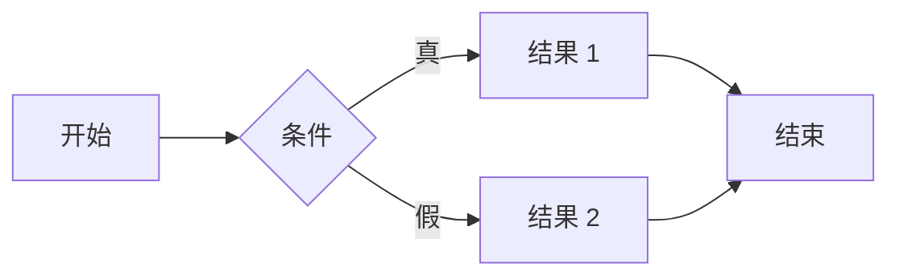

:::info
本文撰写于使用Jekyll框架时期。现已迁移至Astro！
:::

## **引言**

自[第一篇博客](https://hyngng.github.io/posts/first-post/)开设以来已近两年。坦白说，以两年时间来看，迄今为止写的文章数量不算多，但这期间并非没有投入感情。虽然有时因各种公事私事忙碌，有时自己活动减少，但都这样定期运营着博客。

最近重新整修博客并申请了站点搜索注册，我开始觉得自己对这个平台比以前熟悉了不少。写作比以前轻松了许多，省下的精力用来装饰博客。个人觉得选择GitHub博客这个决定虽然有风险，但我似乎正在享受平台本身的特色，因此想整理一下GitHub博客有哪些优点吸引了我。

## **自由定制**

{: .light .border }
{: .dark }
*最近添加的特定标签内容删除功能，以及功能成功应用后的效果*

GitHub博客整体运营难度比其他平台高得多，相应地需要关注并自行设置的事项也很多。尽管如此，选择GitHub博客的原因是博客运营体验非常自由。

GitHub博客与其他博客平台不同，给人的感觉是开放而灵活。其他博客平台是在一定围栏内只能使用平台支持的功能，属于封闭环境；而GitHub博客提供所有构成页面的信息并可自行修改，因此如果具备前端基础知识，可以实现大部分功能。主要使用以下语言：

- Ruby
- Liquid
- SCSS
- JavaScript

关于这方面，我已经写过两篇文章：分别是[各种定制设置](https://hyngng.github.io/posts/first-blog-customization/)和[特定功能实现](https://hyngng.github.io/posts/blog-content-remove/)。此外虽然没有单独写文章，但最近还自行添加了LQIP预览图、Instagram图标、Applause-Button等功能。

正因为定制如此自由，才有装饰的乐趣，这也是持续运营博客的动力。平时看着博客，会不断思考如何进一步改进，或者寻找其他类似类型的博客，思考有哪些优点可以引入到自己的博客中。

## **用Markdown写作**

*当前所看段落的编辑界面*

此外，GitHub博客最大的特点之一就是写作时使用Markdown这种标记语言。Markdown有多个优缺点，个人认为优点更多。

因为适应Markdown后，每次插入粗体、引用、分隔线等文章元素时，无需再点击编辑器按钮。当充分熟悉语法后，写作时手只需放在键盘上、眼睛只需盯着屏幕，可以全神贯注。

而且我使用的主题对Markdown文档可用的外部模块支持良好，例如用于表达公式的[MathJax](https://www.mathjax.org/)和用于绘制图表的[Mermaid](https://mermaid.js.org/)，因此写作时限制较少，反而可以更专注于文章质量。

例如，稍加用心就可以在正文中干净地插入如下公式或图表：

**MathJax**
$$
\begin{equation}
  \sum_{n=1}^\infty 1/n^2 = \frac{\pi^2}{6}
  \label{eq:series}
\end{equation}
$$

**Mermaid**

此外，与Obsidian等基于Markdown的程序也能很好地兼容。虽然有些不便，但将Obsidian与手机同步后，也可以在移动端进行文章编辑。

## **实用的主题特有功能**

*Chirpy主题设置界面(_config.yml)部分内容*

目前使用的这个模板，最初是因为简洁的设计、深色模式切换支持以及相关文章推荐功能而选择，使用后发现主题层面支持的细碎功能相当强大。如果打算开设GitHub博客并使用此模板，建议熟悉并充分利用以下功能：

- Google Search Console及Analytics集成
- 深色/浅色模式专用图片区分
- LQIP（低质量预览图）、PWA（Web应用）
- utterance、giscus等基于GitHub的评论功能

以上功能虽然容易被忽略，但如果善加利用，可以改善博客为作者和读者提供的整体体验质量。如果运用得当，可以做到在加载图片的过程中平滑过渡、在手机上安装博客专用应用等特别体验。

此外，还有为图片添加外阴影、图片与文字并排排列等高实用性功能，前面介绍的MathJax、Mermaid也在博客模板层面得到良好支持，因此能很好地加以利用。

## **结语**

不过，与之相对的代价是有些难度。如果不是开发者，需要了解一些不熟悉的GitHub或网页技术构成，才能顺畅运营；正如[Chirpy官方写作指南](https://chirpy.cotes.page/posts/write-a-new-post/)所示，即使在单纯写文章时也需要掌握一些语法。广告插入和文章曝光也需要外部流程，因为缺乏现成的对接服务。

尽管如此，我认为GitHub博客对于那些希望降低平台依赖度或技术好奇心强烈的人来说，是最佳体验。虽然确实不容易，但九成的功能都已经做好，并非难到令人绝望。加上平台依赖度低、可以按照自己想要的方式运营博客，只要能够适应，不仅完全可以胜任，其本身就是无与伦比的成就感和乐趣所在。
