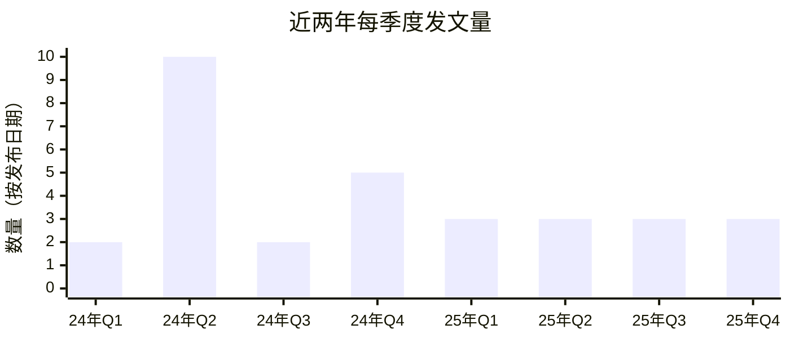
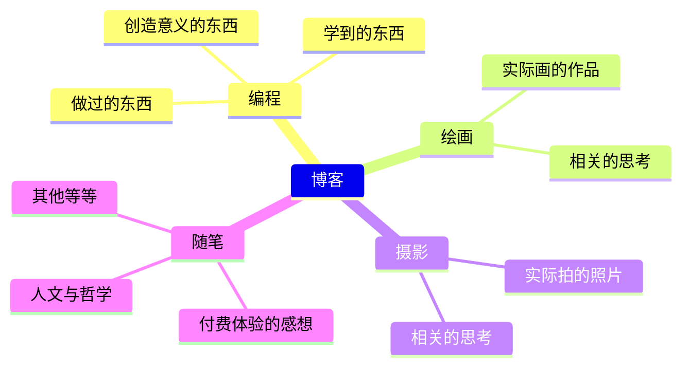

## **当初为何开始写博客**

算上这篇，迄今共写了42篇文章。回顾开设博客的契机，确实受到了外界影响。看到其他博客将所学知识、各种技术细节、自创的解题方法等汇集在一处，觉得非常酷，自然而然地我的博客也走向了技术博客的方向。其实这个方向并不坏，所以至今仍刻意维持。今后也会持续发布与编程相关的经验、整理在过程中遇到的困难等内容。

第二，我希望拥有一个能很好描述自己的空间。不知从何时起，向初次见面的人介绍自己是什么样的人变得有些吃力。现在这里不是常用的SNS（如X、Threads、Facebook、Instagram等）而是博客，也是出于同样的原因。SNS虽利于轻松内容的传播，却并非理性思考的好环境，也无法真诚地描述一个人。

结论是，这两个目标都实现得比预想中要好，回看之前写的文章，心中有些许惊喜和感慨。虽然需要花费大量时间和精力，但运营博客确实是我现在的一个优点。

## **这段期间的点点滴滴**

### **持续写作的原则**

以两个月为单位整理去年至今的文章数量如上。其实从开设博客起，我就一直在思考应该多久写一篇文章。去年我默认为每两周一篇的目标，实际上也曾月写4~5篇，但后来不得不妥协发文频率，原因如下：并非文章数量多就能让博客更丰富。与博客的依赖越大，就越难专注于原本的生活；目标发稿量越大，就越难写出高质量的文章。

进入25年后，基本保持每月一篇的频率，只是月初月末的差别。这也是一个默认模式，并非必须遵守，但保持这个节奏约一年后，发现能在忙碌生活和博客之间适度切换。一年12篇文章并不算少，我认为这是长期可持续的水平，如果没有特别的契机，今后大概也会以这种感觉发布新文章。

### **持续的博客定制**

也许是博客配置文件的便利，每次写文章时我都会审视页面结构并频繁进行修改。之前已经[修改过几次](https://hyngng.github.io/zh/blog/first-blog-customization/)，至今仍在持续按个人喜好调整。最近的例子是禁用了深色/浅色模式切换动画。主题本身没有提供禁用选项，实在觉得碍眼，于是找到定义了主题切换效果的属性如`id="post-preview"`，用`transition: none !important`覆盖了它。现在切换非常干净利落。

另外，在博客主题版本`v7.3.1`中发现首页预览图从LQIP切换到原图时虚化效果不播放的bug，经过长时间调试后解决，并在官方仓库[提交了issue](https://github.com/cotes2020/jekyll-theme-chirpy/issues/2537)。大约两周半后开发者确认了问题，不久便创建了[反映我视角的新提交](https://github.com/cotes2020/jekyll-theme-chirpy/pull/2551)，随后新版本[v7.4.0](https://github.com/cotes2020/jekyll-theme-chirpy/blob/master/docs/CHANGELOG.md#740-2025-10-19)发布，该bug正式修复。

### **搜索引擎相关杂谈**

已经[写过一篇相关文章](https://hyngng.github.io/zh/blog/webmasters-and-seo/)，所以当个后续故事看就好。首先，处理站长工具时需要有耐心。真的需要极大的耐心。特别是Google Search Console，注册后到正常被搜索到可能需要半年左右，即使过了足够长时间，如果页面权威性低，爬虫活动也会大幅下降。我的印象可能不准确，但感觉域名权威性对于索引生成来说比SEO优化程度更为重要。

在Bing上曾发生过索引突然被取消的情况。具体来说，Bing将页面分为"已编入索引"、"错误"、"警告"、"已排除"四类，而我的博客所有页面都被移到了"已排除"类别，从Bing搜索结果中消失了。由于站点托管和`robots.txt`等页面本身没有问题，我于8月13日[向Bing站长工具支持团队](https://www.bing.com/webmasters/support)提交了咨询，8月30日收到_"We have reviewed your site and sent it to our Product Review group for further assessment."_，10月3日收到_"I am happy to inform you that the issue related to your site has been resolved"_的回复邮件。虽然花了一个半月左右，但索引基本恢复，现在搜索曝光正常。

## **个人的写作原则**

### **杂而不乱的博客风格**

以写这篇文章的时间点来看，博客涵盖的题材大致如上。有些杂，说好听了是丰富，说难听了就是风格定位模糊。混合多种主题其实对SEO不利，但我仍然基于一定的理由撰写不同主题的文章。前提如下：博客是自由书写的个人空间，在我的页面上不需要看别人眼色。如果我的兴趣确实分散在多个领域，那么我的文章自然也应当如此。

可能有些批判性，但举例来说，如果以SNS上的热门话题或广告单价高的主题为中心来运营博客——那些常见的情况——我认为从长远来看会削弱其作为个人博客的意义。无论如何，在写作的瞬间就在一定程度上实现了作为作者的原始意义，因此作者的主观应当以51:49的比例优先于读者的偏好。这里的意义在于创造一个能很好描述自己的空间，因此涉猎多个主题是符合上下文意图的。

### **有意识地变换文风**

初期以作者为主体的"해체"风格写作，后来考虑到潜在读者曾尝试统一使用"하십시오체"敬语体。改变文风后发现两者都有些别扭，就在这时，我喜欢的电影评论家金惠利的评论文章中，有些文风非常自由。每个作品都有其适合的形式这一想法，以及将这种想法付诸实践的哲学，都很有说服力，我也想尝试一下。

以前从未做过这样的尝试，所以在别人看来可能会有些冒险。但在[最近的这样一篇文章](https://hyngng.github.io/posts/finding-camus-in-goryeo-history/)中，我尝试谨慎地将句子结尾方式与其他文章区分开来使用，感觉文章更真诚了，写作过程也更有趣，印象很好。今后在写作中，不仅限于句子结尾方式，还将在段落构成、长度、叙述视角等方面追求多样性而非统一性，尽量写出有新意的内容。

### **去权威化的表达选择**

就像编程时斟酌变量名一样，写作时也常常在多种表达之间犹豫。对我来说，好的表达标准不在于修辞的华丽，而在于意义的清晰——即能在多大程度上降低语境抽象度，并且我认真遵循这一标准。已有语句过段时间再看也会发现有遗憾之处，因此我会寻找削弱信息传达力的官腔或翻译腔，更细致地说，是寻找接近冗长风格的句子并加以打磨。

类似地，在选择词语时我也注意语言层级。尽量优先使用韩语固有词，必要时使用汉字词和外来词。论点很简单：固有词属于经过验证的经典，而外来词相对有沦为一时流行的风险。与其盲目相信这种倾向性，更重要的是在每种情况下选择能最准确传达意义的表达。但如果后者的比重过高，可能会给人炫耀专业性的印象，因此当外来词不如固有词精确时，我会刻意避免使用。在需要专业表达的场合，我会先斟酌是否用白话解释更好。

### **尊重读者，从容行文**

我避免使用粗体。粗体的优点是可以明确传达意义，但其效果通过视觉强调便捷地实现，这会产生一个问题：将作者的特定主观优先到了不必要的高度。当然，有些场合确实需要如此，比如电影海报或产品广告等带有商业性的情况。但在本博客这样注重归档性的环境中，作者应当以诚恳的态度努力构建有说服力的语言。尽量少用斜体、删除线等Markdown语法在句子中玩弄技巧，也是出于类似的原因。

同样，我坚持写长文。避免把文章写得太短的习惯，当需要包含新信息时，尽量不另发独立的新文章，而是附加到已有文章中。这也与当今以移动端为中心的短平快内容趋势背道而驰。明知如此仍甘愿承受不利，是因为我希望现在写下的文章在未来不会褪色，依然是好文章。

### **对AI的保守态度**

与代码不同，在写作方面我尽量保持传统的写作方式，不使用ChatGPT、Gemini、Claude等LLM人工智能服务的帮助。我写作的原因在于回顾、能力提升和情感投入，将写作委托给他人没有意义。如果我能充分驾驭某个主题，那么不需要外部帮助也能写出高质量的文章；如果不能，那首先要做的是与题材熟悉起来。不过也并非完全排斥，我在思考生成式人工智能的健康使用方法。例如，最近我将其用于比较分析正在撰写的草稿与印象深刻的文章，或检查特定表达。

特别是ChatGPT 5、Claude 4.5等最新模型的回答已经达到可供参考的水平。尤其是Gemini 2.5 Pro从发布到现在，经常感觉其对语言的熟练度很高。它能很好地指出文章整体的印象和问题点、某个词语的替代方案、句子的精简版和扩展版，只要配合韩语词典使用，作为润色工具非常出色。不过对于幻觉问题仍需高度警惕。发布越新的模型，在冷门领域越容易提出错误概念，我会先查阅官方指南、偶尔是书籍或几篇论文，然后再反映到文章中。

## **今后也将继续营业**

博客开设时，我曾有很多有趣的小领域可以用来丰富博客：政治现实主义与政治理想主义等国际政治基本理论、印欧语系与语言类型学、蒙古文字与满文文字的相似性、现代韩语汉字音的起源等语言学上的多个要点、结合AI快速发展的绘画故事、CMOS图像传感器的物理局限与克服策略等等。如今回顾起来，因为没时间而实际上没有发布相关文章有些遗憾，但兴趣一直保持着。也许有一天会发布类似主题的文章。

此外，随着近期AI的发展，互联网搜索活动正在萎缩，有人说传统博客已经终结。确实，与搜索引擎的相互合作弱化，广告收入减少，不少人对运营博客失去了动力。基于多种指标，我的博客也可能会被更少发现，这已是既定事实，但对我来说，相比信息共享的目的，自我消费的性质才是第一位的，因此我大概能在没有太大动摇的情况下继续活动。

我曾读过一篇文章，说能持续运营一年以上的博客非常少。如果此话属实，那么以年数计算，我已经迈过三年走向第四年，第一道难关早已跨过。我个人希望能长久地运营下去。
