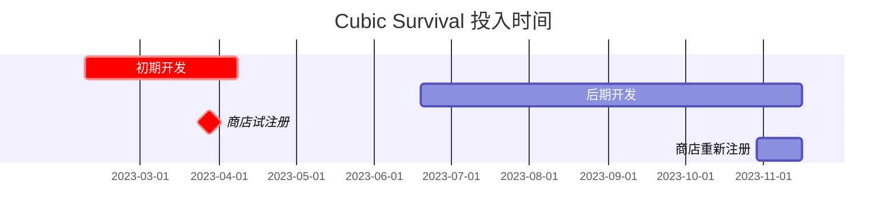

---
image:
    path: /2023-12-22-palette-first-devlog/gameplay.webp
    lqip: data:image/webp;base64,UklGRrYAAABXRUJQVlA4TKoAAAAvD8ABAHW4jWxbbfp4JJmZmSml0LH7L0Mq4pgVtG3DuOOPdQge4zaSFHVVH9P78o+T+j8BbhLNGhMUUL7GTwDFP6j3DTiLqMug0k4+RlwpOQFUC2jKxL/yzX0tKUApmm8sxu7n4LvlOeUbSBnGjBjAWUR/xmX1IQt/X/KSXVS1BnsLKLMeGqGJGl7KM5cUhbtrZyZYxL+CgfcTwNUUcJMaRE0DKQrAqa8oAA==
    alt: 示例游戏画面
    
title: "'方块生存'，构思及开发过程"
authors: ["dev"]

categories: [마일스톤, 게임 개발]
tags: [마일스톤, 게임 개발, 유니티, C#, URP, 큐빅 서바이벌, 기획, 개발일지]
start_with_ads: true

toc: true

date: 2023-12-20 19:18:00 +0900
last_modified_at: 2023-12-22 20:42:00 +0900

mermaid: true
---

## **开始做游戏**

2023 年新年，我需要找点事做。既然要做，我希望做点既能提高编程熟练度、又能让我乐在其中的东西。新年钟声敲响后的第二天，我制定了几项计划。

想了一下几个想法，包括基于六何原则的 Python 库、类无反相机风格的应用、2D 移动端游戏等。这些分别源于[基于 Python 的程序](https://hyngng.github.io/posts/astp-devlog/)、使用 Android Studio 制作简单应用的经验，或[之前的 Unity 项目](https://hyngng.github.io/posts/lavad-devlog/)。

但是游戏开发看起来太有趣了。之前使用 Unity 的经验本身就很新奇，而且当时能够自给自足使用资源这一点看起来非常吸引人。虽然确实是辛苦活儿，但用别人找不到的独有素材来制作程序这个主题非常吸引我，而且正值我对面向对象产生兴趣的时候，想认真使用一下面向对象语言，于是开始制作 2D 移动端游戏。

## **项目概要**



开发周期在时间上分为初期和后期，因此我将分别用两篇文章进行简要回顾。因此，本文章包含上图以红色强调的初期开发的内容。

我一开始只是想快速确认面向对象的特点，轻松地开始做，没想到会对此项目投入如此多的感情。所以这个项目没有系统的计划或目标，顶多抽象地抱有以下几个愿望：

- [x] 想做视觉上极简的设计。
- [x] 想实现平滑的相机移动。
- [x] 想有效运用面向对象设计。
- [x] 想使用协程。

开发周期长，上述目标也逐个达成了。至于分别在何处以及如何达成，说来话长，将在这篇文章和下一篇文章中详细讨论。

## **初期开发过程**

{: w="960" }
*最初我想，每消灭几个敌人，如果能触发某个事件就好了*

一开始是从克隆代码开始的。首先从小处着手，找其他知名游戏中可以模仿的来尝试制作。

最初参考了高中时和朋友一起玩得很开心的 Brawl Stars。不过主要目的不是模仿游戏系统，而是帮助理解"2D 移动端平台大概就是这种感觉"。

### **摇杆**

{: w="960" }

我想实现一个典型的 2D 移动端游戏中的摇杆，左侧是一个用于玩家移动的摇杆，右侧是一个用于瞄准的摇杆。

制作时，使用了 `Unity​Engine.​Input​System.​On​Screen` 包的 `OnScreenStick` 类，基于该类创建了两个新脚本，分别根据相位差使用 `Translate()` 移动玩家和瞄准用透明对象。由于涉及 `​On​Screen` 包的国内资料很少，主要参考了[官方文档](https://docs.unity3d.com/Packages/com.unity.inputsystem@1.7/api/UnityEngine.InputSystem.OnScreen.OnScreenStick.html?q=OnScreenStick)。

顺便一提，我有很多想实现的想法，比如通过 LineRenderer 视觉连接摇杆和中心点、摇杆像有弹力一样弹回中心点、或者不同武器的摇杆操作方式不同等，但当时能力不足，有些也与游戏结构冲突，未能实现。只做到了按下和松开摇杆时会有震动反馈。

### **敌人生成及动作**

{: w="960" }
```cs
void spawnEnemy(GameObject Enemy, float east, float west, float south, float north)
{
    float spawnPointX = Random.Range(west, east);
    float spawnPointY = Random.Range(south, north);

    instantiatedEnemy = Instantiate(
        enemy,
        player.transform.position + new Vector3(spawnPointX, spawnPointY),
        transform.rotation
    );
}

IEnumerator spawnEnemies()
{
    for (int i = 0; i < data.spawnCount; i++)
    {
        spawnEnemy(Enemy, east, west, south, north);
        yield return new WaitForSeconds(spawnDelay);
    }
}
```

一开始也尝试过创建传送门对象，在指定位置实例化敌人，但觉得生成后的样子太单调，于是像上面那样编写了敌人在玩家周围生成的代码。

基于 `east`、`west`、`south`、`north` 四个参数，生成距离玩家一定距离的随机坐标值。为了防止敌人突然出现在玩家附近，该坐标值被单独处理为指定在画面渲染区域之外。

在 Unity 中，延迟方法并不像 `Delay()` 那样简单提供，大多数情况下推荐使用协程，这成为了我第一次使用协程的契机。创建了以 `spawnDelay` 为间隔生成敌人的协程。

```cs
void Move()
{
    dirTowardsPlayer = (player.transform.position - gameObject.transform.position).normalized;
    transform.Translate(dirTowardsPlayer * speed * Time.deltaTime);
}

void OnCollisionEnter2D(Collision2D collider)
{
    if (collider.gameObject.tag == "player")
    {
        player.hp -= damage;

        Vibration.Vibrate((long)20);
        Destroy(gameObject);
    }
}
```

敌人基本向玩家移动，与玩家碰撞时，通过震动反馈减去玩家 `damage` 值的体力，然后 `Destroy()`。

### **背包与物品**

随着游戏结构逐渐成形，我觉得如果能储存物品并在之后拿出来使用，有一个背包就好了。这部分我自己思考了一些，因为很多游戏中背包 UI 要么是单独的窗口，要么干脆不做，而是以按钮切换的方式。我两者都不满意。

于是，我的目标是制作一个既能容纳多个物品、又不会破坏游戏体验的背包。因此，将原本分配给右摇杆的手动瞄准功能改为自动瞄准，并分配了新的背包访问功能。长按右摇杆打开背包，松开手指则关闭背包。

{: w="960" }
```cs
public struct InventoryData
{
    public string[]     Code;
    public GameObject[] UI;
    public GameObject[] ItemUI;
    public GameObject   Weapon;
    public int[]        Rounds;
}

for (int i = 0; i < InventoryData.InventoryUI.Length; i++)
    InventoryData.UI[i].transform.position = Vector3.Lerp(currentPos, targetPos[i], 2*t);
```

背包使用 8 个对象，在访问时对象会在玩家周围展开。为此，我创建了如上结构体，以管理访问所需的数据（物品标识符、背包对象、物品对象、武器数据、弹药等）。

物品分为用于在地图生成的物品对象和作为 UI 使用的对象，玩家获得地图物品时，物品 UI 对象被添加到 `ItemUI` 数组中。

|物品|ID|
|---|---|
|手枪|WPPSTL|
|霰弹枪|WPPASG|
|迷你机枪|WPMING|
|移动速度增加被动|PVMSPD|
|攻击速度增加被动|PVATKR|
|...|...|

物品标识符如上所示，由表示类型的 2 位 + 表示物品名称的 4 位组成。有趣的是，制作时我并未意识到，但当物品越来越多时，我自然想到"需要给每个物品创建唯一的代码！"，后来才知道这个想法就是"标识符"的概念。使用起来相当有用，以后也会继续沿用。

### **武器发射**

{: w="960" }
```cs
if (shotTimer > fireThreshold)
{
    for (int i = 0; i < bulletCount; i++)
    {
        instantBullet = Instantiate(
            bullet,
            FirePosition.transform.position,
            Quaternion.Euler(
                0, 0, transform.rotation.eulerAngles.z + Random.Range(MOA * -1, MOA) + 180
            )
        );
        Destroy(instantBullet, 1);
    }
}

shotTimer += Time.deltaTime;
```
```cs
void hasHitEnemy()
{
    hit = Physics2D.Raycast(transform.position, transform.right, 100);

    if (hit.collider != null && hit.distance < 1)
    {
        if (hit.collider.gameObject.tag == "enemy")
        {
            if (hit.collider.GetComponent<Enemy>().HP > 0)
                Destroy(gameObject);
            /* ... */
        }
    }
}
```

子弹从武器对象的 `FirePosition` 子对象生成，沿玩家瞄准的方向直线前进，生成 1 秒后消失。为了实现弹道散布效果，子弹生成时在每种武器指定的 `MOA` 变量值范围内，通过 `Random.Range()` 对角度 Z 轴进行微调。

碰撞检测使用了射线检测。但可能是因为子弹速度太快，射线检测也无法正常检测碰撞，出现了子弹直接穿过敌人的问题。通过增加射线长度或扩大碰撞体范围也无法解决，但通过添加 `hit.distance < 1` 条件得以解决。

全部实现后，我发现像子弹发射这样需要频繁实例化对象的情况，可以使用对象池（Object Pooling）这一优化技术。以后有时间的话打算尝试应用。

## **用户体验设计**

如果说上一段是关于"想制作一个在战场上移动、消灭敌人的动作游戏"的内容，那么这一段是关于"想实现流畅而独特的用户体验"的内容。我认为大部分视觉相关工作是在后期开发阶段完成的，因此将在下一篇文章中讨论。

### **相机**

{: w="960" }
```cs
void Move()
{
    transform.position = Vector3.Lerp(
        transform.position,
        player.transform.position,
        Time.deltaTime * moveSpeed
    );
}

void Vignette()
{
    targetVignetteValue = inventoryIsOpen ? 0.35f : 0f;

    vignette.intensity.value  = Mathf.Lerp(
        vignette.intensity.value,
        targetVignetteValue,
        Time.deltaTime * vignetteSpeed
    );
}
```

平时在[修照片](https://hyngng.github.io/posts/photos-of-imin/)时，我会特别注意一个叫暗角（Vignette）的选项。这个功能使画面边缘变暗，将视线集中在中央，碰巧 Unity 的[后期处理](https://docs.unity3d.com/kr/2020.3/Manual/PostProcessingOverview.html)中也有相同的选项，所以我想在打开背包时应用这个效果会很合适。

于是，在访问背包时将暗角值设置为 0.35 左右。暗角效果与相机移动一样，使用 Lerp 进行平滑处理。制作时，将 Lerp 接收的 `vignetteSpeed` 和 `moveSpeed` 等参数调整到想要的感觉很难，通过游玩、修改、再游玩、再修改，做其他部分时又不满意了再次修改，在整个开发过程中不断寻找理想的值。

### **URP**

{: w="960" }
*每当武器发射时，敌人身后会投下阴影。*

一开始我将就用 Unity 2D 环境的基本光照效果，但各处都有不如意之处，作为替代应用了 [URP（通用渲染管线）](https://unity.com/srp/universal-render-pipeline)后，视觉效果变得非常好。URP 默认就提供平滑漂亮的照明效果，同时还可以通过调节 Falloff Strength 选项来制作更柔和或更华丽的光线，或者利用 Shadows 选项呈现上述的光影效果等，非常实用。

不过后来在子弹或每个敌人身上添加 Light2D 时，出现了手机很快发热的问题。似乎相当消耗 GPU 资源，因此未能积极使用，仅保留作为枪械发射时丰富火焰效果的用途。

## **结语**

简单整理了初期开发活动。写的过程中感觉，实际上这段时间的很多经历已经不太记得了。似乎没有充分记录下各种想法和努力，下次打算在过程中多留笔记。

不过，通过亲自尝试各种实现，我认识到制作游戏比想象中更加精密。尤其是那些不追随流行趋势、寻找全新范式并成功实现的其他游戏，真的很了不起。而作为一个认为那些很酷的人，我个人也有点心动了。
