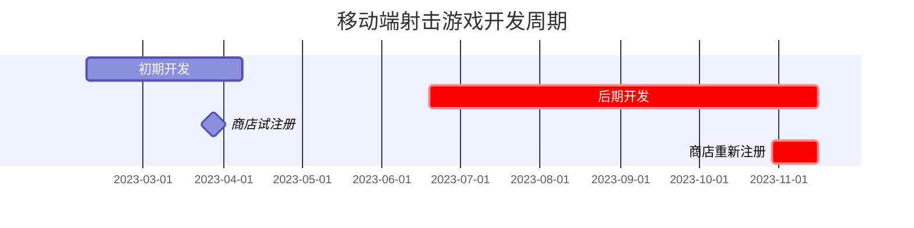
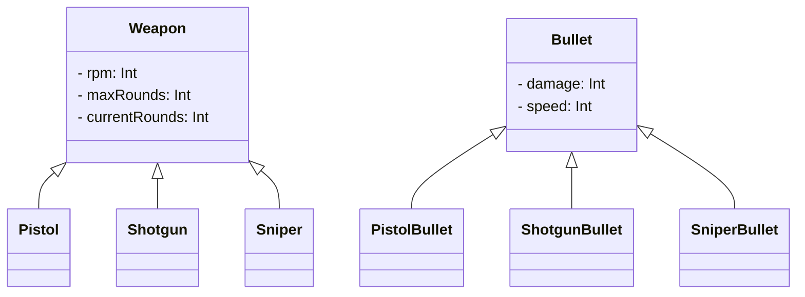

---
image:
    path: /2023-12-24-palette-second-devlog/gameplay.webp
    lqip: data:image/webp;base64,UklGRp4AAABXRUJQVlA4TJIAAAAvD8ABAHW4jW07cZZZFK05opg5dwVuh0KP63YPX9K8r/lX2LZtQ/9/b7pH/6uQQTkldeJfaiu1Vm5md+y6VXAnB01t6GKRzP0ax2haSBXAIpUOphDguA1NYDEqXRj3wIgpeMdtNWAhXjfv2IdZJp2CutpKacCzQSqv6wO8mG9t+BciZqCmJINcWYVt8M57GziHAA==
    alt: 示例游戏画面
    
title: "'方块生存'，开发及发布过程"
authors: ["dev"]

categories: [마일스톤, 게임 개발]
tags: [마일스톤, 게임 개발, 유니티, C#, URP, 큐빅 서바이벌, 개발, 개발일지]
start_with_ads: true

toc: true

date: 2023-12-22 22:38:00 +0900
last_modified_at: 2024-03-20 17:38:00 +0900

mermaid: true
---

## **重新开始开发的原因**

:::info
接[前一篇文章](https://hyngng.github.io/posts/palette-first-devlog/)。
:::



3 月新学期开始后，最初一个月左右虽然继续制作玩家背包等游戏的基础系统，但随着考试临近，因压力开发进程中断了。6 月期末考试结束后，时间又空了出来，决定继续制作之前开发的游戏。

在暑假的两个月里，我专注于图像资源或粒子效果等视觉表现，产生了浓厚的兴趣。不仅感觉游戏在有效改善，而且意图创造出别处看不到的独特感觉，这本身就非常独特。似乎很难有这样的经验，于是在第二学期做了一次尝试性的豪赌：第二学期认真上课和考试，但尽可能将最多的时间投入到游戏开发中。

因此，这篇文章主要整理了在那段期间内，其余所有部分是如何制作以及制作了什么。

## **制作武器**

### **发射动画** {#weapon-animation}


```cs
if (shotTimer > fireThreshold)
{
    WeaponAnimator.SetTrigger("Fire");
}

shotTimer += Time.deltaTime;
```

使用 Unity 动画组件制作了发射动画。Unity 提供的动画组件除了通过替换精灵图像实现的传统逐帧动画外，还支持直接调整子对象位置的动画，因此我充分利用了这两种类型，使武器发射时相应的后坐力动画得以播放。

在枪口前播放的火焰效果先对图像本身进行模糊处理，为了减少不自然感，夸大了精灵的尺寸，并应用了 URP 提供的光照效果和后期处理的 Bloom 效果。这样既减少了单调感，又制作出了引人注目的华丽效果。

{: w="480" }
{: w="480" }

构成火焰动画效果的图像是利用 Clip Studio 的动画功能制作的。自己制作动画精灵说到底就是数字苦力活，所以也曾考虑使用 Unity 提供的官方资源代替，但发现其中没有我想要的感觉，于是自己绘制使用。制作时，我逐帧慢慢参考了[其他射击动画](https://www.youtube.com/watch?v=kAafHZcT2fc)，做出了我想要的感觉。


为了减少武器对象切换时的不自然感，我还制作了仅在切换或新获得武器时播放的、各武器专属的检查弹膛动画。在操作武器时，让玩家操作产生短暂的延迟，应用后发现游戏体验看起来更加有机，令人满意。

### **敌人受击效果**


```cs
public void Hit()
{
    ParticleSystem hitEnemyParticle = hit.collider.GetComponent<ParticleSystem>();
    hitEnemyParticle.Emit(particleNumber);
}
```

受击效果使用了粒子系统制作。最初只是简单地让粒子朝随机方向移动并逐渐减速，但结果比预想的生硬，让人头疼。

这个问题解决得有点偶然，在 Velocity over Lifetime 模块中将线性速度和公转速度设为 Random between two curves，并将曲线翻转两次后，产生了一种类似尘土飞扬的效果，于是采用了。看起来不错，打击感也相当好。

### **弹药系统**


```cs
public virtual void Update()
{
    if (roundsCurrent > 0)
        Fire();
    else if (!WeaponAnimationInfo.IsTag("Weapon_Reload"))
        WeaponAnimator.SetTrigger("RoundIsEmpty");
    else
        roundsCurrent = roundsMax;
}

public virtual void Fire()
{
    if      (currentRounds == 1) WeaponAnimator.SetTrigger("FiredLastRound");
    else if (currentRounds > 0)  WeaponAnimator.SetTrigger("Fired");

    roundsCurrent -= 1;
}
```

制作了显示剩余子弹的功能。子弹数为 0 时播放装弹动画，装弹动画结束后弹药数恢复为武器对象设置的最大弹药值。与玩家体力类似，弹药 UI 以游戏对象的形式简洁地显示在玩家头顶上方。

还加入了一些细节：如果装弹动画尚未结束就切换了武器，之后再次拿起该武器时，会播放与 `Gained` 动画不同的 `GainedEmpty` 动画。区别在于 `GainedEmpty` 状态下枪机呈后退固定状态，弹膛可见，然后开始装弹。这是从许多 FPS 游戏中的实现方式借鉴而来。

### **伤害效果**


伤害效果本身在初期开发时已实现，但因为是使用代码而非动画组件实现的，视觉效果也不太满意，所以重新制作了。从单纯逐渐淡出消失，改为效果的大小、移动速度也可动态调节。

制作时还同时实现了暴击系统：当伤害以概率翻倍时，播放专属动画。为了让玩家易于识别是暴击伤害，与普通伤害动画相比，在大小和颜色上做了区分。

### **武器多样化**


```cs
public abstract class Weapon : MonoBehaviour
{
    protected int   RPM;
    protected int   maxRounds, currentRounds;

    public virtual void Awake()
    {
        /* ... */
    }
}
```
```cs
public class Pistol : Weapon
{
    public override void Awake()
    {
        base.Awake();
        
        maxRounds     = 10;
        rotationSpeed = 40;
    }
}
```

一开始并没有打算主要做枪，但因为想复用最初制作的内容，结果制作了多把以枪为主的武器。制作过程中有意识地运用了面向对象编程的多态性，在父类 `Weapon.cs` 中编写 `RPM`、`maxRounds`、`currentRounds` 等基本内容，让 `Minigun.cs`、`Shotgun.cs`、`SMG.cs` 等具体武器类通过继承来运作。

这是我第一次运用继承，与之前的编码方式相比，效率确实明显提高。将重复的代码在低层级统一化，并通过末端代码调用使用，这与使用库完全不同，既感到陌生又觉得新奇。

## **制作动画**

### **玩家移动**


使用 Unity 默认提供的方形图形作为玩家太没诚意了，于是添加了新的身体和移动的腿部。根据玩家将摇杆拉至最大范围与否，分别适当播放行走动画和奔跑动画。

为了减少动画动作的生硬感，根据摇杆拖拽程度动态调节行走动画的播放速度，并增加了根据瞄准方向使玩家后退行走的功能。例如，当玩家向左走但敌人在右边时，玩家会缓慢后退并瞄准敌人。结果动作并不生硬，看起来相当自然。

### **经验值系统**


为了稍微减轻游戏过程中的枯燥感，制作了经验值系统。击败敌人后玩家获得经验值，经验值达到一定量时升级，玩家获得一定强化，累积的等级在游戏结束时以分数的形式显示在结果窗口中。

最初设计为玩家必须亲自获取经验值粒子才能获得经验值，但到了游戏后期，越来越密集的敌人导致画面变得杂乱，因此改为击败敌人后立即获得经验值的方式。应用后发现现在的方式更加干净利落，堪称标准做法。

### **进入游戏画面**


我个人喜欢场景之间流畅过渡，而不是生硬切换，感觉像是受到了程序的关怀。我也想将这个特点应用到自己的游戏中。

因此，在场景切换时，按下 Play 按钮后不仅仅是场景切换，而是从相同大小的按钮形状对象开始，让玩家登场。按钮被按下时，主场景的 UI 平滑消失，游戏场景的 UI 从屏幕边缘新出现。虽然看起来有些业余的不足，但我觉得创造了一个其他游戏中没有的独特体验，有点自豪。

## **后期开发：其他工作**

### **图像资源**


*用 Galaxy Tab 绘制*

[如前所述](#weapon-animation)，图像资源没有使用 Unity 资源商店，全部自行制作。先用像素画风绘制了武器，感觉不违和，于是敌人、受击效果、摇杆、经验值条等其他图像也采用了像素画风。像素画绘制负担比想象中小，在制作多个方案或替换使用中的图像时相当自由。

主要使用 Clip Studio，导出为背景透明的 png 格式后，按照各图像的实际尺寸裁剪后导入，所有导入的图像均作为 Sprite (2D and UI)，Filter Mode 设为 Point (no filter)，Max Size 根据图像分辨率相应设置。

### **相机**

我通过自己的[摄影爱好](https://hyngng.github.io/posts/photos-of-imin/)发现了通过视角可以表现很多东西，并希望将其应用到我的游戏中。Unity 的 2D 环境以正交投影方式显示场景，虽然概念上有所不同，但从能够容纳多少的抽象角度来看，我认为 2D 环境下也有值得思考的地方。


因此，在制作游戏时，我使影响相机视野的 `Camera.orthographicSize` 值能够随时根据需要变更。例如，装弹或开始新游戏时，为了表现无力感和紧张感，我使视角变窄。构建测试应用亲自试玩后发现，意图得到了很好的表现，同时也让游戏体验变得独特，令人满意。

### **音频**

{: .light .border }
{: .dark }
*暴击音效*

背景音乐、音效等与声音相关的内容，实际处理起来有些令人不知所措。与画画或写代码不同，声音方面我完全一无所知，真的不知道应该从哪里、如何获取音频文件，以及如何进行编辑。

结果，经过一番乱找，从 [Pixabay](https://pixabay.com/ko/sound-effects/) 和 [GDC Game Audio](https://sonniss.com/gameaudiogdc) 获取了免费音频文件，然后使用 [Audacity](https://www.audacityteam.org/) 音频编辑程序进行降噪、低频增强等小幅编辑后使用。

虽然最终效果不算差，但声音相关的部分还是留下了不小的困惑，觉得下次如果再制作游戏，应该先获取音效或背景音乐再做。

### **应用内广告**


```cs
void PlayerDied()
{
    ShowInterstitialAd();
}
```

这是后期开发中最早实现的功能之一。制作[简单的自动股票交易机](https://hyngng.github.io/posts/astp-devlog/)时，对使用 API 或 SDK 等外部发布模块产生了兴趣，出于好奇制作了广告调用功能。当玩家死亡进入结果窗口时，其间会弹出插页式广告。

参考 [Google AdMob 官方文档](https://developers.google.com/admob/unity/banner?hl=ko)进行制作，跟着官方指南一步步来，比预想中简单得多。效果也很干净利落，让人惊奇。

### **应用内购买**

{: .light .border }
{: .dark }
```cs
void Purchase()
{
    if (playerDonateKimbab)
    {
        DonateKimbab();
        playerDonateKimbab = false;
    }
}
```

应用内购买也想在同样的脉络下实现。不过，由于游戏中没有流通的货币或道具，所以以赞助的形式制作。构思了紫菜饭卷、火鸡面、牛排三种食物，在 Google Console 中申请了应用内商品后，在游戏内实现了无报酬的支付。

实现过程中，听说实现应用内购买时需要注意安全。这个项目具有很强的玩具项目性质，并非以盈利为目的，所以关系不大，但下次再实现应用内购买时，我想需要稍加注意。

## **商店注册**

### **注册准备**

{: .light .border .w-25 }
{: .dark .w-25 }
*应用 Logo*

为了统一性，应用 Logo 使用与 Play 按钮相同的图像制作。在这个项目中，商店注册具有一定的象征意义，并没有想通过这个游戏吸引关注之类的想法，所以决定接受直观性不足的问题。应用的包名从开发者账号和个人称呼的项目名中取用，定为 `com.payang.palette`。

### **商店注册**

{: .light .border w="960" }
{: .dark w="960" }
*Google Console 的商店注册信息填写栏*

应用注册限定在 Play Store，因此使用了 Google Console。实际上在[初期开发阶段](https://hyngng.github.io/posts/palette-first-devlog/)已经注册过一次，当时只是因为好奇应用注册流程以及想确认自己的应用是否真的能上架，所以注册后确认正常上架便立即停用了应用。

过了半年多，觉得再投入时间到这个项目已经有些负担，同时游戏的完成度也比初版有了不少改善，于是决定更新应用后重新启用。注册时重新编写了应用名称和应用说明，应用图标、图形图像以及自定义截图也更新为新的。

{: .light .border w="960" }
{: .dark w="960" }
*游戏在 Google Play Store 上架的画面*

最终应用重新启用，处于可下载状态。应用重新启用已过约一周，搜索标题可以正常显示。

### **宣传与反馈**

说实话，谈得上是正规宣传活动的做法令人汗颜，实际上之前也从未考虑过宣传，所以有困难。但觉得既然是"游戏"，有人玩就好了，于是开始寻找应该在哪里以及如何进行宣传。

不过，这个游戏从一开始就不是以让人玩为目的制作的，更像是给玩具项目增添趣味后规模膨胀的结果，所以有些担心进行宣传是否合适；而且虽然开发过程有趣，但宣传是另一回事，真要宣传自己的作品时，羞耻心占了上风。

{: .light .border w="960" }
{: .dark w="960" }

尽管如此，我还是鼓起勇气在海外 [Unity2D 子版块](https://www.reddit.com/r/Unity2D/comments/17p1toj/my_first_game_is_now_on_google_play_what_do_you/)发了一篇短文。抱着有 100 个人看就很感谢了的心情发了帖，结果一周内浏览量突破 2 万，过了一个月左右竟然有近 10 万人关注，我真的很惊讶。

{: .light .border w="960" }
{: .dark w="960" }

其中几位非常感谢地亲自游玩后留下了如此详细的反馈。反馈包括："摇杆位置固定且无法调整，不方便"、"Bloom 看起来有点过了"、"看起来和其他游戏相似"。这些反馈有些地方我也有同感，但目前不想继续开发下去了，等以后有时间再逐步修改，或者推进下一个项目时另行反映。

## **结语**

:::tip
您可以在 [Play Store](https://play.google.com/store/apps/details?id=com.payang.palette&hl=ko-KR) 下载试玩。
::>

至此，这个投入了大量心血和时间的项目结束了。花了大约半年的时间投入精力，看到应用上架的画面，百感交集，个人感受最深的有三点：

- 制作动画虽然有趣且有成就感，但需要逐一手工操作，非常耗时。除非是专业动画师，否则制作出理想感觉的动画需要做好心理准备；而且为每个对象制作专属动画是低效的。我意识到，尽可能让多个对象共享相同的动画会更有效率。

- 以即兴的、自底向上的方式、在没有策划的情况下做项目，在小规模上下文中或许有趣，但局限性是明显的。开发中流程中断，制作动画时流程中断，不满意就回退或删除已有成果、重新制作新成果的情况频繁发生。  
因此，我一直在遗憾，如果当初精心策划，也许就能避免这种低效。所以下次我打算在初期认真做好策划。

- 最后是时间管理方面。这个项目原本是计划在寒假最多一个月左右短期推进的，但因为有趣，变成了暑假项目，然后又差点变成下一个寒假项目。  
学期中边学习边开发游戏，因为太有趣了，导致学业被推到了心理上的第二位。这自然影响了成绩，让我对未能妥善管理时间感到遗憾。

不过，制作过程本身是非常有趣且令人有成就感的经历，所以我想不久后可能会用 Unity 弥补这次遗憾，开启下一个里程碑。也想尝试将开发过程中学到的一些技巧或模式应用到新项目中，而且第一次难，第二次应该不会太难。不过，如果下次再度着手，我希望能以更加系统的计划和准备过程，将游戏提升一个台阶。
