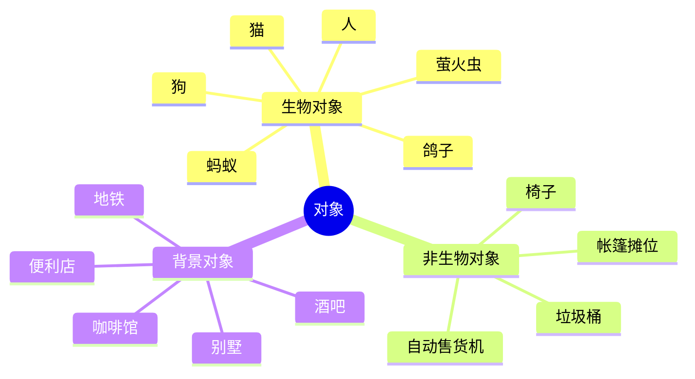
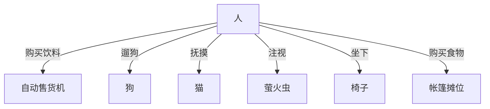
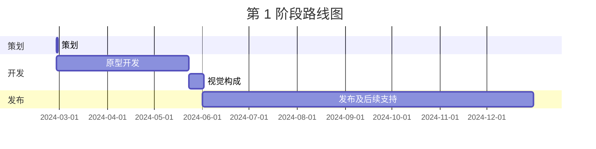

---
image:
    path: /2024-03-22-armonia-devlog-planning/preview-image.webp
    lqip: data:image/webp;base64,UklGRoAAAABXRUJQVlA4THMAAAAvD8ABAJUwiiRJkZtjZmbGF9s5Kyd1ScY8FbRt5MYA/F79RFEjSWpSxn2Zbw+m+z8BjqBzPlDmvL+4+00yVxL5ht9jZKHMSM22JRAbkUChuDviWIX4O+VnNh9jixzr0LjyndMjOUfNsQQDkKGXf/yfCzAGAA==
    alt: 大概这种感觉
    
title: "'行尽地'，游戏策划"
authors: ["dev"]

categories: [마일스톤, 게임 개발]
tags: [마일스톤, 게임 개발, 유니티, 행선지, 기획, 개발일지]
start_with_ads: true

toc: true
toc_sticky: true

date: 2024-03-22 19:24:00 +0900
last_modified_at: 2024-04-30 18:58:00 +0900

mermaid: true
---

## **前言**

结束[上一次的经验](https://hyngng.github.io/posts/palette-developing/)后，正打算开始新的 Unity 项目时，重新看了一部十年前看过的宁静电影，对经验所具有的影响力进行了思考。思路整理到一定程度后，我想，好的电影带来好的体验，我也想做那样的作品。平时也有想要制作和表达各种东西的心情。

{: .w-50 }
*和朋友闲聊时画的简易概念艺术兼策划*

以体验为中心，构思了一个即使玩家不做任何操作，场景内的对象也能自行相互互动的环境。这是一个没有分数或游戏结束条件，单纯观赏和漫步的游戏。  
基于上述想法快速画了草图，感觉比预想的好，周围反应也不错，于是开始以此为基础构思策划。

## **策划**

上一次最令人遗憾的就是没有策划。没有可参考的指标和长期计划，宏观上难以把握游戏的方向性，微观上难以考虑留存率或盈利能力等。所以这次打算先在一定程度上做好策划再开始。

寻找对游戏策划有帮助的概念时，了解到了 GDD（Game Design Document）。这是一种游戏规格说明书，没有固定的格式，所以我打算参考[Unity 制作的 GDD](https://connect-prd-cdn.unity.com/20201215/83f3733d-3146-42de-8a69-f461d6662eb1/Game-Design-Document-Template.pdf) 格式，预先记录必要部分。

### **简易 GDD**

- 基本说明
	- 名称：行尽地（英文：waybound）
	- 类型：横版卷轴冒险
	- 形式：2.5D 移动端
- 游戏玩法
	- 玩家在城市外围环境中成为构成环境的人、狗、猫、蚂蚁等生物，执行该生物所具有的互动。例如，人从自动售货机取出饮料饮用，狗闻街边长椅的气味。
	- 即使玩家不特意操控生物，生物之间也会相互互动，构成城市外围的氛围，每种生物在指定范围内拥有外观上的个性。
- 主要特点
	- 对象间多种互动
	- 手绘图像与逐帧动画
	- 雨、雪等随天气变化的体验

### **示例对象**

### **示例交互**

## **目标**

### **技术目标**

在此之前，变量名和函数名的编写存在很多混乱。没有把握好一致性和直观性，导致阅读和修改代码变得越来越困难。

正在这时，我在 Unity 博客上看到了一篇[整理命名约定的文章](https://unity.com/how-to/naming-and-code-style-tips-c-scripting-unity)，受到了不小的冲击。如果一开始就知道就好了，会方便得多。最终，我清晰地了解了在 C# 中何时该使用什么变量名和函数名，以及哪些写法是不该用的。

在继续寻找是否还有其他需要了解的惯例时，同样发现了 Unity 发布的 ["Level up your code with game programming patterns"](https://blog.unity.com/games/level-up-your-code-with-game-programming-patterns) 电子书。我慢慢地仔细阅读，了解到有 SOLID 原则、工厂模式、状态模式等许多可用的技术，并以此为基础进一步查找衍生模式，产生了一些想要挑战的内容，以实现更加体系化的代码设计。整理后如下：

- PlasticSCM
- 事件驱动编程
- 程序化动画
- 严格的命名约定

其中，PlasticSCM 是用于替代 GitHub 的版本管理系统（VCS），计划在开发过程中偶尔保存工作成果。事件驱动编程、命名约定等则是通过本项目想要获得的核心开发能力。此外，还有一些小目标，比如更好地运用单例模式、协程、委托、get set 属性等尚不熟悉的内容。

### **艺术目标**

基本目标是，通过线条和画面动态的体验，描绘我们周边的日常氛围。希望既能充分吸引注意，又不会过于刺激。如有可能，以影像表现作品般的呈现为目标，具体打算运用以下内容：

- 逐帧动画
- 动态景深
- 色调曲线

整体上，希望即使玩家只是静静地看着游戏画面，也能觉得有趣。不过，我也在担忧自己是否具备那样的能力，特别是用逐帧动画描绘狗、猫、鸽子等动物的动作，据说这是专业动画师的领域。虽然我不需要画到那么精细的程度，但由于缺乏背景知识和经验，恐怕会经历一些试错。

## **路线图**

