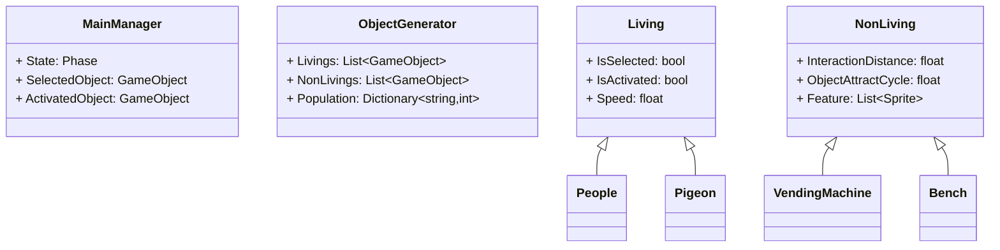
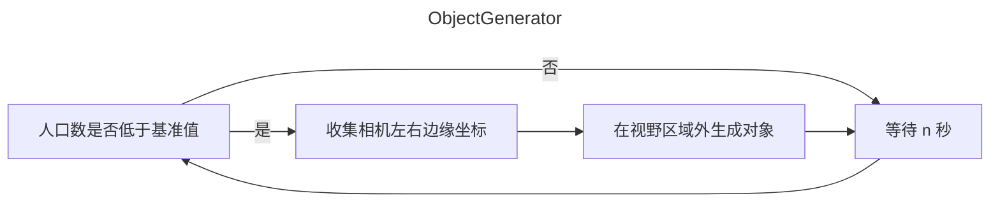
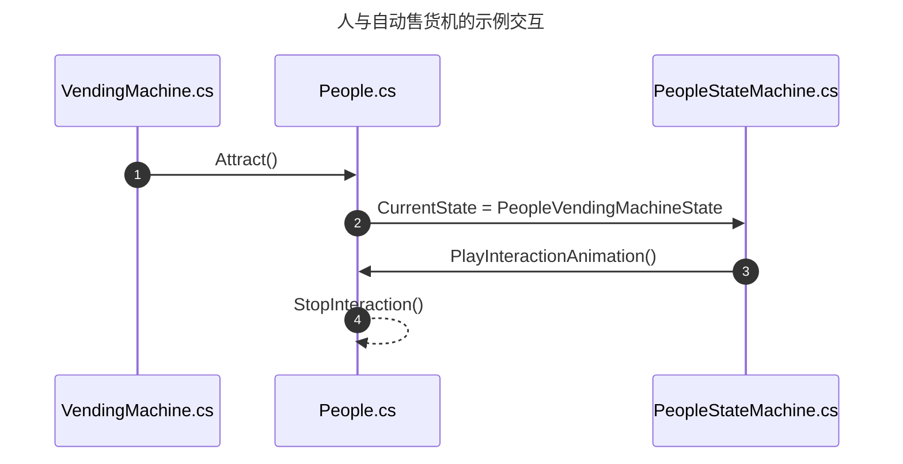
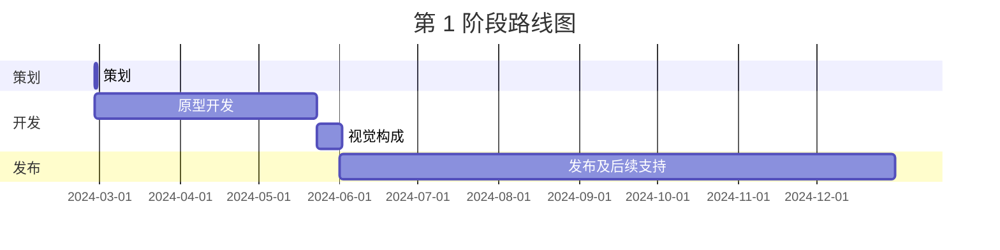

---
image:
    path: /2024-04-30-armonia-first-devlog/gameplay.webp
    lqip: data:image/webp;base64,UklGRiQBAABXRUJQVlA4TBgBAAAvD8ABAM1kRP9jE+UpQv/D4CCSJEXqOXpmBhts/1W8BGZa6B0bG44kyW2bnQUUHM7+//t8zQmA2wiMHEXSexc+ENN/QdRAxJC9WSlicZYaCiHEiBEEBULCMMoQhMMi0bv93TqZbAMSDEWRd+s75TKrKm4VicC+vLm9fnxs++PKnIq5yl2/HI/H7Znt/PFTbA+vP6RcraP+/u4u769YybUSgygQFMaTzCmCmruS9R8Wur+T874jmH1RRSUTIWlnwwMxK3/FTqFkkIRu7it/NDlMKxKqKhJtqW+MXnKWekjlKoNGylt4ripQbry6Ou5Me5Ctq6J0E8qGQe2+v3Tlrj/5bLz7VimPuFYRKZDFKkBIEQUROUhNEJEA
    alt: 正在开发的原型
    
title: "'行尽地'，第一次开发中期记录"
authors: ["dev"]

categories: [마일스톤, 게임 개발]
tags: [마일스톤, 게임 개발, 유니티, C#, 행선지, 개발, 개발일지]
start_with_ads: true

toc: true
toc_sticky: true

date: 2024-04-30 18:14:00 +0900
last_modified_at: 2024-05-23 23:11:00 +0900

mermaid: true
---

## **前言**

> 接[前一篇文章](https://hyngng.github.io/posts/armonia-devlog-planning/)。

这是有趣而再次挑战的[第四个里程碑](https://hyngng.github.io/categories/%EB%A7%88%EC%9D%BC%EC%8A%A4%ED%86%A4/)开发记录。为了在制作过程中整理笔记，也需要进行中期检查，所以简单整理了约一个月的工作成果。本开发阶段制作的内容整理如下。

- 游戏系统
	- [x] 随触摸输入的平滑相机移动
	- [x] 屏幕内对象的选择、操控及互动
	- [x] 确保对象数量控制在特定数量以下
	- [x] 部分对象获得指定范围内的随机个性
	- [x] 确保对象仅存在于相机视野内

- 新增对象
	- [x] 人、鸽子等 2 种生物对象
	- [x] 房屋、地铁等 7 种背景对象
	- [x] 消火栓、交通锥等 6 种街头对象

## **归档**

{: .w-75 }
_实现人物时。玩家可以成为任意对象，与周围环境互动。_

## **资源制作**

### **图像资源**


_绘制的背景图像_

为了营造城郊风格的背景，我查找了城市插画、小区建筑照片或街景等作为参考，制作了背景图像资源。由于希望为语言翻译等本地化保留可能性，我没有加入广告纸、报纸、书法招牌等含有文字的元素；同时希望有手绘的感觉，所以使用了粗糙质感的线条，并有意不使用直线工具，结果虽然有些歪斜，但画得还算整洁，比较满意。

说起来，虽然很有成就感且不错，但分辨率似乎太高了。尝试过缩小图像，但因为不是一开始就以低分辨率制作的，所以图像模糊严重，效果不佳。如果以较低分辨率绘制的话，应该也能表现出同样的感觉，这一点有点遗憾。

### **精灵 Shader**

开发过程中遇到的一个难关。该项目中的对象普遍使用 Sprite 组件，但 Unity 的默认 Shader 中没有支持接收阴影（Receive Shadow）的精灵用 Shader，所以需要找到并使用其他人制作的。

使用后发现这个 Shader 虽然工作正常，但因为是 Unlit Shader，所以不会生成阴影（Cast Shadow）。我希望对象之间能有阴影效果，进一步了解后发现 Unlit Shader 根本无法实现 Cast Shadow 功能。我需要一个可应用于精灵且不反射光线的、能生成阴影的 Shader，但由于我对 Shader 一窍不通，很难实现。这部分需要进一步了解。

### **动画资源**

{: .light .w-25 .border }
{: .dark .w-25 }
*飞翔的鸽子*

动画也有直接绘制使用的。例如鸽子的动作，用 Unity 动画组件很难实现，所以像制作传统动画一样，一帧一帧地绘制并拼接起来。之前从未画过动物动作的动画，所以找了鸽子走路、飞翔的视频，观察并绘制。

制作时，我没有使用简单单一的动画，而是将动画流程细化为多个阶段。例如鸽子飞走的样子，分为飞向天空的 EnterFly 动画、空中滞留的 BeingFly 动画、着陆的 EndFly 动画三个独立的组输出，并与状态模式联动使用。因此，如上述[归档](#归档)所示，效果看起来相当不错。


*行走的人物与感性萤火虫*

不过基本上还是用了 Unity 的动画组件。上面的示例是人物的行走动画根据位置变化自动左右翻转或调整播放速度的场景，由于没有预先留下资料，看起来不太明显，但这是没有逐帧动画，而是将头、躯干、四肢等碎片化组装，各自位置分别调整的样子。

顺便一提，动画相关的工作似乎是最难的。特别是动画制作与编程不同，在个人层面上没有特别的突破口，这一点每次感受都很深刻。工作效率完全取决于个人技能水平。专业的动画师们是如何做这种工作的呢，真是不清楚。

## **开发过程**

为了改善[上次经验](https://hyngng.github.io/posts/palette-developing/)中的不足之处，我付出了努力。特别是注意不要丢失代码的可维护性，有意识地遵循 SOLID 原则。当觉得某个类可能要变大时，就严格遵循单一职责原则进行拆分，更谨慎地使用访问修饰符关键字，更细化地说，还积极使用了类属性或 `#region`。

考虑到中途需要备份，还使用了 [Unity 版本控制 (VCS)](https://www.plasticscm.com/)，非常方便。如果熟悉 GitHub，很快就能适应，尤其喜欢在开发过程中随时可以通过 Unity 内部界面上传。

### **类设计**



在开始开发之前，我考虑了类的角色和类间关系，构想了基本框架。不过没有到绘制 UML 图的程度，只是在个人层面上进行了足够的形式化，以防止过于即兴的设计导致复杂结构的产生。除了上述内容外，还有其他类的内容，但全部包含会使图表过于庞大复杂，所以只挑选了最具代表性的。

除了脚本成员之外，还预先考虑到了 `MainManager` 以单例模式使用并采用事件驱动编程、`Living` 和 `NonLiving` 作为父脚本使用状态模式，并且确实如此实现。

虽然在开发过程中引入了一些编程模式，或者将从 `MainManager.cs`{: .filepath } 变得臃肿的触摸相关代码分离到了 `TouchManager.cs`{: .filepath }，实际形态发生了很多变化，但先确定大框架确实方便。这次受益匪浅，下次再开发什么时，也打算先画个简单的图表。

### **地图生成与管理**

{: .w-75 }


```cs
void GenerateObjects(List<GameObject> instantiated, List<GameObject> instantiable)
{
    GameObject tempInstantiated = instantiated[instantiated.Count - 1];

    for (int i=instantiated.Count - 1; i>0; i--)
        instantiated[i] = instantiated[i - 1];
    instantiated[0] = tempInstantiated;
    
    instantiated[0].transform.position = new Vector3(
        instantiated[1].transform.position.x - objectSize, 0, 0
    );

    /* ... */
}
```

地图生成是第一次自己尝试。之前也查找过 BSP 等程序化地图生成算法，但感觉与我想做的相去甚远，而且似乎也不需要那么复杂的系统，于是决定自己制作。

- 满足以下条件：
	- 一次性生成的地图保存至游戏结束
	- 地图相关对象仅在屏幕内可见
	- 每局打乱列表顺序，以不同方式构成地图

结果制作了一个以视野为基准运行的分阶段地图生成流程，使其不依赖于设备屏幕比例。利用游戏对象列表，列表中的第一个值保持为左侧边缘的对象，最后一个值为右侧边缘的对象；根据相机视野，对象会被新实例化或调整顺序。结果比预想的运行得更好。

### **对象生成**



```cs
void GenerateObject(GameObject targetObject)
{
    bool spawnAtLeft = Random.value > .5f;
    float spawnPosX = spawnAtLeft
                    ? MainCamera.GetRenderWidth(gameObject).Left - 1.8f
                    : MainCamera.GetRenderWidth(gameObject).Right + 1.8f;

    GameObject generatedObject = Instantiate(
        targetObject,
        new Vector3(
            spawnPosX,
            targetObject.GetComponent<BoxCollider>().size.y / 2,
            Random.Range(-3.5f, 3.5f)
        ),
        Quaternion.identity
    );
    generatedObject.transform.parent = standardObject.transform;
    GeneratedObjects.Add(generatedObject);
}

IEnumerator ManagePopulation()
{
    while (true)
    {
        GenerateLiving(LivingToGenerate);
        yield return new WaitForSeconds(GenerationDelay);
    }
}
```

对象生成之前有写过类似的代码，所以不算太难。使用 `ViewportToWorldPoint()` 在视野外实例化对象，对象实例化后，在视野外经过 n 秒则消失。

不过还有需要完善的地方。例如相机快速向左右某一方向移动时，会出现没有人的空荡荡的村庄，过一段时间后左右才逐渐出现人，看起来非常不自然，需要通过保持相机左右区域的对象密度恒定来解决。

### **交互**



作为游戏核心的对象间交互，我让作为交互主体的对象调用交互。在协程中每隔一定时间使用 `Physics.OverlapBox` 获取范围内的对象，然后对其中随机一个对象调用交互。使用了状态模式，具体如上所述。

不过可能是因为我还不熟悉状态模式，感觉流程过于混乱。不知道有没有比这更简单的实现交互的方法。

## **结语**

迄今为止的开发过程中，游戏开发确实有趣且令人有成就感。先构想体系，基于构想的策划案收集资料，资料不足则自己制作并应用，通过这些复合过程得出的结果以明确的视觉反馈呈现时，确实有一种独特的成就感。

- 后续仍有以下任务：
	- [ ] 添加音效音频
	- [ ] 利用程序化动画
	- [ ] 对象及交互多样化
- 或者想尝试以下内容：
	- [ ] Toast 通知
	- [ ] 空气透视

开发过程中，因忙于重新装修博客而浪费了约 2 周时间。希望剩余的一个月左右能保持专注不分心地节制自己，在期限内顺利完成。


