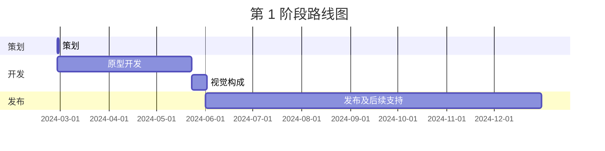

---
image:
    path: /2024-05-31-armonia-second-devlog/gameplay.webp
    lqip: data:image/webp;base64,UklGRlYAAABXRUJQVlA4IEoAAADwAQCdASoQAAgAAUAmJQBOgB8xi/GXoBAA/vuITP1jzd5vh9i82itNyxKJOlCBXvOebik8444+JnSUJik6FdPY8GR+D5jZO/WAAA==
    alt: 正在开发的原型
    
title: "'行尽地'，第二次开发中期记录"

categories: [마일스톤, 게임 개발]
tags: [마일스톤, 게임 개발, 유니티, C#, 행선지, 개발, 개발일지]
start_with_ads: true

toc: true

date: 2024-05-31 22:53:00 +0900
last_modified_at: 2025-12-26 11:40:00 +0900

mermaid: true
---

## **前言**

:::info
接[前一篇文章](https://hyngng.github.io/zh/dev/armonia-first-devlog/)。
:::

这是我的[第四个里程碑](https://hyngng.github.io/categories/%EB%A7%88%EC%9D%BC%EC%8A%A4%ED%86%A4/)的开发记录。整理了又一个月的工作成果。这一个月的工作主要是扩展游戏系统和内容，具体在本阶段制作的内容如下。

- 游戏系统
	- [x] 背景对象分层
	- [x] 通过替换 Shader Graph 进行优化
	- [x] 通过双指缩放进入的设置窗口
	- [x] 使用程序化动画的对象交互
- 新增对象
	- [x] 充当背景的 2 种建筑对象

## **归档**

{: .w-75 }
*进入设置窗口测试中录制*

## **资源制作**

### **图像资源**

{: .light .w-25 .border }
{: .dark .w-25 }
*啄地的鸽子*

我们会继续添加关键帧格式的动画。这次为了给鸽子实现啄地动作，制作了动画。动画篇幅很短，而且最重要的是有[之前制作好的资源](https://hyngng.github.io/posts/armonia-developing-first/#%EC%95%A0%EB%8B%88%EB%A9%94%EC%9D%B4%EC%85%98-%EC%97%90%EC%85%8B)，所以没有像之前那样需要找其他鸽子视频观察特征来模仿的负担。

与之前类似，创建了 `DigState.cs` 并与状态模式联动，因此动作看起来很自然。交互的触发条件是在选中鸽子的情况下触摸地面。

### **Shader 文件**

下文将详细说明，由于 GPU 成本问题，我将正在使用的 2D 精灵 Shader 更换为了更轻量的版本。但问题是这个 Shader 没有生成阴影<sup>Cast shadow</sup>功能，且不应用后期处理的景深<sup>DOF</sup>效果。虽然能改进更好，但我对 Shader 还不熟悉，可能需要认真学习，或者放弃表现上的功能。

## **开发过程**

### **相机风格的设置窗口实现**

{: .w-75 }
*通过双指缩放进入设置窗口，目前仍是原型。*

设置窗口为了最大限度地保留没有 UI 的干净画面，并使其成为一种有趣的呈现方式，设计为不显示单独的 UI，而是通过双指缩放进入。双指缩放分阶段运作，在特定范围内作为普通相机的拉近拉远操作，但超过特定范围后，伴随震动反馈进入设置窗口。已进入的设置窗口可以通过双指拉出退出。

设置窗口 UI 被设计成看起来像相机。偶尔拍照时，从平时观看 POV Street Photography 视频中感受到的感觉被直接移植了过来：手中屏幕里的场景仿佛穿透了我和被摄体之间的屏障，场景以真实感连接起来，我想模仿这种体验。

电池和时间分别使用 `SystemInfo.batteryLevel` 和 `DateTime.Now` 来显示真实电池状态和时间；快门速度和光圈值将分别作为控制后期处理的运动模糊和景深效果的选项。

虽然还有需要完善的地方（如文本以默认字体显示等），但仅目前制作的内容已经给人以独特的体验感，首先还是比较满意的。

### **应用程序化动画**

{: .w-75 }
*附近有鸽子时会看过去*

在制作[上一个里程碑](https://hyngng.github.io/zh/dev/palette-second-devlog/)时，我看到利用程序化动画创建与环境互动的有机动画，觉得非常棒，所以记住了，这次尝试了一下。原本以为是通过技术上精密的调节条件来实现的，但因为是 Unity 包提供的，所以比想象中简单，不过用代码控制比想象中复杂。

与鸽子不同，人的头部、身体、腿部等是作为独立对象分开的，我利用 [Animation Rigging 包](https://docs.unity3d.com/Packages/com.unity.animation.rigging@1.1/manual/index.html) 的 `Multiple Aim Constraint` 组件，尝试实现了人的头部对象在特定距离内看向鸽子的功能。

```cs
public void ChangeSourceObject(GameObject discoveredObject)
{
    WeightedTransformArray sourceObjects = Constraint.data.sourceObjects;
    WeightedTransformArray newSourceObjects = new WeightedTransformArray(sourceObjects.Count);
    
    newSourceObjects[0] = new WeightedTransform();
    WeightedTransform wt = newSourceObjects[0];

    /* ... */

    newSourceObjects[0] = wt;
    
    data.sourceObjects = newSourceObjects;

    Animator.enabled = false;
    rigBuilder.Build();
    Animator.enabled = true;
}
```

要实现该功能，需要将 `Multi Aim Constraint` 组件的 `sourceObject` 属性替换为场景中的对象，这个过程有很多难关，费了不少劲。如果有谁想通过代码更改程序化动画的 `sourceObject`，以下内容可能会有所帮助。

- `sourceObjects` 的属性是只读(read-only)的。需要在其他局部变量中定义数据后，将新值赋予 `data.sourceObjects`。
- 赋值完成后，需要先禁用该对象的动画器，构建 `rigBuilder` 后再重新激活动画，才能正常生效。
- 如果某个对象被注册为其他对象的 `sourceObject`，则当该对象被删除时，需要将注册了它的 `sourceObject` 属性改为 `None`。

即使查阅了[官方文档](https://docs.unity3d.com/Packages/com.unity.animation.rigging@1.0/api/UnityEngine.Animations.Rigging.html)，也有很多难以找到解决方案的行为或错误，令人棘手，但最终效果还不错。实现之后，确实对游戏氛围起到了柔化作用。以后如果做 3D 玩具项目的话，一定要更好地利用它。

### **使用 Profiler 尝试优化**

{: .w-75 }
*用 Unity Profiler 测量的示例数据*

我的游戏很奇怪，构建后连 40FPS 的帧率都维持不了，发热严重。虽然我的代码并不完美，但我认为自己在基本方面做得不错，比如避免 `GetComponent()`、`Find()` 等重量级函数，注意不让 `for`、`foreach`、协程等有重复操作的代码过度运行，因此对于一个理应很轻量的 2.5D 项目却掉帧，实在无法理解。

调试过程中，手机很快就变热的感觉令人不适，于是我首次挑战使用 Profiler 进行优化。过程比想象中简单：在 Unity Profiler 录制的数据区间中，找到帧率测量值较高的部分，找出什么任务执行得最多，然后改进该部分即可。

在我的情况下，`Semaphore.WaitForSignal` 占用了 50~70% 的份额，看到一篇帖子说这种情况通常建议将 Shader 更换为更轻量的版本，于是将[之前找到的 Shader 文件](https://hyngng.github.io/zh/dev/armonia-first-devlog/#%EC%8A%A4%ED%94%84%EB%9D%BC%EC%9D%B4%ED%8A%B8-%EC%85%B0%EC%9D%B4%EB%8D%94)替换为了更轻量的版本，结果帧率大幅上升，发热也显著减少。

## **发布标准**

### **完成需要目标**

为各种对象分别制作动画和互动，虽然本质上是一件有趣且令人兴奋的事情，但感觉花费的时间和精力比预想的多。我以为随着熟练度和经验的增长，工作效率会提高，实际上也确实提高了很多，但输入代码或制作关键帧动画仍然需要打字或在屏幕上画线等最低限度的体力劳动。

随着项目变大、需要处理的资源增多，我开始切实感受到自己的负担在不断增加。以前在 Unity 发布的游戏行业报告中看到过一句忠告："不要贪多嚼不烂（Don't bite off more than you can chew）"，我担心自己目前的情况是否正在朝那个方向发展。

因此，我认为需要有一个作为目标点的发布标准，暂时决定以能够申请[谷歌推荐展示位](https://play.google.com/console/about/guides/featuring/)为目标。谷歌推荐展示位对高质量应用和游戏提出了明确的标准，其中具有代表性的包括以下内容：

- [高用户评分](https://support.google.com/googleplay/android-developer/answer/138230?hl=en)
- [Google Play 政策](https://play.google/developer-content-policy/#!?modal_active=none)遵守情况
- [高 Android Vitals](https://support.google.com/googleplay/android-developer/answer/9844486?hl=en&visit_id=638527380779176477-2227653483&rd=1) 分数
- 是否遵守 Android 和 Google Play [核心应用质量指南](https://developer.android.com/quality?hl=ko)

特别是 [Android Developers](https://developer.android.com/quality?hl=ko) 对良好的用户体验提出了可用性（备份与恢复等）、可访问性、本地化、深层链接、视觉吸引力与工匠精神（动画、音频、控件等）……除此之外还有许多标准和示例。虽然需要进一步细化，但作为大致的标准，值得参考。

### **其他自定详细标准**

- 应用
	- [ ] 应用图标
	- [ ] 3D 音效
	- [ ] 简单的教程
	- [ ] 内部文本本地化
- 对象
	- [ ] 5 种以上对象
	- [ ] 每个对象 2 种以上个性
	- [ ] 每个对象 3 种以上互动
- 背景
	- [ ] 雨、雪等天气系统
	- [ ] 包含云的动态天空盒
	- [ ] 屏幕上保证有 3 个以上背景对象

## **结语**



按照原路线图，在文章发布的今天或明天应该完成，但不知道是能力不足还是什么，差得远呢。需要制定新的路线图，更重要的是，需要更详细地确定每个季度的角色和目标。

另外，由于 6 月份将开始补充役兵役履行，我会暂时放下开发去训练所。虽然还不清楚未来的情况，但希望能在可能的情况下，继续稳步开发，以能够在商店上架为目标。
