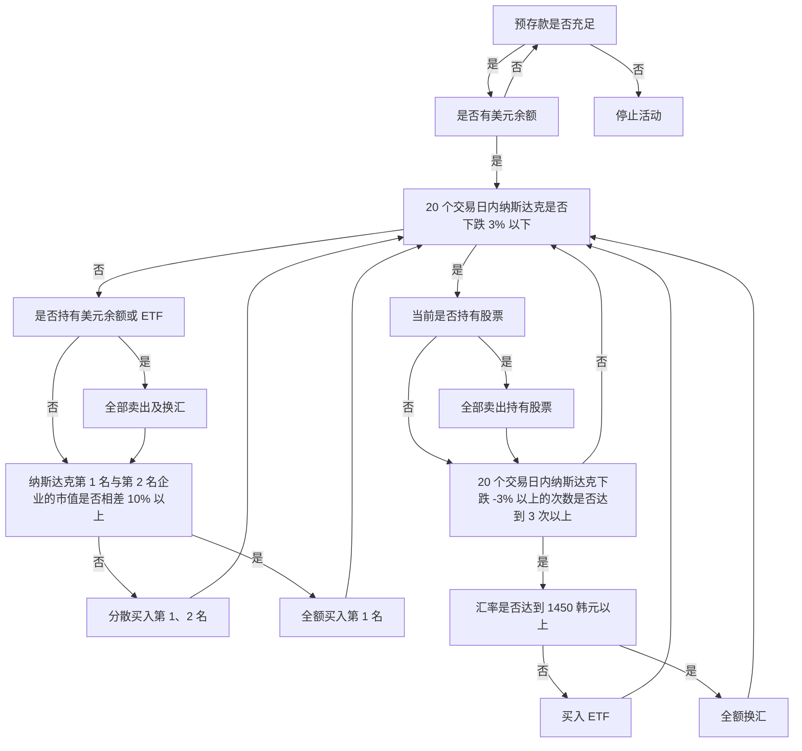

## **自动股票交易机，ASTP**

ASTP(Auto Stock Trading Program) 是以根据内部算法自动买卖股票为主题的，这是我的[第二个里程碑](https://github.com/hyngng/astp/tree/legacy)。大一第二学期结束后，我想自己做点程序，这时听熟人提到自动股票交易机，产生了兴趣，于是开始制作。该程序使用 Python 编写，与股票相关的部分在熟人的帮助下，仅简单遵循基础策略的形式制作。

## **程序特点**

使用了韩国投资证券的 [OpenAPI](https://www.truefriend.com/main/customer/systemdown/OpenAPI.jsp?cmd=TF04ea01200)。这是我第一次制作使用 API 的程序，能做的事情比预想的多，让我很惊讶。交易策略遵循以下两种，以纳斯达克为基准运作。

- 算法概要
	- **股票买入**：考虑 NDX 指数与纳斯达克市值排名前两位企业的比率来买入股票。
	- **股票卖出**：当 NDX 指数暴跌或韩元兑美元汇率过度上涨时，将持有的股票全部卖出，停止交易活动 20 个交易日。NDX 指数是否暴跌，通过比较股票市场开盘和收盘时分别在 Excel 中输入的 NDX 指数最大值和最小值来判断。
- 使用的库
	- `mojito`：韩国投资证券 OpenAPI 集成的 Python 参考模块。
	- `yfinance`：用于获取纳斯达克市值排名。
	- `BeautifulSoup`：用于通过爬虫获取所有股票模块中缺失的 NASDAQ-100 数据。

## **结构及示例代码**



```python
# NDX 爬取
def get_ndx():

    if response.status_code == 200:
    
        html = response.text
        soup = BeautifulSoup(html, 'html.parser')

        ndx_class = soup.find(class_ = 'Fw(b) Fz(36px) Mb(-4px) D(ib)')
        ndx = re.sub(r'[^0-9]', '', ndx_class.get_text())

    else:
        print(response.status_code)
    
    return ndx

# NDX -3% 检查
def ndx_collapsed():

    df_ndf_data['ndx_index'] = df_ndf_data['ndx_index'].astype(float)
    ndx_decrse_3per = False

    ndx_max = df_ndf_data['ndx_index'].max()
    ndx_min = df_ndf_data['ndx_index'].min()

    if 100 * (ndx_max - ndx_min) / ndx_max > 3:
        ndx_decrse_3per = True
        print("\nNDX 数值波动较大。\n")
    else:
        print("\nNDX 数值稳定。\n")

    return ndx_decrse_3per
```

## **程序运行示例**

{: .w-75 }
*程序运行示例及通过程序买入 1 股苹果的画面*

由于是无 UI 的简单 Python 程序，通过命令提示符即可正常运行，程序一旦运行，在手动终止之前会自行发出买入和卖出订单。已成交的卖出订单可以通过提示符窗口或韩国投资证券应用程序，如下面截取的画面所示，确认是否买入及持股情况。

## **注意事项及局限**

- 美国股票市场在韩国时间 PM 11:30 ~ AM 6:30 开放，因此以海外股票为基础的 ASTP 与一般程序不同，在可以确认代码运行的时间上存在限制。
- 为了使用韩国投资证券提供的服务，程序之外需要两项准备工作。
    1. 必须开设韩国投资证券账户并申请 [OpenAPI](https://apiportal.koreainvestment.com/intro)。在申请页面获取 `key` 和 `secret`，将这些值与虚拟账号一起保存在项目内的 `mock.key` 中使用。
    2. 为了处理订单收发或余额查询等，必须安装韩国投资证券提供的 [eFriend Expert](https://www.truefriend.com/main/customer/systemdown/OpenAPI.jsp?cmd=TF04ea01200) 程序。
- 此外，由于共同认证证书模块不支持 64bit 环境，虽然不便，但需要任意构建 [32bit 虚拟环境](https://hyngng.github.io/posts/virtual-32bit/)，并在构建的虚拟环境上运行代码。

## **结语**

:::tip
您可以在 [GitHub](https://github.com/hyngng/astp/tree/legacy) 上查看更多详情。
:::

在制作这个里程碑的过程中，我重点体验了使用 API 或库等外部模块，亲自使用后，我深切认识到只有积极利用已有的模块，才能做更多的事情。也了解了如何排序和显示纳斯达克指标及各企业市值等数据。

虽然以大约 237 行的简洁代码收尾，但我想以后如果扩展这个程序，如果能进一步细化买入和卖出条件，并通过分类化来简洁整理代码，那就更好了。
