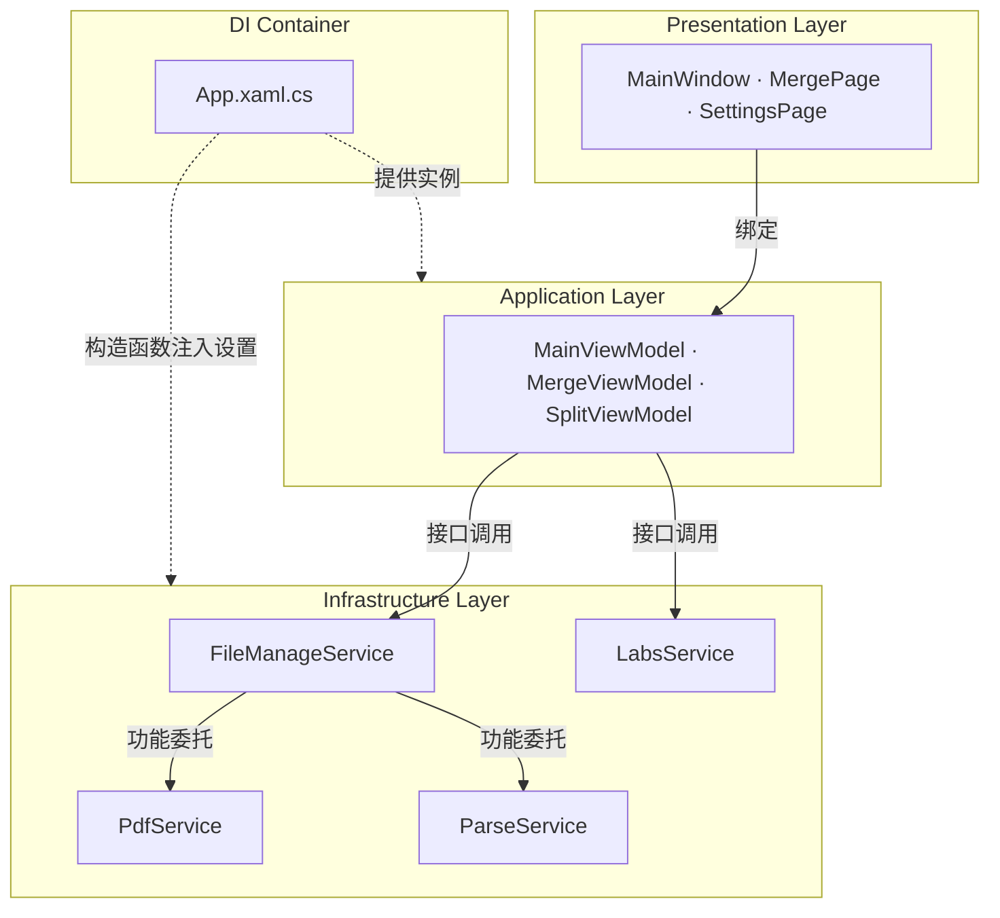

---
image:
    path: /2026-04-02-pascal-devlog/preview-image.webp
    lqip: data:image/webp;base64,UklGRj4AAABXRUJQVlA4IDIAAADQAQCdASoQAAgAAUAmJZwCdAEPDuQrCAD+/crO2PZZpBuP/xETb+8eyANti2KhVUAAAA==
    alt: "临时使用的程序名是'Pascal'"

title: "基于 WinUI 3 的 PDF 编辑程序开发回顾"
authors: ["dev"]

categories: [마일스톤, 기타 개발]
tags: [마일스톤, 기타 개발, WinUI 3, MVVM, XAML, C#]
start_with_ads: true

toc: true

date: 2026-04-02 11:14:00 +0900
last_modified_at: 2026-06-23 16:47:00 +0900

mermaid: true
---

## **开发动机**

> "谢谢，但我们是公共机构，不能随便用外部程序"

在社会服务期间，办公室里遇到了一个问题。[社会服务人员工作后记文章](https://hyngng.github.io/posts/sabok-logs/)中有更详细的整理，简单概括就是公共机构不能随意使用未经许可的外部程序，这个经历成为了程序开发的动机。不过，我并不是仅仅出于"直接自己做一个来用"的想法开始的。因为想在不同的语境下使用通过 Unity 初次接触的 C#，也想认真做一次 Windows 程序，所以才大胆开启了新项目。

程序名叫 Pascal 的原因是最初以 PDF 压缩功能为目标开始开发的。虽然压缩功能最终因为在退伍前夕，算下来不划算而没有实现，但 PDF 文件操作这个脉络已经通过合并和拆分两种功能先实现了。

## **程序介绍**

{: .light }
{: .dark }
*完成后的 4 个页面的截图。从版权窗口可以看出并不是什么非常严肃的程序*

Pascal 是执行 PDF 合并、拆分操作的程序。在社会服务期间大约花费了 2 个月开发，非常幸运的是[有一位志在成为开发者的同事](https://github.com/din-c)，所以我们在工作空闲时间开设了专用的 Notion 页面，进行了一次小型协作。原本计划将 PDF 文本提取、JPG 转换、压缩等多种办公相关功能集成到这个程序中使用，但由于职业发展方面的原因以及所剩无几的服务期限，最终只实现了几个基础功能就收尾了。

公开能够特定机构的信息是兵务厅不推荐的行为，出于尊重这一立场，虽然很难准确描述在什么情况下如何被使用，但可以简要说明一下。首先，拥有这个程序的感觉在心理上给了我很大的帮助；其次，以前运行 Python 脚本前需要每次都修改 `config.yaml` 设置值等原始的工作形态，现在通过点击几个按钮就能得到很好的简化。

- 已实现的功能
	- 合并多个 PDF 文件
    - 可更改合并顺序
    - 可指定合并页面
	- 同时拆分多个 PDF 文件
    - 可指定拆分单位
    - 可指定拆分范围
	- 显示 Windows 更新画面（实验室）

## **开发的难解之处与适应努力**

### **WinUI 3 框架**

在开发 Windows 程序方面，我没有先前的知识和经验，从选择框架的阶段开始就难以确定方向。一开始想复用前端开发经验，先找到了 [Electron.NET](https://github.com/ElectronNET/Electron.NET)，结果连他们自己都在问"等等——你把 .NET Core 应用托管在 Electron 里？为什么？"，这让我感觉与正统方向相去甚远。恰逢此时我了解到 [Fluent 2](https://fluent2.microsoft.design/) 这个微软设计语言，就转向了使用 [ModernWPF](https://github.com/Kinnara/ModernWpf) 库的 WPF 项目，但在开发过程中觉得以 2025 年的标准来看，这种遗留环境已经落后了，于是将开发环境转移到了最新框架 WinUI 3。

这段经历事后有一个需要指出的部分。据我所查，微软在过去 20 多年里，从 WinForms 开始，到 WPF、UWP、WinUI 3，再到最近的 MAUI，推出了大量与旧平台不完全兼容的新框架。因此，Windows 程序开发框架不同于移动端、Web 端、游戏等其他领域的开发，在应该以什么为标准方面标准确实模糊，在我写这篇文章的此刻回想起来，我觉得自己走过的弯路多少是一种必经的仪式。

|前端 Web 开发|WinUI|
|---|---|
|HTML|XAML|
|CSS|XAML Style|
|JavaScript|C#|

不过第一印象好的地方是，WPF 和 WinUI 3 的开发体验与前端 Web 开发非常相似。这一点还挺有趣的。用 XAML 定义 UI 组件和属性，用 C# 编写具体逻辑的过程，与 HTML 和 JavaScript 的运作方式相同，样式定义方面如果有 CSS、SCSS 经验也不难，所以 UI 框架很快就适应了。

不过 WinUI 3 的生态虽然在微软的持续支持下，仍然比较贫乏。例如浏览 [WinUI-3-Apps-List 项目](https://github.com/DesignLipsx/WinUI-3-Apps-List?tab=readme-ov-file)会发现数量还算有一些，但质量不高。尤其是开源公开代码的更是少之又少，因此很难了解其他人实际是如何使用这个框架的。所以关于如何推进 WinUI 3 项目的思考，只能通过钻研[微软提供的官方文档](https://learn.microsoft.com/ko-kr/windows/apps/winui/winui3)来演绎式地解决，而韩文翻译版本完成度较低，英文文档实际上是唯一的选择，LLM 在这个领域也没有太大帮助。这是初期学习成本较高的部分。

### **IDE、.NET、库**

我喜欢 VSCode 的简洁，所以远亲 Visual Studio 对我来说有点陌生。更何况我从未尝试过 WinUI 3 这个陌生的框架。熟悉解决方案、NuGet、设计器这些术语以及菜单栏提供的功能本身就是第一个瓶颈，在功能实现之前，我花了比预想更多的时间来理解开发环境的结构。

特别是查看 [WinUI-Gallery](https://github.com/microsoft/WinUI-Gallery)、[DevWinUI.Gallery](https://github.com/ghost1372/DevWinUI/tree/main/dev/DevWinUI.Gallery)、[Files](https://github.com/files-community/files) 等其他开源项目时，可以看到它们遵循着 `Services`、`Helpers`、`Modules` 之类的某种方言。这种方式在 Unity、Python 或前端项目中不太常见，所以一开始有点陌生。除了学习功能本身之外，还需要探索阅读项目的方式，并把我原有的感觉翻译、应用到该项目中。

尽管如此，我能够在 WinUI 3 环境中很好地安顿下来，得益于 [Windows Community Toolkit](https://github.com/CommunityToolkit/WindowsCommunityToolkit) 和 [DevWinUI](https://github.com/ghost1372/DevWinUI) 这两个出色的控件库。在处理 UI 的 .NET 开发环境中，UI 元素被称为控件，这两个库提供了非常多样的控件，所以除了 `DataTable` 之外，大部分功能都能不难地实现。这降低了初期进入成本。

### **相当陌生的 MVVM 模式**

这是最陌生的部分。除了了解 XAML 或 C# 语法之外，还需要对 MVVM 有感觉。MVVM 本身不是 WinUI 开发的必要条件，但框架本身是基于 MVVM 设计的，如果不遵循它，代码维护的难度会急剧上升。这是与 Unity 开发体验截然不同的地方。

降低代码间依赖度的概念本身是熟悉的，但 MVVM 实际上如何实现这一点，模型、视图、视图模型三个领域能做到什么程度、从哪里开始不该做什么、如何区分两者的差异，这些都需要学习。而且说实话，在写这篇文章的此刻，我的理解还是有些模糊。例如，复杂页面设置专用的 ViewModel，简单页面则省略；像文件拖放这样仅靠绑定难以处理的情况，使用 code-behind 作为桥梁等，我认为这是为了很好地遵守 MVVM 的最佳做法。但我不确定这到底是不是真正做好的最佳做法，即使是最佳做法，我也没能很好地感受到它的好处。

与此无关，[MVVM Toolkit](https://learn.microsoft.com/en-us/dotnet/communitytoolkit/mvvm/) 包在 WinUI 3 开发中几乎是必须掌握的。这个包帮助视图可以在不经过 code-behind 的情况下直接与 ViewModel 通信，从而可以改善为更直观的程序设计结构。

## **关于协作与工作效率的感想**

### **协作**

我平时习惯使用 Notion、Figma、GitHub，当然也打算在这个项目中使用它们。同事说他没用过这些工具，所以我简要说明了工具的使用方法以及为什么选择这些工具，这次还尝试了 Notion 中的 PARA 方法论，想要构建一套系统化的协作结构。

但实际除了 GitHub 之外，并没有得到预期的响应，说实话有点尴尬。并不是因为同事懒惰，而是 WinUI 3 这个新环境已经够吃力了，我似乎没有充分说明为什么需要 Notion、Figma 这些工具。我认为资源管理体系能让开发走得更远，所以觉得总是需要的；而同事似乎认为如果是与开发关系不大的成本，可以根据需要舍弃。后来我渐渐觉得这个想法是对的。就像面向对象的效用一样，好的工具和好的模式也有其得以正当化的规模。我觉得自己是出于惯性盲目相信了好工具就是好东西。

虽然形式有所改变，但协作本身进行得很满意。我将工作区域划分为视图和视图模型，同事负责视图模型和模型，修改内容则互相共享、审查，经过相互二次修改的方式推进下去，能够交换观点本身就是令人满意的经验。代码编写习惯几乎一样，摩擦很少，这是额外的好处。

### **效率**

几年前，我看到一位海外作家为了全身心投入作品而想辞职的文章。一位读者留言建议"即使是因为你想做的事情，我认为无论什么理由辞职都不好"，而作家则以"我已经后悔让自己在不喜欢的职场办公室里让想象力死去"这样强有力的回应结束了争论。

在程序开发过程中我想起了这个轶事。创作艺术作品时常有的那种精神感应、自我实现的迫切感，这些并非程序开发所必需，所以严格来说我和他的情况不同。但对于处理消耗性事务的日常环境会如何消磨创作和工作推进意愿这一点，我有同感。

实际上，这个项目正是因为这个原因进展困难。在我想象某个 UI 控件可以如何使用的时候，被工作叫走，20 分钟后回到座位上重新恢复上下文时，座机又响了。不仅是在需要创意的时刻，即使是像检查 M-V-VM 之间的依赖流这样的简单调试工作，也因为频繁的干扰而难以集中注意力。我并不是想抱怨这是不公平的情况。只是这是我第一次确认，当环境上的余裕得不到支持时，工作效率可以下降到什么程度。

## **归档**

### **各种截图**

{: .w-75 }
*2025 年初，同事直接用 Python 构建给我的程序。也有用这个来高级替代它的目的*

{: .light .border }
{: .dark }
*2024 年底，针对几乎执行相同功能的程序的原始设计方案*

*在尝试各种东西时的样子。功能实现后，实际使用和开发并行进行*

### **简要架构**

### **使用的库**

- UI 及框架扩展
    - `Windows Community Toolkit`[MIT 许可证](https://github.com/CommunityToolkit/Windows/blob/main/License.md)
    - `DevWinUI`[MIT 许可证](https://github.com/ghost1372/DevWinUI/blob/main/LICENSE)
- PDF 文档处理
    - `PDFsharp`[MIT 许可证](https://github.com/empira/PDFsharp/blob/master/LICENSE)，负责 PDF 合并、拆分
    - `PdfPig`[Apache-2.0 许可证](https://github.com/BobLd/PdfPig.Rendering.Skia/blob/master/LICENSE.txt)，负责文本提取

### **开发中受益的文档**

- 图标相关
	- [Symbol 枚举](https://learn.microsoft.com/ko-kr/uwp/api/windows.ui.xaml.controls.symbol?view=winrt-26100)
	- [fluentui-system-icons](https://github.com/microsoft/fluentui-system-icons)
	- [Segoe MDL2 Assets icons](https://learn.microsoft.com/en-us/windows/apps/design/style/segoe-ui-symbol-font)
	- [FluentIcons.Wpf](https://www.nuget.org/packages/FluentIcons.WPF/)
- WinUI3
	- [快速入门：环境设置及创建 WinUI 3 项目](https://learn.microsoft.com/ko-kr/windows/apps/winui/winui3/create-your-first-pascal-devlog3-app?source=recommendations#unpackaged-create-a-new-project-for-an-unpackaged-c-or-c-pascal-devlog-3-desktop-app)
	- [命名空间 Windows App SDK](https://learn.microsoft.com/ko-kr/windows/windows-app-sdk/api/winrt/?view=windows-app-sdk-1.7)
	- [Teamplate Studio for WinUI](https://marketplace.visualstudio.com/items?itemName=TemplateStudio.TemplateStudioForWinUICs)
- MVVM
	- [MVVM 工具包介绍](https://learn.microsoft.com/ko-kr/dotnet/communitytoolkit/mvvm/)
- .NET 9
	- [高级 .NET 编程文档](https://learn.microsoft.com/ko-kr/dotnet/navigate/advanced-programming/)
	- [适用于 .NET 9 的 WPF 新功能](https://learn.microsoft.com/ko-kr/dotnet/desktop/wpf/whats-new/net90)

## **结语**

:::tip
您可以在[GitHub](https://github.com/hyngng/pascal.drill)上查看更多详情！
:::

库中的 DevWinUI 完全由以 [ghost1372](https://github.com/ghost1372) 名义活动的伊朗开发者 Mahdi Hosseini 管理。根据公开信息，他似乎在伊朗 Qeydar 市担任教师并居住在那里。而且说起来简直难以置信，2025 年 12 月 28 日，伊朗全国各地爆发大规模示威，伊朗强硬保守政权开始武力镇压。

根据维基百科，他所居住的 Qeydar 市也有示威报告。几天后，伊朗政府切断了全国互联网，ghost1372 的提交记录也从此中断，其未来动向也变得不明朗。DevWinUI 对 WinUI 3 生态的贡献不小，所以虽然开玩笑说过微软应该派直升机去救他，但当时确实无法确认他的安危，很是担心。幸运的是，现在又有新的提交上来了，看起来安然无恙。

- 其他杂谈
	- 处理这个项目期间，Visual Studio 2026 发布了2025 年 11 月 11 日。
	- DevWinUI 的版本从 `9.4.0` 升级到了 `9.8.0`。
