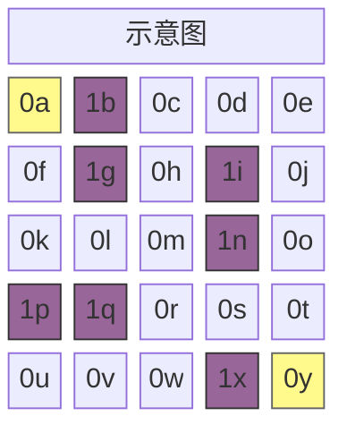
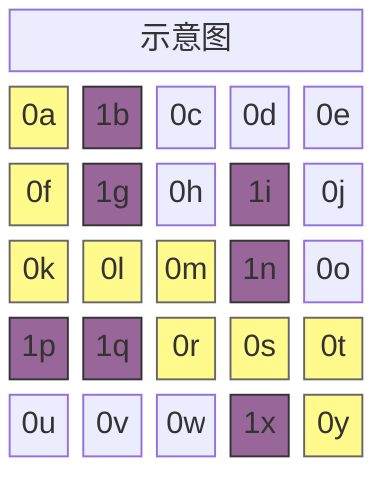

A* 算法是一种用于寻找连接两个特定点的最短路径的图搜索算法。该算法的特性可以用一个公式概括，其中 $n$ 表示节点：

$$
f(n) = g(n) + h(n)
$$

## **开放列表与关闭列表**

A* 算法在寻找最短距离时，会考察可移动相邻节点的成本。首先将考察对象加入开放列表（Open List），然后将考察结束的节点移入关闭列表（Closed List）。

```python
open_list = []
closed_set = set()
```

为了实现这一过程，使用两个列表。开放列表使用优先队列，关闭列表使用集合（Set）数据结构。

## **$g(n)$：单步移动成本**

$g(n)$ 是衡量移动到开放列表中候选节点时的成本的函数。如果地图由网格构成，上下左右移动成本为 $1$，如果可以对角线移动，对角线移动成本可计算为 $\sqrt{2} \approx 1.4$。在我编写的代码中，仅考虑上下左右移动。

```python
# 假设节点定义如下
class Node:
    def __init__(self, position, parent=None):
        # ...
        self.g = 0

# 可以表示如下
neighbor.g = current_node.g + 1
```

## **$h(n)$：到终点的距离**

$h(n)$ 是粗略估算从开放列表中候选节点到目标节点的移动成本的函数。例如选择餐厅时去人多的地方，或购买海外产品时将汇率估算为 1200~1400 韩元等，这些称为启发式（heuristic），因此也称为启发式估值。根据问题情况适当计算该值有助于提高算法性能，通常可通过以下方式获得：

- 示例 1：曼哈顿距离 $h(n) = |x_1 - x_2| + |y_1 - y_2|$
```python
def heuristic(start_node, end_node):
    return abs(
        end_node[x] - start_node[x]) + abs(end_node[y] - start_node[y]
    )
```
- 示例 2：欧几里得距离 $h(n) = \sqrt{(x_1 - x_2)^2 + (y_1 - y_2)^2}$
```python
def heuristic(start_node, end_node):
    return math.sqrt(
        (end_node['x'] - start_node['x'])**2 + (end_node['y'] - start_node['y'])**2
    )
```

## **用 Python 实现的算法**

```python
import heapq

class Node:
    def __init__(self, position, parent=None):
        self.position = position
        self.parent = parent

        self.g = 0
        self.h = 0
        self.f = 0

    def __lt__(self, other):
        return self.f < other.f

def heuristic(a, b):
    return abs(a[0] - b[0]) + abs(a[1] - b[1])

def astar(grid, start, end):
    open_list = []
    closed_set = set()

    start_node = Node(start)
    end_node = Node(end)

    heapq.heappush(open_list, start_node)

    while open_list:
        current_node = heapq.heappop(open_list)
        closed_set.add(current_node.position)

        if current_node.position == end_node.position:
            path = []
            while current_node:
                path.append(current_node.position)
                current_node = current_node.parent
            return path[::-1]

        x, y = current_node.position
        neighbors = [(x+dx, y+dy) for dx, dy in [(-1,0), (1,0), (0,-1), (0,1)]]

        for next_pos in neighbors:
            nx, ny = next_pos
            if not (0 <= nx < len(grid) and 0 <= ny < len(grid[0])):
                continue
            if grid[nx][ny] != 0:
                continue
            if next_pos in closed_set:
                continue

            neighbor = Node(next_pos, current_node)
            neighbor.g = current_node.g + 1
            neighbor.h = heuristic(next_pos, end)
            neighbor.f = neighbor.g + neighbor.h

            if any(n.position == neighbor.position and n.f <= neighbor.f for n in open_list):
                continue

            heapq.heappush(open_list, neighbor)

    return None
```

## **算法运行示例**

该算法判断给定节点的值：$0$ 为道路，$1$ 为障碍物。现假设以下地图。以黄色高亮的 $0a$ 和 $0y$ 分别为起点和终点。



```python
grid = [
    [0, 1, 0, 0, 0],
    [0, 1, 0, 1, 0],
    [0, 0, 0, 1, 0],
    [1, 1, 0, 0, 0],
    [0, 0, 0, 1, 0]
]

start = (0, 0)
end = (4, 4)

path = astar(grid, start, end)
```

在 $5 \times 5$ 大小的地图中，设置起点为 `(0, 0)`、终点为 `(4, 4)`，并适当布置墙壁时，最短路径 `path` 的输出如下：



```bash
[(0, 0), (1, 0), (2, 0), (2, 1), (2, 2), (3, 2), (3, 3), (3, 4), (4, 4)]
```
