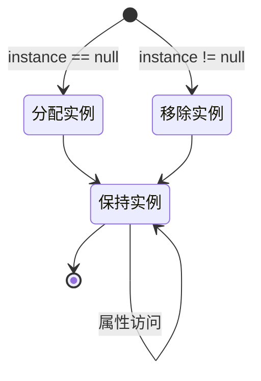

## **引言**

随着游戏开发深入，我越来越觉得有很多概念需要整理。虽然经常使用Notion或Obsidian，但毕竟和花时间整理出来的东西还是有差距的。

尽管如此，原本担心博客氛围会变得过于严肃，所以刻意避免详细撰写涉及技术概念的文章。但最近了解到博客的词源是 Web + Log 后，觉得整理学习内容的文章也不错。所以今后需要单独记录的内容，我都会趁着深入探究的机会，在博客中逐一整理出来。

首先整理的是单例(Singleton)模式。单例模式是一种确保特定类只有一个实例的设计模式，主要优点如下：

- 能够在多个脚本或场景中保持游戏整体状态一致
- 可以无冗余地管理音频、精灵、对象等数据
- 避免在单个类中重复使用重量级代码，性能更好

最先介绍单例模式是因为它很直观。很多人在学习游戏开发、代码编写达到一定程度后，就会接触到这个模式，其概念简单且易于使用。

## **结构可视化**



## **基本代码**

```cs
public class Singleton : MonoBehaviour
{
    private static Singleton instance = null;
    public static Singleton Instance
    {
        get
        {
            if (instance == null)
                return null;
                
            return instance;
        }
    }

    void Awake()
    {
        if (instance == null)
        {
            instance = this;

            DontDestroyOnLoad(this.gameObject);
        }
        else
            Destroy(this.gameObject);
    }
}
```

单例模式的规则可以归纳为以下两点：

- 确保类只能实例化自身的一个实例 (Ensures that a class can only instantiate one instance of itself)
- 通过单个实例提供全局访问 (Gives easy global access to that single instance)

因此在Unity中，单例模式的实现非常简单。上方的属性部分和下方的 `Awake()` 都只是确保实例只有一个。脚本的实例声明为 `static`，因此使用单例模式的脚本的字段或方法可以通过 `脚本名.Instance` 的形式从外部类访问。

## **实例创建**

```cs
public class Singleton : MonoBehaviour
{
    private static Singleton instance = null;
    public static Singleton Instance
    {
        get
        {
            if (instance == null)
            {
                GameObject gameObj = new GameObject();
                instance = gameObj.AddComponent<Singleton>();
                DontDestroyOnLoad(gameObj);
            }
                
            return instance;
        }
    }
}
```

之前当单例实例不存在时，只是将实例简单处理为 `null` 而不创建新实例，因此外部脚本访问实例时需要检查 `Instance` 是否存在，比较麻烦。如果觉得不方便，可以按上述方式修改属性部分，将实例化代码也连接起来。

这样每次访问属性时实例会自动创建，外部脚本无需单独检查实例是否存在，只需调用 `Singleton.Instance` 形式的代码即可访问单例实例。

## **创建多个**

```cs
public class Singleton<T> : MonoBehaviour where T : MonoBehaviour
{
    private static T instance;
    public static T Instance
    {
        get
        {
            if (instance == null)
                return null;

            return instance;
        }
    }

    private void Awake()
    {
        if (instance == null)
        {
            instance = this as T;
            DontDestroyOnLoad(gameObject);
        }
        else
            Destroy(gameObject);
    }
}
```

```cs
public class GameManager : Singleton<GameManager>
{
    /* 代码编写 */
}
```

单例脚本的实例默认只保持一个，因此从概念上来说无法同时使用多个单例实例。虽然可以通过复制代码勉强使用，但效率低下。如果想使用多个不同的单例实例，可以使用泛型以 `Singleton<T>` 的形式创建多个不同的单例脚本。

这样其他类也可以通过继承简单地变为单例。例如，如果想对 `GameManager.cs` 应用单例，可以按照上述方式继承 `Singleton<T>` 来使用。

## **使用示例**

```cs
public class GameManager : MonoBehaviour
{
    /* 单例声明部分 */

    public int Score;

    public void ResetScore()
    {
        Score = 0;
    }
}
```

```cs
public class Player : MonoBehaviour
{
    void AttackEnemy()
    {
        Enemy.TakeDamage();

        if (Enemy.HP <= 0)
        {
            Destroy(Enemy);

            GameManager.Instance.Score += 100;
        }
    }

    void Dead()
    {
        GameManager.Instance.ResetScore();
    }
}
```

在所有场景中通用存在且保持唯一实例这一特性，也意味着它适合用于 `GameManager.cs`，因为统管游戏数据或状态的脚本通常只有一个。与此相关，游戏管理器可以像上面这样使用单例模式。

假设玩家与敌人战斗，击败敌人时分数增加，死亡时分数重置。游戏管理器中定义了 `Score` 和 `ResetScore()`，`Player.cs` 作为外部类通过单例实例直接访问游戏管理器的 `Score` 和 `ResetScore()`。敌人死亡时 `Player.cs` 直接增加分数，玩家死亡时直接重置分数。

由于外部可以直接访问类成员，无需繁琐的 `GameManager` 实例创建过程即可实现这种结构。利用这一特性，将 `GameSystem.cs` 等管理器脚本作为单例使用时，可以构建如下字段或方法。

- 字段
	- `Score`、`CurrentLevel`、`EnemyCount`：用于存储等级、分数、剩余敌人数等主要游戏状态
	- `isGamePaused`、`IsMusicEnabled`：用于存储游戏是否暂停或背景音乐是否启用等
- 方法
	- `StartGame()`、`QuitGame()`：游戏开始或结束时使用
	- `PauseGame()`、`ResumeGame()`：游戏暂停或恢复时使用
	- `LoadScene()`、`LoadLevel()`：加载特定场景或关卡时使用

## **注意事项**

不过，单例模式在结构上存在争议，因为容易滥用。由于使用过于方便，脚本可能承担过多角色或数据，导致单例实例与其他类之间的耦合增强，杂乱的代码使得实例的修改主体或时机难以把握。

因此使用前需要慎重考虑是否有替代方案。就像一般代码编写一样，单例模式一旦长期滥用，就很难挽回。使用单例模式时，最好只允许少数脚本访问单例实例。

尽管如此，它仍然易于使用，并且可以避免 `GetComponent()` 或 `Find()` 等重量级函数的重复执行，因此根据项目规模，单例模式完全值得使用。
