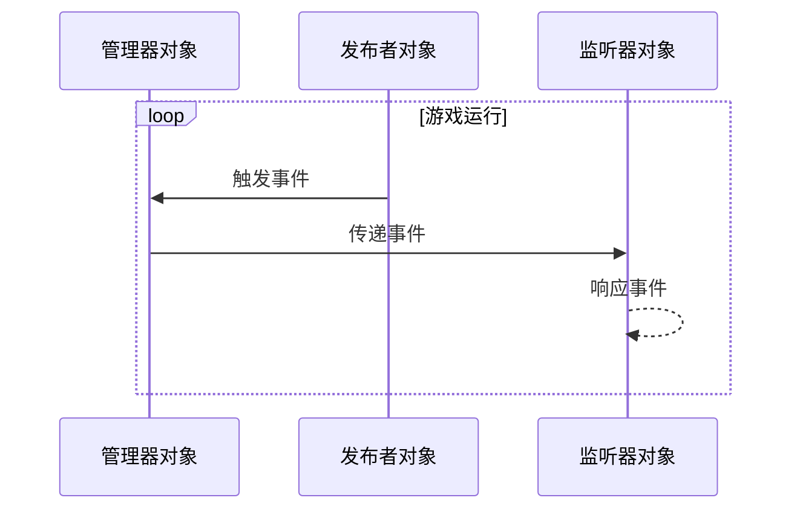

## **引言**

事件驱动编程(Event Driven Programming)是一种程序流程由事件决定的编程范式，负责事件的发生、管理和执行，用于提高代码的可扩展性，管理可读性和可维护性。它在[其他游戏开发过程](https://hyngng.github.io/zh/dev/armonia-first-devlog/)中提供了很大帮助，我认为将来也会很有用，因此整理成文。

## **基本概念**

- 事件驱动编程通过以下三个概念实现：
	- 管理器(Manager)：负责将事件传播到特定对象
	- 监听器(Listener)：负责响应特定事件
	- 发布者(Poster)：负责触发特定事件

管理器角色通常由 `GameObject.cs` 等一个管理器脚本承担，但监听器或发布者角色可以由一个对象同时承担所有角色，也可以只承担其中一种角色。

例如，假设听到爆炸声且周围的NPC朝声源方向看去的情况，基本情况下触发爆炸声的对象担任发布者，周围的对象各担任一个监听器角色；但如果触发爆炸声的对象本身也是对该事件做出反应的NPC，则该对象可以同时担任发布者和监听器角色。

## **结构可视化**



## **基本代码**

### **事件管理器**

:::info
代码篇幅较长！
:::

```cs
public enum EventType
{
    FirstExampleEvent,
    SecondExampleEvent,
    /* ... */
}
```

```cs
public class EventManager : MonoBehaviour
{
    public static EventManager Instance { get { return instance; } }    
    private static EventManager instance = null;

    public delegate void OnEvent(EventType eventType, Component Sender, object Param = null);
    private Dictionary<EventType, List<OnEvent>> Listeners
        = new Dictionary<EventType, List<OnEvent>>();

    void Awake()
    {
        if (instance == null)
        {
            instance = this;
            DontDestroyOnLoad(gameObject);
            return;
        }
        DestroyImmediate(gameObject);
    }

    public void AddListener(EventType eventType, OnEvent Listener)
    {
        List<OnEvent> ListenList = null;

        if (Listeners.TryGetValue(eventType, out ListenList))
        {
            ListenList.Add(Listener);
            return;
        }

        ListenList = new List<OnEvent>();
        ListenList.Add(Listener);
        Listeners.Add(eventType, ListenList);
    }

    public void PostNotification(EventType eventType, Component Sender, object param = null)
    {
        List<OnEvent> ListenList = null;

        if (!Listeners.TryGetValue(eventType, out ListenList))
            return;

        for(int i = 0; i < ListenList.Count; i++)
             ListenList?[i](eventType, Sender, param);
    }

    public void RemoveEvent(EventType eventType) => Listeners.Remove(eventType);

    public void RemoveRedundancies()
    {
        Dictionary<EventType, List<OnEvent>> newListeners
            = new Dictionary<EventType, List<OnEvent>>();

        foreach(KeyValuePair<EventType, List<OnEvent>> Item in Listeners)
        {
            for (int i = Item.Value.Count - 1; i >= 0; i--)
                if(Item.Value[i].Equals(null))
                    Item.Value.RemoveAt(i);

            if (Item.Value.Count > 0)
                newListeners.Add(Item.Key, Item.Value);
        }

        Listeners = newListeners;
    }

    public void RemoveListener(Event eventType, OnEvent listener)
    {
        List<OnEvent> listenList = null;

        if (Listeners.TryGetValue(eventType, out listenList))
            listenList.Remove(listener);
    }

    void OnLevelWasLoaded()
    {
        RemoveRedundancies();
    }
}
```

这是使用委托的方法。为了让监听器对象也能使用部分方法，采用了[单例模式](https://hyngng.github.io/posts/singleton-pattern/)，事件通过 `enum` 定义。代码接近80行，但由5个独立方法组成，所以并不难。

- 委托与字段
	- `OnEvent()`：用于注册事件监听器响应方法的委托。
	- `Listeners`：键为事件，值为 `List<OnEvent>` 的字典。连接特定事件及其响应。
- 方法
	- `AddListener()`：将特定对象对某事件的响应以方法形式注册。
	- `PostNotification()`：发布者对象触发事件时使用的方法。
	- `RemoveEvent()`：从 `Listeners` 字典中移除特定事件的方法。
	- `RemoveRedundancies()`：一种完整性检查。若某事件无可执行内容，则移除该事件。
	- `RemoveListener()`：销毁监听器对象时，从 `Listeners` 字典中移除该对象以防止 `NullReferenceException` 错误。

### **事件监听器**

```cs
public class ListenerObject : MonoBehaviour
{
    void Start()
    {
        EventManager.Instance.AddListener(Event.ObjectAccessed, OnEvent);
    }

    public void OnEvent(EventType EventType, Component Sender, object Param = null)
    {
        switch (EventType)
        {
            case EventType.FirstExampleEvent:
                /* 事件行为代码编写区 */
                break;
        }
    }

    void OnDestroy()
    {
        EventManager.Instance.RemoveListener(Event.ObjectAccessed, OnEvent);
    }
}
```

游戏开始或对象创建时，通过 `EventManager.AddListener()` 方法添加监听器以便检测所需事件；对象销毁时，通过 `EventManager.RemoveListener()` 移除已注册的方法，防止小错误或无关事件调用。

`OnEvent()` 方法在事件发生时被调用。它接收事件类型、触发事件的对象以及附加参数作为参数，通过 `switch` 语句根据事件类型处理不同的逻辑。此示例中为 `FirstExampleEvent` 事件配置了特定逻辑编写区域。

## **使用示例**


这是在[正在开发的游戏](https://hyngng.github.io/zh/dev/armonia-first-devlog/)中使用的示例。选择特定对象时，部分可交互对象会以黄色系高亮显示，取消选择该对象时则恢复原状。这是通过事件驱动编程实现的。
