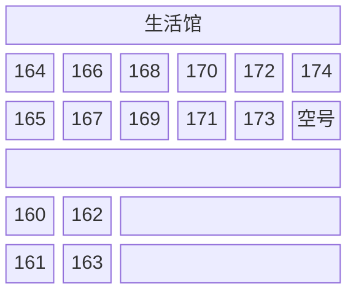

心情有些发懵。缓慢流淌的时间不知不觉已经全部逝去，走出演武馆，我正在家中写这篇文章。

我在时间点上，恰逢2024年5月21日手榴弹爆炸事故和2024年5月23日因中队长苛虐行为导致训练兵死亡事故接连发生后首批入营的期数，加上又是补充役，因此训练所方面确实有部分明显的照顾。并非训练本身变轻松了，而是尽可能找阴凉的地方进行同样的教育，或是对军纪的强度进行了柔化处理。

补充役本身相对于现役的宽松教育课程和氛围也存在。与根据训练所生活分配不同部队的现役不同，补充役在入营时就已经确定了结业后的计划，大概因此如此。虽然并非所有人都如此，但在我所在的生活馆里，有一个同龄人竟是因听说训练所很有趣而故意来的——他即将转为长期待命战时勤劳役，说是为了体验一下。

我带去了笔记本和笔袋，每天一天天都认真记录日记。共整理了14页的篇幅，结业后在家中重新整理并转移到博客文章中。

## **训练所事前准备**

我带了几样物品。结业出来后发现，即使只身入所也不会有大碍，不过其中几样东西确实有用。携带的物品如下：

|准备物品|带去理由|实际是否有用|
|---|---|---|
|卡西欧 F-91W-1 手表|确认时间|到哪里都有用。真的很好用|
|大创鞋垫 2双|放进军靴使用|放进战斗靴里使用，真的很棒|
|3M 耳塞 2双|备用|与配发耳塞完全不是一个级别的好用|
|练习本和笔袋|写日记和画画|虽然用了几次，但最后还是成了行李|
|洗发水、沐浴露|备用|虽然不错，但用多合一更好|
|书本 2本|排解无聊|除了站岗时稍微读一下，最后还是成了行李|
|卫生纸 1卷|备用|配发的卫生纸都没用完就出来了|
|牙刷盒|熟人强烈要求带去|配发了牙刷盒，所以没用上|

看同一生活馆的人，通常只轻便地带上洗发水和沐浴露的情况更多，但也有带来康宝或宝矿力粉分享的人，特别是专门研究人员中，也有带了几篇论文或书的情况。我也听说训练所生活无聊，所以带了两本书。

个人觉得最好带上的物品是睡眠眼罩。因为红色睡眠灯会亮起，对敏感的人来说亮度足以干扰睡眠。

## **训练所一天作息概要**

写日志前，我先整理了每天重复的共通分母。首先，训练所的一天作息如下：

```mermaid
gantt
    title 平时作息
    dateFormat HH:mm
    axisFormat %H:%M

    section 早间点名
    就寝: 00:00, 06:30
    起床及洗漱洗脚: 06:30, 07:00
    早间点名及早餐: 07:00, 09:00

    section 上午课程
    上午教育及训练: 09:00, 12:00
    午餐: 12:00, 13:00

    section 下午课程
    下午教育及训练: 13:00, 17:30
    晚餐: 17:30, 18:30
    洗澡及个人整理: 18:30, 20:30

    section 晚间点名
    打扫及点名等待: 20:30, 21:30
    晚间点名: 21:30, 22:00
    就寝: 22:00, 2h
```

基本一天作息如上，但根据训练所规定，6月起训练兵被分类为热期，并行暑季作息。这种变动作息如下：

```mermaid
gantt
    title 暑季作息
    dateFormat HH:mm
    axisFormat %H:%M

    section 午睡前作息
    就寝: 00:00, 03:00
    起床及洗漱洗脚: 03:00, 03:30
    教育及训练: 03:30, 07:00
    早餐: 07:00, 08:00
    教育及训练: 08:00, 12:00
    午餐: 12:00, 13:00
    个人整理: 13:00, 14:00
    午睡: 14:00, 16:00
    教育: 16:00, 17:30
    晚餐: 17:30, 18:30
    洗澡及个人整理: 18:30, 19:30

    section 晚间点名
    打扫及点名等待: 19:30, 20:30
    晚间点名: 20:30, 21:00
    就寝: 21:00, 3h
```

暑季作息的特色是就寝时间调整为晚上9点，起床时间为凌晨3点。入所第一周还没过完就早早开始，负担不小，但也只能跟着来。

## **存档**

- 26联队，24-24期（6月13日入营，7月4日结业）

## **训练所日志**

### **第1周**

#### **第1天**

入所第一天。入所仪式在陆军训练所入营审查处简短进行，唱了爱国歌，敬了简短礼后就结束了。

传闻父母离开后教官们会立刻变成恶魔，但实际上是在沉稳的氛围中开始了各项行政程序。父母退场后，我们移动到父母坐过的地方附近，接受了各种检查和问卷调查——确认携带的国民爱心卡和身份证以确保是入营对象，然后填写了4~5页关于抑郁症或自杀等精神健康的问卷。

填写问卷的同时，训练所的入所相关程序继续进行。首先发放了500mL冰水塑料瓶和训练所编号牌，教官轮流用卷尺测量头围以发放贝雷帽，同时安装了那著名的国防移动安全应用程序。在入所者和教官都忙碌的情况下，完成了对急需上厕所的人的引导和处理等多项程序后，拖着带来的行李箱前往指定的联队。到联队的直线距离并不远，但经过入营大队和演武馆绕行，需要走相当远的路。在初次见到的陌生环境和尴尬的沉默中，只听到行李箱拖行的声音，营造出一种紧张的氛围。

到达分配的联队及教育大队后，用空气压缩机拍掉灰尘，进入自己的生活馆。到达生活馆后，立即给床垫套上外层套。材质非常粗糙紧绷，所有人套外层套时，中指和无名指的第二个关节都被磨破了。过了一段时间后，前往本中队的讲堂，按尺寸分别领取两套未来三周穿的生活服（上下装），立即换上生活服后，将带来的行李箱像叠方块一样整齐地码放在每个生活馆都有的空号位置上。

第一天没有特别的训练或教育，而是填写了与在入营审查处填写的论调非常相似的精神健康相关问卷多份，确认了床下隐藏的篮子及篮中牙膏、牙刷、肥皂、毛巾等生活必需基础补给品后，用了晚餐。餐后去外部澡堂洗澡，在极其陌生的感觉中结束了一天。

这是久违的非常茫然和尴尬的一天。彼此生疏的人们之间持续沉默，我带来的物品——书、练习本和笔袋——不知道能否拿出来用，只能不断地看手表确认无意义的时间，然后入睡。

#### **第2天**

训练所第一次起床日，也是进行制式训练教育的一天。

伴随着那著名的起床号在6点半起床，进行了第一次早间点名。在半梦半醒的状态下简单洗漱洗脚，带上新兵教育指南，按小生活馆在教育大队旁的道路上排成三列，确认人数无误后移步练兵场，检查中队人数及健康状况后开始早间点名。

记得在微凉氛围中迎来的第一次早间点名，分队长和排长的声音真的很大很有力，让我很惊讶。第一次看到洪亮的声音从分队长到排长、中队长、教育大队长依次迅速传达的过程，那氛围真是只听说过而没有亲历的"军队"。那是我真切感受到自己真的来到了军队的一刻。

早间点名和早餐后，在生活馆接受了基本制式训练。原本应在练兵场等外部空间进行教育，但自6月起我被归类为热期数，所以在生活馆进行了教育。分队长教授了立正、稍息、休息、放松、左转、右转、向后转等基本动作，以生活馆为单位每4人一组接受评估的形式。评估并不严苛，只要确认动作掌握良好就给予合格。

此外，这一天还选拔了分队长训练兵和副分队长训练兵。副分队长是毫无存在感的形式上的角色，而分队长则会被四处叫去干活，我本以为会开始眼力斗争，但我们生活馆有人自愿说"被选为分队长训练兵可以享受零食或抽烟时间等好处"，所以很顺利地定了下来。

午饭后，前往其他教育大队建筑物的武器库领取了对应各自编号的枪支。那是第一次亲眼见到著名的K2步枪。听说真枪很重，确实如预期般沉重，护木和枪托处有很多划痕和磕碰。这次领取的真枪直到结业前一天，训练时随身携带，非训练时则存放在生活馆的枪支保管柜中。

记不清具体时间了，同一生活馆的一位同期因家庭原因获得了两天请愿休假。这位是有孩子的户主，大概是跟孩子有关的事情吧。

这一天的副食发了ABC Kuandke巧克力饼干、披萨薯片和星巴克罐装咖啡。

#### **第3天**

是接受部队制式和枪械制式教育的日子。

第一次值夜班。值班时，起床后先从先醒的人那里交接当天的口令（当天的口令是"尼龙精华"）和特殊事项等，在指定时间起床，在一个小时内发呆式地"不眠"执勤。过了30分钟，检查自己负责的生活馆区域温湿度后，向值班桌前记录温湿度的训练兵报告；过了45分钟，去叫醒下一个人；等对方出来后交接班，然后继续就寝。不过，因为我们生活馆有人打鼾特别严重，当天剩余时间几乎都是睁着眼睛度过的。

星期六原则上是没有训练的日子，但只有第一周的星期六例外进行训练。早间点名增加了跑步，但这一天只是沿着之后计划的1.5km跑步体能测定路线走了一遍，简化进行。

这一天大致以午餐为界，饭前学习部队制式，饭后学习枪械制式。部队制式是前往演武馆，学习两臂间隔、个人间隔、窄间隔、左右并列或两列纵队散开集合等基本部队制式，以生活馆为单位练习后，接受分队长检查，合格后返回生活馆。枪械制式则是再次前往演武馆，学习持枪、立枪、举枪等基本枪械制式后，立即进行了授枪仪式。授枪仪式是全体训练兵整齐列队面向中队长，反复进行举枪动作，很快就结束了。

这一天也是大家开始慢慢详细介绍自己从哪里来、做过什么，生活馆氛围开始融化的日子，同时也是训练兵和现役分队长之间开始有沟通的日子。

具体时间记不清了，但这一天发放了战斗服（常说的训服）和战斗靴。

这一天的副食发了罐装可乐。

:::info
这一天的轶事
- 同一生活馆29岁专门研究人员训练兵在就寝时间被叫到值班桌前做类似"今天也辛苦了"的收尾发言，从这天起开始了"广播兵"的绰号。
- 有个同僚在个人整理时间没事做，在桌上用水瓶盖打台球或弹棋子打发时间。
:::

#### **第4天**

以训练兵身份迎来的实质第一个休息日。虽然是休息日，但并非完全没有日程——掀开床垫晾晒，还领取了据说分队长们当天用蒸汽消过毒的水壶。

这一天也是首次解除手机限制（从2点半到3点半，1小时）。入所时间恰逢敏感时期，值班桌播放了"鉴于氛围特殊，请务必给父母打安全电话"的广播。我打了30分钟电话，剩余时间看了积攒的网络漫画；其他人通常看YouTube、Instagram打发时间，有意思的是有孩子的人还互相炫耀孩子的照片。

手机使用时间过后，是新兵教育指南的填空答题时间。问题当然不难，但分量相当大，需要翻阅书本各处，所以我们生活馆各自分工填写，专门研究人员承担更多份额，填完后相互传阅。分队长们用"填完了就给你们看电视"来哄，但给定分量多、誊写时间长，实际上只看了aespa的片段就结束了。

两天前请愿休假离开的训练兵当天归队了。其实不是什么大事，但大家都表示欢迎。

这一天也发了副食，但没有具体记录。

:::info
这一天的轶事
- 基本教材检查时，其他训练兵把我的字给分队长看说"字写得好看"，得到了"哇，字不错嘛~"的称赞。从这时起，我在生活馆有了"代笔兵"的绰号。
- 进行了关于希望接种破伤风等疫苗的需求调查。我们生活馆的专门研究人员（药学博士在读）说接种疫苗各种好，于是大家就说"反正挺麻烦的那就都一起去打吧~"。
- 好笑的同期语录："再折磨我就把可乐全偷了"，"给我两罐可乐就给你看解题答案"，"都说去军队会便秘，我反而拉个不停"。
:::

#### **第5天**

是接受健康检查和训练准备的日子。

这天早间点名之前，把带来的大创鞋垫放进战斗靴里，结果穿着感变得无比柔软，让我很惊讶。不仅早间点名的跑步，之后到距离较远的训练场移动或行军等过程中，也大幅减轻了脚和腿的负担。

跑步后在生活馆发放了名为Re:high Mix的粉末型补水剂。大家都好奇地马上冲来喝，但生活馆全体人员的一致评价是：难喝。虽然说是石榴味，但更像是一种难以形容的暧昧味道，所以此后直到结业式再也没有冲来喝过。

接下来是早餐后的尿检和结核检查。过程简单但人数多，所以大半个上午都在等待。检查就像在学校做的那样，在教育大队建筑物走廊和结核检查巴士之间往返。午饭后前往教育大队外的建筑物接种了脑膜炎球菌和破伤风疫苗，回来后直到晚餐时间都在做新兵指南的手榴弹、急救部分答题。

晚餐后，按生活馆发放了要缝在上衣和陆军帽上的皮革军籍牌（训练所称为"レザ"）和针线工具。皮革军籍牌上标有联队、中队、编号等所属信息，我领到了上衣用的`26-1-XXX`和陆军帽用的`01-XXX`军籍牌。其实大家都不太会针线活，按照教范应该沿着军籍牌轮廓在六处缝成X形，但大家大多只是大致固定成直线。

个人而言，从这天起第一天的紧张感明显缓解，制式和敬礼变得自然，对训练所生活已经相当习惯了。

这一天的副食是Binch和Monster Zero（白色）。

:::info
这一天的轶事
- 去吃午餐的路上，前任分队长训练兵被分队长逮住接受了制式训练。"训练兵们，制式是开玩笑的吗？来玩的吗？练到成为合格训练兵为止！原地踏步，走！一！二！三！四！……"好笑的是，制式训练一直进行，这个训练兵小声坦白"我是低能儿"时，分队长听成了"我是死脑筋"，差点让情况变得更糟。
- 这名训练所同期在晚间点名后，向分队长认真倾诉想回家。他担任分队长角色，但与外面听到的不同，没有任何好处，而且午餐时发生的事也让他很生气。分队长听完后劝他说，现在不能让他回去，先睡一觉再想想。
:::

#### **第6天**

是接受对敌认识教育的日子。

凌晨3点值了夜班。有人打鼾，值班后也很难入睡，几乎睁着眼，所以虽然喝了前一天收到的Monster Zero，这天还是整天都很累。这天早间点名——大概是奖罚分制分数低被叫出来——到跑步环节时，只有我们生活馆被排除，绕着教育大队建筑捡了一圈垃圾，以这种特别形式进行。

早餐后，穿着训练服，上午下午都在室内通过电视听了对敌认识教育。主要是"我们的主敌是朝鲜"之类的内容，教育后写了以"大韩民国为何珍贵，自己将以何种心态保卫祖国"为主题的随笔。之后又是新兵教育指南的答题时间。

分队长访问生活馆，针对有脊柱侧弯或前一天尿检结果异常等健康原因的人员，确认是否想回家，并调查了尼古丁贴片需求。这时分队长讲了一些故事，大致是关于训练所氛围的内容：

- "生化防护的瓦斯很难比喻，大概就是芥末蘸煤吃的那种感觉"
- "烈性手榴弹因为最近的事故，现役也不能投了，你们也只能投练习用手榴弹。我投过真的手榴弹，不是练习用的，从山坡上投过，不吹牛地说，地面咚——地响，全身起鸡皮疙瘩"
- "行军是走5公里休息一下，再走5公里再休息。我当训练兵时有个48kg的同期问，要背自己体重一半的装备合理吗，但那个同期最终也完成了全程。我行军结束后整整三天都一瘸一拐地走路"
- "你们前一期还因为新冠疫情入营后隔离了一周，以前还有过整三周都用Zoom凑合的时代"

这一天的副食是Cukdas和2%罐装饮料。具体时间记不清了，但这一天收到了枪支分解图，并有暑季作息，同样在9点就寝。

:::info
这一天的轶事
- 前一天想回家的训练所同期睡了一觉后平静了。
- 因为前一天被制式训练捉住，我严格按制式来，结果获得了加分。
- 个人整理时间帮其他训练兵代笔写信。
:::

#### **第7天**

是进行体能测定和枪支分解教育的日子。

从这一天开始暑季作息，凌晨3点起床。这天进行了体能测定和枪支分解教育。按照暑季作息，穿着运动服等待，简化的早间点名结束后，先进行了1.5km跑步记录测定。体能测定结束后短暂休息，在教育大队楼后进行仰卧起坐和俯卧撑测定。每个项目都有合格标准，若有一项不合格，则需接受补充训练。我的仰卧起坐59次、俯卧撑30次满足标准，但跑步排名第134名未达标（不过跑步是否合格以时间为准，而非排名），因此接受了补充训练。

暑季作息中，凌晨课程结束后正好是早餐时间。餐后，在食堂前按ㄷ字形集合，接受了从气体调节器到枪机为止的枪支分解教育。休息时排长讲了一些训练所的故事，大致内容如下：

- K2什么都好，但重心不对，实际感觉更重。美军使用的M4以弹匣插入口为准左右平衡，而K2的散热片一侧重得多。因此，我军官的体能惩罚是：单手抓住K2枪托颈部，保持枪身与地面水平抬起40秒。
- 他本人正准备因腿部原因退役。理由是：不想把别人的痛苦变成自己的工作。他迄今已训练出一个师级规模的训练兵，训练如此多人员的过程中，见过就寝时用针贯穿四根手指的训练兵，也见过自杀的训练兵，他不喜欢这些。
- 拿枪时，你们怎么舒服怎么拿。虽然有军队特性会矫正所有人都采取同样的瞄准姿势，但事实上教范也说射手按自己舒适的方式瞄准更好，我也认为如此。

午餐和淋浴后，下午2点到4点午睡。起床后在讲堂观看了个人火器教育视频，在生活馆短暂等待后，领取了称为"A级"的新军服。

副食是品客酸奶油洋葱味和宝矿力水特。

:::info
这一天的轶事
- 生活馆的老幺猜拳输了做杂活：将次日其他中队实弹射击用的餐盘和餐具按数量整理对齐并用保鲜膜包装。
:::

### **第2周**

#### **第8天**

这一天接受了枪支分解、射击姿势和枪支安全检查教育。

早间点名后，穿着攻击军装前往附近训练场，接受枪支分解、基础射击姿势和枪支安全检查教育。枪支分解是生活馆全员在规定时间内完成从气体调节器到枪机击针的分解，再逆向完成组装，在规定时间内完成后接受分队长检查并获合格判定。基础射击姿势也同样，以生活馆为单位学习立姿、坐姿、卧姿三种姿势，练习后接受分队长检查获得合格。

个人而言，这天有几处不适：攻击军装系得相当紧，呼吸稍有不便；为了快速分解枪支，在上下机匣分离过程中，右手食指两节被夹住导致血管破裂；立姿射击姿势需手持K2步枪，枪比想象中重得多，检查时难以坚持。

回到生活馆后，进行了关于理想军人形象、食堂及食物满意度、排便周期异常等问卷调查。晚餐后，公布了次日实弹射击的组和号。分队长强调绝不能忘记，所以生活馆里几个人在手背上用笔写了下来。我是5组3号。

具体时间顺序记不清了，但这一天收到了实弹射击时用的耳塞。不过又薄又硬又破损，没有使用。

这一天的副食是草莓味威化饼。

:::info
这一天的轶事
- 想回家的训练兵向排长报告后，排长劝他说："傻瓜，要回去就趁早走啊，难道要先打完枪再走？再扔个手榴弹再走？这样下去不知不觉就第2周、第3周了。"然后他就回去了。
- 隔壁10生活馆有人玩"要是下次再被分队长批评，我就死在你手上"之类的小混混游戏，结果被抓到了。
- 入所第一天套床垫外层套时磨破的无名指基本痊愈了。
- 去吃饭时一直受制式批评，最终受到了处分。
:::

#### **第9天**

这一天是首次实弹射击。穿着攻击军装，左侧口袋放枪支分解图，右侧口袋放500mL水，背包里放防弹头盔，前往零位射击场。印象深刻的是呼吸着凌晨空气看到的高速公路收费车道，以及上方的人行天桥。第一次走向射击场时，所有人大概都在看着桥下通行的民用车辆想到同样的事，确实有人发出了"哇，真想直接跳下去"之类的喊声。后来才知道，这座桥的正式名称是"小龙陆桥"，别名"痛哭之桥"，是相当有名的桥。

经过论山训练所附近的村庄和民宅之间，就到了零位射击场。事前被告知距教育大队3公里，实际也需要走这么远，相当远。到达射击场后，按以下顺序进行零位射击：

1. 先到的组完成射击前等待，在此期间领取军用耳塞并听取注意事项。
2. 轮到后，佩戴耳塞通过安全检查后依次进入射击场。
3. 入场后，在轮到自己之前观察前方人员的动作等待。当接近自己的顺序时，大声复诵控制塔的指示并执行。
4. 射击过程在控制塔指示和训练兵中选出的专业助教的辅助下，按（枪机后退固定→交接弹匣→结合弹匣→快慢机单发→开始射击→一发、两发、三发射击结束→快慢机安全）的顺序进行。姿势限于卧姿。
5. 一次射击结束后，经过（射手放枪、跪姿等待→确认靶纸→调整准星）的过程，重复三次。
6. 射击结束后，拿着自己的靶纸离开射击场，实施（枪机后退固定→确认弹膛→枪机前进→击发→三次后退前进→击发）顺序的安全检查。
7. 安全检查后用带来的靶纸接受评估。三次射击中，靶纸内圆圈中有两发以上命中即合格，否则不合格，需重新射击。
8. 先吃早餐，合格者进行枪支保养，不合格者重复上述过程直至合格。

实际听到的射击声像是爆炸的声音。声音大到身体一直在颤抖，轮到我之前，别人的射击声每次都会吓我一跳。但神奇的是，当我射击时，声音只是"咚、咚、咚"的程度，并不大。大概是耳塞佩戴得好，射击后也没有耳鸣。关于射击，我想特别记录以下几点：

- 后坐力感觉像有人轻轻推了三次肩膀。
- 枪口火焰，与游戏或电影中的描述不同，无论别人射击还是我射击，完全看不到。
- 意外的是没有弹壳收集器。

虽然只有25m，但我打得很不错。第一次射击后怀着激动的心情去确认靶纸，子弹穿过的孔紧密地聚集在一起，有些惊讶。分队长说"哦~训练兵打得好啊？准星往右3、往下7调整。训练兵打得不错，所以注意呼吸就行"，而专业助教训练兵听到后说"他平时不怎么这样说的，看来你真的很准"。虽然不是什么大事，那天却莫名自豪，心情很好。

因此，我第一次射击3发中2发命中靶纸圆圈内，一次通过。第一次射击合格率约1/3，其他同期中有些人在第2、3、4次射击仍未合格，有的训练兵打了约36发。一次射击过程时间较长，等待中早餐结束后，我和同样合格的同期在等待训练结束期间聊了很多。第4次射击后，可能是时间原因，不再进行重新射击训练，返回教育大队后仅对不合格者单独叫出进行补充教育。

返回生活馆的路上，被告知准备了用于降温的冰块，在多功能作战帽内放3~4颗后移动。这个系统不知是否正式用语，训练所称之为"绿洲"。戴着冰块移动时，融化的冰水顺着流下，一滴一滴打湿后颈。被浸湿的衣服和装备快被晒干时，越过陆桥再次领取新冰块。冰块差不多融化完时到达了教育大队楼，回来后聚集在练兵场听排长说"今天攻击军装总重含枪支5.8kg。可能有人觉得辛苦，辛苦了"，然后返回生活馆。

这一天的副食是类似牛肉干的干燥香肠、Nun-gamja和Milkis 250ml罐装饮料。

:::info
这一天的轶事
- 晚上扔垃圾时，拆箱子不小心弄伤右手大拇指指甲，指甲轻微翘起。
:::

#### **第10天**

从凌晨1点夜班开始的一天，是久违的休息日。

当天下雨，每次去吃饭都要穿雨披。雨披一旦穿上，就挂在教育大队讲台衣架上晾干，所有生活馆的雨披混在一起，所以每次去吃饭都会穿到不同的雨披。

下午2点，第一次去了PX。PX就像一般的社区超市，提着篮子在规定时间内购物。我买了2个独岛化妆品和2件ROKA T恤，花了约5万韩元；而有的人买了14万、15万甚至多达60万韩元的礼物。主要受欢迎的是副食中没有的麦可乐、罐装咖啡、饼干类，化妆品和ROKA T恤也受欢迎。

回到生活馆后，下午3点再次领取了1小时手机。我先给父母打了30分钟平安电话，剩余30分钟向熟人报平安、看之前攒的网络漫画，但时间有限，漫画内容没能好好看进去。其他人也类似地打电话、看YouTube、Instagram打发时间。

之后允许看电视，但只有一台电视，人很多，在收集意见时，一个同期说"下雨天看《老男孩》正好"，反响很好，于是就真的看了《老男孩》打发时间。

具体时间顺序记不清了，但还调查了献血人员和参加宗教活动的人员。

#### **第11天**

是有清洗组（洗碗组）的休息日。

清洗组需参与早间点名至人员报告后即被排除，去准备清洗。负责餐食相关的洗碗和收尾工作，具体分为餐盘、汤碗、万能、盆、垃圾等角色。我们生活馆事先通过抽签确定角色，各角色的职责如下：

|名称|职责|
|---|---|
|餐盘|顾名思义，清洗餐盘|
|汤碗|顾名思义，清洗汤碗|
|万能|无特定角色的辅助人员，会被叫到出现瓶颈的地方|
|盆|最辛苦。负责清理食物残渣，即泔水桶|
|垃圾|最轻松。负责收集偶尔产生的面包袋或酸奶容器等垃圾，提着垃圾袋站着就行|

收尾打扫非常辛苦，每次清洗组结束后，衣服上都会有泔水味。清洗组一旦被选上，基本当天就只做清洗直到结束。尤其重要的是与检查清洗状态的副士官的配合，有一次碰上了FM训导教官，即使认真清洗，只要看到一两粒饭粒就要求重新清洗，做了2~3次无意义的返工。

最后一次清洗结束后，转移到教育大队讲堂，观看因清洗而错过的次日生化视频教育。因音响不出声，就这样无声地观看了视频。

记得这一天的淋浴非常舒服。

:::info
这一天的轶事
- 清洗结束后，训导教官让我们处理早餐中的冰淇淋。正愁怎么处理，一个生活馆同僚问分队长能否用黑色冰柜冷冻，分队长反问是谁给的。听了军衔和长相描述后，三个分队长同时说"啊，操，那个残疾女"。冰淇淋通过分队长被销毁了。
- 其他中队的分队长中，有人在放勺子和杯子清洗的地方倒吃剩的汤。生活馆一个同僚要去找他理论，被周围的人劝住，忍了下来。
- 午餐清洗出发前，因未整理生活馆地垫而被扣分。整天辛苦却收到这种泄气的消息，生活馆氛围不好。
:::

#### **第12天**

是有名的生化防护训练日。

生化防护训练场距教育大队约4公里，相当远。便装的话也许是可走的距离，但穿着攻击军装、背着枪、排成两列往返是很大负担。因此前一天强调这一点并接收了参加减缓行军的人员，我也报了名但帮助不大。

教育内容包括应对核攻击的方法和防毒面具佩戴法，然后练习并接受检查。防毒面具佩戴目标为9秒以内，但这是现实中有困难的标准，所以只是检查是否掌握了佩戴方法就放行了。

佩戴防毒面具的感觉是：视野有些受限，呼吸变得困难很多。肺活量不好的人可能会出问题。确实差点出了事故：一个训练所同期佩戴防毒面具后呼吸困难，无法自行脱下，周围人急忙帮他脱下，这位流着口水和呼吸困难训练兵，被旁边进行教育的排长从训练中排除。

防毒面具佩戴教育结束后，在有空调的室内空间吃了早餐。餐后进行了进入毒气室的训练。进入毒气室的感觉，就像一个充满蚊香烟的黑暗仓库。按照事前告知，没有脱下防毒面具的指示，防毒面具佩戴也无异常，所以没有吸入毒气。在毒气室内，只拆装防毒面具滤毒罐就结束了。

不过在进入毒气室前后，稍微尝到了一点毒气。个人感觉，比辣椒素更恶劣的辣味，以及口腔中有东西在咀嚼、喉咙里有东西卡住的感觉。出毒气室后，双臂上下大幅挥动缓慢移动以抖落颗粒物；皮肤上沾到毒气时可以用水冲洗。这时被告知绝不能摸脸。我没事，但大概是有辣椒素颗粒附着，皮肤发红、感到刺痛刺痒的训练兵不少。

回到生活馆午睡后，观看了手榴弹、人员急救视频讲座，短暂休息后用晚餐结束了一天。

这一天的副食是Tartelettes草莓味、Maxbon香肠和可口可乐零度罐装饮料。

:::info
这一天的轶事
- 训练所同期在从训练场回来后，右脚踝发炎到无法正常走路，去吃饭时甚至需要背着走。问题是，向分队长报告"好像需要送急诊还是什么的"后，得到的回答是："了解情况，但我们能做的一是有限。急诊不是你想象的那样。"无奈之下，一个同僚又向排长报告了一次，结果排长带着两个分队长来到了生活馆。排长让这名训练兵试着站起来，发现他无法正常站起，确认了当前症状和之前是否有类似病症，然后打电话给某处，报上自己的军衔和姓名预约了地区医院，同时让分队长临时取来拐杖。问是否需要进一步措施，回答没有后离开了生活馆，自然响起了掌声。大概是之前排长在生化防护训练场亲眼见过他走路困难，所以能快速处理。排长离开约2分钟后，除了正在控制训练兵的人员外，所有分队长被叫到了排长室，大概与此相关进行了提醒。
:::

#### **第13天**

是手榴弹训练日。

具体时间没有记录，但是从夜班开始的一天。感冒和夜班叠加，真的非常累——身体反应迟钝，眼睛一直想闭上。

被告知手榴弹训练场比生化防护时近一些，但个人感觉仍然很远。手榴弹投掷训练与零位射击时一样，按组和号依编号编成，随着控制塔的指示大声复诵并逐步执行。

轮到投掷手榴弹时，分队长喊名字并用"能做到"、"做得好"等方式积极鼓励。手榴弹投掷过程是："接手榴弹→确认目标→拔安全夹→手指放入保险环→拔保险环，投！→一，二，三，确认目标"。在自己的顺序到来前，不断重复练习这一动作。

投掷4次手榴弹，只要有一枚越过训练场设置的铁丝网即为合格，若4枚均未达标准，则为补充教育对象。大部分人都轻松合格，但我的情况有些危险：第一枚直接砸在了地上，第二、第三枚也未达标准，但最后一枚勉强成功，总算合格。

手榴弹训练结束后回到教育大队，排长把1中队人员单独叫到练兵场说："我一直在后面看着，军纪、制式完全不像话。开玩笑吗？来玩的吗？"提醒了我们。我觉得情况可以理解，没有不满地听着，但排长最后以"大家不好意思啦~"泄气地结束。当时有些疑惑，是不是他故意放水。

当天训练结束后吃的早餐是历史级别的差：嫩豆腐和酱油、萝卜块泡菜、飘着油花奇怪的大酱汤、一个蛋卷。有生活馆同僚说不想吃，这种反应我也能理解。

午睡后，前往讲堂观看了单兵战斗动作视频，短暂休息后用晚餐结束了一天。

这一天的副食是一罐500mL的Birak食醯（甜米露）。

:::info
这一天的轶事
- 一直喊牙疼的训练所同僚这天去了地区医院接受了神经治疗。回来后转述说，在PX那边同行的高个子训练兵逃跑了，但20分钟后被分队长抓了回来。
:::

#### **第14天**

是进行3km跑步测定和单兵战斗动作练习的日子。

这一天没有夜班，睡了个久违的好觉，但依然整天都很累。

早间点名后进行了3km跑步测定。测定开始前，另外接收了想免于跑步而接受体能锻炼的人员，我上次1.5km跑得太累，从一开始就退出了。体能锻炼以国军徒手体操简单进行。

单兵战斗动作中有低姿匍匐、高姿匍匐等对身体负担较大的姿势。训练结束后站立时会短暂感到眩晕，是迄今为止训练中强度最高的。教育先由分队长示范，然后将训练兵按行列整齐排好，以"单兵动作没在社会上学过吗？推！拉！推！拉！"的方式强行推进。

单兵战斗动作每个动作结束后有约10分钟休息。此时有两点印象深刻：一是休息时有训练兵挑衅现役训练兵说"喂我下周就走了~你们继续受虐吧~"；二是在那之中，训练所风景看起来比平时更加和平美丽了。

午睡时间，以感冒为由跳过午睡，申请去了医务室。医务室等候的人非常多，有趣的是医务室椅子各处有很多涂鸦，如"我去单兵，你们去单兵"、"配餐组太爽了"等。就诊时，趁着看感冒也顺便说腰疼（次日有行军预定），开了膏药并获得了次日行军减缓资格。

副食是蜂蜜黄油法棍和Monster Black一罐。

:::info
这一天的轶事
- 听说我们这期训练所有个足球选手，这天跑步测定时确实看到一个训练兵以绝对优势第一名冲线。
:::

### **第3周**

#### **第15天**

是进行单兵战斗动作实操和行军的日子。

身体状态真的很差。喉咙肿胀，非常困。

凌晨从枪柜取出枪支集合后出发前往单兵训练场。单兵战斗动作是以组为单位依次通过各种障碍物并跑步推进。有匍匐穿过轮胎、仰望天空躺着穿过铁丝网下方等过程，最后应该是喊着口号跑过去。

单兵战斗动作结束后，按生活馆依次接受遭遇敌人、友军受伤、6点方向敌机出现等各细分战时情况的应对评估。不难，事实上算是训练中最有趣的部分。

单兵评估结束后在讲堂前短暂等待后吃早餐，餐后接受了哨兵任务教育。哨兵课结束后，排长教授了刺枪术，但令人疑惑的是排长本人似乎不太喜欢刺枪术，说什么最近有CQB。刺枪术练习了突刺、打击、旋转等动作数次，没有检查就结束了。

单兵结束后，迎来了训练所最后一次午睡。因为接下来有行军预定，从2点到6点睡了4个小时，疲劳确实消解了很多。接着吃了晚餐，餐后走出食堂时，太阳正好漂亮地落山。云层投下的影子，视野左右两侧反转的橙色与紫色的密度——风景真的非常美。

行军时，把水壶从装备上摘下来、防毒面具从防毒面具袋里拿出来，总之尽量轻装。行军从晚上9点到凌晨3点，利用跑步路线往返6次，每次约需45分钟。虽然有行李检查，但大概是当时训练所尽量放水的氛围，并非所有人都接受了检查。第一次行军后，天气太热，上级通知生活馆把防弹头盔换成多功能作战帽再出来，很多人说"这是叫我们尽量减重出来"，于是卸下装备出来。实际上并未重新集合检查行李后出发。

开始行军时还说着能看到北斗七星，颇有余裕，但夜深后分队长因有受伤危险而控制前方注视和保持肃静，第一次中途过后所有人真的只是默默走路。我第一次往返后觉得太无聊，后来用外语数步伐来打发时间。

第4次行军结束后休息时间发放了宝矿力、披萨面包和牛肉干。个人因困倦疲乏没有胃口，只吃了点宝矿力和披萨面包。

第5次行军时休息时间闭了会儿眼，旁边其他生活馆的人问"要不要糖果？提提神"，给了我一枚超酸糖。我说垃圾我来处理，他说"垃圾给我吧，我来扔"，就拿走了。虽然长得像混混，而且确实有传闻说那个训练兵是个问题少年，但当时经历的那份善意让我记忆犹新。

行军结束后，将汗湿的马甲和装备放在地上晾晒，然后进入生活馆。行军结束后发了辛拉面、煮鸡蛋和宝矿力水特，我觉得只会增加行李故意没拿。其他同僚大多只领了宝矿力。

据说全副武装的人中有2人左右受伤。其中有人说困着走路时踩进了排水沟，附近的生活馆同僚说听到了某种枪折断的声音。

行军结束后，上等兵分队长说"我跟他们说好了要出热水，去舒服地尽情洗澡吧"，但去澡堂时出来的是冷水。同一生活馆的专门研究人员同僚真的无言地生气了。

就寝时间为凌晨4点到第二天早上11点。虽然因为冷和打鼾声醒了2次左右，但时间够长，起床后状态似乎还不错。

:::info
这一天的轶事
- 行军途中大家都把枪插在装备弹匣袋里，我也试了试，确实舒服很多。
- 行军途中晴朗天气使北斗七星格外清晰可见。
:::

#### **第16天**

行军后洗涤装具的一天。

11点起床后直接吃午餐，取回了前一天放下的马甲和装备。回到生活馆清洗了战斗马甲、弹匣、防弹头盔、水壶，并擦洗了水壶盖、5个弹匣的底面和防毒面具上的泥土，接受了检查。马甲和防毒面具袋重新浸湿后，按生活馆整理晾晒在生活馆旁地面上，直到晚上才收回。

关于配餐，每个生活馆须轮流负责一次清洗组或配餐组，但因生活馆数量不足，各生活馆派一名代表到值班桌前，通过猜拳决定额外值班的生活馆。我们生活馆老幺作为代表出战但输了，于是开始确定次日的配餐组角色。配餐角色包括餐盘与勺子、米饭、配菜、汤、副食等，大部分是配菜。我们生活馆通过爬梯子游戏确定抽签顺序，在防弹帽里放纸条抽签，我第6个抽到了汤。

此外这天没有特别日程，适当玩耍、打扫、接受晚间点名，悠闲地结束了。

:::info
这一天的轶事
- 从这天起有了一种"终于要回家了"的氛围。
:::

#### **第17天**

虽是久违的休息日，但前一天预告的配餐组进行了。

早间点名时被告知：从所有训练结束到结业前，因事故退所的情况很多，如果想安全结业就小心到结业。这段时间分队长的管控也会放松，训练兵之间的情绪冲突也多发。

配餐组无论从体力劳动强度还是心理考验上都比清洗组轻松得多。除了要戴帽子和塑料手套、袖套外，没有不便之处，除了配餐没有其他事要干，工作氛围也不混乱。清洗组最先吃饭，而配餐组最后吃，因此可以随心所欲地拿量，算是额外的好处。

1.5km跑步不合格者的体能补充训练于这天进行。教育主持者说"还是从训练所学点什么比较好"，进行了深蹲、俯卧撑、开合跳、躺下搭档抱腿抬腿等，各10次或20次，2~3组。不过强度不高。

吃完午餐回来，看完了之前中断的电影《老男孩》的结局。这是第一次看这部电影，印象很深。

:::info
这一天的轶事
- 军队里餐食量通常准备1.2~1.5人份，所以每次都会产生大量未食用的食物垃圾，且不允许带走。这天有3袋完好的家乐氏玉米片就这样直接废弃了。
- 洗上了久违的热水澡。明明不是什么大事，但洗完躺在床_上时非常幸福。
:::

#### **第18天**

是久违的悠闲休息日。

同一生活馆一个同僚打开储物柜的瞬间，柜门掉了下来。向分队长报告后，另一个分队长带着电钻来固定好了柜子。记得当时分队长说"我是人肉电钻啊。唉，我为什么这么擅长这种事？"自夸着干活。

这天下雨有台风。同样，去吃饭也要穿雨披。生活馆里几个人嫌麻烦没穿雨披，只穿着生活服去了，结果回来路上被喊着"喂！你们是几中队的！"追来的分队长逮住受到了警告。

这天主要训练和教育都已结束，除了洗训服外没什么特别的事。同样在生活馆聚在一起吃剩下的零食、聊天打发时间，我写了带去的书的读书笔记。允许看电视后，观看了《客人》、《小姐》、《浮士德》等电影。

:::info
这一天的轶事
- 我左边床位的训练兵头发长了，正担心"会不会被剪掉"时，生活馆人员合谋向一个分队长多方游说，问他能不能通融一下。最后分队长一句"嗯，那程度没问题"让大家放心。实际上，这名训练兵没有剪头发，平安结业了。
:::

#### **第19天**

7月的第一天，训练结束后迎来的第一个平日。

早餐后确认装具数量，领了膏药擦除了床上的涂鸦。你可能觉得床上怎么会有人涂鸦，但我们生活馆也有几个人。不过隔壁生活馆喷了太多膏药，气味很重，我们生活馆喊了"别喷膏药了！！"，差点和隔壁生活馆的人打起来。虽然和平解决了，但也反映出之前积累的不满在生活馆层面形成了共鸣，以此为契机，我们生活馆决定写一封"心意信"。在专门研究员们的帮助下，我们倾注心血尽量写好，由一个人代表出去偷偷放入心意信箱。

剩余时间日程不多，按生活馆各取一件生活服上衣和裤子进行集体洗涤。不过同一生活馆另一个位置的储物柜又掉了，这次说没有电钻，没有修理，只是让我们自行小心使用。

悠闲的时光过去，晚间点名熄灯后躺在床上时，一个兵长分队长在值班桌播放了"本分队长，今天是最-后一个工作日了"的广播，所有生活馆都响起了掌声。然后好像是训练所惯例，他说接受10分钟关于他自己的Q&A。问的内容包括NMIXX吴海媛是理想型、最喜欢的某某分队长之类的。

这一天的副食是品客烟熏烧烤味和Monster White Zero Sugar。

:::info
这一天的轶事
- 晚上打扫时间，去放卫生间清洁工具时，和战友组很晚才到教育大队楼外，因为分队长之间交接不畅，怕门先关掉，跑着出去了。
- 同一生活馆一个同僚因下雨不想外出，挂了个天气护身符。
- 空闲时间互相交换名牌玩，吃剩余副食，悠闲度过。
:::

#### **第20天**

从凌晨4点夜班开始的一天。这个时间的夜班可谓最差时间带，将8小时睡眠压缩到6小时。好笑的是，当天的口令是"文化与保险杠、日历"，比平时长，起床后确认发现原本是"保险杠与日历"。推测是被告知"文语是保险杠，答语是日历"时，因不知"文语"为何，传成了"文化"，然后变质为"文化与保险杠"。

到了第3周临近离开时，大家都变得亲近了很多，安静的人也一起开始聊天。大家围坐成圈，拿出收到的副食，聊各种话题，或者互相搭着腿聊天，氛围真的很放松。

1点半起，听了约1个半小时朝鲜学博士的讲座。主题是"以实力求和平的重要性"，具体内容主要涉及朝鲜的近期动向和军队的战备态势等。我对国际政治有兴趣，对朝鲜学本身也很感兴趣，所以听得比较认真，但内容本身平淡。旁边坐的生活馆同僚似乎觉得无聊，在聊结业后的未来计划。

前一天的心意信被排长压了下来。实际上，其他心意信也在一点点积累，排长把全排人员叫到讲堂说："训练快结束了就开始互相捅刀子了。这样下去估计有6个人会被退所。但我想让你们尝到结业的甜头。你们所有人都辛苦了3周，所以我要悄悄压下这件事。有问题的家伙我会单独叫来谈，不要质疑我的决定。"然后解散，聚集的全排默默各回生活馆。

:::info
- 夜班时看到其他生活馆同僚们在看书，我也拿出带来的书阅读，训导教官过来警告说："值班！值班！别看书！值班的时候别做其他事！"（这位教官甚至在分队长之间也以不讨喜著称。）
:::

#### **第21天**

结业前一天。

这时所有人都真实地感到真的要回家了。日程不多，早间点名后在隔壁教育大队武器库归还枪支，全体训练兵前往演武馆为结业式练步。因为步伐不齐，起立坐下反复了约10次，算是训练所里强度最大的军纪训练了。

作为最后的活动"训练兵之日"，举办了娱乐活动。26联队因设施陈旧，借用了27联队楼的讲堂进行。节目组成和氛围类似学校校庆。顺便一提，27联队楼与26联队相比差别相当大。26联队是长期修缮过、反过来说已很陈旧的感觉，而27联队像社区学校设施一样新颖干净。

在有冷风的空调讲堂里，所有期数的训练兵到齐后发了Pappico冰淇淋，活动开始。内容包括训练兵们自己配合军歌表演舞蹈和戏剧，叫四名中队长训练兵表演才艺，分队长唱歌等。其中，中队长训练兵跳Zero Two、分队长唱高音时反响特别热烈。

训练兵之日结束后返回生活馆，4~5点左右排长叫全排到讲堂。排长在大家面前说"作为军人缘分已到的人，为了打最后的招呼叫了你们"，讲了一些事情：训练所连续发生两起不光彩事件，教育大队长和联队长等对本期很关注；他自己曾是小混混，偷摩托车、校园暴力，到20多岁开始思考如何谋生，成为军人后发现只需遵守规则的生活很合心意，于是报名副士官，成为了他们的排长。几个故事讲完后，因难以参加结业式，排长最后和全排每人握了一次手。轮到我的时候，握到的排长手的感觉是：手心柔软，手指粗糙，但有温度的、典型的大人的手。

回到生活馆后，晚间点名前打包了行李。

晚间点名后，分队长们挨个来房间，同样讲了一些故事。之所以用引用句，是因为听说分队长要来生活馆，我也一起等了一下，但太累先睡了。第二天听说分队长依次来访，讲了训练所恶徒等各种故事。

个人而言，确实有些不舍和哽咽。训练、训练场、生活馆，所有都不喜欢，但训练时大家一起加油的生活馆氛围很好，训练所的氛围——在规定时间吃饭、没有智能手机、面对面偶尔聊天的感觉——挺合我意，所以有些不舍。当然，多亏在生活馆有幸遇到好人。

#### **第22天**

是训练所结业的日子。

早间点名后按尺码归还了生活服。回到生活馆，将前一天打包好的牙刷、活动鞋等行李转移到行李箱整理好。

作为训练所最后一餐的早餐真的很差。紫菜、米饭、汤、肉、泡菜等，但还是全吃完了。回到生活馆洗漱洗脚后换上A级战斗服，拖着行李箱走出教育大队楼，依次领取了手机。天气非常晴朗，温度稍热。

排成两列整理完毕，在演武馆前按生活馆将行李箱整理在建筑外围，调整好结业式队列后进入楼内走廊，等待至9点50分。时间一到，伴着低音和鼓点起步左脚进入，按前一天练习的制式进行，唱爱国歌和陆军训练所歌后，训练所的最后正式日程——结业式也结束了。因此，我个人在唱爱国歌时，有点哽咽了。

我们生活馆彼此关系不错，结业式结束后在退所人员等候区约好一起拍最后一张照片。按约定拍了很多张照片，互道"辛苦了！！"、"辛苦啦~"等最后告别后分开。随后走出楼外与家人拍了几张照片，出发回家，卸下行李，整理军籍牌和橡胶圈等各种训练所物品。

:::info
这一天的轶事
- 当被要求向父母挥手时，一转头就看到了家人。第一个念头是："咦，家人怎么会在这里……？"
- 虽然早有预感，但分队长们据说都是04年生的。
:::

## **结业后的感想**

写成文字看起来是很短的时期，但训练所环境太不同，所以实际感觉超过了3周。感觉像是日常中度过了1个半月或2个月的时间。回家后，氛围太和平安静，训练所生活有些不太现实。

个人而言，体重增加不少，偶尔会梦见分队长或同生活馆同僚，强制多巴胺治疗和睡眠时间校正等，出来时健康了不少。关于体重，训练所里身体活动量大、饭也吃得多，是增是减我很好奇，结果增长近5kg，打破了初高中以来一直保持的惯性，达到了人生中前所未有的高点。多巴胺很快恢复了，但训练所校正的睡眠时间至今保持得不错，维持着10点半、11点就寝。

关于人，对我来说除了打鼾外，中队长、排长、生活馆里的人都幸运地遇到了好人，没有坏人，所以在精神上保持了健康。特别是生活馆里有制造有趣氛围的同龄同僚，专门研究员哥哥们也保持了健康的氛围，很好。想到其他中队或生活馆传来有问题少年或氛围消极的消息，我真的很幸运。

分队长也是，有希望从当兵开始平稳度过军旅的人、像便利店兼职生一样眼神涣散的人、对一切感到烦躁的人、极其认真尽责服役的人、在众人面前严厉但训练结束后变得非常亲切的人、从表情到一切都从容的末期兵长等——各种类型都有，但大部分都是对自己立场和环境认真负责的人。

结果，凭借各种运气，我在训练所的回忆并不差，所以想将其作为美好的回忆留存。特别是训练所的遗产——睡眠时间：从入营前凌晨1~2点睡觉的模式，被校正为10~11点，对此我感到非常满意。
